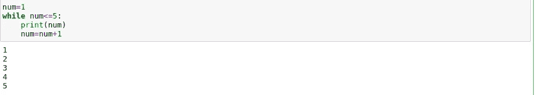

# Python 基础教程|用于数据科学的 Python

> 原文：<https://blog.devgenius.io/basic-python-tutorial-python-for-data-science-e514b5c8371b?source=collection_archive---------23----------------------->

Arif Riyanto 在 [Unsplash](https://unsplash.com?utm_source=medium&utm_medium=referral) 上拍摄的照片

> 在本教程中，我们将遵循一个名为**、【LBA】、**的学习框架。在每一部分，都会有一些问题，如果你知道该部分所有问题的答案，你可以跳过该部分。

# 基础理论

## [什么是编程？](https://en.wikipedia.org/wiki/Computer_programming)

编程是创建一组指令来告诉计算机如何执行任务的过程。可以使用各种计算机编程语言进行编程，例如 JavaScript、Python 和 C++。

## [什么是 python 编程？](https://en.wikipedia.org/wiki/Python_%28programming_language%29)

**Python** 是一种[解释的](https://en.wikipedia.org/wiki/Interpreted_language)、[高级](https://en.wikipedia.org/wiki/High-level_programming_language)、[通用](https://en.wikipedia.org/wiki/General-purpose_programming_language)、[编程语言](https://en.wikipedia.org/wiki/Programming_language)。由[吉多·范·罗苏姆](https://en.wikipedia.org/wiki/Guido_van_Rossum)创建并于 1991 年首次发布，Python 的设计理念强调[代码可读性](https://en.wikipedia.org/wiki/Code_readability)，并显著使用了[重要空格](https://en.wikipedia.org/wiki/Off-side_rule)。它的[语言结构](https://en.wikipedia.org/wiki/Language_construct)和[面向对象的](https://en.wikipedia.org/wiki/Object-oriented_programming)方法旨在帮助程序员为小型和大型项目编写清晰的逻辑代码。

## 你为什么要学习 python？

对我来说，学习 python 的第一个原因是它的简单性。它非常容易学习，是最漂亮的编程语言之一。

另一个原因是 Python 是许多数据科学家的主要语言。*年来，*的学术学者和私人研究人员一直在使用 MATLAB 语言进行科学研究，但随着 Python 数值引擎的发布，如“*Numpy”*和“*Pandas”*，这一切都开始改变。

## 如何安装 Python？

*   你可以直接从官方网站[下载 Python，并安装你想要的组件和库](https://www.python.org/downloads/)
*   或者，您可以下载并安装一个软件包，该软件包带有预安装的库。我会推荐下载 [Anaconda](https://docs.anaconda.com/anaconda/install/) 。运行您的第一个 Python 程序

打开 python 编辑器或 jupyter 笔记本，输入 print("hello world ")并将其另存为 firstprogram.py

`**print()**` 功能将指定的信息打印到屏幕或其他标准输出设备上。该消息可以是一个字符串，或者任何其他对象，该对象在写入屏幕之前将被转换成一个字符串。

# 1.可变的

## *什么是变量？*

简单地说，变量是存储数据值的容器。

## python 编程中如何使用变量？

在 python 编程中，定义一个变量并设置它的值是非常容易的。假设您想在名为 test 的变量中存储一个数字 100。

您可以根据需要为任何其他**变量**赋值。但是选择变量名有一些规则。您也可以在变量中指定 float、Boolean(True/False)或 string。

# 2.接受用户的输入

如何接受用户的输入？

之前我们定义了一个变量，并为它设置了一个固定值。现在，我们希望程序每次运行时都从用户那里获取价值。我们将使用 input()函数从用户那里获取输入。

# 情况

什么是条件？

**Python**中的条件语句执行不同的计算或动作，这取决于特定的布尔约束评估为真还是假

**我们为什么需要条件？**

有时，程序需要跳过一些语句，重复执行一系列语句，或者在不同的语句集之间进行选择。这就是**控制结构**发挥作用的地方。控制结构指导程序中语句的执行顺序(称为程序的[控制流](https://en.wikipedia.org/wiki/Control_flow))。

**如何在 python 中使用条件？**

Python 使用 if…用于检查条件的 else 语句。基本结构:-

## 示例:

如果你运行上面的例子，你会看到输出“Y**you are adult**”。由于 age 变量的值是 18，所以第一个条件为真，它执行“if”语句中的内容。如果我们定义年龄值小于 18，它将执行“else”语句中的内容。

如果我们需要检查多个条件，那么我们将使用“ **elif**

# 循环:

循环语句允许我们多次执行一条语句或一组语句。

**我们为什么需要循环？**

但这并不是解决这个问题的有效方法。程序员不喜欢一遍又一遍地做同样的事情，这就是为什么会出现循环。我们可以通过使用一个循环，用两行代码解决这个问题。

是不是很酷！！！

**python 中如何使用 loop？**

Python 中有两种类型的循环，**用于**和**而**。

**“for”循环**

For 循环可以使用“range”函数迭代一系列数字。

这里，范围(5)意味着循环将从 0 到 4 持续 5 次。

## “while”循环

只要满足某个布尔条件，While 循环就会重复。例如:

# 功能

**什么是功能？**

功能是一组有组织的、可重用的代码，用于执行单个相关的动作。

想象一个榨汁机，你给不同类型的水果，在做一些处理后，它会给你新鲜的果汁。这里榨汁机是一个功能。

在编程中函数就像一台榨汁机，我们会给函数一些输入值，函数返回一个输出。

## 函数的优势在哪里？

函数的主要优点是可重用性。可重用性的另一个观点是一个函数可以在几个不同的程序中使用。

## 如何用 python 写函数？

在 Python 中，函数是使用 **def** 关键字定义的。一个函数将在被调用时运行。您可以将数据(称为参数)传递给函数。函数可以返回数据作为结果。

信息可以作为参数传递给函数。参数在函数名后面的括号内指定。您可以添加任意数量的参数，只需用逗号分隔即可。

## 功能类型:

基本上，我们可以将函数分为以下两种类型:

1.  [内置函数](https://www.programiz.com/python-programming/built-in-function) —内置于 Python 中的函数。
2.  [自定义功能](https://www.programiz.com/python-programming/user-defined-function) —用户自定义的功能。

# 集合(数组):

Python 编程语言中有四种集合数据类型:

*   **列表**
*   **元组**
*   **设定**
*   **字典**

这里我们只谈列表和字典。

## 什么是列表，为什么我们要使用列表？

列表是一个有序的、可改变的集合。当我们需要在一个变量中存储多个值(值可以是不同的类型，如整型、浮点型、字符串型)时，我们需要使用 list。

## 如何创建列表？

在 Python 编程中，列表是通过将所有项目(元素)放在方括号`[]`中，用逗号分隔来创建的。

## 如何从列表中访问元素？

`List`有一个概念叫做**指标**。第一个元素的索引为 0(零)。第二个得到 1，以此类推…

假设我们想添加列表的前两个元素。我们如何做到这一点？

# 词典:

当我们创建一个列表时，默认情况下会为每个元素创建索引号，第一个元素的索引号为 0，第二个元素的索引号为 1，依此类推…..但是字典允许我们给每个值一个唯一的键。

字典是一个无序的、可变的、有索引的集合。

**如何用 python 创建字典？**

创建字典非常简单，只需将条目放在用逗号分隔的大括号{}内。一个条目有一个键和一个对应的值，它们被表示成一对( **key: value** )。

**键**是指向 **值的索引(类似列表)。**

**键**是指向 **值的索引(如列表)。**

## 如何从**字典**中访问元素？

你能猜到吗？？yeap-使用**键**(类似列表中的索引)。让我们试试:

酷！！您已经学习了 python 编程的一些基础知识。有关更多详细信息，您可以使用参考链接。谢谢！

参考:

[1].
【2】。
【3】。[https://www.guru99.com/python-tutorials.html](https://www.guru99.com/python-tutorials.html)【4】。[https://www.w3schools.com/python/default.asp](https://www.w3schools.com/python/default.asp)