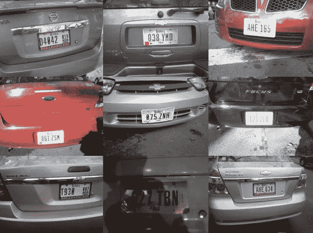

# 使用 Keras 和 OpenCV 从头开始基本 RCNN 对象检测

> 原文：<https://blog.devgenius.io/basic-rcnn-object-detection-from-scratch-using-keras-and-opencv-19e5e43b3dfd?source=collection_archive---------3----------------------->

随着我对人工智能和计算机视觉的迷人子集的了解越来越多，我想尝试并承担起物体检测的任务。有[多种方法](https://arxiv.org/pdf/1807.05511.pdf)(最好的方法使用深度学习)来应对挑战。最先进的方法非常复杂，很难从零开始理解和实现，所以我决定使用基本的 RCNN——一种早期的深度学习对象检测方法，于 2013 年在[本文](https://arxiv.org/abs/1311.2524)中介绍。如果你感兴趣的话，我鼓励你仔细阅读这篇论文并做你自己的研究，但是让我给你一个高层次的解释。

如果你只是为了代码而来，请查看该项目的 Github 回购:【https://github.com/zarif101/rcnn_keras_license_plate

# RCNNs 是如何工作的？

注意:我假设你熟悉人工智能、计算机视觉、CNN 等基础知识。

检测图像时，您必须识别图像中存在的事物及其位置。为此，原始对象检测方法在画布上移动一个“滑动窗口”，然后使用 CNN 检测其中的内容。如果以设定的概率检测到某个类，它将标记该位置并在其周围显示一个边界框。然而，这种方法在计算上是低效的，因为它需要成千上万的图像(取决于原始图像的大小)反复通过 CNN。此外，边界框只能是一种尺寸，即“滑动窗口”的尺寸。你可以查看[这篇文章](https://www.pyimagesearch.com/2020/06/22/turning-any-cnn-image-classifier-into-an-object-detector-with-keras-tensorflow-and-opencv/)了解更多信息。

RCNN 通过使用一种称为[选择性搜索](https://www.learnopencv.com/selective-search-for-object-detection-cpp-python/#:~:text=Selective%20Search%20is%20a%20region,texture%2C%20size%20and%20shape%20compatibility.&text=The%20output%20of%20the%20algorithm%20is%20shown%20below.)的算法来解决滑动窗口(也称为区域建议)的问题，该算法根据纹理、颜色等的相似性来提取图像的区域。然后，将预训练的 CNN 应用于每个提议的区域，并且如果以设定的置信度水平预测了您“想要的”类别，则将来自选择性搜索的区域用作边界框。这是实现 RCNN 的基本方法——使用选择性搜索生成区域建议，然后用 CNN 对它们进行分类。这不是 100%真实的原始论文所描述的，但它对像我这样没有太多物体探测经验的人来说很棒！我鼓励你对 RCNNs 进行自己的研究，以更好地了解它们是如何工作的。[这里有一篇文章](https://www.geeksforgeeks.org/r-cnn-vs-fast-r-cnn-vs-faster-r-cnn-ml/)描述它们，以及更现代的版本。现在让我们回顾一下我是如何创建 RCNN 管道来检测图像中的车牌的。

RCNN 图

# 基于 RCNN 的车牌检测

我的任务是检测图像中的车牌。我使用的数据集可以在这里找到[。我的第一步是为两个类生成训练数据；存在牌照和不存在牌照。前者应该包括有车牌的图像，后者应该是其他的一切，比如随机的背景、人、车身等。为此，我使用了 OpenCV 内置的选择性搜索算法，并对每张图片的返回区域进行循环。对于每个区域，如果它与图像的牌照的给定边界框的交集大于 0.7，我将该区域保存为“牌照存在”类的成员。如果它的 IOU 小于 0.3，我们可以假设它不是车牌，所以我将它保存为“非车牌”类的成员。一旦我生成了这个新的数据集，我就用它来训练一个简单的带有 Keras 的二进制 CNN，以区分这两个类别。CNN 在测试集上有 97%的准确率，在这种情况下对我来说已经足够好了。现在剩下的就是把整个过程组合起来。](https://www.kaggle.com/dataturks/vehicle-number-plate-detection)

通过训练 CNN 模型，a 创建了一个推理脚本，该脚本可以将图像作为输入，并输出一个图像副本，在车牌周围绘制一个方框(如果有)。当给定图像时，管道/脚本执行选择性搜索，然后通过经过预处理的 CNN 传递每个区域。如果美国有线电视新闻网以超过 98%的置信度预测该部分包含车牌，则在图像的该部分周围绘制一个方框。就这样！我现在有一个基本的 RCNN 实现与 OpenCV 和 Keras，以检测车牌图像。

下面是一个示例输入:

以及通过管道后的输出。

正如您所看到的，并不是每一块板都被完美地检测到，但是考虑到实现是多么相对简单，它工作得非常好。通过花更多的时间优化和培训有线电视新闻网的基础，它肯定可以得到改善。RCNN 管道的其他应用，比如这个，可以检测图像中的动物，天空中的飞机，甚至细胞中的疾病。像其他人工智能一样，应用程序是无限的！要了解更多关于该项目的信息并查看实际代码，请在 Github 上查看:https://github.com/zarif101/rcnn_keras_license_plate

我总是尽可能添加新功能，所以一定要经常查看。感谢阅读，如果你有任何问题或意见请告诉我，并继续创作！