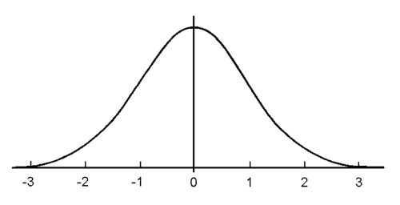
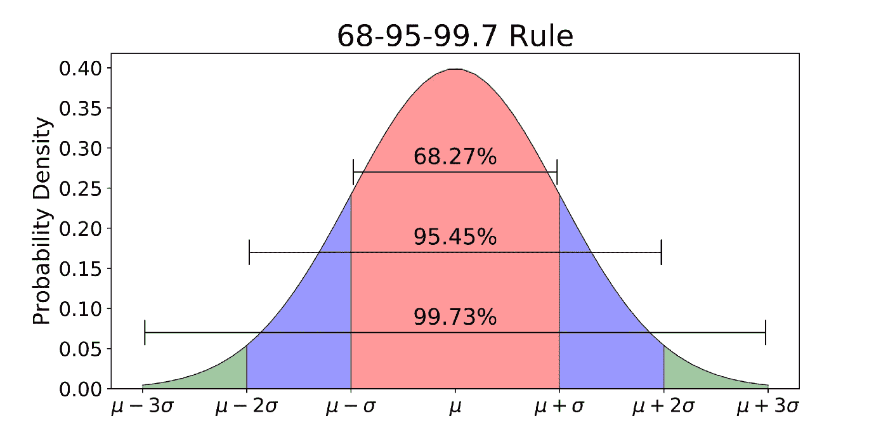
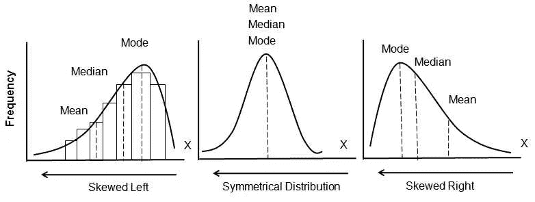
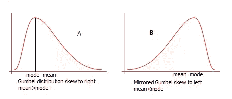
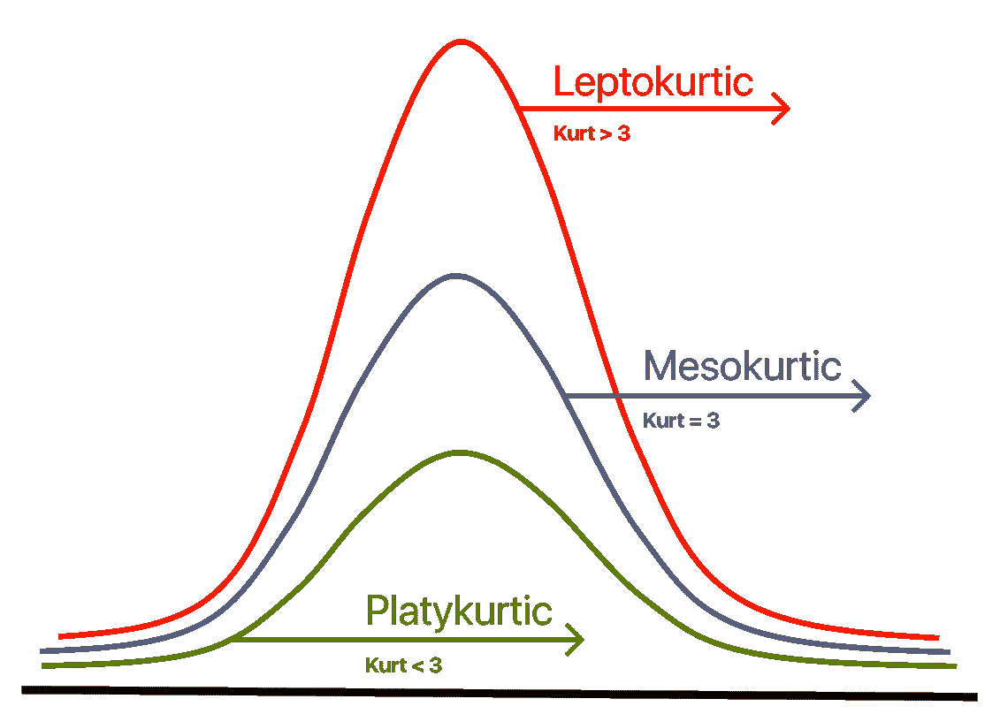
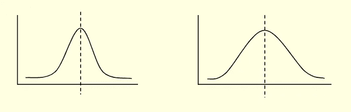
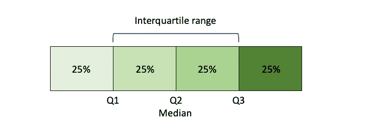
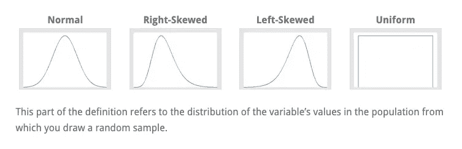

# 数据科学的基本统计概念(初学者指南)

> 原文：<https://blog.devgenius.io/basic-statistics-for-data-science-beginners-guide-17f7d09cf4c7?source=collection_archive---------19----------------------->

对于有抱负的数据科学家来说，理解统计学的每个基本原理是非常重要的。

图片由[阿迪·戈尔茨坦](https://unsplash.com/@adigold1?utm_source=medium&utm_medium=referral)在 [Unsplash](https://unsplash.com?utm_source=medium&utm_medium=referral) 上拍摄

统计是数据科学家收集和分析大量数据以开发洞察力的必要工具。从数据处理的开始到每一步的结束，它总是被要求的。

作为一名数据科学家，您的角色将需要良好的统计技能来理解定量数据，以发现趋势并做出预测。然而，**大多数学习者**不太清楚该学什么或者从哪里开始。

在本指南中，我们将阐明有效数据科学所需的关键统计概念。学习这些概念将帮助您建立数据科学和机器学习所需的统计直觉和认知技能。

# 介绍

数据科学涉及描述性统计和推断性统计，掌握这两方面的知识将会让你从事有益的数据职业。

如果你渴望学习统计学，首先要了解统计学内部两大类的区别。

描述性统计:回顾、总结和交流大量原始信息很难，但描述性统计允许有目的地呈现数据。

> *描述性统计提供了对数据的分析和描述，以及一种可视化数据的方式。*

**推断统计:**推断统计有助于通过数学计算得出结论，得出推论。

> *推断统计学允许我们根据对数据的研究来推断趋势并对人口做出预测。*

顾名思义，**描述性统计**描述总体，另一方面，**推断性统计**用于根据样本对总体进行概括。

这些方法对于数据科学和机器学习等科学领域的进步至关重要。

让我们来看看数据科学的关键概念。

# 数据科学的统计概念

**要成为一名数据科学家**，你需要对数据分析中有用的计算技术有数学直觉和统计推理能力。

简而言之，你必须学会使用关键的**统计公式**来阐述和交流分析结果，从而建立统计的流畅性。

你必须具备描述统计学和概率论的基本概念，包括概率分布、统计意义、假设检验和回归的关键概念。

**贝叶斯思维**对于数据科学也是必要的，学习机器学习所需的概念非常重要，如条件概率、先验和后验以及最大似然。

学习这些概念的理想学生准备好掌握编程的下一个级别，即使用 Python、R 或 Julia 的统计编程。

您可以从著名的数据科学教育家那里了解这些概念:

*   [统计学基础](https://kngr.me/stat-02) — Dataquest
*   [数据科学家的计算统计学](https://kngr.me/st-c5) —数据块

# 1.描述统计学

描述性统计使我们能够建设性地呈现原始数据并实际地总结数据点。

你必须学习这些研究方法的基本概念，以便进行简单的统计分析、可视化数据、从数据中预测未来趋势等。

# 1.1 正态分布

正态分布是许多现实应用中最常见的概率分布函数之一。

> 例如，像人的身高、体重和智商这样的变量都非常接近正态分布。

在正态分布中，我们在图中表示数据样本。

正态分布看起来像对称的钟形，这就是为什么它经常被称为钟形曲线。*又称为* ***高斯曲线*** *。*

图片由[牛津埃默里](http://math.oxford.emory.edu/site/math117/normalDistribution/)

这个钟形曲线以它的平均值为中心，随着你向任一方向移动，它以递减的概率展开。

**68–95–99.7 规则**

对于一个正态分布在**正+和负-1 之间的一个**标准差，有 68%的分布数据。

在**正负 2 个**标准差之间，有 **95%** 的数据。

最后，在**正负 3 个**标准差之间，有 **99.7%** 的数据。

图片由[走向数据科学](https://towardsdatascience.com/understanding-the-68-95-99-7-rule-for-a-normal-distribution-b7b7cbf760c2)

正态分布应用广泛，每个应用都有自己的均值、标准差和单位。

该分布函数适用于大多数 ML 算法，您必须详细学习正态分布的概念，因为如果数据是正态分布的，线性模型会表现良好。您还将需要它来进行中心极限定理和探索性数据分析。

# 1.2 中心趋势

使用中心趋势，我们确定了数据的中心点。中心趋势的三个重要部分是平均值、中位值和模式。

**平均值**:数据集内所有观测值(值)的算术平均值。

**中位**:数据的中间值，由小到大排列。

**模式**:数据集中最频繁出现的值。有些数据集可以有一种以上的模式，即多个值出现频率最高。如果有两个值的频率最高，那么我们就得到一个双峰分布。如果有两种以上的模式，那么我们有一个多模式分布。

研究之门提供的图像

> *学习均值、中位值和模式很容易，包括偏斜度&峭度。*

# 1.3 偏斜度

这是对称性的一种度量，但有时这种分布并不表现出任何形式的对称性。

当我们遇到非对称分布时，我们可以直观地看到中心趋势的度量发生了什么。

请注意当正态分布(对称)失真时，这些度量是如何扩展的。当数据累积在左侧时，它是正偏斜；当数据累积在右侧时，它是正偏斜；我们有负偏差。

图片出自[维基百科](https://www.wikipedia.org/)

> *学会检测不对称程度*

# 1.4 峰度

它是衡量数据相对于正态分布是重尾还是轻尾的一个尺度。

峰度较大的分布的尾部大于正态分布，而负峰度的尾部小于正态分布。

领英脉搏提供的图像

这是由分布的可变性引起的。

*   **细峰曲线** —因靠近中心处项目浓度较大，故为峰高比正常曲线。
*   **板状-栗色**:该曲线峰值较低，因中心附近项目浓度较低，故较正常峰值平坦。
*   **Meso-Kurtic** :有正常峰或正常曲线的曲线。当中心值(平均值)周围的分布相等时，则平均值、中位值和模式相等。

> *了解数据的分布是非常重要的一个方面*

# 1.5 可变性

可变性衡量数据点与分布中心平均值之间的距离。

可变性通常根据距离来定义

*   分数之间有多远
*   分数离平均值有多远
*   一个分数在多大程度上代表了整个数据集

图片由[莱斯特](https://le.ac.uk/)

可变性的度量包括范围、方差、标准差和四分位数范围。

**范围**:这是描述可变性最简单的方式。该范围仅考虑两个极端值，忽略两个极端值之间的任何值。

**标准偏差**:这个度量用数据集中的典型偏差来表示可变性。它通常用于了解特定数据点是标准的、预期的还是意外的。

*   低标准偏差告诉我们，数据紧密地聚集在平均值周围
*   高标准偏差表明数据分散在更大的数值范围内，我们认为数据紧密地聚集在平均值周围

> *当数据分布近似正态时，使用标准差，类似于钟形曲线。*

**方差:**方差是可变性的度量。它本质上是平均值的平方差的平均值。

> *方差对于数据分析非常重要，你必须彻底学习所有的概念。*

**百分位数、四分位数和四分位数间距(IQR):**

**百分位数:**百分位数告诉我们一个值与其他值相比如何。百分位数是某个百分比的观察值位于其下的值。

**分位数:**分位数决定分布中有多少值高于或低于某个限制。它也可以指将概率分布划分为等概率区域。

**四分位数范围(IQR):** 四分位数范围衡量数据中间一半的分布。这是中间 50%数据的范围。我们用 IQR 来评估大部分价值所在的可变性。

图片由 [Scribbr](https://www.scribbr.com/statistics/variability/)

> 这些概念听起来可能有点吓人，但是学起来很简单。

# 2.推断统计学

推理统计为预测、预报和估计提供了基础，这些预测、预报和估计用于将信息转化为知识。

从数据中通过概率得出的“**推断**见解或结论的过程称为“**推断统计学**”

概率分布、假设检验、相关性检验和回归分析都属于推断统计学的范畴。

> “推断统计学”最好的真实例子是预测死亡和吸烟习惯之间的关系。

推断统计学包括从样本到总体的归纳、假设检验和预测。

其中一些技术对数据科学很有帮助。

# 2.1 中心极限定理

中心极限定理是统计学中最基本也是最简单的概念之一。

本质上是均值的抽样分布。

随着样本量的增加，样本值均值的分布是正态的。

较小样本数据的平均值与较大总体的平均值相同。所以，得到的标准差也等于总体的标准差。

> 如果你熟悉正态分布，就更容易理解 CTL。

CTL 适用于几乎所有类型的概率分布。这些可以是正常的、左偏斜的、右偏斜的和均匀的。

图片由[统计局 byjim](https://statisticsbyjim.com/)

理解和实践 CTL 概念

*   正常人口
*   二分结果
*   偏斜分布

由于正态性假设和估计的精确性，中心极限定理对统计学是重要的。

学习总体均值的估计、错误频率的规律等概念，包括如何使用置信水平百分比的 z 分数来计算边际误差。

# 2.2 假设检验

假设检验是所有统计学的核心，它允许我们对世界做出推论。这是对假设的衡量，是对我们周围世界的有根据的猜测。

简而言之，假设检验是一个统计分析师调查关于总体参数的假设的过程。采用的方法取决于使用的数据和分析的原因。

通常，这些方法包括估计总体属性，如均值、均值之间的差异、比例以及变量之间的关系。数据科学家最常使用它来证明来自理论的特定预测，称为假设。

> *公司经常使用这种技术在他们的网站或移动应用上实现新功能。*

**我们需要测试两个假设:**

两者都是互斥的，两个假设中只有一个永远是真的。

**零假设:**是对变量之间没有关系的预测，可以说明总体平均收益等于零。

**备择假设:**是预测变量间关系的初始假设。替代假设与无效假设完全相反。

> *无效假设和替代假设应该如何表述并不总是很清楚，因此，在确定应该如何表述假设时，情境的背景很重要。*

在数据科学中，假设检验的应用是分析性的，涉及收集证据以支持研究假设的尝试。

正确的假设公式需要大量的实践。充分理解术语、测试过程和概念，以便用真实的例子进行推理。

# 2.3 方差分析

方差分析——最简单的 ANOVA 检验用于观察各组数据之间的差异是否具有统计学意义。

当有两个以上的独立组时，应用 ANOVA 检验。使用方差分析，我们测试我们的假设，以确定是否需要拒绝零假设或接受替代假设。

ANOVA 以最小的错误率执行测试，以查看多组之间是否有差异**。**

**您可能想要测试多个组的情况:**

*   一组癌症患者正在尝试三种不同的疗法:化疗、激素疗法和免疫疗法。你想研究一种疗法是否比其他疗法更强。
*   一家公司生产了两款使用两种不同操作系统的经济型智能手机。他们想知道一个比另一个更好。

> *这些技术被用于数据科学和机器学习，以决定数据集的结果。*

作为一名数据科学家，你需要运用统计学知识做出自信可靠的决策。

理解学习如何用方差分析解决问题所涉及的概念；学习单向方差分析，双向方差分析和 N 向方差分析，包括其公式。

# 2.4 回归分析

**回归**是一种定性数据分析的形式，用于发现数据中的趋势。

这是一种预测性建模技术，可以帮助公司了解他们的数据点代表什么，并将其与其他分析技术结合使用，以做出更好的决策。

> 汤姆·莱德曼说，回归分析是“分析中的首选方法”。

在数据科学中，对变量之间关系的评估称为回归分析，这些变量指的是某些事件或对象的属性或特征。

我们需要掌握以下术语:

*   **因变量:**这是你寻求理解或预测的关键因素。
*   **自变量:**这些是你假设对因变量有影响的因素或要素。

从本质上讲，回归分析有助于使用一组数据进行预测，从而做出最佳猜测。

有简单回归分析和多重(多变量)回归分析。

**简单回归**:预测变量只有一个，每个因变量“y”对应一个 x 变量:(x1，Y1)。

**多元回归**:该分析对每个自变量使用多个“x”变量:(x1)1，(x2)1，(x3)1，Y1)。

> 如果函数是非线性的，那么我们有一个非线性回归。

回归允许数据处理为重要的业务问题提供答案:哪些方面最重要？我们可以忽略哪个？这些元素是如何相互作用的？我们对这些考虑有多大把握？

预测的回归方法在以下方面对分析数据非常有帮助:

*   预测销售额
*   假设需求和供给
*   了解库存水平
*   分析变量如何影响所有这些因素

对于数据科学和机器学习，我们使用 NumPy、Pylab 和 Scikit-learn 等 Python 库进行简单和多元回归分析。

对回归和多变量回归的透彻理解将为学习机器学习算法(如逻辑回归、K-最近邻和支持向量机)奠定良好的基础。

# 学习数据科学统计学的最佳资源

有抱负的数据科学家必须知道这些必要的统计概念，并具备数据分析、数据可视化、机器学习等技能。

我们根据经验水平编写了适合的高质量学习资源。除了课程，我们非常推荐一些书籍来巩固你的知识。

**为了简单起见**，我们在我们的网站 kanger.dev 上创建了一个 [**数据科学栈**](https://kanger.dev/stacks/data-science/) ，你可以查看优质资源、指南和课程，无需会员。

**新文章/指南**

*   学习用于数据科学的 Python(初级学习指南)
*   最好学的课程[数据科学的概率统计](https://kanger.dev/learn-statistics-for-data-science-courses/)(非编程)
*   用 Python 学习[统计学](https://kanger.dev/computational-statistics-python-courses/)(课程、书籍和面试准备)
*   用 R 学习[统计学(课程、书籍和面试准备)](https://kanger.dev/data-science-statistics-r-programming/)
*   构建强大的[数据科学产品组合](https://kanger.dev/how-build-data-science-portfolio/)
*   数据科学的基础数学
*   为初学者学习 Python 一本轻松的职业指南
*   让你被聘用的不可或缺的数据科学家技能
*   学习[面向数据科学的张量流](https://kanger.dev/tensorflow-courses/)

## 结论

我们浏览了数据科学的统计要求。描述统计学和推断统计学的能力将使你具备统计编程的能力。

学习统计学不是很难。事实上，它将提升你的认知能力，帮助提高你的编程技能。

此外，我们希望学习资源(建议)能够帮助您扩展数据科学知识，并消除您对发现幕后发生的事情的恐惧。

**感谢你坚持到最后** …