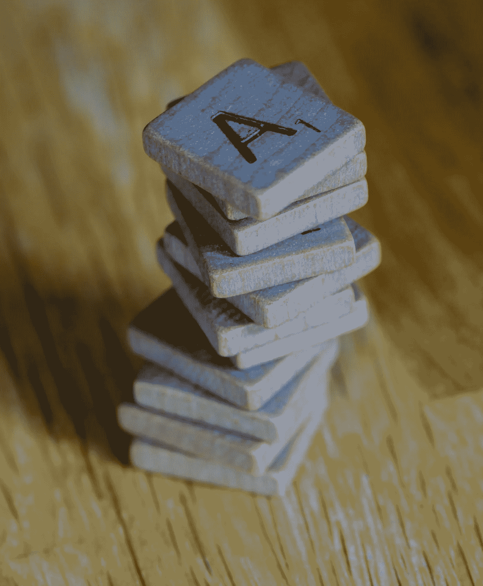

# python 中的一些基本字符串方法

> 原文：<https://blog.devgenius.io/basic-string-methods-in-python-7621a523cd23?source=collection_archive---------16----------------------->



布雷特·乔丹在 [Unsplash](https://unsplash.com/s/photos/letters?utm_source=unsplash&utm_medium=referral&utm_content=creditCopyText) 上的照片

字符串是一系列字符。在 Python 中，引号内的任何内容都被视为字符串。您可以在字符串中使用引号和撇号，如下所示:

```
"I like python programming"
'I like python programming'
```

# python 中的基本字符串方法

## 上部()

您可以将字符串全部改为大写。

```
a="I like python programming"
print(a.upper())
```

输出:

```
I LIKE PYTHON PROGRAMMING
```

## 下部()

您可以将字符串全部改为小写。

```
a="I like python programming"
print(a.lower())
```

输出:

```
i like python programming
```

## islower()

is lower 用于检查字符串中的所有字符是否都是小写的。

```
a="python programming"
a.islower()
```

输出:

```
True
```

## Isupper()

isupper()用于检查字符串中的所有字符是否都是大写的。

```
a="python programming"
a.isupper()
```

输出:

```
False
```

## Isnumeric()

isnumeric()用于检查字符串中的所有字符是否都是数字。

```
a="python programming 123"
a.isnumeric()
```

输出:

```
False
```

## 伊萨法()

isalpha()用于检查字符串中的所有字符是否都是字母。

```
a="python programming"
a.isalpha()
```

输出:

```
False
```

所有字符都是 alphabet 但它的输出仍然是“False”这是因为 python 和编程之间有空格，如果我的字符串只有一个词“programming”怎么办:

```
a="programming"
a.isalpha()
```

输出:

```
True
```

## 伊萨勒姆()

isalnum()用于检查字符串中的所有字符是否都是字母数字(字母和数字)。

```
a="python3"
a.isalnum()
```

输出:

```
True
```

## 大写()

此方法将第一个字母转换为大写，其余转换为小写:

```
a="i like python programming"
print(a.capitalize())
```

输出:

```
I like python programming
```

## 条状()

strip()用于移除字符串中的空白， *rstrip()* 移除右侧的空白， *lstrip()* 移除左侧的空白。

这个字符串中有空白，如下所示:

```
a=" python "
a
```

输出:

```
' python '
```

*   使用 *rstrip()表示右侧空白*:

```
a=" python "
a=a.rstrip()
a
```

输出:

```
' python'
```

*   使用 l *strip()表示左侧空白*:

```
a=" python "
a=a.lstrip()
a
```

输出:

```
'python '
```

*   仅使用*条()*:

```
a=" python "
a=a.strip()
a
```

输出:

```
'python'
```

## 标题()

title()方法将字符串中每个单词的第一个字母变成大写字母。

```
a='python programming'
print(a.title())
```

输出:

```
Python Programming
```

## 计数()

count()方法用于查找一个字母的出现次数，i latter 在给定的字符串中出现了多少次:

```
a="i like python programming"
print(a.count('i'))
```

输出:

```
3
```

## 查找()

如果在给定字符串中找到子字符串，则返回该子字符串的最低索引或第一个匹配项。如果没有找到，则返回-1。

```
a="python programming"
a.find('programming')
```

输出:

```
7
```

## 加入()

join()方法接受 iterable(列表、元组、字符串)中的所有项，并将它们连接成一个字符串。

将列表中的所有元素连接成一个字符串:

```
a=["python", "programming"]
print(''.join(a))
```

输出:

```
pythonprogramming
```

## 替换()

replace()方法用于将后面的任何单词替换为另一个字母或单词。

语法=string.replace(old，new，count)

old =要替换的字母或单词

新=字母或单词替换旧单词或字母

计数—(可选)要替换旧字母或单词的次数。

*   用 R 替换 python:

```
a="python programming"
a.replace("python", "R") 
```

输出:

```
'R programming'
```

*   如果有两个相同的单词，我只改变其中一个，使用 *count* 我只替换一个:

```
a="python and python programming"
a.replace("python", "R", 1)
```

输出:

```
'R and python programming'
```

## 索引()

index()方法用于查找指定值的第一个匹配项。

语法=字符串(值，开始，结束)

值=指定值(任何单词或字母)

start =从哪里开始查找特定值

end =结束查找特定值的位置

*   查找特定的单词或字母

```
a="I like python programming"
a.index('python')
```

输出:

```
7
```

*   查找起点和终点之间的特定单词或字母:

```
a="I like python programming"
a.index('o',10,17)
```

输出:

```
11
```

字母“o”第一次出现在第 11 个位置，我们在 10 和 17 个位置之间进行了搜索。

## 拆分()

这个方法将一个字符串拆分成一个列表。默认情况下，它根据空格分割字符串，但我们也可以指定任何字符。

```
a="I like python programming"
a.split()
```

输出:

```
['I', 'like', 'python', 'programming']
```

## 分区()

它搜索指定的字符串，并将该字符串拆分为包含三个元素的元组。

```
a="I like python programming"
a.partition("python")
```

输出:

```
('I like ', 'python', ' programming')
```

如果你欣赏这个帖子，请给我买一个 [ko-fi](https://ko-fi.com/haseeba) 。