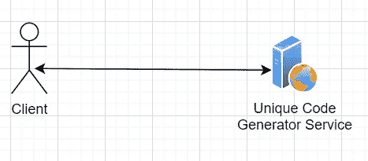
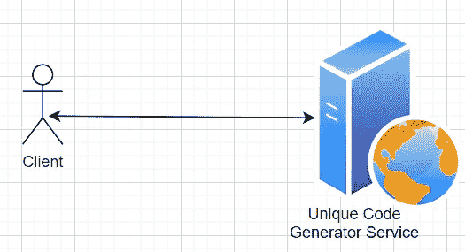
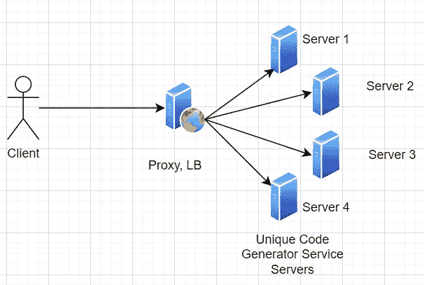

# 负载平衡的基础

> 原文：<https://blog.devgenius.io/basics-of-load-balancing-f8a1abd97ece?source=collection_archive---------3----------------------->

## 使系统更加可靠、可用和高效

雷·哈灵顿在 [Unsplash](https://unsplash.com?utm_source=medium&utm_medium=referral) 上的照片

分布式系统的一个重要方面是利用多台服务器的计算能力和资源来处理工作的能力。客户端访问了服务端点。系统计算出此时哪个服务器最适合服务这个请求，并将请求路由到那里。

在给定的时间点将客户端请求路由到最佳可用的服务器，以便最佳地利用可用的资源，这被称为负载平衡。

**负载—** 一个服务器节点要处理的工作量(请求数、处理量)。

**平衡负载** —通过在可用的服务器之间分配请求来确保没有一个节点过载，并且客户端获得最有效的结果。

让我们用一个故事来理解这一点。

## 独特的代码生成器——简单的 Rest 服务

我在做一个项目。一个用例需要逻辑来为每个给定的字符串内容生成唯一的代码。我开发了这个逻辑，并对它进行了彻底的测试。在使用了几个月之后，我想把它作为一个通用服务来使用。因此任何人都可以用它来为给定的字符串内容生成唯一的代码。

我开发了一个 rest 服务，并将其作为服务公开。现在任何人都可以通过点击 rest 服务来使用它。

公开的 Rest 服务

## 人气伴随着更多的流量——需要更大的机器

服务在第一个月就收到了大量的点击。下个月点击率开始增加。有一天，服务器因大量请求而崩溃，消耗了大量资源。

我通过增加机器配置和内存等方式解决了这个问题。成功了。在长时间停机后，**服务再次恢复以满足请求。**

具有更多内存和 CPU 的大型服务器

## **可伸缩性来自更多的机器，分布式系统**

几天后，由于同样的原因，服务器再次崩溃。在同一台机器上增加更多的资源实际上是不可能的。

我发现唯一的解决办法是添加更多的机器，并在这些机器上安装服务。然而，客户端不应该知道后端的多台机器。客户端应该仍然到达同一个端点。

解决方案是使用一个代理来公开端点，并让所有的服务器都支持这个代理。客户端将访问公开暴露的服务端点，该端点是代理的。系统有一个所有可用服务器的列表和一个将请求路由到这些服务器之一的逻辑(循环)。该请求将由所选的服务器提供服务，结果将返回给客户端。

这一切都发生了，甚至客户端都不知道后端有多台服务器。

这是在多个服务器之间平衡负载的基本实现。让我们称之为**负载平衡器，又名 LB** 。

在实现这个解决方案之后，独特的代码生成器服务在处理大量请求时变得更有弹性。它还使我能够根据流量随时添加(或减少)任意数量的服务器，而不会出现任何停机。

## **分布式系统带来复杂性**

一些用例仍然存在问题。例如:

*   一些请求可能携带非常庞大的字符串内容来生成唯一代码。服务器将需要大量的时间来处理。
*   一台服务器停机了一段时间。当它回来时，所有的负载都由其余的服务器管理。现在 LB 逻辑将在循环中路由请求。新服务器在重新加入后获得相同数量的请求，而不考虑现有服务器上的高负载。
*   还有更多…

我们开始分析解决这些问题。解决方案是在 LB 中添加一些智能逻辑，以便在路由流量时考虑服务器上的负载。

上面的第一个用例可以通过维护 LB 上所有服务器的活动请求数量来解决。在决定将请求路由到哪里时，LB 可以选择请求最少的服务器。这个逻辑解决了第一个用例。

第二个用例的解决方案需要来自每台服务器的数据。例如，每台服务器消耗多少资源？为此，LB 需要公开每个服务器都可以不断调用的 API(就像心跳和关于服务器资源的信息)。

LB 现在可以根据服务器资源状态做出明智的决策。考虑到活动请求的数量和最高的可用资源，它可以将请求路由到负担最小的服务器。这也解决了我们的第二个用例。

第三个用例呢。还有更多…‘是的，对路由可能有几个这样的要求。每一个都需要特定的实现。

这些处理不同负载平衡需求的不同实现被称为**负载平衡策略**。一些通用的可以通过现成的标准 LB 实现来实现。至于其他，LB 供应商有机会向应用程序开发人员提供挂钩，这样他们可以引入更多的逻辑。

## 常见的负载平衡策略

一些最常见的 LB 策略是

*   **循环调度** —请求按顺序路由到所有可用的服务器
*   **最少连接** —请求被路由到具有最少活动连接的服务器。
*   **基于资源的** —请求被路由到拥有最多可用资源的服务器。
*   **基于响应时间的** —请求被路由到响应最快的服务器。
*   **权重驱动** —可以根据每个服务器处理请求的能力为其分配权重。这是一个静态参数。
*   更多

为了理解这些概念，这些名字都很简单。网上有很多很好的文档，详细解释了这些和更多的策略。最好是参考 LB 厂商网站。

所有这些实现都解决了这样一个用例，即通过多个服务器和一个高效的 LB 策略将请求路由到最佳可用服务器，来处理数百万个对唯一代码生成器的请求。

## 负载平衡—粘性会话

我们发现了另一个用例。同一用户不应被允许在一分钟内请求超过 20 次代码生成。这是为了避免黑客利用这项服务。

为此，一个简单的解决方案是跟踪一个用户发送的所有请求。但是跨服务器跟踪它需要将这些信息存储在数据库中并跨节点访问，这带来了隔离、序列化等更复杂的问题。

一个可能的解决方案是 LB 是否能确保总是从一个用户向同一个服务器发送请求。这将需要 LB 从请求中识别用户会话信息，并维护会话和服务器的映射。这使得 LB 能够将活动会话的请求路由到第一次发起会话的同一服务器。

然后，我们可以在会话中存储所有统计数据。这解决了用例。

这就是通常所说的粘性会话 LB 策略。简而言之，这意味着将来自一个用户的所有请求都粘贴到首先发起会话的同一台服务器上。

> 当应用程序通过添加更多服务器开始水平扩展时，粘性会话策略在 web 应用程序中被大量使用，但大多数情况下是通过在会话本身(有状态)中存储大量信息来开发的。

这种策略看起来很酷，但也有它的缺点。它打破了将负载有效地分配给所有可用服务器的初衷。如果一个用户总是绑定到一个服务器，并且如果它产生大量负载，它就违背了负载平衡的整个目的。

# 总结一下:

简单地说，负载平衡是一种考虑到系统用例在所有可用的服务器之间分配请求/负载的方法，因此系统可以高效地运行。

负载均衡器就像一个交通警察，为高负载的混乱状态带来秩序。

**好处:**

*   服务器高效运行，不会过载
*   跨所有服务器高效利用资源
*   由于有多台服务器提供服务，因此对客户端请求的响应速度更快。
*   一个资源过载不会导致失败。
*   更多冗余。无停机时间，最大限度减少失误。提高可用性。

> 负载均衡器在现实世界中也可能承担扩展的责任，如 SSL 终止、数据解压缩、缓存以提高性能，以及应用增强的安全检查以避免 DDOS 类型的攻击。

# 参考

对系统设计感兴趣，请点击这里查看更多文章

[*系统设计的演进，Webservices 到微服务*](/evolution-of-system-design-web-services-to-microservices-9d660506c93f)

[*系统设计进化，微服务受益*](/evolution-of-system-design-microservices-benefits-6d0b2233f686)

我们将围绕分布式系统和系统设计讨论更多的主题。

在那之前，请继续关注，祝你学习愉快…

*喜欢看这个，请分享，鼓掌，关注类似的故事！*

*如有任何建议，请随时通过****Linkedin****:*[*Mohit Gupta*](https://www.linkedin.com/in/mohitkgupta/)联系我