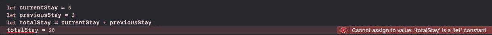

# Swift 基础知识—第 1 部分

> 原文：<https://blog.devgenius.io/basics-of-swift-part-1-481554641de9?source=collection_archive---------3----------------------->


> 斯威夫特。一种强大的开放语言，让每个人都可以构建令人惊叹的应用程序。Swift 是一种强大而直观的编程语言，由苹果公司开发，用于为 iOS、Mac、Apple TV 和 Apple Watch 构建应用程序。它旨在给予开发人员比以往更多的自由。Swift 易于使用且开源，因此任何有想法的人都可以创造出不可思议的东西。[苹果](https://www.apple.com/swift/)

根据这篇阅读材料，让我们来看看一些基本概念，让你熟悉 Swift 编程语言的基础。

# 线

String 是一组字符，如“developer”。
字符串可以用+运算符组合。

```
var str = “ios”
var combinedStr = str + “developer” print(combinedStr)
// Prints **iosdeveloper**
```

***多线琴弦:***

Swift 4+支持 multiline 和一些规则。如果字符串以三个双引号开始和结束，就有可能看到多行字符串。

```
**var** multiLineStr = “””
I can have
more than
a line String!
“””
```

注意:不要忘记从新行开始:)


***字符串插补:***

可以在字符串中使用变量的直接值，这在 Swift 中称为插值。它与反斜杠(\)一起使用，变量名称在括号中:

```
var myExperience = 5
var str = “My total experience is \(myExperience)”
```

# 整数

整数类型保存整数值。在 Swift 中，整数表示为 Int。

```
var intNum = 38
```

如果需要保存较大的数字，Swift 允许使用下划线作为千位分隔符，数字是相同的，只是更容易阅读。

```
var totalCount = 90_000_000
```

# 两倍

Double 类型保存一个分数。

```
var doubleVal = 3.14
```

苹果的建议是用 Double 代替 Float，因为 Double 精度最高。

# 布尔代数学体系的

Boolean 是一种值类型，其实例为**真**或**假**。“所以，它们只能是真的或假的。Boolean 在 Swift 中表示为 Bool。

```
var boolVal = true
```

# 常数

常量是变量的固定值类型。当一个变量用 let 定义为常量时，该变量不能再被改变。

```
//If a let value is tried to be changed, an error will occur:
**let** currentStay = 5
**let** previousStay = 3
**let** totalStay = currentStay + previousStay
```



# 排列

数组是值的有序集合，它存储为单个值。

```
// Prefered definition type: 
var doubleArr : [Double] = [] 
var strArr: [String] = []// Full name is also allowed: 
var doubleArr: <Double> = [] 
var strArr: <String> = []// It can be used with elements:
var doubleArr = [1.2, 0.05]
var strArr = [“Burcu”]
```

使用 ***数组(重复:计数:)*** 可以创建默认的固定数组

```
var strArr = Array(repeating: “burcu”, count: 10)
print(strArr)
*// Prints* **[“burcu”, “burcu”, “burcu”, “burcu”, “burcu”, “burcu”, “burcu”, “burcu”, “burcu”, “burcu”]**var intArr = Array(repeating: 1, count: 5) 
print(intArr)
*// Prints* **[1, 1, 1, 1, 1]**
```

可以用 ***isEmpty*** 属性检查数组是否有元素。

```
var strArr = Array(repeating: “burcu”, count: 10)
if strArr.isEmpty {
print(“There is no elements.”)
} else {
print(“There is \(strArr.count) elements.”) 
}
```

也可以快速获得数组的第一个和最后一个元素:

```
let intArr = [1,2,3]
print (“first element of intArr is \( intArr.first ?? 0)”)
print (“last element of intArr is \(intArr.last ?? 0)”)
```

附加说明:打印时可以分离项目:

```
let intArr = [1,2,3]
guard let firstElement = intArr.first else {return}
guard let lastElement = intArr.last else {return}
// Separator can be anything as String 
print(firstElement, lastElement, separator: “:”) 
print(firstElement, lastElement, separator: “try”)
```

***添加和删除元素:***

可以使用 append 和 insert 属性向数组中添加元素。

```
var elements = [“String”, “Double”]
elements.append(contentsOf: [“Float”, “Int”]) 
elements.insert(“Array”, at: 3)
```

可以使用 remove、removeAll 和 removeLast 属性从数组中移除元素:

```
var elements = [“String”, “Double”, “Int”]
elements.remove(at: 0) 
elements.removeLast() 
elements.removeAll()
```

# 一组

集合是值的集合，类似于数组，但集合不以任何顺序存储，而是以随机顺序存储。集合必须有唯一的元素，它们不能重复。重复的值将被忽略。

```
var setArr = Set([“red”, “green”, “blue”])
// the elements must be unique otherwise it will be ignored
var setArr = Set([“red”, “green”, “blue”, “red”, “green”, “green”, “blue”])
print(setArr)
// Prints **[“red”, “blue”, “green”]**
```

# 结构体

> 结构可以包括存储属性、计算属性和方法。此外，Swift 结构可以通过默认实现采用协议来获得行为。Swift 标准库和基础使用您经常使用的类型的结构，如数字、字符串、数组和字典。”

结构是自定义数据类型，就像模型一样，包括该类型的属性。

```
struct ComplexType { 
var writerName: String 
var writerAge: Int 
var isWriter: Bool
}var structType = ComplexType(writerName: “Burcu”, writerAge: 27, isWriter: true)
print(structType) 
// Prints **ComplexType(writerName: “Burcu”, writerAge: 27, isWriter: true)** print(structType.isWriter) 
// Prints **true**
```

# 元组

元组是一个复合类型变量。

> "复合类型是没有名称的类型，在 Swift 语言本身中定义."

元组用于表示多种类型的值。

> 有两种复合类型:函数类型和元组类型。复合类型可能包含命名类型和其他复合类型。

```
var singleTuple = (writerName: “Burcu”, writerAge: 27)struct ComplexType { 
var writerName: String 
var writerAge: Int 
var isWriter: Bool
}var myComplexType = ComplexType(writerName: “Burcu”, writerAge: 27, isWriter: true)var complexTuple = (complex: myComplexType)
print(complexTuple)
// Prints **ComplexType(writerName: “Burcu”, writerAge: 27, isWriter: true)** print(singleTuple)
// Prints **(writerName: “Burcu”, writerAge: 27)**
```

元组变量总是可访问的，有索引号和变量名。

```
let a = complexTuple.0 let b = singleTuple.0
print(a)
// Prints **CompexType(writerName: “Burcu”, writerAge: 27, isWriter: true)** print(b)
// Prints **Burcu**
```


```
var a = complexTuple.compex.isWriter 
var b = singleTuple.writerName
print(a)
// Prints **true** print(b)
// Prints **Burcu**
```

*****加成:数组、集合、元组非常相似。可以使用以下规则来识别用法:***

*   如果需要特定的和固定的变量组，应该使用元组:

```
let info = (userName: “Burcu”, city: “Istanbul”, picAvailable: true, picID: 1234)
```

*   如果有独特的需要，而不是订单要求，或能够快速检查设置应使用:

```
let developers = Set([“IOS Developer”, “Java Developer”])
```

*   如果需要按顺序收集值，并且不考虑重复，则应使用数组:

```
let developers = [“Paul”, “Burcu”, “Hudson”, “Kemal”, “Paul”, “Sefa”, “Json” ]
```

# 词典

字典是值集合，存储带有标识符(键)和值的东西。应该定义值类型。

值类型可以是任意的，如果有多种类型的话:

```
var writerInfo: [String: Any] = [:]
writerInfo = [“name”: “Burcu”, “age”: 27, “isDeveloper”: true]
print(writerInfo) 
// Prints **[“name”: “Burcu”, “age”: 27, “isDeveloper”: true]** print(writerInfo[“name”] ?? “”) 
// Prints **Burcu**
```

例如，值类型可以是整数:

```
var developerId: [String: Int] = [:]
developerId = [“burcuId”: 27, “sefaId”: 28, “paulId”: 30] print(developerId[“burcuId”] ?? 0)
//Prints **27**
```

# 收藏品

> 集合，将值收集在一个地方。"数组、集合、字典被称为集合."
> “使用数组、字典、集合和其他数据结构来存储和组织数据。”

```
var stringEmptyCollection = [String: String]() stringEmptyCollection[“complexity”] = “Easy” print(stringEmptyCollection)
// Prints **[“complexity”: “Easy”]**stringEmptyCollection[“complexity”]?.append(contentsOf: “-Medium”)
print(stringEmptyCollection)
// Prints **[“complexity”: “Easy-Medium”]**stringEmptyCollection[“varType”] = “Collection” print(stringEmptyCollection)
// Prints**[“varType”: “Collection”, “complexity”: “Easy- Medium”]**stringEmptyCollection[“varType”] = “Dictionary” print(stringEmptyCollection)
// Prints **[“varType”: “Dictionary”, “complexity”: “Easy- Medium”]**
```