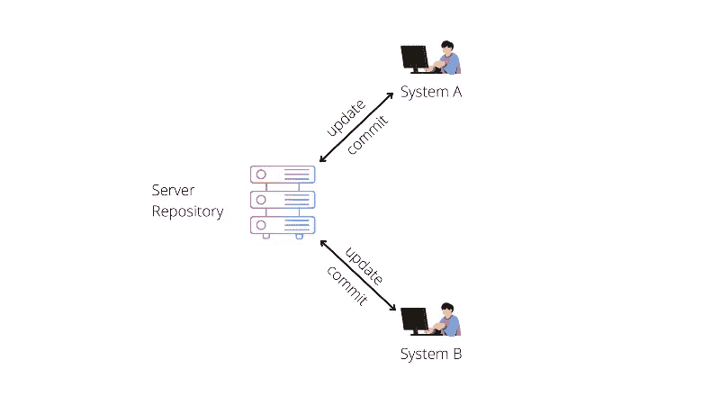
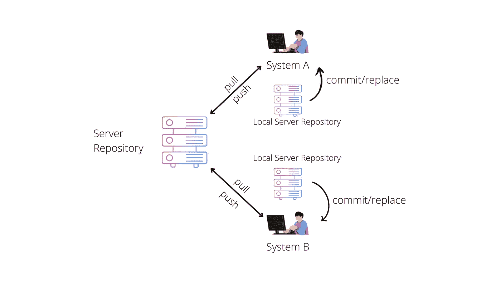
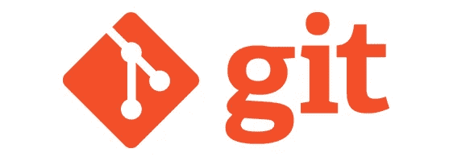
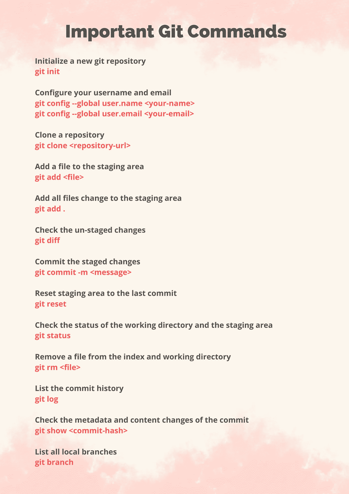
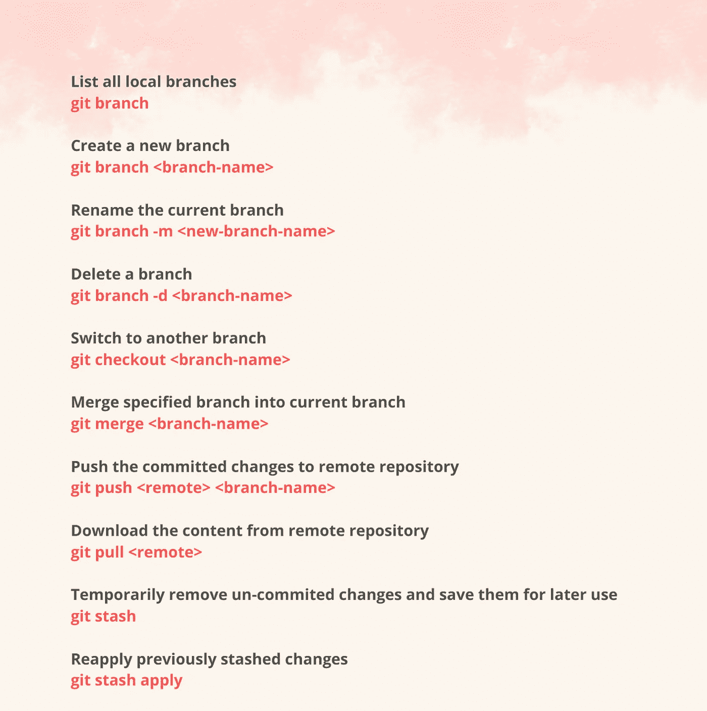

# 版本控制系统的基础&重要的 git 命令

> 原文：<https://blog.devgenius.io/basics-of-version-control-system-important-git-commands-edcd71fd39d3?source=collection_archive---------25----------------------->

版本控制，也称为源代码控制，是跟踪和管理软件代码变更的实践。版本控制系统是帮助软件团队管理源代码随时间变化的软件工具。它帮助软件团队更快更明智地工作。它们对 DevOps 团队特别有用，因为它们有助于减少开发时间和增加成功部署。

版本控制软件在一种特殊的数据库中跟踪对代码的每一次修改。如果出现错误，开发人员可以回到过去，比较代码的早期版本，以帮助修复错误，同时最大限度地减少对所有团队成员的干扰。

版本控制系统的类型(VCS)

*   本地版本控制系统
*   集中式版本控制系统
*   分布式版本控制系统

**本地版本控制系统**

本地版本控制系统是位于本地计算机上的本地数据库，其中的每个文件更改都存储为一个补丁。每个修补程序集仅包含自上一版本以来对文件所做的更改。要查看文件在任何给定时刻的样子，有必要将文件的所有相关补丁按顺序添加到该给定时刻。

这样做的主要问题是所有东西都存储在本地。如果本地数据库发生任何事情，所有的补丁都将丢失，而且与其他开发人员或团队合作是非常困难或几乎不可能的。

**集中版本控制系统**

在集中式源代码管理中，有一个服务器和一个客户端。服务器是包含所有代码版本的主存储库。这使得多个客户端能够同时访问服务器上的文件，将它们拉至其本地计算机或从其本地计算机推至服务器。集中式源代码控制中涉及的基本工作流程是从一个中央存储库中获取最新版本的代码，该存储库也包含其他人的代码，在代码中进行您的更改，然后将这些更改提交或合并到主存储库中。这使得与其他开发人员或团队的协作变得容易。

这种结构的问题是所有东西都存储在一个中央服务器上。如果那个服务器出了什么问题，没有人能够保存他们的版本化更改、提取文件或进行协作。

**分布式版本控制系统**

使用分布式版本控制系统，客户机不仅仅从服务器上检查文件的最新快照，它们还完全镜像存储库，包括它的全部历史。这里，每个开发人员或客户都有自己的服务器，他们在本地服务器或机器上有整个历史或代码版本及其所有分支的副本，而不是一个单独的存储库即服务器。每个客户端或用户都可以在本地和断开连接的情况下工作，这比集中式源代码控制更方便，这也是它被称为分布式的原因。

使用这种模型，如果服务器变得不可用，任何客户端存储库都可以将项目版本的副本发送到任何其他客户端，或者在服务器变得可用时发送回服务器。一个客户端包含一个正确的副本就足够了，该副本可以很容易地被进一步分发。

分布式版本控制系统

Git 是世界上使用最广泛的现代分布式版本控制系统。Git 是一个成熟的、积极维护的开源项目，最初由 Linux 操作系统内核的著名创建者 Linus Torvalds 于 2005 年开发。数量惊人的软件项目依赖 Git 进行版本控制，包括商业项目和开源项目。除了分布式之外，Git 的设计还考虑了性能、安全性和灵活性。

*感谢阅读！如果你喜欢你所读的，按住下面的***按钮，这样其他人会发现这一点，跟随将会非常感谢。**