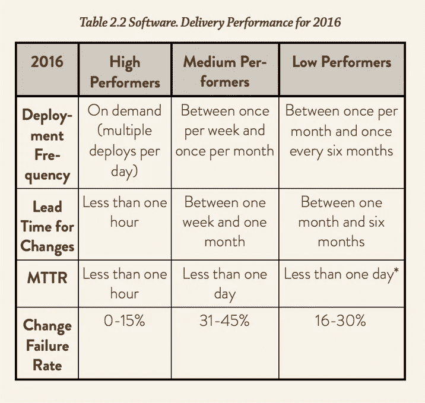

# 定量

> 原文：<https://blog.devgenius.io/batching-1e23cc939710?source=collection_archive---------4----------------------->

我们认为大的改变比小的改变更有效率，但这仅仅是因为我们只是从发展的角度来考虑。越大的变化越难部署到生产中，有些事情直到你得到客户的反馈才算真正完成。

> 批处理是流程中从一个阶段传递到下一个阶段的工作单元。批量大小是工作产品的规模。
> [http://dev 2 ops . org/2012/03/devo PS-lessons-from-lean-small-batches-improve-flow/](http://dev2ops.org/2012/03/devops-lessons-from-lean-small-batches-improve-flow/)

《加速、构建和扩展高绩效技术组织》一书发现，团队的表现与不同的 [DORA](https://www.leanix.net/en/wiki/vsm/dora-metrics) 指标之间存在联系:

每天多次部署与较短的交付时间和生产中出现问题时的快速反应有关。变更失败率更多地与我们的开发实践相关。
但为什么这与小批量有关，我们可以通过解释大批量时的问题来解释这一点。

批量大小、部署频率和在系统中部署的难度之间存在相互依赖关系。
如果您每六个月部署一次生产，您可能会遇到这种情况:

*   批量大，要部署的功能多。
*   每个部署都是一个大计划的一部分，这个计划包括谁将在生产中手动检查部署是否正确。
*   部署将在工作时间之外进行，可能是在晚上或不影响用户的时间段。
*   部署到生产环境中的人并不是开发要部署的特性的人。
*   几个小时的部署时间窗口，通常需要团队之间的一些交流来协调操作人员和测试人员的工作。

所有这些大批量的症状在组织中也有所体现，许多不同的角色负责其中的一个步骤:

*   您将拥有一个 DevOps 团队(实际上是一个旧的运营团队，但有一个新的花哨名称)，他们将是部署到生产的团队。
*   DevOps 团队将负责监控生产，将有大量 DevOps 无法理解的警报。
*   你将有一个 QA 部门(实际上是许多手工测试人员在他们自己的环境中手工检查东西)。
*   将有一个 DBa 部门负责数据库中的更改。
*   您将有许多生产前环境，允许前面的每个角色单独测试他们的工作部分。

从业务的角度来看，如果没有能力比我们做得更快、质量更好，六个月的部署频率通常是合适的。因为如果其他人能够做我们正在做的事情，并且更频繁地为用户提供更好的功能，我们就只能在价格上与他们竞争，更便宜，有时这是一个问题。因此，高质量、更快地投入生产有助于你的公司在另一个领域与其他公司竞争，它允许你根据客户的数据设计你的功能，并在需要时使用你的产品更快地改变方向([假设驱动开发](https://opensource.com/article/19/6/why-hypothesis-driven-development-devops))。

如果您感受到了这种痛苦，那么您正在进行部署，以便在部署当天一次推出众多功能。你遵循大爆炸的方法，要么一切都在生产，要么什么都不是。
**你的批量大小是一组特征。**

## 增加频率

当企业开始认为我们把新功能交到用户手中的速度非常慢时，我们开始考虑改变。
下一阶段通常是做同样的事情(在生产中使用相同的过程来开发测试和部署特性)，但是频率更高。所以我们说我们需要做以前做过的事情，但是每个月都要做。在那一刻，你会意识到你的流程、文化和员工反对这种改变。现状不利于变革，因为变革需要改变公司，找到更好的流程，让我们从六个月缩短到一个月。如果你不改变这些过程，角色的行为，那么你的目标将很难实现。你正处于这个阶段的一些信号:

*   开发人员在下一次迭代中将会有一大堆的 bug，因为上一次部署并不像大家想象的那样好。
*   QA 会为没人关心的缺陷或错误开出大量罚单。
*   英航将尝试自己对数据库进行所有的修改，把自己变成守门员。
*   PO 的 PM 或 Scrum Masters 会因为团队的速度和每次迭代中产生的 bug 数量而抱怨。

所有这些影响都是因为我们试图做一件非常困难的事情，维护一个为每六个月部署一次而设计的流程，并将其用于每个月的部署。

事实上，该公司的人们正感受着与《生活大爆炸》发布时同样的痛苦，但每两周一次。这里有两种可能，公司回去，或者因为产生的所有痛苦而改变。

## 变化

为了能够增加我们的部署频率，我们需要改变，以减少我们需要改进过程的次数。但是要改变什么呢？，[约束理论](https://www.leanproduction.com/theory-of-constraints/)可以在这方面帮助我们。约束理论使用一个称为五个聚焦步骤的过程来识别和消除约束:

*   识别:识别当前的约束(限制每个月部署到 prod 的流程的单一部分)。
*   Exploit:使用现有资源快速提高约束的吞吐量(即，充分利用您所拥有的资源)。
*   从属:审查生产过程中的所有其他活动，以确保它们与约束一致，并真正支持约束的需求。
*   提升:如果约束仍然存在(即，它没有移动)，考虑可以采取什么进一步的行动来消除它成为约束。通常，动作在这一步继续，直到约束被“打破”(直到它移动到其他地方)。
*   重复:五个聚焦步骤是一个持续改进的循环。因此，一旦解决了一个约束，就应该立即解决下一个约束。这一步提醒你永远不要自满——积极改善当前的约束……然后立即转向下一个约束。

经常检查我们的[生产路径](https://javi-kata.medium.com/ci-cd-the-journey-of-a-dummy-team-f51a061684bc?sk=f87d2f392581df6e60076f1ca848b77b)以消除限制将使我们处于持续改进的场景中，为我们自己找到更好的解决方案。

## 一个特征

如果您每两周部署一次产品，那么您将会意识到，为了进入下一步，您需要在特性完成后就开始考虑部署特性，而不是等待其他特性的部署。
这有很多好处:

*   当我们认为某样东西已经准备好了，客户就会使用它，你的故事的上市时间就会减少到最短。
*   为了实现这一点，我们需要将开发、测试和部署所需的所有角色放入团队中。所以我们的团队会有更多的自主权，能够决定更多的事情。
*   风险比以前更小，因为更容易理解发布内容。

很多公司在这里停止减少批量，因为他们甚至不认为还有另一个步骤可以做。在此阶段，您可能会感到一些痛苦:

*   高水平的技术债务，没有时间来解决技术债务。
*   我们只专注于功能，其他的都很难做到。
*   大的特性很难实现，它们会在分支中存在很长时间，分支从主功能中分出来的时间越长，合并它就越困难。
*   团队内部的过程被分成几个部分(例如分析、开发和手工检查)，由团队内部的不同角色来完成。我们在不同的角色之间有了更好的协调，但我们仍然有一些问题需要解决。

## 一次提交

下一个变化需要心态上的巨大改变，但是这个变化允许你将发布与部署分离。您可以在每次提交时部署到生产环境中，因此您的部署频率将是每天多次，这允许您在生产环境中与客户一起试验您的产品，并在出现问题时更快地做出反应。这也让你可以更快地使用来自生产的反馈，例如，你的 QA 可以在生产中进行探索性测试，检查一些缺陷，与开发人员讨论并立即解决它们。要解决生产中的 bug，你只需要提交并把补丁推送到 main，几分钟后它就投入生产了。

*   在这种情况下，零 bug 策略很容易实现。
*   在这种情况下，假设驱动的开发也很容易实现。
*   为了解决技术债务，你只需要不断地重构，这些变化会更快地被团队的其他成员分享。

为了允许所有这些，你需要转移左边的质量(因此当提交被开发时移动质量),而不是稍后检查整个事情的手动，很难为一个人逐个检查提交。每个提交都需要被测试，为了有一个好的变化节奏，你需要依靠自动测试。您将需要某种自动工具来帮助您知道您的提交正在工作(持续集成)。在这种情况下，手动测试是不可能的，所以你必须依赖于你的自动测试，你的管道将检查你的提交是工作的，没有别的。
手动测试对于发现 bug 毫无用处，它们是浪费时间，探索性测试是一个很好的工具，它将帮助我们从产品中获得反馈，并利用这些反馈来改进。但是在这种情况下，探索性测试将不再是守门员。

如果您能够将每个提交部署到生产中，您将会做[连续部署](https://javi-kata.medium.com/ci-cd-the-developer-perspective-73ae627f435?sk=cb2c2e3f9f0539bda926f00943f11579)。

**提交是您可以想象的较小的批量。**