# 小样本混合模型的贝叶斯分析

> 原文：<https://blog.devgenius.io/bayesian-analysis-of-small-sample-mixed-models-8d40ff01a887?source=collection_archive---------8----------------------->

## 处理随机截距和随机斜率之间讨厌的相关矩阵

我的一个朋友让我告诉他我将如何处理包含 20 个观察值的数据集的分析，每个测量组 10 个，测量两次。该数据集是治疗前和治疗后数据集，其中在“治疗”之前和之后测量 10 名受试者。

现在，对于那些熟悉混合模型或纵向数据的人来说，你会认识到这是纵向数据。你也可以称之为前后数据或前后数据，但无论你怎么框定都是纵向数据。因此它是适合混合模型的数据，因为观察值不是独立的，因为它们是在两个时间点从相同的个体获得的。对于那些不熟悉混合或纵向数据的人，我以[频率主义者](https://medium.com/mlearning-ai/introduction-to-mixed-models-in-r-9c017fd83a63)和[贝叶斯](https://medium.com/mlearning-ai/mixed-models-of-chicks-weight-a41413c99b51)的方式写了很多。

我今天要特别关注的是处理模型的随机截距和随机斜率之间的相关矩阵。正如副标题所揭示的那样，这种相关性确实令人讨厌，如果你用贝叶斯方法分析数据，你需要事先处理好。因为，一个好的贝叶斯分析需要你为分析的所有部分定义先验，而不仅仅是感兴趣的参数。不，整个模型需要先验知识。

所以，我今天要讲的是两件事:

1.  使用贝叶斯分析对小样本数据集建模
2.  处理相关矩阵，更具体地说，通过 LKJ 先验或莱万多夫斯基、库罗维卡和乔先验来处理它。在这里，你可以看到一个非常好的博客[帖子](https://adamhaber.github.io/post/varying-slopes/)，来自亚当·哈伯，关于使用 Python 之前的 LKJ。

让我们从手头的数据开始。

首先，让我们看看我们有哪些数据。我将使用捏造的数据，老实说，你产生什么样的数据并不重要。只要它分等级。在我们看来，每个受试者有两行:一行在治疗前，一行在治疗后。

```
rm(list = ls())library(ggplot2)
library(brms)
library(bayesplot)
library(tidybayes)
library(dplyr)
library(bayesrules)
library(rethinking)
library(dplyr)
library(forcats)
library(lme4)sub=rep(1:10,2)
treat=rep(c("pre","post"),each=10,length.out=20)
score<-c(12,14,19,16,11,11,21,18,10,16,14,17,18,18,13,14,23,18,9,20)
df<-data.frame(sub, treat, score)
df %>%
  mutate(treat = fct_relevel(treat, 
                            "pre", "post")) %>%
ggplot(., aes(x=as.factor(treat), 
               y=score, 
               group=sub, 
               color=as.factor(sub)))+
  geom_point()+
  geom_line()+
  theme_bw()+
  labs(col="Subject", x="Treatment")
```

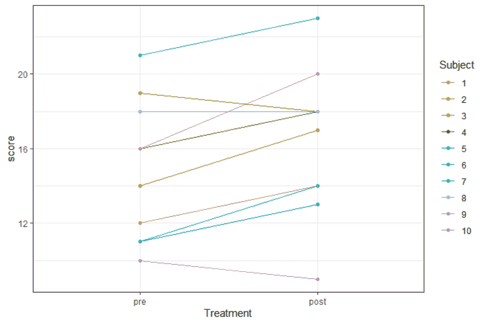

你可以看到 10 名受试者的前后分数。从一开始，您就应该清楚混合模式的设置。但是，要小心，因为它是一个非常小的数据集。即使在进行贝叶斯建模时，你也可能会遇到从如此小的数据集中获取某些东西的问题。

就像我说的，我们可以用多种方法分析数据，但我更喜欢混合模型。在使用贝叶斯方法之前，我将使用 Frequentist 方法和包含 [**lmer**](https://www.rdocumentation.org/packages/lme4/versions/1.1-29/topics/lmer) 函数的 [lme4](https://cran.r-project.org/web/packages/lme4/index.html) 包，用于具有高斯响应变量的混合模型。我的第一个模型将是一个随机截距模型，它假设患者在开始时是不同的。我将使用*治疗*变量作为时间，定义前期和后期阶段。

```
fitlme<-lmer(score~treat+
               (1|sub),
             data=df)
summary(fitlme)
plot(fitlme)
sjPlot::plot_model(fitlme, type="diag")
```


截距、治疗效果和受试者之间的差异。

我们可以检查模型是否符合其假设。你要寻找的是正态性和方差齐性，后者是最重要的。

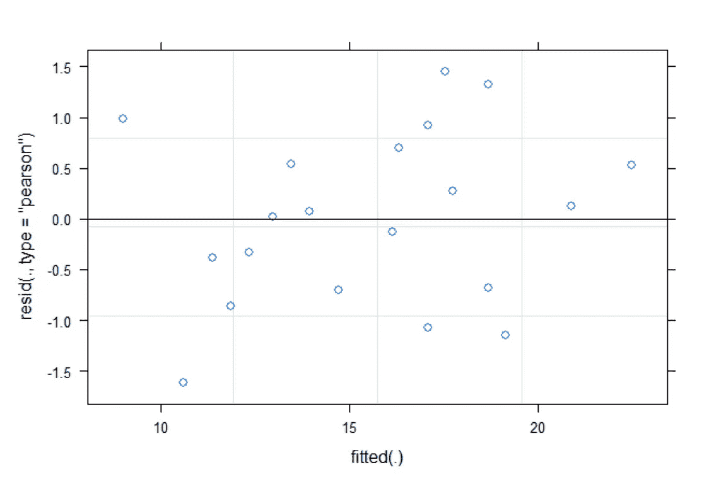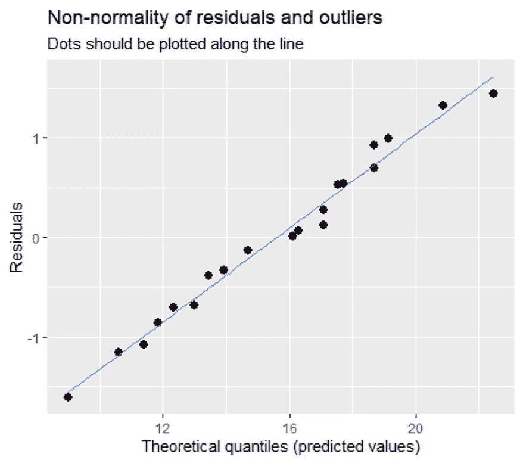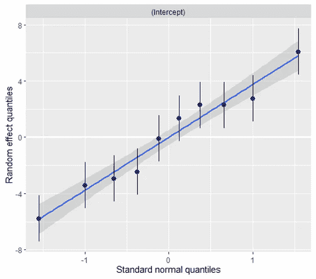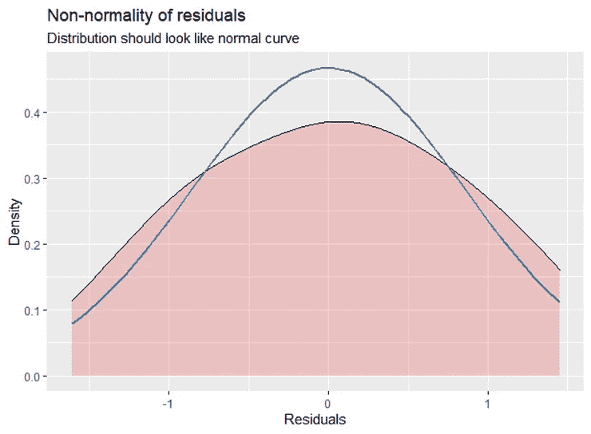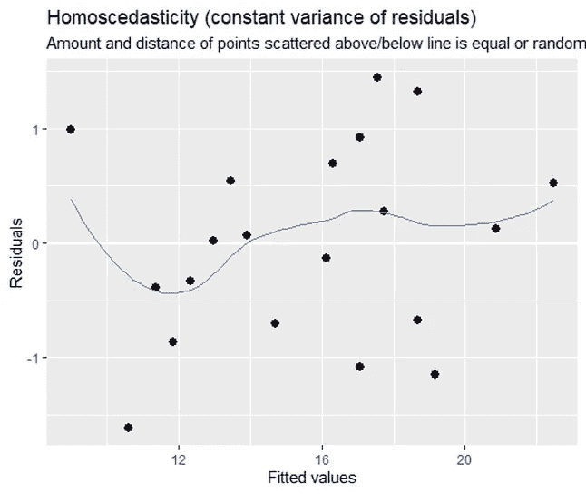

看起来不错。

但这不是我想要的最终型号。我想要的最终模型是随机截距，随机斜率。但是，这会给我带来问题，我会告诉你为什么。

```
fitlme2<-lmer(score~treat+
               (1+treat|sub),
             data=df)
```

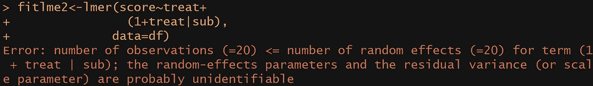

这个误差意味着增加另一个方差分量将使模型无法识别，在英语中这意味着随机截距和随机斜率与残差纠缠在一起。因此，模型比它应该的要复杂得多，因为你包含了比你所拥有的更多的方差分量(随机截距、随机斜率、残差)。

现在，如果我们后退一点，这个错误是有意义的。我们有两个时间点，我们已经可以看到，个人从不同的位置开始，所以肯定有一个随机截距定义。我也很确定，一个物体的起始位置，在某种程度上，决定了它的轨迹。因此，如果你开始低，或高，它应该有影响。或者至少，我想模拟一下。但是，通过包括随机斜率，我去掉了治疗效果。看看如果我取消治疗会发生什么。

```
fitlme3<-lmer(score~(1+treat|sub), data=df)
```

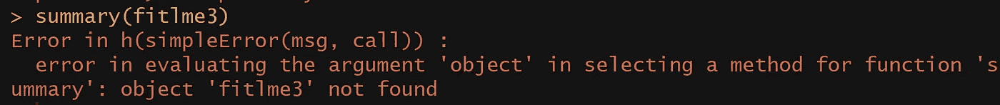

尽管如此，它还是不起作用，这是因为我用两个方差分量太多的方式“划分”数据。

然而，我们面临的最大问题是，一切都需要来自数据，这就是为什么我们在应用贝叶斯模型时不会有这个问题。原因很简单:贝叶斯模型通过将其与先验结合，将其观点扩展到数据和任何可能性估计之外。

让我们看看这是怎么回事，但在开始之前，我要做两个大的假设:

1.  我期望受试者开始不同(随机截距)。
2.  我希望这种变化是治疗的直接结果，也是受试者的起点。这很复杂，但是你看到的任何变化都不能完全归因于治疗，因为受试者开始时是不同的。这就像进行减肥干预，然后测量减掉的磅数，但是受试者一在干预前重 400 磅，另一个重 100 磅。最有可能的是，任何体重减轻都是两者的函数(随机斜率)。

因此，一个随机截距随机斜率模型，即使干预实际上是斜率。但是首先，让我们看看随机截距模型在贝叶斯方法中是怎样的，尽管我不会开始完整的贝叶斯方法(没有先验，只有可能性)。

```
fit<-brm(score~treat+(1|sub),data=df)
summary(fit)
plot(fit)
pp_check(fit, ndraws=100)
```

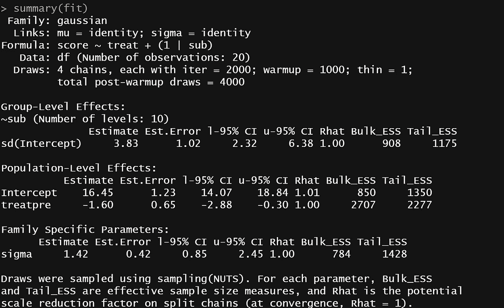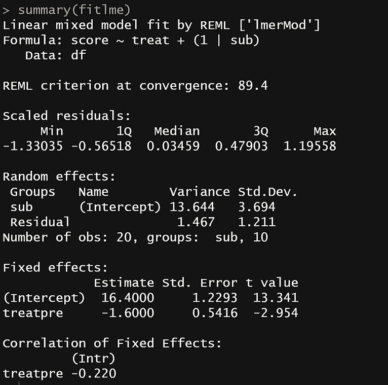

左图:不完全贝叶斯的贝叶斯模型。右图:lmer 模型。同样规格。完全相同的估计，但不精确。尤其是随机截取部分。

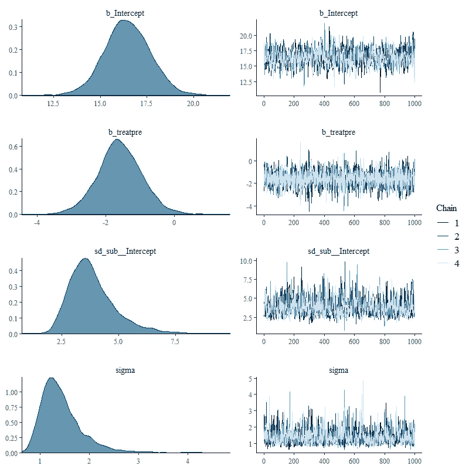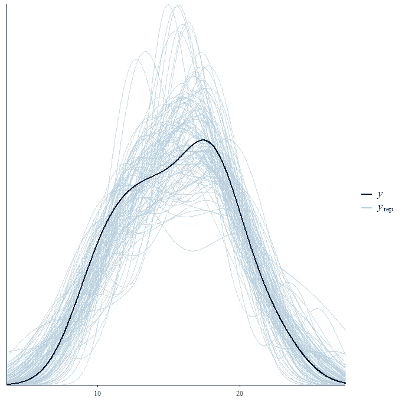

模特看起来不错。链条正在很好地融合。到目前为止一切顺利。

现在，让我们看看能否在 [brms](https://cran.r-project.org/web/packages/brms/index.html) 中建立随机截距随机斜率模型。

```
fit2<-brm(score~treat+(1+treat|sub),
         data=df)
summary(fit2)
plot(fit2)
pp_check(fit2, ndraws=100)
```

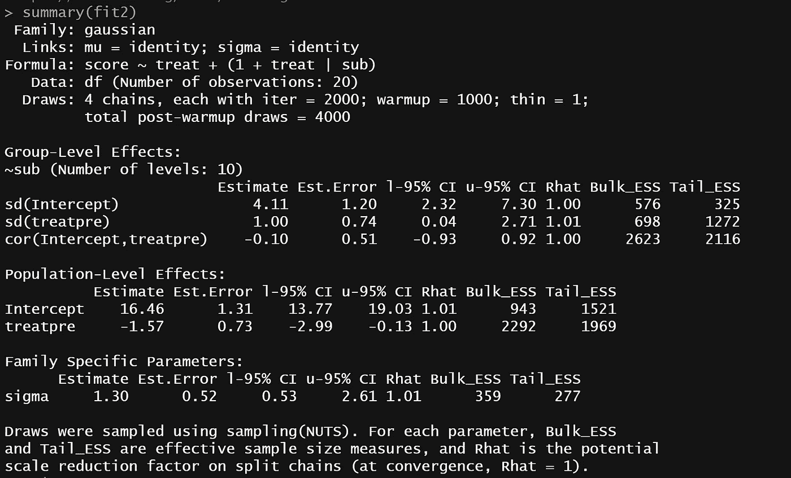

来自随机截距随机斜率的模型。如果模型不能正常运行，那么 **Rhat** 度量就会爆炸，而且估计的误差也会更大。我没看到。

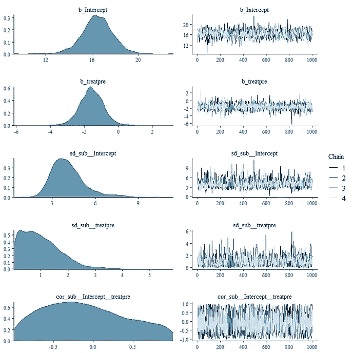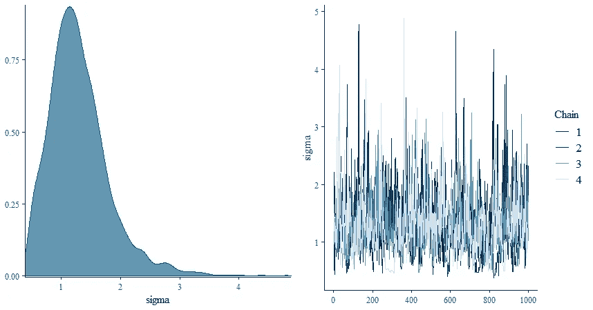

也不算太坏。

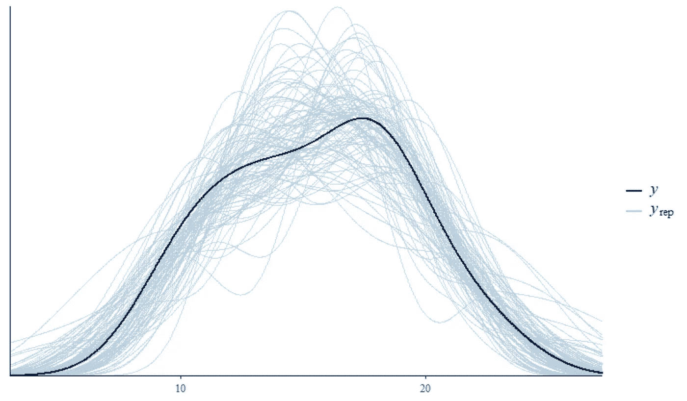

看起来也很体面。请记住:模型和数据不一定要一致，但是因为我们没有使用任何先验知识，我希望从后验观察中找到可靠的一致程度( **Yrep** )。

让我们比较这两种模型。

```
loo_fit<-loo(fit)
loo_fit2<-loo(fit2)
loo_compare(loo_fit, loo_fit2)
```

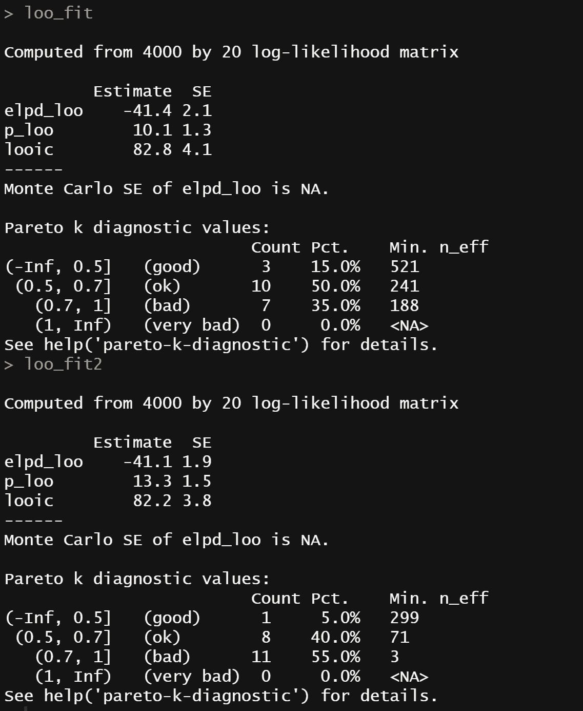

模型 2 似乎没有模型 1 做得好，这并不令我惊讶。同样在这里，在贝叶斯模型中，三个方差分量纠缠在一起，这不是一件好事。

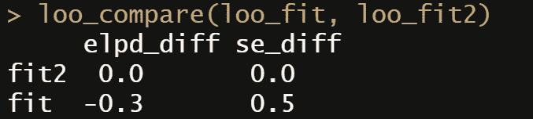

所以，模型可以收敛，但是就像我说的，这不是一个完全的贝叶斯模型。一个完整的贝叶斯模型是有先验定义的，这就是我现在要做的。我将做出以下假设:

1.  治疗没有效果。
2.  受试者在他们的起点——截距上确实不同。
3.  受试者在治疗前后的评估——他们的斜率——确实不同。
4.  受试者确实有不同的斜率，因为他们的起点不同。这是随机斜率和随机截距之间的相关系数。我们将在后面更详细地讨论这一部分。

因此，我假设前值和后值是相关的，但是治疗没有任何效果。如果我要求 brms 根据数据给我提供先验信息，结果会是这样的:

```
get_prior(score~treat+(1+treat|sub),data=df)
```

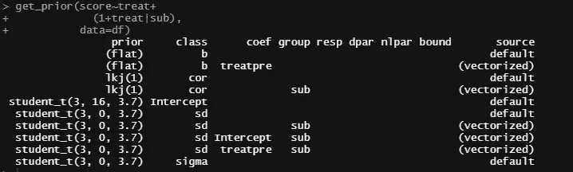

这个输出的问题是，似乎您需要指定所有的变量，但是您并不需要。在大多数情况下，书写指示相同的参数，但是书写方式不同。

让我们定义模型。就前科而言，我只能遵循我的假设，但不能精确到什么程度。所以，在我制作最终模型之前，我需要看看数据。

```
df%>%
  group_by(treat)%>%
  summarise(mean = mean(score))
```

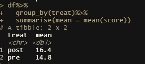

不看前后的平均差异，而只看估计的平均值的大小。

现在，开始详细说明前科。对于截距，我将坚持使用正态分布的平均值 15，对于每个方差，我将使用伽玛分布。随机截距和随机斜率 I 之间的相关性将使用 LKJ 先验进行模拟，并设置为 0.6。我稍后将回到这一点。正态和伽玛分布看起来像这样。

```
p1<-bayesrules::plot_normal(15,2)
p2<-bayesrules::plot_normal(0,1)
p3<-bayesrules::plot_gamma(2,2)
gridExtra::grid.arrange(p1,p2,p3)
```

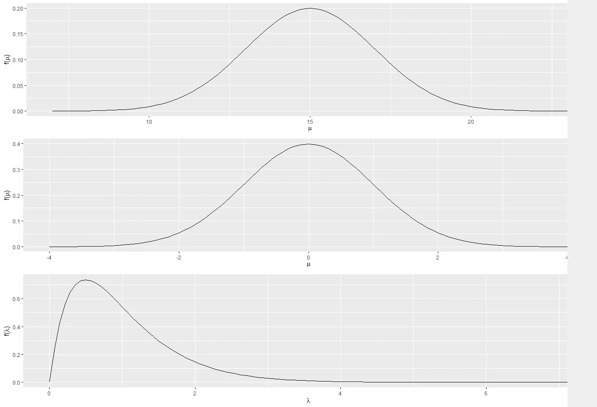

两个正态分布和伽玛分布。

因此，当指定时，模型如下所示:

```
fit3<-brms::brm(score~treat+(1+treat|sub),data=df, 
                prior = c(
                  prior(normal(15,2),   class = Intercept),
                  prior(normal(0, 1),   class = b,  coef=treatpre),
                  prior(gamma(2,2),     class = sd, coef=Intercept, group=sub),
                  prior(gamma(2,2),     class = sd, coef=treatpre,     group=sub),
                  prior(lkj(0.6),       class = cor, group= sub),
                  prior(gamma(2,2),     class = sigma)),
                chains=4, 
                cores=6, 
                iter = 5000, warmup = 2000)
summary(fit3)
plot(fit3)
pp_check(fit3, ndraws=100)
```

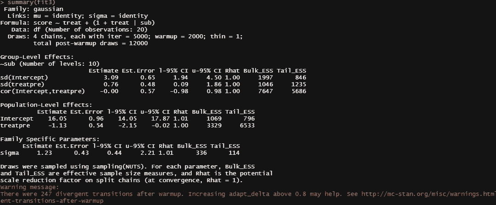

模型如我所愿地运行并收敛。只有截距和适马的估计可能有点问题。让我们进一步看看。

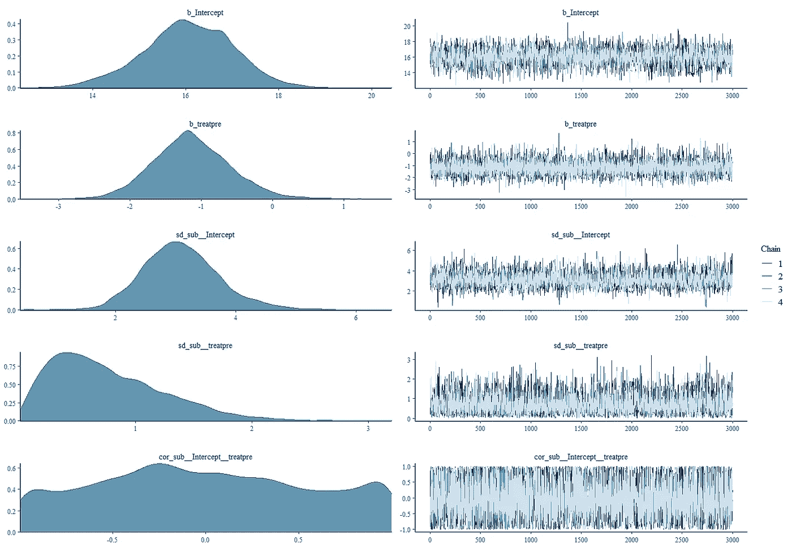

看看相关系数估计值就知道了。这意味着根据模型，它可能在任何地方。这不是我想要的。

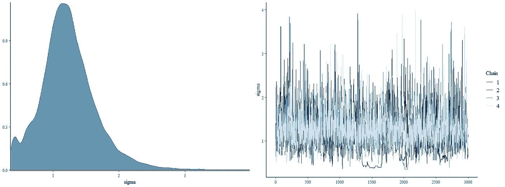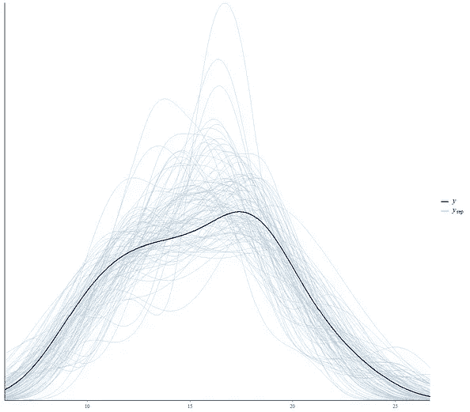

适马估计底部的一些分歧。后面的抽签还不错。

```
color_scheme_set("darkgray")
mcmc_scatter(
  as.matrix(fit3),
  pars = c("b_Intercept", "b_treatpre"), 
  np = nuts_params(fit3), 
  np_style = scatter_style_np(div_color = "green", div_alpha = 0.8)
)
mcmc_scatter(
  as.matrix(fit3),
  pars = c("sd_sub__Intercept", "sd_sub__treatpre"), 
  np = nuts_params(fit3), 
  np_style = scatter_style_np(div_color = "green", div_alpha = 0.8)
)
```

以及一个观察模型警告我们的分歧点的图表。这并不坏，但要记住，因为你不希望有太多不同的情况出现。

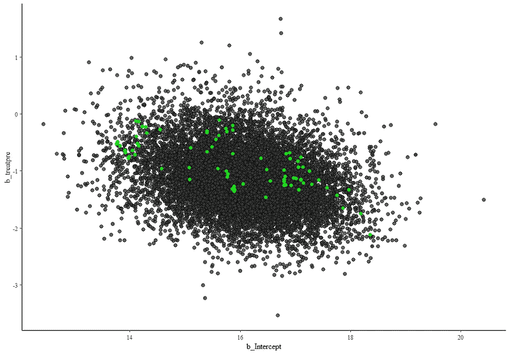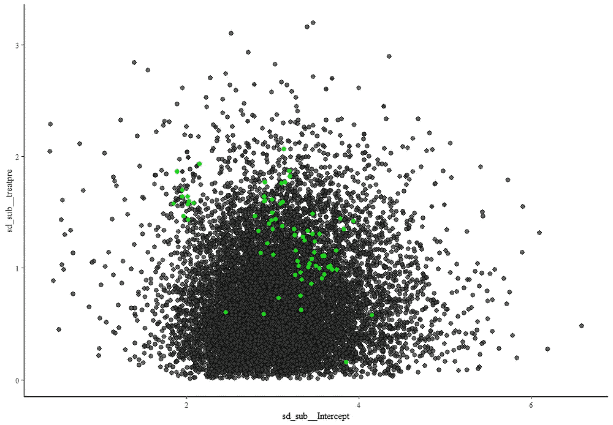

所以，现在是时候深入探究 LKJ 先验了。在模型中，你看到我在做一件简单的事情: *prior(lkj(0.6)，class = cor，group= sub)* —就是它！但事情没那么简单。让我们使用 [mcelreath](https://github.com/rmcelreath) 的重新思考包来仔细看看这个关联矩阵。此外，我们可以通过 STAN 查找一些可用的文档来找到关于 LKJ 先验的信息。

```
?lkj
```

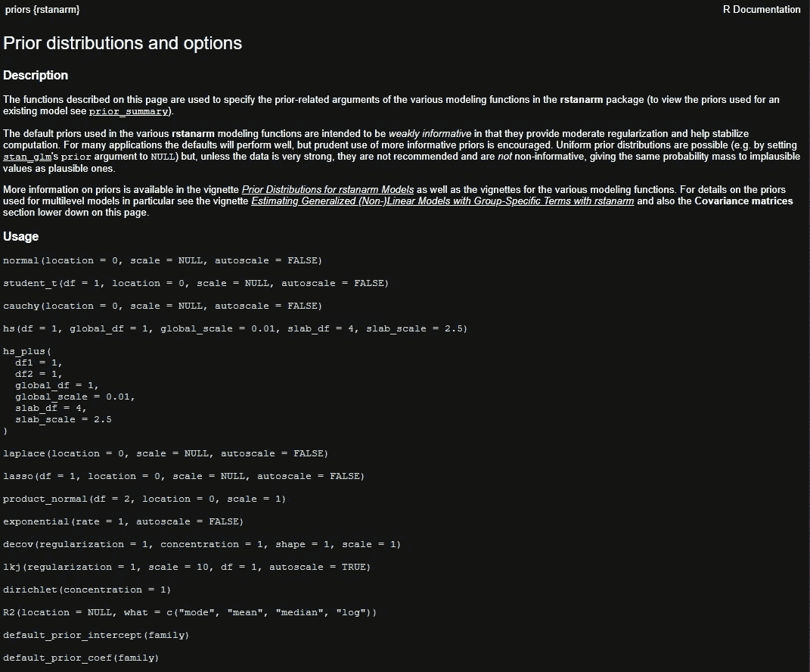

这里描述的是 **lkj** 分布有三个参数可以使用:**正则化**、**比例**和 **df** 。在重新思考包中，参数的命名不同。

```
?rlkjcorr
```

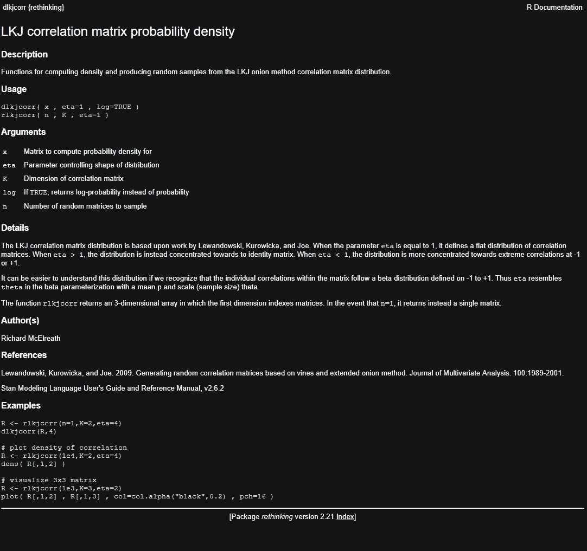

在**重新考虑**包中定义的 lkj 相关矩阵。这里，最重要的参数是 eta。让我告诉你为什么。

```
x<-rethinking::rlkjcorr(1000000, K=2, eta=1)
y<-rethinking::rlkjcorr(1000000, K=2, eta=0.5)
w<-rethinking::rlkjcorr(1000000, K=2, eta=0.6)
z<-rethinking::rlkjcorr(1000000, K=2, eta=1.5)
df<-data.frame(x[,1,][,2],
               y[,1,][,2],
               w[,1,][,2],
               z[,1,][,2])
colnames(df)<-c("Eta 1", "Eta 0.5","Eta 0.6","Eta 1.5")
ggplot(df)+
  geom_density(aes(x=`Eta 1`, colour="Eta 1"))+
  geom_density(aes(x=`Eta 0.5`, colour="Eta 0.5"))+
  geom_density(aes(x=`Eta 0.6`, colour="Eta 0.6"))+
  geom_density(aes(x=`Eta 1.5`, colour="Eta 1.5"))+
  scale_color_manual(values = c("blue", "red","black","green"))+
  labs(x="Correlation Coefficient", y="Density", 
       title="Distribution of correlation value coming from LKJ")+
  theme_bw()
```


这里你可以看到 **Eta** 的影响是什么。所以，当我在 brms 模型中指定 lkj(0.6)时，我做了一个 Eta=0.6 的模型，这个模型相当重。这意味着只考虑远端的相关系数，这不是我想要的。我想要的是指定一个特定的相关系数是适用的。比如说 0.6。但这似乎需要更多的东西。

因此，让我们比较先验相关密度曲线和后验密度曲线。

```
n_sim <- 1e5
set.seed(13)
r_0.6 <- 
  rlkjcorr(n_sim, K = 2, eta = 0.6) %>%
  as_tibble()
post <- posterior_samples(fit3)
post %>%
  ggplot(aes(x = cor_sub__Intercept__treatpre)) +
  geom_density(data = r_0.6, aes(x = V2),
               color = "transparent", fill = "#EEDA9D", alpha = 3/4) + geom_density(color = "transparent", fill = "#A65141", alpha = 9/10) + annotate("text", label = "posterior", 
           x = 0, y = 1, 
           color = "#A65141", family = "Courier") +
  annotate("text", label = "prior", 
           x = 0, y = 0.9, 
           color = "#EEDA9D", alpha = 2/3, family = "Courier") +
  scale_y_continuous(NULL, breaks = NULL) +
  xlab("correlation") +
  ggdark::dark_theme_bw()
```

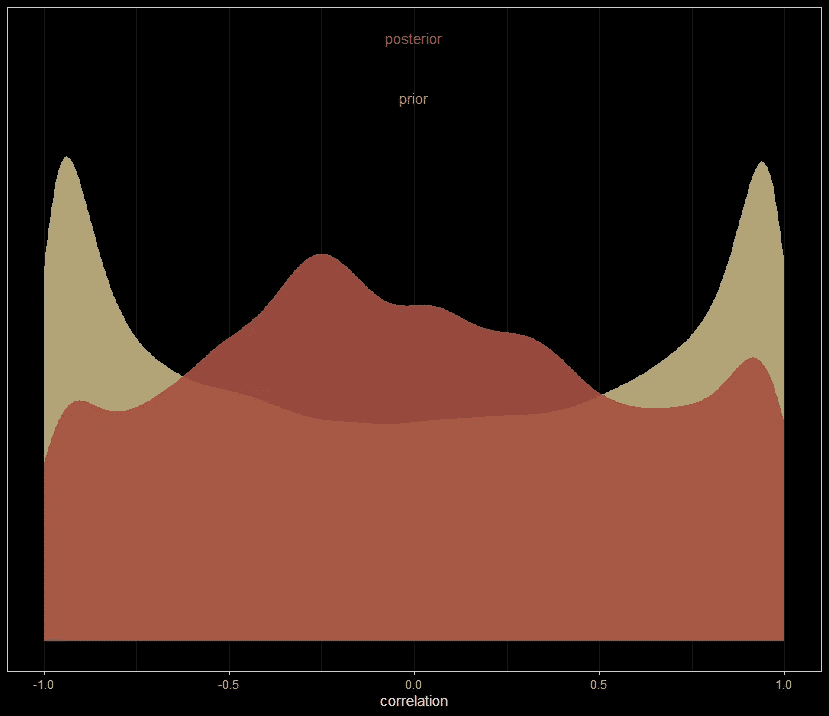

先验和后验不一样，没那么差。这在贝叶斯分析中肯定会发生。但是，后验概率的密度函数非常不稳定，这可能是不应该发生的，并且最有可能与可能性有关，即使用模型从数据中提取的相关性。我们这里说的是小样本。我们确实有随机截距、随机斜率和剩余方差纠缠的问题。

所以，如果我尝试做的事情不可行呢？我知道我选择的优先可以有优点。它毕竟是一个先验，我如何指定由我决定。它不依赖于最新的数据集，而只依赖于我所拥有的知识。因此，先验不必通过与我现在正在建模的数据进行比较来进行辩护，而是在一定程度上它捕获了已经可用的知识。让我们假设我可以，而且前科也说得通。

然后，就到了检查模型的后验与最新数据相比如何的时候了。

```
prediction_summary(model = fit3, data = df)
df %>%
  add_epred_draws(fit3, 
                  ndraws=50) %>%
  ggplot(aes(x = treat, 
             y = score, 
             color = as.factor(sub), 
             group=sub)) +
  geom_line(aes(y = .epred, group = paste(sub, .draw)), alpha = 0.25) +
  geom_line(data = df, color="black") +
  geom_point(data = df, color="black")+
  labs(color="sub")+
  theme_bw()df %>%
  add_epred_draws(fit3, 
                  ndraws=50) %>%
  ggplot(aes(x = treat, 
             y = score, 
             color = as.factor(sub), 
             group=sub)) +
  geom_line(aes(y = .epred, group = paste(sub, .draw)), alpha = 0.25) +
  geom_line(data = df, color="black") +
  geom_point(data = df, color="black")+
  labs(color="sub")+
  facet_wrap(~sub, scales="free", ncol=2)+
  theme_bw()
```

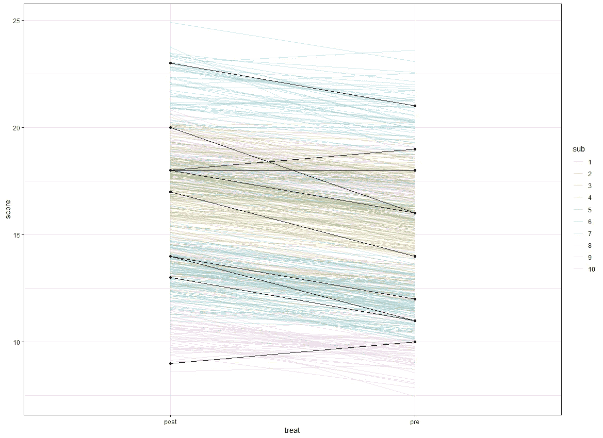

黑色的点和线是观察值，彩色的线是后验图。

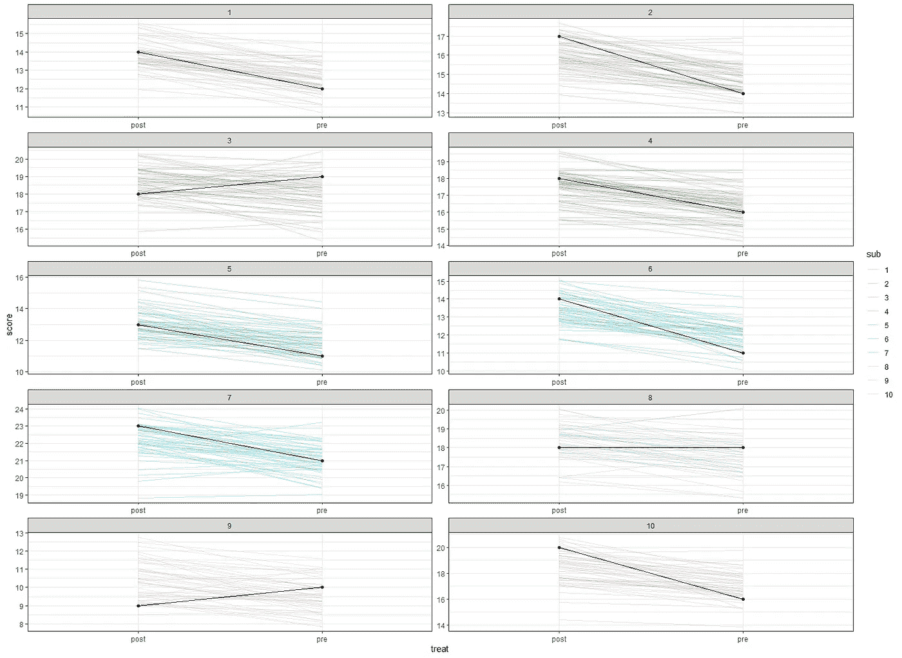

同上，但主题不同。你可以看到后验线覆盖在观测线上，并且模型允许随机截距和斜率。然而，从该图来看，治疗效果并不明显。

让我们仔细看看治疗效果的先验和后验。

```
n_0 <- 
  rnorm(n_sim, 0,1) %>%
  as_tibble()
post %>%
  ggplot(aes(x = b_treatpre)) +
  geom_density(fill="blue", alpha = 0.5) +
  geom_density(data = n_0, aes(x = value),
               fill = "red", alpha = 3/4) +
  geom_vline(xintercept=0, color="orange", lty=2)+
  annotate("text", label = "posterior", 
           x = -2.5, y = 0.5, 
           color = "blue", family = "Courier", size=8) +
  annotate("text", label = "prior", 
           x = 2.5, y = 0.5, 
           color = "red", size=8, family = "Courier") +
  scale_y_continuous(NULL, breaks = NULL) +
  xlab("correlation") +
  ggdark::dark_theme_bw()
```

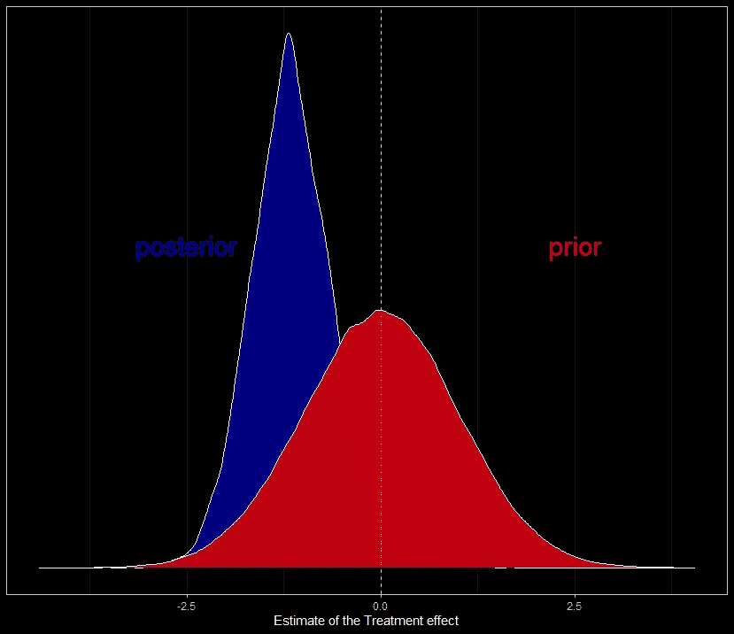

β的先验和后验**处理**。先验显然是广泛的，但其中心点没有影响。后验更倾向于一个效果，尽管这里零也是非常可能的。

我们当然可以更正式地检验治疗之间的后验差异。

```
fit3 %>%
  recover_types(df) %>%
  emmeans::emmeans( ~ treat) %>%
  emmeans::contrast(method = "pairwise") %>%
  gather_emmeans_draws() %>%
  ggplot(aes(x = .value, 
             y = contrast)) +
  stat_halfeye(alpha=0.5)+
  theme_bw()
```

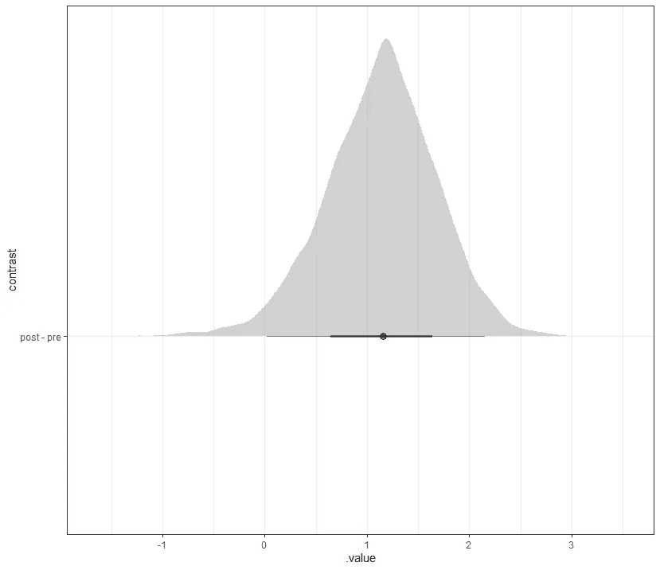

该图表明，后验概率不能排除治疗无效的可能性。

让我们更仔细地看看所有这些密度函数。为此，有一个很棒的包叫做[bayestr](https://easystats.github.io/see/articles/bayestestR.html)，我要展示的输出就是来自这些例子。我要给你们展示的是参数的分布，以及你们可以赋予它什么样的意义。这绝不是给概率分布赋予[p 值或某种统计学意义的方式。当然，这正是 p 值的含义。](https://medium.com/mlearning-ai/inference-estimates-p-values-and-confidence-limits-a-frequentist-approach-acdd45d94bd5)

```
bayestestR::hdi(post$b_treatpre)
result <- p_direction(fit3)
result
plot(result)+theme_bw()
```

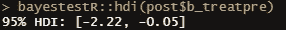

实际上，这就是我所需要的。最高密度区间显示零不在区间内，所以治疗有效果的可能性相当大。治疗效果的大小各不相同，其大小肯定存在一些不确定性。

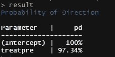

正方向和方向概率。没什么意义，不是吗？

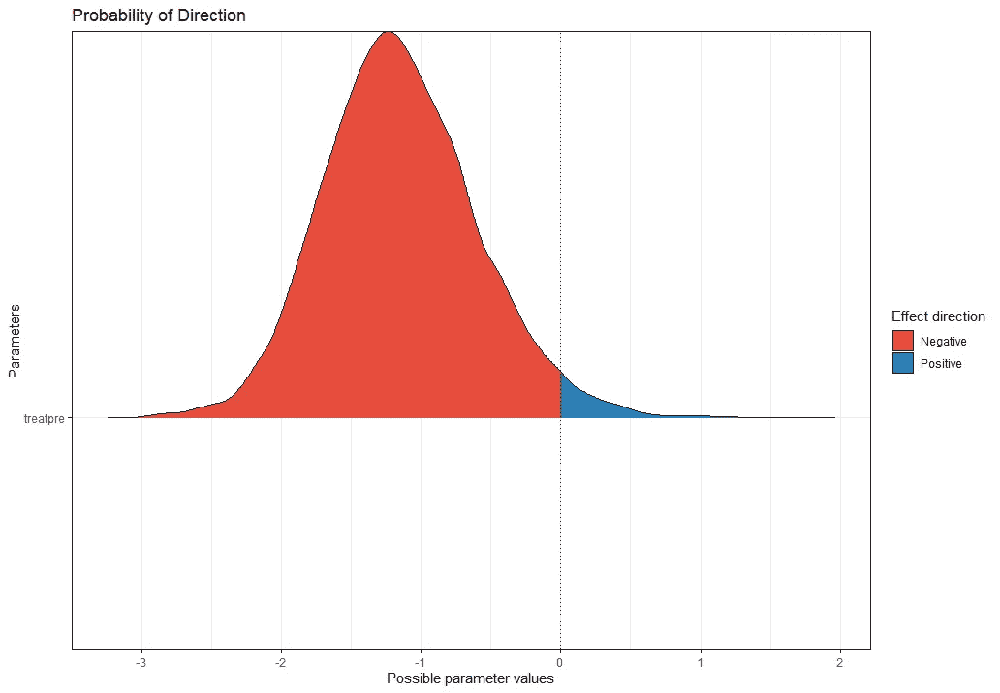

下面，一个比较好的例子。这里您可以看到处理的差异(实际上是测量前与测量后的差异),它显示测量前的差异可能小于测量后的差异。至少，根据来自我的模型的后验，它包含了一个先验，说不会有区别。

我们可以对所有分布进行上述操作，而不仅仅是感兴趣的特定参数。

```
result <- p_direction(fit3, 
                      effects = "all", 
                      component = "all")result
plot(result)+theme_bw()
plot(result, n_columns = NULL)+theme_bw()
```

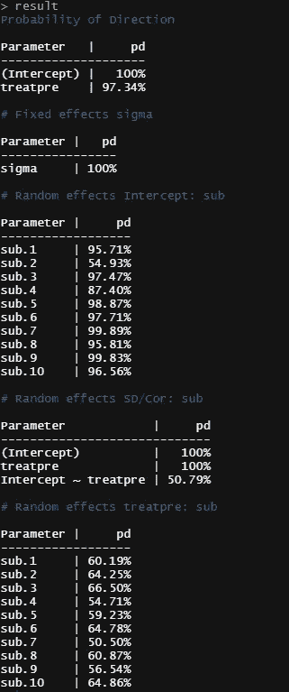

该表包含几乎与下图相同的信息，但缺乏直观的描述。

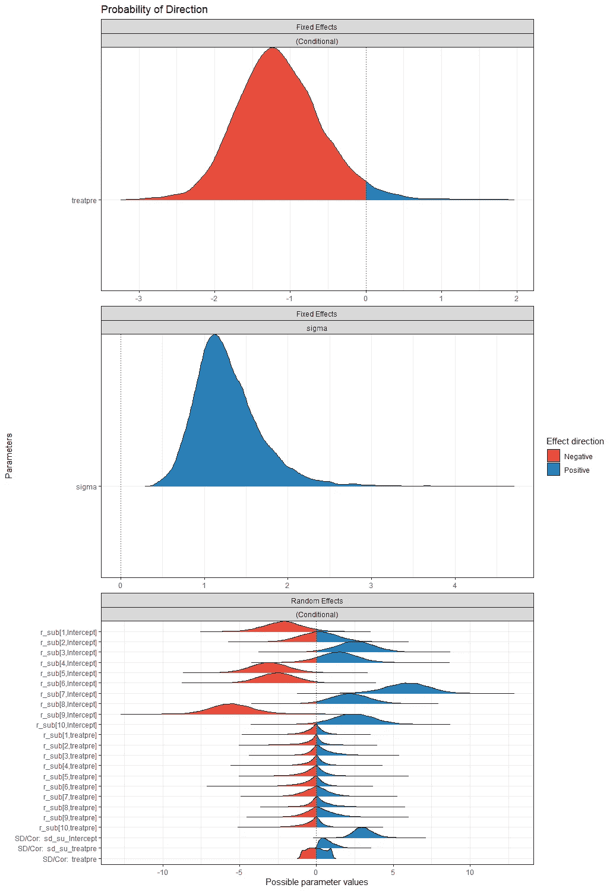

下面我们看到截距和斜率的随机效应。它非常清楚地显示了一个随机的斜率，每个受试者并没有什么不同。在最下面，我们可以看到相关系数的分布。

```
result
plot(result)+theme_bw()
plot(result, n_columns = NULL)+theme_bw()
```

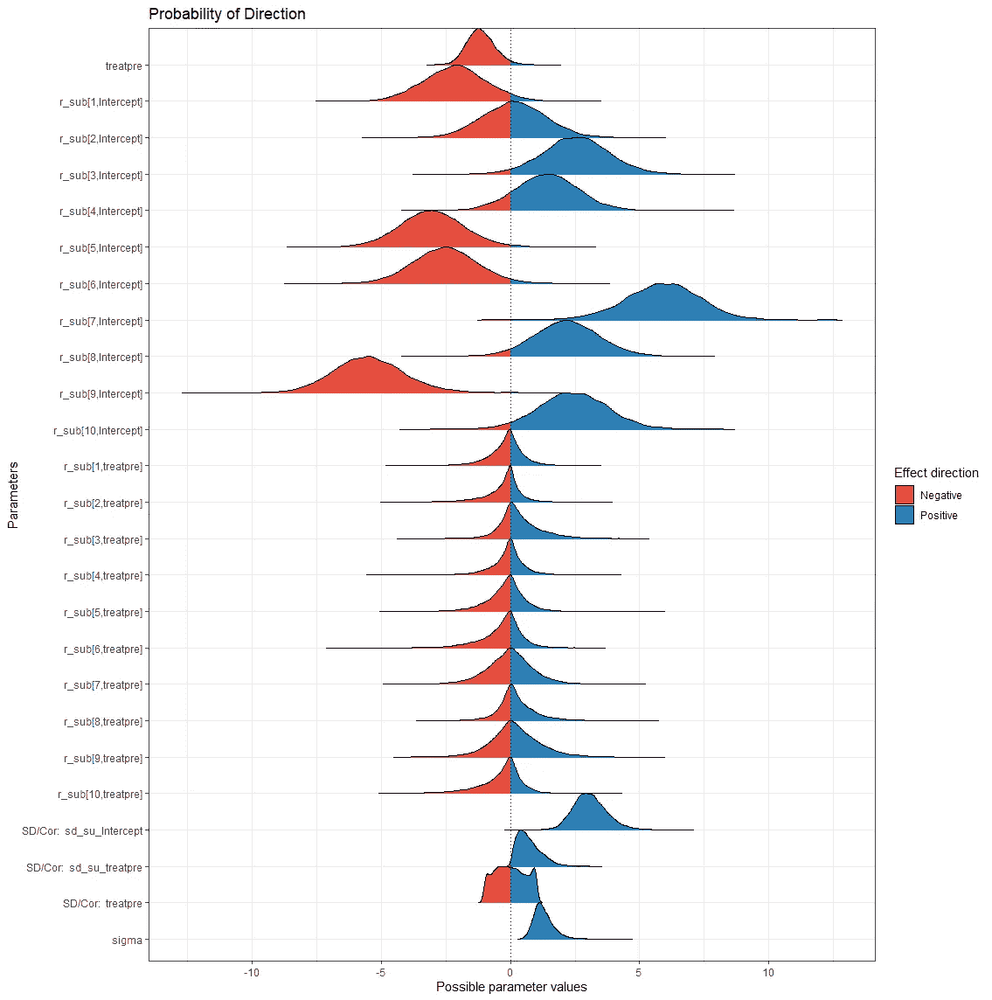

和上面相同的情节，但没有方面。

现在，下一个图更有趣，显示了治疗效果的后验和先验。请记住，我指定了无治疗效果，这一点你可以从先验中清楚地看到。

```
result <- p_direction(fit3)
plot(result, priors = TRUE) + theme_bw()
```

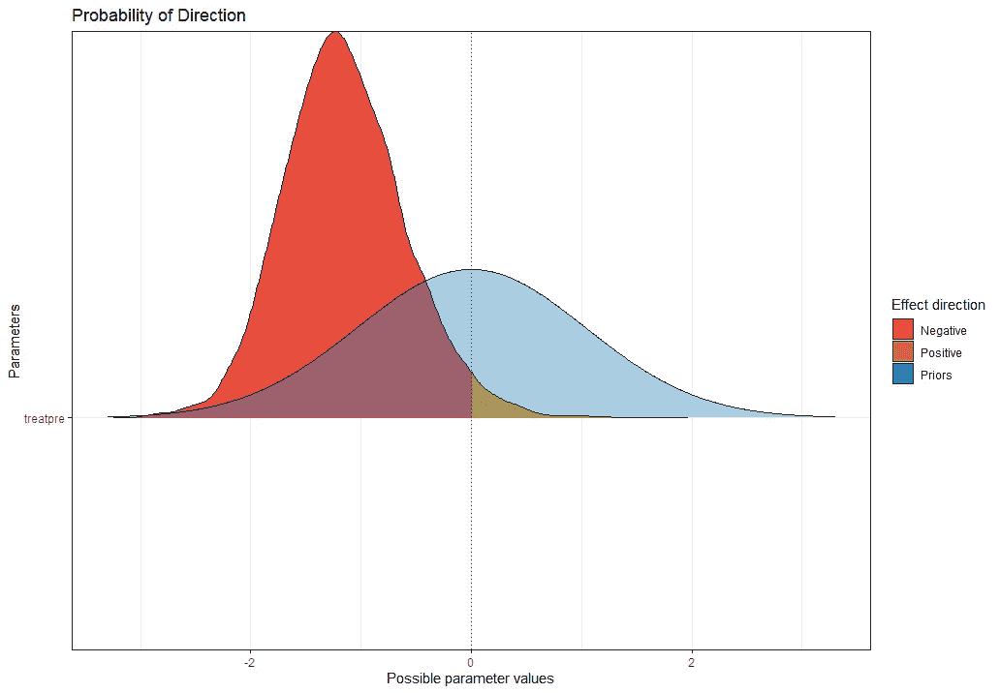

在这里，你可以看到后验和先验方向的影响。

最后但同样重要的是，只给那些喜欢颜色的人。可信区间的分布，用颜色表示。

```
result <- hdi(fit3, ci = c(0.5, 0.75, 0.89), effects = "all", component = "all")
plot(result, n_columns = 3) + scale_fill_metro()+ theme_bw()
```

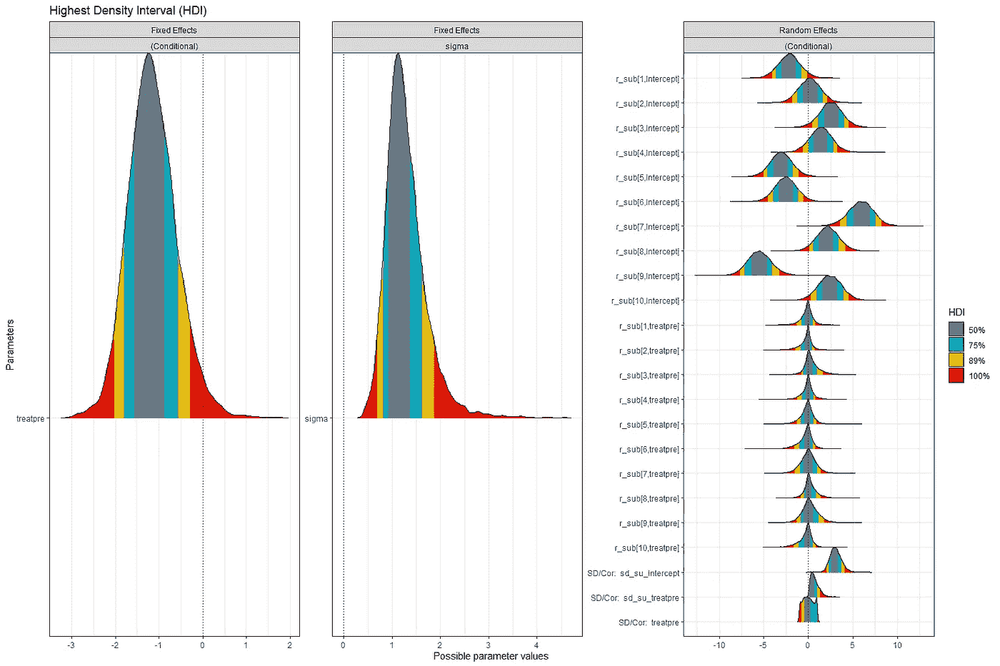

所有参数，用颜色表示最高密度区间的百分比。

好吧，最后一点是相当偏离，但我们在这里，在最后。对于那些相信我会用相关矩阵解决他们所有问题的人，我很抱歉。事实并非如此。在这篇博文中，我想告诉你，建模是做出选择，而不是简单的选择，相关性在其中发挥着作用。

也许过一段时间，我会写一个更大的博客，展示如何模拟和建模相关矩阵。既有混合模型方式，也有时间序列分析方式。

在那之前，小心点，如果有什么不对劲，请告诉我。