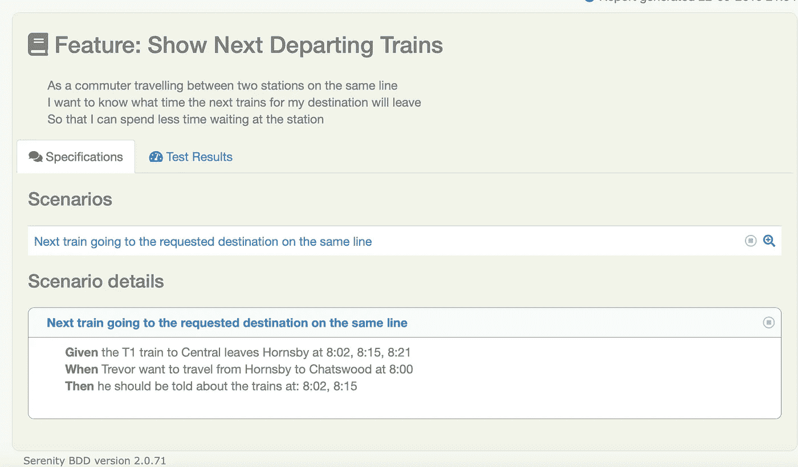
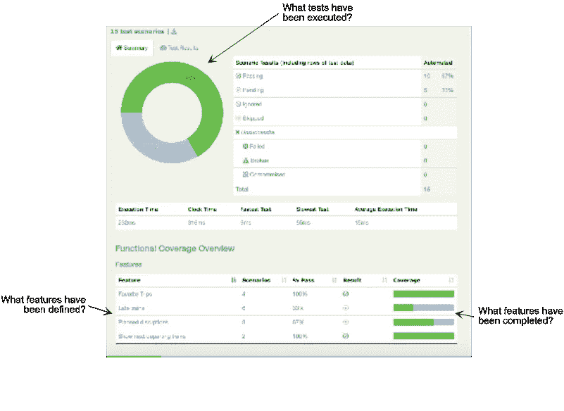
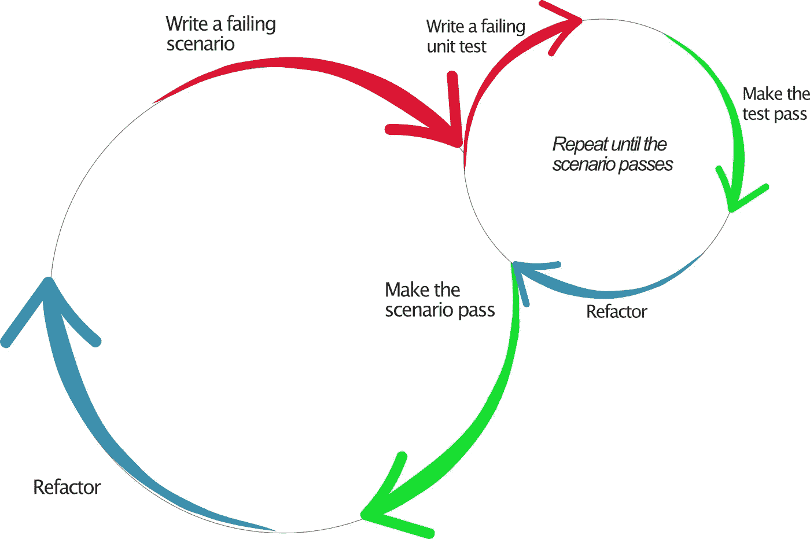
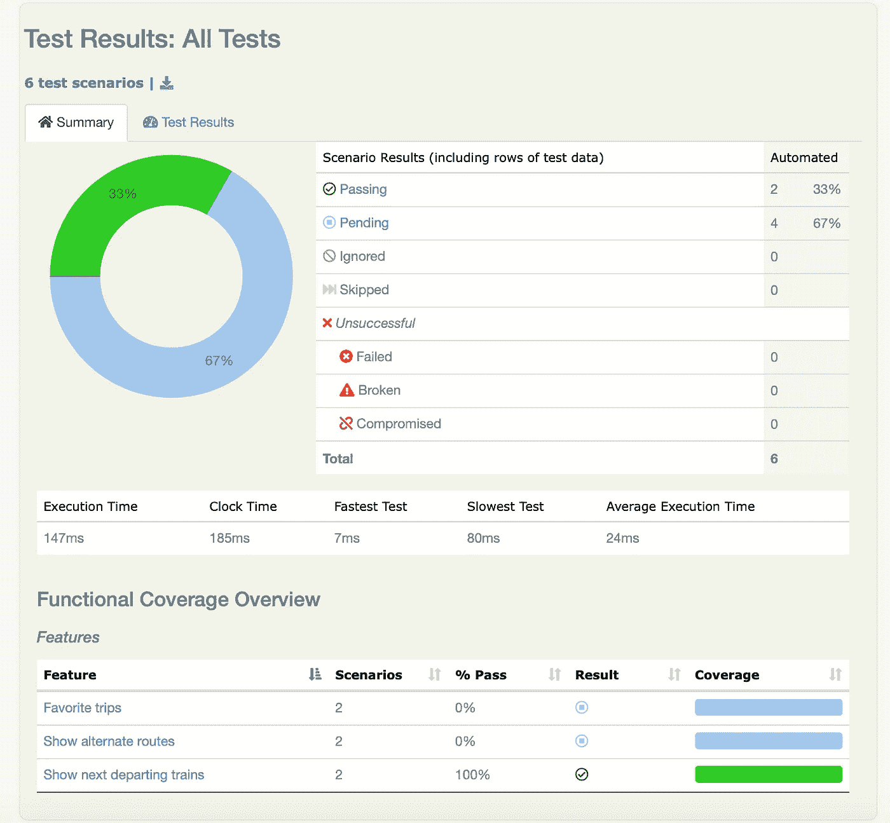
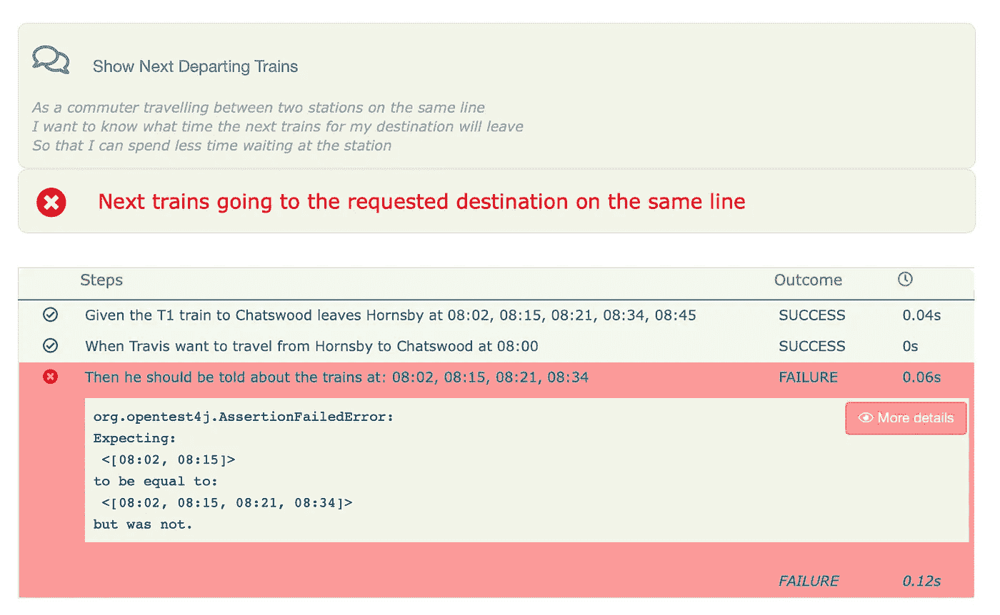

# BDD 自动化:从可执行规范到自动化测试

> 原文：<https://blog.devgenius.io/bdd-automation-from-executable-specifications-to-automated-tests-11b0c2650490?source=collection_archive---------5----------------------->

## 文章

## 约翰·弗格森·斯马特的第二版《BDD 在行动》

本文探索了可供使用的 BDD 自动化工具。

在[manning.com](https://www.manning.com/?utm_source=medium&utm_medium=organic&utm_campaign=book_smart_bdd_1_9_20)结账时，将 **fccsmart2** 输入折扣代码框，即可享受 40%的折扣 [*BDD in Action，第二版*](https://www.manning.com/books/bdd-in-action-second-edition?utm_source=medium&utm_medium=organic&utm_campaign=book_smart_bdd_1_9_20) 。

许多专门的 BDD 工具可以用来自动化您的验收标准。流行的选择包括 Cucumber(针对 Java、JavaScript、Ruby 和许多其他语言)、SpecFlow(针对。NET)，以及行为(对于 Python)。尽管它们不是必不可少的，但是这些工具使得以结构化的形式表达自动化测试变得更加容易，类似于通常使用的“给定…当…然后”表达式。这使得产品所有者和测试人员更容易理解和识别自动化验收标准，这反过来可以帮助增加他们对自动化测试和自动化验收测试方法的信心。

## **用 Maven 和 Cucumber 建立项目**

在本文中，我将使用几种不同的 BDD 工具举例说明。我们使用 Cucumber 和 Java[【1】](https://freecontent.manning.com/bdd-automation-from-executable-specifications-to-automated-tests/#id_ftn1)编写可执行的规范，项目使用 Maven 构建和运行。[【2】](https://freecontent.manning.com/bdd-automation-from-executable-specifications-to-automated-tests/#id_ftn2)测试报告是使用 Serenity BDD 生成的，[【3】](https://freecontent.manning.com/bdd-automation-from-executable-specifications-to-automated-tests/#id_ftn3)这是一个开源库，可以更容易地组织和报告 BDD 测试结果。

本文的源代码可以在 GitHub[【4】](https://freecontent.manning.com/bdd-automation-from-executable-specifications-to-automated-tests/#id_ftn4)和 Manning 网站上找到。我们将遍历整个过程，跟随 Tess 和 Dave 在 Cucumber 中实现自动化验收测试，并使用这些测试来驱动他们的开发过程。如果您想跟进，您需要一个安装了以下软件的开发环境:

*   Java JDK(示例代码是使用 OpenJava 12.0.2 开发的，但是它应该可以在 JDK 1.8 或更高版本中正常工作)
*   Maven 3.6.x
*   Git(如果您想查看运行中的示例解决方案

Tess 和 Dave 做的第一件事是使用 Maven 原型创建一个新的 Maven 项目。Maven 原型是一种用正确的目录布局和 Maven 构建脚本创建框架项目的便捷方式。为了使用 Cucumber 和 Serenity 创建一个新项目，他们在命令行上运行以下命令:

```
$ mvn archetype:generate -Dfilter=serenity-cucumber4
```

该命令列出了可用的匹配原型，并提示他们选择想要使用的原型。只提供一个原型，他们输入“1”。接下来，他们输入一个 Maven 组 id(“manning . BDD inaction”)一个 artefact id(“火车时刻表”)和一个初始版本(他们将此作为默认的“1.0 快照”)。Maven 还提示输入项目的根包(它们保留为默认值，与组 id 相同)。整个过程看起来像这样:

```
[INFO] Generating project in Interactive mode
 [WARNING] No archetype found in remote catalog. Defaulting to internal catalog
 [INFO] No archetype defined. Using maven-archetype-quickstart (org.apache.maven.archetypes:maven-archetype-quickstart:1.0)
 Choose archetype:
 1: local -> net.serenity-bdd:serenity-cucumber4-archetype (Serenity automated acceptance testing project using Selenium 2, JUnit and Cucumber-JVM)
 Choose a number or apply filter (format: [groupId:]artifactId, case sensitive contains): : **1**
 Define value for property 'groupId': **manning.bddinaction**
 Define value for property 'artifactId': **train-timetables**
 Define value for property 'version' 1.0-SNAPSHOT: :
 Define value for property 'package' manning.bddinaction: :
 Confirm properties configuration:
 groupId: manning.bddinaction
 artifactId: train-timetables
 version: 1.0-SNAPSHOT
 package: manning.bddinaction
  Y: : **Y**
 [INFO] ---------------------------------------------------------------------
 [INFO] Using following parameters for creating project from Archetype: serenity-cucumber4-archetype:2.0.72
 [INFO] ---------------------------------------------------------------------
 -
 [INFO] BUILD SUCCESS
 [INFO] ---------------------------------------------------------------------
 [INFO] Total time:  30.818 s
 [INFO] Finished at: 2019-09-22T17:14:18-04:00
 [INFO] ---------------------------------------------------------------------
```

这在列车时刻表目录中创建了一个新的项目结构，如下所示:

```
|____train-timetables
 | |____pom.xml                                                   #1
 | |____build.gradle                                                       #2
 | |____src
 | | |____main
 | | | |____java                                                  #3
 | | | | |____manning
 | | | | | |____bddinaction
 | | | | | | |____app
 | | | | | | | |____Calculator.java
 | | |____test                                                     #4
 | | | |____resources
 | | | | |____features                                             #5
 | | | | | |____math
 | | | | | | |____adding_numbers.feature
 | | | |____java
 | | | | |____manning
 | | | | | |____bddinaction
 | | | | | | |____acceptancetests
 | | | | | | | |____AcceptanceTestSuite.java                            #6
 | | | | | | |____steps
 | | | | | | | |____MathsStepDefinitions.java
```

**# 1 Maven POM . XML 构建脚本**

**#2 一个等价的 Gradle 构建脚本**

**#3 应用程序代码在此处**

**#4 测试代码在此处**

**#5 黄瓜特征文件放在 src/test/resource 下**

**#6 这是主要的测试转轮类**

进入火车时刻表文件夹，运行“mvn 验证”命令。这将下载您需要的任何依赖项，并运行与项目框架捆绑在一起的简单特性文件:

```
$ cd train-timetables
 $ mvn verify
 [INFO] Scanning for projects...
 …
 [INFO] -------------------------------------------------------
 [INFO]  T E S T S
 [INFO] -------------------------------------------------------
 [INFO] Running manning.bddinaction.AcceptanceTestSuite
 …
 [INFO] ---------------------------------------------------------------------
 [INFO] BUILD SUCCESS
 [INFO] ---------------------------------------------------------------------
 [INFO] Total time:  6.343 s
 [INFO] Finished at: 2019-09-22T18:17:16-04:00
 [INFO] ---------------------------------------------------------------------
```

现在他们已经有了一个项目框架并开始运行，Tess 和 Dave 继续进行更有趣的工作:以 Cucumber 可以执行的形式实现他们之前发现的场景。

## **记录黄瓜中的可执行规范**

在 Cucumber 中，我们在名为*特征文件*的特殊文件中记录我们之前编写的场景。这些文件有一个”。feature”后缀，顾名思义，它包含了描述特定特性行为的所有场景。

下面是 Tess 如何记录她和 Jill 在上一个问题中定义的场景:

**清单 1。用黄瓜表示的验收标准**

```
Feature: Show next departing trains

   As a commuter travelling between two stations on the same line
   I want to know what time the next trains for my destination will leave
   So that I can spend less time waiting at the station

   Scenario: Next train going to the requested destination on the same line
     Given the T1 train to Chatswood leaves Hornsby at 8:02, 8:15, 8:21
     When Travis want to travel from Hornsby to Chatswood at 8:00
     Then he should be told about the trains at: 8:02, 8:15
```

这只不过是我们之前讨论的示例的结构化版本。粗体字(Feature、Scenario、Given、When 和 Then)是标记特征文件结构的关键字。其他的都是普通的商业语言。

Java 项目的一个常见约定是将特性文件放在 src/test/resources/features 目录下。在这个目录中，功能文件可以按照高级功能或主题进行分组。例如，随着项目的进展，团队可能会得到如下目录:

*   路线(路线计算和时间表信息)
*   通勤者(通勤者的个性化出行数据)
*   通知(通勤者的延迟通知)

目前，一个特征文件就足够了。Tess 在 features 文件夹中创建了“路线”目录，并添加了一个名为 show _ next _ departing _ trains . feature 的文件。她还删除了 math 目录，该目录与用于演示目的的 skeleton 项目一起提供。目录结构现在看起来像这样:

```
|____src
 | |____test
 | | |____resources
 | | | |____features
 | | | | |____itineraries
    | | | | | |____show_next_departing_trains.feature
```

这现在算作一个可执行的规范。尽管场景背后没有让它测试任何东西的代码，但您仍然可以执行它。如果您想尝试一下，请进入火车时刻表目录并运行以下命令:

```
$ mvn clean verify
```

这将在目标/站点/serenity 目录中生成一组报告。[【5】](https://freecontent.manning.com/bdd-automation-from-executable-specifications-to-automated-tests/#id_ftn5)如果你打开这个目录中的 index.html 文件，点击屏幕底部测试表中的唯一测试，你应该会看到如图 1 所示的内容。



图一。验收测试报告中的黄瓜特性

此时，场景不再是简单的文本文档；它现在是一个*可执行规范*。它可以作为自动化构建过程的一部分来运行，以自动确定特定的特性是否已经完成。当第一次执行这样的测试时，它们被标记为“pending”，用 BDD 的术语来说，这意味着测试已经自动化，但是实现支持特性的代码还没有被编写。随着特性的实现和验收测试的成功，它们被标记为“通过”,表明您已经完成了这方面的工作。

这些场景中使用的语言与 Jill 在与团队的对话中使用的术语非常接近。当场景出现在测试报告中时，使用这种熟悉的语言使得测试人员、最终用户和其他非开发人员更容易理解正在测试什么特性以及它们是如何被测试的。

活文档不仅仅是测试报告。它还应该报告您所有指定需求的状态，甚至那些还没有任何测试的需求。这给你的项目和产品一个更完整的描述。例如，Serenity BDD 既报告已经构建和测试的特性，也报告仅仅以未实现的特性文件的形式计划和定义的特性(您可以在图 2 中看到一个例子)。



图二。活文档也应该告诉你你已经指定了什么需求，即使还没有针对它们的测试。

## **自动化可执行规范**

现在是时候将这个可执行的规范转化为自动化测试了。首先，Tess 仔细检查了框架项目附带的 test runner 类。它被配置为运行*特性*目录下的所有特性文件，如下所示:

```
@RunWith(CucumberWithSerenity.**class**)
 @CucumberOptions(features=**"src/test/resources/features/"**,   
                  glue=**"manning.bddinaction"**
 )
 **public class** AcceptanceTestSuite {}
```

在未来的某一天，她可能会给这个跑步者类添加更多的选项，但现在还不错。

接下来，她和 Dave 编写了测试自动化代码，每当执行他们的场景时都会调用这些代码。请记住，他们的场景如下所示:

```
**Scenario**: Next train going to the requested destination on the same line
     **Given** the T1 train to Central leaves Hornsby at 08:02, 08:15, 08:21
     **When** Travis want to travel from Hornsby to Chatswood at 08:00
     **Then** he should be told about the trains at: 08:02, 08:15
```

他们需要为这些给定的、*、*、*和*步骤中的每一个写一个方法。Cucumber 使用特殊的注释(命名得相当恰当:给定、*@当*和*@然后*)来知道每个场景步骤要运行哪个方法。这些注释使用正则表达式来标识 Cucumber 场景中表示测试数据的部分(例如火车线路、车站和时间)。例如，第一个*给定*步骤的注释需要传入列车线路、始发站和目的站以及出发时间。我们通常称这个代码为*粘合代码*，因为它将场景步骤中的文本绑定到实际的测试自动化或者应用程序代码。

Tess 和 Dave 为这一步编写的初始代码如下所示:

```
**@Given("the (.*) train to (.*) leaves (.*) at (.*)")**
 **    public void theTrainLeavesAt(String line,**
 **                                 String destination,**
 **                                 String departure,**
 **                                 String departingAt){}**
```

Tess 将这些方法放在一个名为*departmentinstepdefinitions*的类中，她将这个类放在 test runner 类下面的 *steps* 包中。完整的类如清单 2 所示。

**清单 2。一个基本的黄瓜场景实现**

```
package manning.bddinaction.steps;

 import cucumber.api.java.en.Given;
 import cucumber.api.java.en.Then;
 import cucumber.api.java.en.When;
 import java.time.LocalTime;
 import java.util.List;
 import java.util.stream.Collectors;

 import static java.util.Arrays.stream;

 public class DepartingTrainsStepDefinitions {

     @Given("the (.*) train to Central leaves Hornsby at (.*)").        #1
     public void theTrainLeavesAt(String line, String departingAt) {}

     @When("Travis want to travel from (.*) to (.*) at (.*)").          #2
     public void travelBetween(String departureStation,
                               String destinationStation,
                               String departingAt) {}

     @Then("he should be told about the trains at: (.*)").              #3
     public void shouldBeToldAboutTheTrainsAt(String departureTimes) {}
     }
```

**#1 给定步长**

**#2 A 时的步骤**

**#3 A 然后步骤**

对于实践 BDD 的团队来说，像这样的代码是通向生产代码的大门。它准确地告诉您底层代码需要做什么来满足业务需求。从这里开始，我们不仅可以考虑我们的产品代码应该做什么，还可以考虑如何最好地测试它。

这就是泰丝和戴夫接下来要做的。让我们跟踪他们将这些空方法转化为完全成熟的自动化验收测试的过程，然后使用这些测试来推出产品代码。

## **实现胶水代码**

BDD 实践者喜欢从他们需要获得的结果开始，并逆向工作。苔丝和戴夫从第`@Then`步开始，这一步表达了他们期望的结果。他们设想一个实现时间表逻辑的服务。他们不确定这项服务应该是什么样的，但是他们知道他们需要一个建议出发时间的列表。编写 glue 代码给了他们一个绝佳的机会来试验不同的 API 设计，看看他们最喜欢什么。

Tess 更新了 *@Then* 方法，如下所示:

```
@Then("he should be told about the trains at: (.*)")
 public void shouldBeToldAboutTheTrainsAt(String expectedDepartures) {
     List<LocalTime> expected = localTimesFrom(expectedDepartures);       #1
     assertThat(proposedDepartures).isEqualTo(expected);                  #2
 }

 private List<LocalTime> localTimesFrom(String listOfDepartureTimes) {
     return stream(listOfDepartureTimes.split(","))
             .map(LocalTime::parse)
             .collect(Collectors.toList());
  }
```

**#1 将逗号分隔的时间列表转换为 Java LocalTime 对象列表**

**#2 使用 AssertJ 断言检查服务返回的日期是否与 Cucumber 场景**中列出的日期相同。

自然，这段代码还不能编译。他们需要声明`proposedDepartures`变量，并计算出建议的火车将来自哪里；这将在适当的时候到来。

在编写代码之前编写可执行的规范是发现和充实您需要的技术设计以交付业务目标的好方法。它帮助您发现什么领域类有意义，您需要什么服务，以及服务之间需要如何交互。它还帮助你思考如何使你的代码易于测试，易于测试的代码易于维护。

在这种情况下，Tess 设想了一个名为*findnext departments()*的简单方法来查找从给定车站出发的下一个发车时间。当她将这段代码添加到步骤定义方法中时，结果如下所示:

```
**List<LocalTime> proposedDepartures;**

 **@When("Travis want to travel from (.*) to (.*) at (.*)")                   #1**
 **public void travelBetween(String departure,                                #2** 
 **String destination,                              #2** 
 **String departingAt) {,                           #2** 
 **    LocalTime departureTime = LocalTime.parse(departingAt);**

 **    proposedDepartures = itineraryService.findNextDepartures(departure,    #3**
 **                                                             destination,  #3**
 **                                                             departingAt); #3**

 **}**
```

**#1 当步骤**

**#2 从 When 步骤**传入参数

**#3 寻找下一个出发时间**

“巡回服务从哪里来？”戴夫想知道。“我们需要在早期定义它。”他在类的顶部添加了下面一行来创建服务:

```
ItineraryService itineraryService = new ItineraryService();
```

接下来，他创建了*巡回服务*类本身，以及*findnextdepartments()*方法的空实现。

“巡回服务需要知道我们在给定步骤中提到的时间表细节，”Tess 指出。“那是一个单独的问题，也许应该放在它自己的类中”。

“我同意，”戴夫说，“但我们不要因此而分心；时间表的逻辑可能令人毛骨悚然。让我们创建一个时间表接口，以模拟我们的行程服务需要如何与时间表服务进行交互。”

这是一种典型的 BDD 方法，通常被称为“由外向内”。当我们实现一个层时，我们发现它需要运行的其他东西，它需要调用的其他服务。我们有一个选择；我们可以直接构建这些东西，也可以把它们放在一边，建模成一个接口或虚拟类，以后再回来。如果第一种方法适用于简单的问题，那么对于更复杂的代码，专注于手头的工作通常会更有效。

为了通过这个验收标准，我们的英雄现在需要实现`findNextDepartures()`方法，但是要让这个场景绿色。他们需要改变方式，从验收测试转向单元测试。正如您将看到的，验收测试用于演示应用程序的高级端到端行为，单元测试用于构建实现该行为的组件

验收测试通常使用完整或接近完整的应用程序堆栈，而单元测试则关注孤立的单个组件。单元测试使我们更容易专注于让一个特定的类工作，并确定它需要什么其他的服务或组件。单元测试也使得检测和隔离错误或回归变得更加容易。为了通过验收标准，你通常会编写许多小的单元测试(见图 2.8)。在单元测试层面，实践 BDD 的团队通常使用测试驱动开发(TDD)来驱动实现。

TDD 看似简单。您编写一个测试，描述您期望您的应用程序如何运行。自然就失败了，因为你还没有写任何代码。您编写了足够的代码来通过这个测试。一旦你的测试通过，你看看你的代码，想想你如何整理它，重构它来改进设计，或者当你回到轨道上时，使它更容易阅读和理解。

行为驱动开发和测试驱动开发都是示例驱动开发的例子。在这两种方法中，我们都使用具体的例子来说明、讨论和理解我们想要实现的行为。主要的区别在于 TDD 倾向于以开发人员为中心的活动，并且它在类、方法和 API 的详细级别上运行。正如我们已经看到的，BDD 是以团队为中心的，并且着眼于业务目标、特性和场景的更大图景。



图 3。您通常需要编写许多低级的、TDD 风格的单元测试来获得通过的自动化验收标准。

让我们回到泰丝和戴夫身上。他们将使用 JUnit 5 编写单元测试，JUnit 5 是 Java 的一个通用单元测试库。现代单元测试库现在通常包括对 BDD 风格测试的良好支持。

他们从一个单元测试开始，这个单元测试展示了`findNextDepartures()`方法的一个基本用例。您可以在清单 3 中看到代码。

**清单 3。一个简单的 BDD 风格的单元测试**

```
package manning.bddinaction.itineraries;

 import org.junit.jupiter.api.DisplayName;
 import org.junit.jupiter.api.Test;
 import java.time.LocalTime;
 import java.util.List;

 import static org.assertj.core.api.Assertions.assertThat;

 @DisplayName("When finding the next train departure times")
 class WhenFindingNextDepatureTimes {

     @Test
     @DisplayName("we should get the first train after the requested time")
     void tripWithOneScheduledTime() {

         // Given
         ItineraryService itineraryService = new ItineraryService();     #1

         // When
         List<LocalTime> proposedDepartures
             = itineraryService.findNextDepartures(LocalTime.of(8,25),   #2
                                                   "Hornsby",            #2
                                                   "Central");           #2

         // Then
         assertThat(proposedDepartures)                                  #3
             .containsExactly(LocalTime.of(8,30));                       #3
     }
 }
```

**#1 创建新的旅程服务**

**#2 查找 8:25 后从洪斯比到中央车站的发车时间**

**#3 检查服务返回预期时间 8:30**

“我对这次考试不满意”，苔丝说。“我可以看到，我们希望找到 8:25 之后从 Hornsby 到 Central 的下一趟列车，但它没有明确说明为什么答案是 8:30——我们是在依赖可能会改变的测试数据吗？这个时间从哪里来？”

“说得好”，戴夫说。“我们需要包括一个时间表，并设置一些测试数据。我们还不知道时间表 API 应该是什么样子，但我们可以用一种方法来创建一个时间表，该时间表总是返回特定的出发时间列表。”

Dave 重构了单元测试，如下所示:

```
private LocalTime at(String time) {
     return LocalTime.parse(time, DateTimeFormatter.ofPattern("H:mm"));  #1
     }

     private TimeTable departures(LocalTime... departures) { return null; }#2

     @Test
  @DisplayName("should the first after the departure time")
  void tripWithOneScheduledTime() {

     // Given
     timeTable = departures(at("8:10"), at("8:20"), at("8:30"));              #3
     itineraries = new ItineraryService(timeTable);                  #4

     // When
     List<LocalTime> proposedDepartures
        = itineraries.findNextDepartures(at("8:25"),"Hornsby","Central"); #5

     // Then
     assertThat(proposedDepartures).containsExactly(at("8:30"));          #6
  }
```

**#1 创建本地日期的实用方法**

一旦我们知道时间表类是如何工作的，这个方法返回一个正确配置的时间表。

**#3 创建在指定时间发车的列车时刻表**

**#4 创建使用此时间表的路线服务**

**#5 查找 8:25 后从 Hornsby 到 Central 的发车时间**

**#6 检查服务返回预期时间 8:30**

“我们可以猜测时间表类需要什么方法，但是开始实现*findnextdepartments()*方法并查看我们需要时间表提供什么信息可能更容易，”Tess 建议道。

经过一番试验，苔丝和戴夫一致认为，这种方法的主要工作是找出两站之间有哪些线路(这是时刻表应该知道的事情)，并找出在指定时间后到达的下两趟列车。您可以在清单 4 中看到完整的实现。

**清单 4。巡回服务班**

```
package manning.bddinaction.itineraries;

 import manning.bddinaction.timetables.TimeTable;

 import java.time.LocalTime;
 import java.util.List;
 import java.util.stream.Collectors;

 public class ItineraryService {
     private TimeTable timeTable;

     public ItineraryService(TimeTable timeTable) {
         this.timeTable = timeTable;
     }

     public List<LocalTime> findNextDepartures(LocalTime departureTime,
                                               String from,
                                               String to) {

         List<String> lines = timeTable.findLinesThrough(from, to);      #1

         return lines.stream()
                .flatMap(line -> timeTable.getDepartures(line)           #2
                                         .stream())                     #2
                .filter(trainTime -> !trainTime.isBefore(departureTime)) #3
                .sorted()                                                #4
                .limit(2)                                                #5
                .collect(Collectors.toList());                           #6
     }
 }
```

**#1 询问途经出发地和目的地的线路时刻表。车站**

**#2 询问时刻表，了解这些线路的发车时间列表**

**#3 只保留不早于要求出发时间的出发时间**

**#4 先显示较早的列车**

**#5 只保留前两个发车时间**

**#6 返回本地时间对象列表**

最后，他们在测试中实现了一个虚拟版本的时间表，返回一个硬编码的时间列表。时间表类的逻辑变得比这复杂得多，但是从行程服务的角度来看，它只需要知道时间表在请求出发时间时发回正确的出发时间。

这是 BDD 团队中通常采用的由外向内开发风格的一个很好的例子。在编写这个类的过程中，Tess 和 Dave 发现了他们从时间表类中需要的两件事:它需要告诉他们哪条铁路线经过任意两个车站，以及每条线上的火车什么时候离开给定的车站。他们已经精确地确定了他们需要的方法以及这些方法应该做什么。

基于这个实现，`TimeTable`接口至少需要包括这些方法:

```
**public interface** TimeTable {
     List<String> findLinesThrough(String from, String to);
     List<LocalTime> getDepartures(String lineName, String from);
 }
```

稍后可能会有更多，但从路线服务的角度来看，这些已经足够了。

现在他们已经定义了`TimeTable`接口，他们可以返回到最初的测试并完成`departures()`方法，返回我们要求的出发时间:

```
private TimeTable departures(LocalTime... departures) {
     return new TimeTable() {
             @Override
             public List<String> findLinesThrough(String from,
                                                  String to) {
                 return List.of("T1");
             }

             @Override
             public List<LocalTime> getDepartures(String line, String from) {
                 return List.of(departures);
             }
         };
     }
```

成功！有了这个虚拟实现，他们的第一个单元测试就通过了。

“太好了！”苔丝说。“这个班还需要做什么？”

两人继续探索旅程服务的行为，并增加了一些测试来说明这种行为的不同方面。例如，他们希望添加返回多个计划时间的场景，以确保只返回前两个时间。他们还想检查没有更多列车的边缘情况。您可以阅读清单 5 中的完整测试类。

**清单 5。已完成的 WhenFindingNextDepatureTimes 类**

```
package manning.bddinaction.itineraries;

 import manning.bddinaction.timetables.TimeTable;
 import org.junit.jupiter.api.DisplayName;
 import org.junit.jupiter.api.Test;

 import java.time.LocalTime;
 import java.time.format.DateTimeFormatter;
 import java.util.List;

 import static org.assertj.core.api.Assertions.assertThat;

 @DisplayName("When finding the next departure times")
 class WhenFindingNextDepatureTimes {

     private LocalTime at(String time) {
         return LocalTime.parse(time, DateTimeFormatter.ofPattern("H:mm"));
     }

     private static TimeTable departures(LocalTime... departures) {   #1
         return new TimeTable() {

             @Override
             public List<String> findLinesThrough(String departingFrom, 
                                                  String goingTo) {
                 return List.of("T1");
             }

             @Override
             public List<LocalTime> getDepartures(String line,
                                                  String from) {
                 return List.of(departures);
             }
         };
     }

     TimeTable timeTable;
     ItineraryService itineraries;

     @Test
     @DisplayName("should the first after the departure time")
     void tripWithOneScheduledTime() {

         timeTable = departures(at("8:10"), at("8:20"), at("8:30"));     #2
         itineraries = new ItineraryService(timeTable);

         List<LocalTime> proposedDepartures
             = itineraries.findNextDepartures(at("8:25"),                #3
                                              "Hornsby","Central");      #3

         assertThat(proposedDepartures).containsExactly(at("8:30"));     #4

     }

     @Test
     @DisplayName("should propose the next 2 trains")
     void tripWithSeveralScheduledTimes() {                         #5

         timeTable
           = departures(at("8:10"), at("8:20"), at("8:30"), at("8:45"));
         itineraries = new ItineraryService(timeTable);

         List<LocalTime> proposedDepartures
          = itineraries.findNextDepartures(at("8:05"),"Hornsby","Central");

         assertThat(proposedDepartures)
           .containsExactly(at("8:10"), at("8:20"));
     }

     @Test
     @DisplayName("No trains should be returned if none are available"). #6
     void anAfterHoursTrip() {

         timeTable = departures(at("8:10"), at("8:20"), at("8:30"));
         itineraries = new ItineraryService(timeTable);

         List<LocalTime> proposedDepartures
                 = itineraries.findNextDepartures(at("8:50"),
                 "Hornsby", "Central");

         assertThat(proposedDepartures).isEmpty();
     }
 }
```

**#1 为测试目的创建一个虚拟时间表**

**#2 假时刻表，返回一组硬编码的出发时间。**

**#3 呼叫巡回服务，查找下一个出发时间**

**#4 核对预计发车时间**

**#5 一个稍微复杂一点的测试，检查我们返回不超过两次。**

**#6 边缘情况测试，检查在最后一次出发时间之后没有时间返回**

随着路线服务的完成，步骤中的*现在开始运行。是时候进入*给出的*步骤了:*

```
**Given** the T1 train to Central leaves Hornsby at 8:02, 8:15, 8:21
```

这一步需要准备行程服务使用的时间表。虽然他们可以使用一个虚拟时间表，但是像这样的 BDD 场景通常希望验证所有的系统组件都像它们应该的那样一起工作。

“看起来我们需要在这一步准备实际的时间表数据。那会是什么样子？”苔丝想知道。

“我们用一个 *scheduleService* 方法创建一个`CanScheduleServices`接口来表示这种能力怎么样？我们也可以把它添加到时间表界面中，但是感觉像是一个单独的问题。“大概是这样的:”

```
public interface CanScheduleServices{
     void scheduleService(String line,
                          List<LocalTime> departingAt,
                          String departure,
                          String destination);
 }
```

Tess 重构了给定的步骤的*粘合代码，以使用该方法:*

```
InMemoryTimeTable timeTable = new InMemoryTimeTable();
     ItineraryService itineraryService = new ItineraryService(timeTable);

     @Given("the (.*) train to (.*) leaves (.*) at (.*)")
     public void theTrainLeavesAt(String line,
                                  String from,
                                  String to,
                                  String departingAt) {
         List<LocalTime> departureTimes = localTimesFrom(departingAt);
         timeTable.scheduleService(line, departureTimes, from, to);
     }
     private List<LocalTime> localTimesFrom(String listOfDepartureTimes) {
         return stream(listOfDepartureTimes.split(","))
                 .map(String::trim)
                 .map(LocalTime::parse)
                 .collect(Collectors.toList());
     }
```

**#1 为特定的林贝**安排出发时间

**#2 将小黄瓜场景中的文本转换成本地时间对象列表的实用方法**

“现在我们需要编写一个类来实现时间表接口和 CanScheduleService 接口”。

两人再次使用测试优先的策略来想象和实现一个时间表类。他们决定从一个叫做*in memory timetable*的简单实现开始。他们从一个像这样的空实现开始:

```
public class InMemoryTimeTable implements TimeTable, CanScheduleServices {

     @Override
     public void scheduleService(String line,
                                 List<LocalTime> departingAt,
                                 String departure,
                                 String destination) {}

     @Override
     public List<String> findLinesThrough(String from, String to) {
         return null;
     }

     @Override
     public List<LocalTime> getDepartures(String lineName, String from) {
         return null;
     }
 }
```

由于他们选择的模块化设计，以后更容易发展这种实现，甚至用完全不同的实现替换它。

第一个测试侧重于调度服务，如下所示:

```
@DisplayName("When scheduling train services")
 class WhenRecordingTrainSchedules {

     // Given
     InMemoryTimeTable timeTable = new InMemoryTimeTable();           #1

     @Test
     @DisplayName("We can schedule a trip with a single scheduled time")
     void tripWithOneScheduledTime() {
         // When
         timeTable.scheduleService("T1", LocalTimes.at("09:15"),              #2
                                        "Hornsby",
                                  "Central");
         // Then
         assertThat(timeTable.getDepartures("T1", "Hornsby")).hasSize(1);
     }
 }
```

**#1 创建新的时间表**

**#2 安排一个单一出发时间的服务**

**#3 检查预定出发时间**

这个测试引导这两个人向`InMemoryTimeTable`类添加一些数据结构。他们决定将预定的行程存储在一个地图中，按行程名称进行索引。

```
public class InMemoryTimeTable implements TimeTable, CanScheduleServices {
     private Map<String, ScheduledService> schedules = new HashMap<>(); #1

     @Override
     public void scheduleService(String line,
                                 List<LocalTime> departingAt,
                                 String from,
                                 String to) {
         schedules.put(line,
                       new ScheduledService(from, to, departingAt));    #2   
        }
    }
```

**#1 在由线路名称索引的地图中存储预定服务**

**#2 记录预定服务**

他们还决定将预定服务表示为一个域类，如下所示:

```
public class ScheduledService {
     private final String departure;
     private final String destination;
     private final List<LocalTime> departureTimes;

     public ScheduledService(String from, String to, List<LocalTime> at) {
         this.departure = from;
         this.destination = to;
         this.departureTimes = at;
     }
        …
    }
```

这足以让代码通过。这很简单，他们认为还不需要重构。

现在他们对代码感到满意了，他们继续探索时间表行为，检查描述当您安排几个出发时间以及当您添加多行时会发生什么。每次他们都重复这个循环，编写一个小测试，让它失败，然后检查他们的代码，寻找潜在的改进。经过几次测试后，他们对生产线调度的正常运行感到满意。

“我们完了，对吧？”戴夫说。

“没那么快”，苔丝说。我们几乎忘记了时间表接口方法。"

苔丝是对的。这对于给定的步骤来说足够了，但是对于整个场景来说还不够。他们的下一项工作是编写一个测试，探索 *findLinesThrough()* 和*get departments()*方法。

“让我们从简单的例子开始，寻找一条穿过两个车站的线路”，Dave 建议道:

```
@Test
 @DisplayName("When querying train services")
 class WhenQueryingTrainServices {
     // Given
     InMemoryTimeTable timeTable = new InMemoryTimeTable();

     @Test
     @DisplayName("We can ask which lines go through any two stations")
     void queryLinesThroughStations() {
         // When
         timeTable.scheduleService("T1",
                                   LocalTimes.at("09:15"),
                                   "Hornsby", "Central");
         // Then
         assertThat(timeTable.findLinesThrough("Hornsby",
                                                     "Central")).hasSize(1);
     }   
 }

 Their initial implementation of the *findLinesThrough() method looks like this:*

     @Override
     public List<String> findLinesThrough(String from, String to) {
          schedules.entrySet()
                 .stream()
                 .filter(line -> (line.getValue().getDeparture().equals(from)         
                         && line.getValue().getDestination().equals(to)))
                 .map(Map.Entry::getKey)
                 .collect(Collectors.toList());
          }
```

这使得测试通过，但戴夫不相信。“这不是世界上可读性最好的代码”，他评论道。"让我们看看是否可以重构它，使它更容易理解."

“也许我们可以整理一下过滤逻辑”，苔丝建议道。“我们试图做的是找到穿过我们提供的两个车站的线路，方向是正确的。”

“如果我们这样写呢？”戴夫说。他修改了代码，提出了两个新方法，允许他将 linesGoThrough()方法重构为可读性更强的方法:

```
private Set<String> lineNames() { return  schedules.keySet(); }       #1

     private boolean lineGoesThrough(String line, String from, String to){ #2
         return schedules.getOrDefault(line, ScheduledService.NO_SERVICE)
                         .goesBetween(from,to);
     }
     @Override
     public List<String> findLinesThrough(String from, String to) {
         return lineNames().stream()
                           .filter(line  -> lineGoesThrough(line, from, to))
                           .collect(Collectors.toList());
     }
```

**#1 查找所有预定线路的名称**

**#2 检查给定预定线路是否在两个站点之间的便捷方法**

这也导致他重构 ScheduledService 类:

```
public class ScheduledService {
     private final String departure;
     private final String destination;
     private final List<LocalTime> departureTimes;

     public static ScheduledService NO_SERVICE                             #1
             = new ScheduledService("","", Lists.emptyList());

     public ScheduledService(String from, String to, List<LocalTime> at) {…}

     public List<LocalTime> getDepartureTimes() {
         return departureTimes;
     }

     public boolean goesBetween(String from, String to) {                  #2
         return departure.equals(from) && destination.equals(to);
     }
 }
```

**#1 表示没有出发时间的服务的常数值**

**#2 一种方便的方法，可以更容易地检查两个站点之间的给定服务**

一旦他们通过了这一关，他们就会添加一个新的测试来说明如何获得给定线路的出发时间:

```
@Test
     @DisplayName("Each line can have a number of departure times")
     void trainLinesHaveMoreThanOneDepartureTime() {
         // When
         timeTable.scheduleService("T1",
                 LocalTimes.at("09:15","09:45"),
                 "Hornsby",
                 "Central");
         // Then
         assertThat(timeTable.getDepartures ( "T1", "Hornsby")).hasSize(2);
     }
```

经过六次这样的小测试后，它们最终得到了清单 6 中所示的 InMemoryTimeTable 类。你也可以在 Github 上看到完整的测试类。

**清单 6。已完成的 InMemoryTimeTable 类**

```
package manning.bddinaction.timetables;

 import java.time.LocalTime;
 import java.util.*;
 import java.util.stream.Collectors;

 public class InMemoryTimeTable implements TimeTable, CanScheduleServices {

     private Map<String, ScheduledService> schedules = new HashMap<>();

     @Override
     public void scheduleService(String line,
                                 List<LocalTime> departingAt,
                                 String from,
                                 String to) {
         schedules.put(line,
                       new ScheduledService(from, to, departingAt));    
     }

     private Set<String> lineNames() { return  schedules.keySet(); }

     private boolean lineGoesThrough(String line, String from, String to) {
         return schedules.getOrDefault(line, ScheduledService.NO_SERVICE)
                         .goesBetween(from,to);
     }
     @Override
     public List<String> findLinesThrough(String from, String to) {
         return lineNames().stream()
                 .filter(line  -> lineGoesThrough(line, from,to))
                 .collect(Collectors.toList());
     }

     @Override
     public List<LocalTime> getDepartures(String lineName, String from) {
         if (!schedules.containsKey(lineName)) {
             throw new UnknownLineException("No line found: " + lineName);
         }
         return schedules.get(lineName).getDepartureTimes();
     }
 }
```

## **演示:作为实时文档的测试**

一旦实现了一个特性，您应该能够运行您的测试，并在待定的测试中看到通过验收标准(参见图 4)。当您应用像 BDD 这样的实践时，这个结果不仅仅告诉您您的应用程序满足了业务需求。通过验收测试也是进步的具体衡量标准。实现的测试要么通过，要么失败。理想情况下，如果某个特性的所有验收标准都已经自动化并成功运行，您就可以说这个特性已经完成并准备投入生产。



图 4。通过的测试现在应该出现在测试报告中

除了评估应用程序的质量之外，测试的状态还清楚地表明了它在开发过程中所处的位置。通过测试的比例与指定的验收标准的总数相比，很好地显示了到目前为止已经完成了多少工作以及还剩下多少工作。此外，通过跟踪已完成的自动化验收测试的数量与未完成的测试的数量，您可以了解您随着时间的推移所取得的进展。

当你用这种叙述风格编写测试时，另一个好处就出现了。每一个自动化的验收测试都成为一个文档化的、工作的例子，展示了系统如何被用来解决一个特定的业务需求。当测试是 web 测试时，工作的例子会用截屏来说明。

## **测试员呢？自动化验收测试和质量保证。**

当自动化验收测试通过时，自动将您的应用程序部署到生产环境中，这需要大量的训练以及对自动化测试的质量和全面性的极大信心。这是一个有价值的目标，许多组织都做到了这一点，但对大多数组织来说，事情并不那么简单。

在典型的企业环境中，测试人员可能仍然希望在将应用程序发布到生产环境之前至少进行一些探索性测试。如果自动化测试结果清晰可见，他们可以节省 QA 团队通常花费在回归或基本机械测试上的几天或几周时间，让他们专注于更有趣的测试活动。这反过来可以大大加快发布周期。

## **维修**

在许多组织中，一旦应用程序投入生产，从事初始项目的开发人员就不再维护它。相反，该任务被移交给维护或 BAU(照常营业)团队。在这种环境中，可执行的规范和活文档是简化移交过程的好方法，因为它们提供了一组应用程序功能的工作示例和支持这些功能的代码说明。

可执行的规范也使维护团队更容易实现变更或错误修复。让我们通过一个简单的例子来看看这是如何工作的。假设用户已经请求被告知将要到达的下四趟列车，而不仅仅是当前情况下的下两趟列车。

与此需求相关的场景如下:

```
**Scenario**: Next train going to the requested destination on the same line
     **Given** the T1 train to Central leaves Hornsby at 08:02, 08:15, 08:21
     **When** Travis want to travel from Hornsby to Chatswood at 08:00
     **Then** he should be told about the trains at: 08:02, 08:15
```

这个场景表达了您当前对需求的理解:应用程序当前的行为是这样的，并且您已经自动化了验收标准和单元测试来证明它。

新的用户请求改变了这一切。现在的场景应该是这样的:

```
**Scenario**: Next train going to the requested destination on the same line
     **Given** the T1 train to Chatswood leaves Hornsby at 08:02, 08:15, 08:21, 8:34, 8:45
     **When** Travis want to travel from Hornsby to Chatswood at 08:00
     **Then** he should be told about the trains at: 08:02, 08:15, 08:21, 08:34
```

当您运行这个新场景时，它会失败(参见图 5)。这很好！它表明应用程序没有做需求要求它做的事情。现在您有了实现这一修改的起点。



图 5。失败的验收标准说明了需求所要求的和应用程序当前所做的之间的差异。

从这里开始，您可以使用单元测试来隔离需要更改的代码。您将更新“应该提议接下来的两列火车”单元测试，以反映新的验收标准:

```
**@Test**
 **@DisplayName("should propose the next 4 trains")**
 **void tripWithSeveralScheduledTimes() {**

 **    timeTable**
 **      = departures(**
 **          at("8:10"),at("8:20"),at("8:30"),at("8:45"),at("8:45"));      #1**
 **    itineraries = new ItineraryService(timeTable);**

 **    List<LocalTime> proposedDepartures**
 **       = itineraries.findNextDepartures(at("8:05"), "Hornsby", "Central");**

 **    assertThat(proposedDepartures)**
 **       .containsExactly(at("8:10"), at("8:20"), at("8:30"),at("8:45")); #2**
 **    }**
```

**#1 假装服务现在返回更多的行程。**

**#2 你现在期望行程服务返回四次。**

这反过来又帮助您隔离出需要在`ItineraryService`类中更改的代码。从这里开始，您将处于一个更好的位置来正确地更新代码。

对于较大的变更，显然需要做更多的工作，但是原则对于任何规模的修改都是一样的。如果变更请求是对现有特性的修改，您需要更新自动接受标准来反映新的需求。如果变更是您当前的验收标准没有捕捉到的缺陷修复，那么您需要编写新的自动化验收标准来重现缺陷，然后修复缺陷，最后使用验收标准来证明缺陷已经解决。如果变更大到使现有的验收标准变得多余，您可以删除旧的验收标准并编写新的标准。

本文到此为止。

如果你想了解这本书的更多信息，你可以在我们基于浏览器的 [liveBook](https://livebook.manning.com/book/bdd-in-action-second-edition) 阅读器[这里](https://livebook.manning.com/book/bdd-in-action-second-edition?origin=product-look-inside&utm_source=medium&utm_medium=organic&utm_campaign=book_smart_bdd_1_9_20)查看。

[【1】](https://freecontent.manning.com/bdd-automation-from-executable-specifications-to-automated-tests/#id_ftnref1)如果 Java 不是你的那杯茶，不用担心；代码示例被设计为任何具有一些编程背景的人都可以阅读。

Maven(http://maven.apache.org/)是 Java 世界中广泛使用的构建工具。

请访问 Serenity BDD 站点(http://serenity-bdd.info)了解关于这个库的更多信息。

[【4】](https://freecontent.manning.com/bdd-automation-from-executable-specifications-to-automated-tests/#id_ftnref4)GitHub 上这篇文章的出处是[https://github.com/bdd-in-action/chapter-2.](https://github.com/bdd-in-action/chapter-2.)

[【5】](https://freecontent.manning.com/bdd-automation-from-executable-specifications-to-automated-tests/#id_ftnref5)如果你不是 Maven 的普通用户，Maven 首先下载它需要使用的库——这可能需要一些时间，但是你只需要做一次。