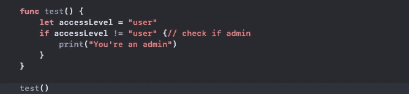

# 小心点！iOS 代码库中的特洛伊木马

> 原文：<https://blog.devgenius.io/be-careful-trojan-horse-in-ios-codebase-75ba3662f8a2?source=collection_archive---------3----------------------->


尽管我们开发人员创造了漂亮的用户界面，并一直在努力提高客户的 UX，但我们需要了解并消除一些安全问题。在本文中，我们将看到一个名为**特洛伊木马的安全问题。**

## 看到问题了吗⚠️

众所周知，每个字符对应一个特定的 unicode。但是你知道吗，那里有一些特别的角色。

```
**func** test() { **let** accessLevel = "user" **if** accessLevel != "user⁦// check if admin⁩⁦" { print("You're an admin") }}test()
```

这段代码乍一看会输出“您是管理员”？但是尝试将它复制粘贴到 XCode 中，看看它看起来是什么样子。这是结果。



不是开玩笑

稍等..😱这是我的第一反应。现在看起来它不会有任何输出。

这里的每个开发人员都会说，当 if 语句中的谓词等于 false 时，输出将是空的。

猜猜输出是什么:

```
You're an admin
```

所以有人可能会改变你的申请流程。如果你为自动驾驶汽车开发了一个软件，并且在代码库中有这样的东西。然后司机会踩刹车，汽车会加速到‼️

> 这不会发生，因为单元测试，但你仍然得到了我的观点！

## ✅解决方案

别急，有解决的办法。Idea 的解决方案很简单。
**不要让那些特殊的字符出现在代码库中。**

这可以通过使用 [Swiftlint](https://github.com/realm/SwiftLint) 并添加自定义 lint 规则来完成。

您需要添加的规则如下


捕捉这些特殊字符的自定义规则

> 如 macdrevx 在此[拉动请求](https://github.com/realm/SwiftLint/issues/3751)中所建议的

如果你想了解什么是 swiftLint，我推荐你读一下这个👇

[](/enforce-swift-style-and-conventions-for-ios-7f5047837e82) [## 对 iOS 实施 Swift 风格和惯例

### 一种让您团队中的所有开发人员使用相同的编码标准和规则编写代码的方法

blog.devgenius.io](/enforce-swift-style-and-conventions-for-ios-7f5047837e82) 

如果你从这篇文章中学到了什么，别忘了跟随和👏。