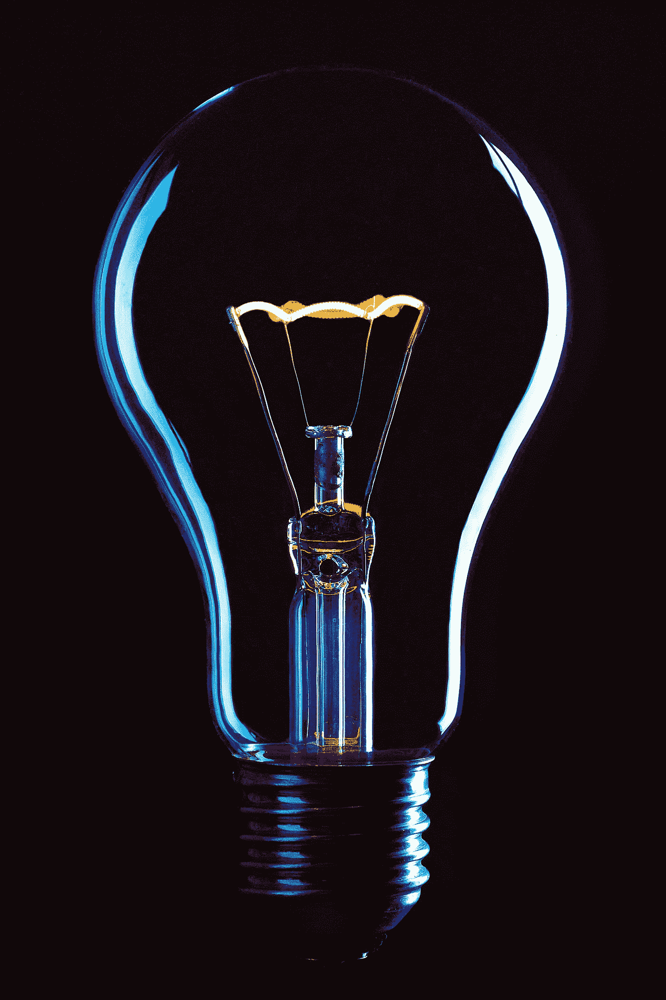
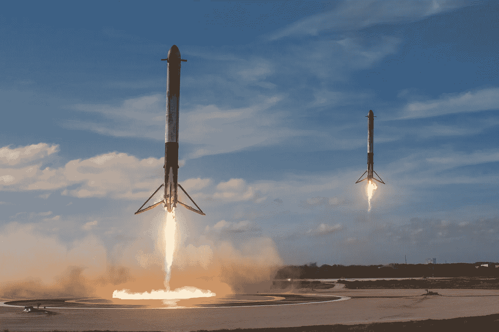

# 少犯错:一个心智模型

> 原文：<https://blog.devgenius.io/be-less-wrong-a-mental-model-7fa5c0330faa?source=collection_archive---------14----------------------->

## 埃隆·马斯克关于解决问题的发人深省的建议

你对特定问题的解决方案是完美解决方案的可能性有多大？

你百分百正确。

我说的不是 2+2 的数学问题，而是有许多变量和许多自由度的现实世界的问题。

逻辑上是 0。

如果有无限多的方法来解决这个问题，那么你中彩票的几率就会非常小。他们倾向于 0。

所以我们认为你的解决方案有些错误。有了这些信息，我们应该做什么？

> 质疑一切(包括问题陈述本身)。

如果我们认为我们系统中的一切都有些错误，而我们的工作就是减少错误，这就引发了一些有趣的争论。

这包括质疑我们的约束和问题陈述本身。

我们的约束有时是自我施加的，有时来自外部来源(即我们的老板)。在这两种情况下，约束本身也会有些错误。询问他们，了解他们为什么在那里。

关于这个问题，请记住，“一个好的问题已经解决了一半”。我们经常解决错误的问题。

找到问题根源的一个好方法是五个为什么。试着问这个简单的问题，为什么？，连续 5 次，你会惊讶于从中获得了多少新信息。

当系统中的一切都是错的时，就没有神圣的牛，一切都可以改进或抛弃。我们经常优化不增加实际价值或不需要存在的部分/流程。

下次你不得不解决问题时，想想少犯些错误。尝试找到问题的根本原因。不要害怕挑战坚定的信念，不断提问。

SpaceX 着陆的两个助推器都来自猎鹰重型发射，每个助推器都有 14 层楼高

“少犯错”让埃隆·马斯克(Elon Musk)在没人说特斯拉在经济上可行的时候造出了特斯拉，在很多人说这在物理上不可能的时候造出了自己着陆的火箭。

“少犯错”这句话来自埃隆·马斯克在 2019 年接受《每日宇航员》采访。来看看[这里](https://www.youtube.com/watch?v=cIQ36Kt7UVg&t=306s)，1:52 - 6:22。