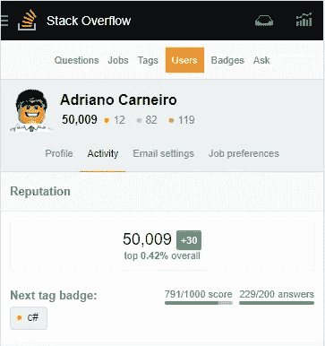

# 自私一点，去帮助别人

> 原文：<https://blog.devgenius.io/be-selfish-and-go-help-someone-ace67ba1a3aa?source=collection_archive---------31----------------------->

在 [Unsplash](https://unsplash.com?utm_source=medium&utm_medium=referral) 上由 [Toa Heftiba](https://unsplash.com/@heftiba?utm_source=medium&utm_medium=referral) 拍摄的照片

## 如何通过在 StackOverflow 上分享知识来帮助他人，实际上对我自己有益

像所有其他呼吸软件开发者一样，我通常在 StackOverflow 上找到有用的问题和主题的答案。所以在 2011 年，我决定多参与一点，不仅开始提问，还开始回答一些问题。

听着，帮助别人很好，看起来很高尚，但我必须承认，我这么做是出于自私的原因。让我解释一下。

高中时，我参加了一个项目，在这个项目中，成绩好的学生会帮助辅导有困难的同学。在数学和物理方面的出色表现给了我信心，让我相信我能够帮助我的朋友。然而，我很早就发现事情不会那么简单:**理解**某件事会把你带到一个层次；运用这些知识让你走得更远；然而,**解释**这种知识，特别是对那些已经在努力理解这个概念的人来说，是在一个完全不同的层次上。它迫使你获得新的理解层次和新的视角，即使是对最简单的概念，这样你就可以想出一种方法把知识传递给另一个人。

所以，几年后，我知道在 StackOverflow 上回答问题会迫使我提高自己的水平，磨练自己的技能和知识。所以我开始了。我开始在 SO 上 [**非常**](https://stackoverflow.com/users/570191/adriano-carneiro?tab=answers&sort=newest&page=24) 活跃，到了每天回答问题的地步。正如我所料，这种程度的活动帮助我更好地理解概念，帮助我更好地写作，帮助我以一种可读和有益的方式传达这些概念。

几个月后，我的活动水平缓慢而稳定地下降，因为生活、家庭和工作中的其他挑战需要我更多的时间。然而，我很高兴我花时间做出了贡献:我获得了个人利益，我过去的贡献仍然在帮助世界各地的人们。

快进到 2020 年，我刚刚注意到这一点:

我的 StackOverflow 个人资料，移动版

即使现在几乎不活跃，[我的贡献](https://stackoverflow.com/users/570191/adriano-carneiro)仍然被看到和投票，达到 50K 的声誉并影响了大约 500 万人(根据 SO)。当然，我的贡献不是独特的知识；其中大部分都是非常简单的概念。他们不是伟大的文学作品，技术或其他。还有，中间有一些不好的答案。尽管如此，我还是很高兴我写了它们。它们帮助我积累了技能和知识，是我努力变得更擅长这些概念和更擅长写这些概念的过程中的垫脚石。

在我的一生中，我越来越确定，不管在什么情况下，帮助别人也是帮助自己的一种方式。当你尽力帮助别人时，你甚至会感觉很好。这真的有点矛盾。有时候，帮助别人的行为似乎有点自私(T2)。甚至在我写这篇文章的时候，我对自己说“当然我帮助了别人，但是也看看那些在 StackOverflow 声誉上的*随机互联网点*！”

我妻子总是告诉孩子们，你的一小部分时间可以对其他人有很大帮助。通常情况下，向别人伸出援助之手花费很少，但是你小小的努力通常会对别人有很大的帮助。有趣的是，一旦你给了别人一些帮助，它就会以某种方式积极地回报给你。出于某种原因(不管你怎么称呼它:上帝、因果报应或者仅仅是人类互动的错综复杂)，一旦你为别人放弃了一些好处，一些其他的好处就会无情地回到你的身上。

我这个怀疑的工程师并不总能解释为什么会发生这种情况。然而，作为一名务实的工程师，我承认这种情况会发生。**这是可重复的**。为什么*不能*主动为自己产生积极的可重复结果？

因此，我很乐意鼓励任何人:自私一点，帮自己一个忙，通过走出去帮助别人来帮助自己。其他人会心存感激。你也会的。