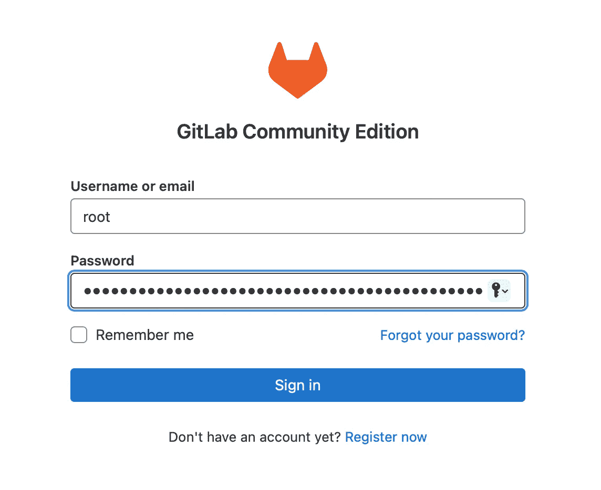
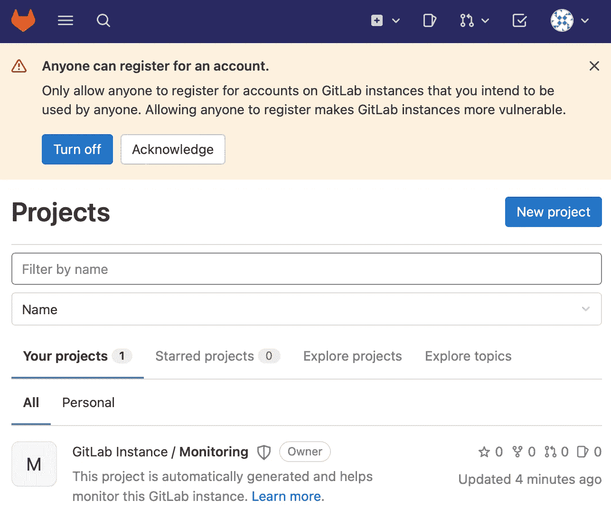
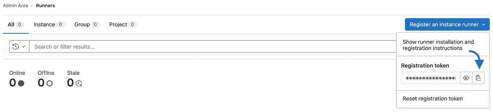
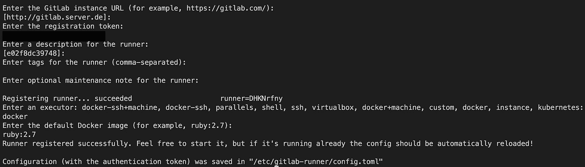
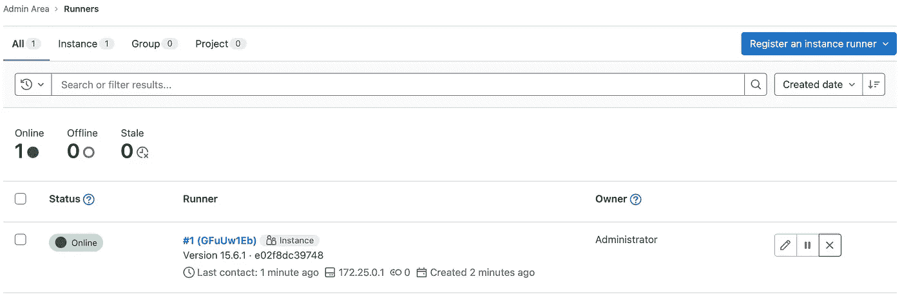

# 成为你代码的主人

> 原文：<https://blog.devgenius.io/be-the-master-of-your-code-150f5f9eb2cc?source=collection_archive---------9----------------------->

## 如何在 7 分钟内用 Docker 设置 GitLab on-premise？


潘卡杰·帕特尔在 [Unsplash](https://unsplash.com?utm_source=medium&utm_medium=referral) 上的照片

**GitLab** 是一个开源软件开发平台，内置版本控制、问题跟踪和 DevOps 功能。你可能使用过在线版本的 Gitlab 进行代码管理。但是，也有几种方法可以在您的服务器上托管 GitLab。

在这篇文章中，我们将向你展示如何使用 Docker 让 GitLab 在你的服务器上运行。在这种情况下，我们将首先设置 GitLab，最后展示如何创建 GitLab runners。最棒的是它很容易。感谢 Docker。这些步骤如下:

1.  **技术要求**
2.  **用 Docker** 设置 GitLab 服务器
3.  **用 Docker 设置 GitLab 转轮**
4.  **结论**
5.  **有用链接**

# ✅技术要求

您将需要以下先决条件:

**软件:**

*   您的机器/服务器上必须安装最新版本的 Docker。如果你还没有安装，请按照[说明](https://docs.docker.com/get-docker/)进行操作。
*   您的机器/服务器上必须安装最新版本的 Docker Compose。请遵循[指示](https://docs.docker.com/compose/install/)。
*   访问 bash (macOS、Linux 或 Windows)。

**硬件:**

*   macOS、Linux 或 Windows(在这篇文章中，我们展示了 macOS 上的过程)
*   推荐:英特尔酷睿 i5 (x86_64)或更高版本
*   推荐:16 GB 内存
*   推荐:500 GB 固态硬盘

仅此而已！😉 😉

# 🖥 **用 Docker** 设置 GitLab 服务器

在本帖中，我们设置了 GitLab 的社区版(GitLab CE)。下面你可以看到 Docker 合成文件。创建一个新的 Docker 合成文件，并插入以下代码。

```
version: '3.7'
services:
  gitlab:
    image: 'gitlab/gitlab-ce:latest'
    container_name: gitlab
    restart: always
    ports:
      - '5050:5050'
      - '80:80'
      - '443:443'
      - '22:22'
    volumes:
      - './config:/etc/gitlab'
      - './logs:/var/log/gitlab'
      - './data:/var/opt/gitlab'
    shm_size: '256m'
```

首先，我们定义 Docker 编写文件的版本。然后我们定义 GitLab 服务。我们使用来自 DockerHub 的 [Gitlab](https://hub.docker.com/r/gitlab/gitlab-ce) 图像。*注意:*该图像仅正式适用于 linux/amd64，即英特尔 64 位平台。不是苹果硅。也许有人可以建立一个多建筑的形象。我们使用最新版本的图像。然后我们定义容器名，容器应该总是重启。之后，我们设置了一些端口。端口 5050 用于 GitLab 容器注册。以后再说。端口 80 用于 GitLab 服务器 Web UI。如果您想启用 HTTPS，您可以使用端口 443。您仍然可以存储证书，以便可以进行 HTTPS 连接。我们不会在这篇文章中讨论这个问题。端口 22 用于 ssh 连接。对于持久存储，我们使用一些卷。此外，我们将共享内存目录设置为 256 MB，因为 [GitLab](https://docs.gitlab.com/ee/install/docker.html) 建议这样做。

您可以通过在终端中输入以下命令来启动 GitLab 服务器:

```
$ docker compose up -d
```

标志-d 意味着容器作为守护进程运行。在这种模式下，终端不输出任何日志。您可以使用以下命令查看特定容器的日志:

```
$ docker compose logs --follow gitlab
```

日志显示容器的状态。如果一切正常，您可以第一次使用您的 GitLab 服务器。服务器启动可能需要 5 分钟。不要慌！

检查 Docker 合成文件的文件夹中是否有 config 文件夹。用您选择的编辑器打开 gitlab.rb 文件，并将下面几行改为:

```
external_url 'http://gitlab.server.de'
registry_external_url 'http://gitlab.server.de:5050'
gitlab_rails['registry_enabled'] = true
registry['enable'] = true
registry['dir'] = "/var/opt/gitlab/registry"
registry['log_directory'] = "/var/log/gitlab/registry"
registry['log_level'] = "info"
```

我们需要在配置文件 gitlab.rb 中做一些修改来启用某些功能。首先，我们设置一个 DNS 名称。稍后，您可以通过这个 URL(*http://GitLab . server . de*)访问您的 git lab。然后，我们为容器注册中心(例如 docker 容器)设置 URL。我们激活注册表并指定日志文件夹。

之后，您必须重新配置您的 GitLab 实例。您可以使用以下两个命令来实现这一点:

```
$ docker exec -it gitlab bash
```

这个命令将您带入 Docker 容器。现在你在你的容器/ GitLab 服务器上。然后，在终端中键入以下内容:

```
$ sudo gitlab-ctl reconfigure
```

现在我们必须等到这个过程完成。然后，我们需要在您的开发机器上设置服务器的 DNS 名称。转到您的开发计算机，在终端中输入以下命令。

```
$ nano /etc/hosts
# Enter the following in the file: <ip-gitlab-server> gitlab.server.de
```

现在，您可以通过 IP 地址(*<IP-GitLab-server>:80*)或通过 *gitlab.server.de* 访问您的 git lab 服务器。

打开您选择的浏览器(例如 Google Chrome)并输入 URL *gitlab.server.de.* 当您看到登录页面时，安装成功。是啊。👍🏼 👍🏼

接下来，我们必须使用默认的登录数据进行登录。但是你从哪里找到这些数据呢？默认用户名是 *root* 并且*初始密码*是为你生成的。您将在服务器上的 gitlab 容器中找到初始密码。初始密码仅在 24 小时内有效。通过输入以下命令返回 gitlab 容器:

```
$ docker exec -it gitlab bash
```

您可以使用以下命令查看容器中的初始密码:

```
$ cat /etc/gitlab/initial_root_password
# Output: <initial-password>, copy it
```

然后返回登录页面并输入以下内容。

*   用户名:*根*
*   密码: *<初始-您复制的密码>*



GitLab 登录页面

然后单击登录。如果一切正常，您将看到以下页面。



GitLab 实例的第一页

接下来，您可以点击右上角的首选项。在首选项中，您可以单独配置 GitLab。😉 😉

# 🏃🏽**用 Docker** 设置 GitLab 转轮

在上一节中，我们设置了一个 GitLab 服务器。现在让我们添加三个 GitLab 跑步者。首先，您必须用以下内容创建一个新的 Docker 合成文件。

```
version: '3.7'
services:
  gitlab-runner-0:
    image: gitlab/gitlab-runner:latest
    container_name: runner-0
    restart: always
    volumes:
      - '/Users/Shared/gitlab-runner/config:/etc/gitlab-runner'
      - '/var/run/docker.sock:/var/run/docker.sock'

  gitlab-runner-1:
    image: gitlab/gitlab-runner:latest
    container_name: runner-1
    restart: always
    volumes:
      - '/Users/Shared/gitlab-runner/config:/etc/gitlab-runner'
      - '/var/run/docker.sock:/var/run/docker.sock'

  gitlab-runner-2:
    image: gitlab/gitlab-runner:latest
    container_name: runner-2
    restart: always
    volumes:
      - '/Users/Shared/gitlab-runner/config:/etc/gitlab-runner'
      - '/var/run/docker.sock:/var/run/docker.sock'
```

接下来，回到你的 GitLab 网页界面，点击汉堡菜单(左上角)。然后点击管理。在管理菜单中，进入概述→跑步者→注册一个跑步者实例。复制注册令牌。



复制注册令牌

在您的服务器(！idspnonenote)上运行以下命令。！！注意占位符<placeholder>！！！):</placeholder>

```
docker exec -it runner-0 gitlab-runner register --url http://gitlab.server.de --registration-token <your-registration-token> --clone-url http://gitlab.server.de
```

请按照屏幕上的指示操作。按回车键确认。您将在屏幕上看到以下输出。



登记过程的结果

该图示出了一种工作配置。但是，您可以根据需要更改配置。对一个容器这样做就足够了，因为所有的运行程序都读取相同的配置。现在你有了三个可以并行运行的共享跑步者。如果您需要更多，请在 Docker 撰写文件中添加更多。

一切准备就绪后，您应该会在 GitLab web 界面上看到以下内容。



共享 GitLab runner

您可以开始编写自己的 GitLab 管道，用于 dockerize、测试、构建和部署。玩得开心！😁 😁

# 🎬**结论**

在这篇博文中，我们学习了如何使用 Docker 在本地设置 GitLab 服务器。您所需要的只是一个 Docker Compose 文件和 GitLab 配置文件(gitlab.rb)中的一些更改。

我们还能做得更好吗？我们可以通过只允许 HTTPS 来加密到 GitLab 服务器的连接。这是生产环境中一个非常相关的方面，尽管它不是这篇博客文章的一部分。

我们还创建了三个 GitLab runners，并在 GitLab 中注册了它们。这只需要 Docker 编写文件和服务器上的注册命令。博文展示了几分钟后 GitLab 的设置。是不是很酷？现在你是代码的主人了。

你喜欢这篇文章吗？成为[中等会员](https://tinztwins.medium.com/membership)继续无限学习。当您使用该链接时，我们将收取一小部分会员费。您无需支付额外费用。

**不要错过我们接下来的故事:**

[](https://tinztwins.medium.com/subscribe) [## 每当 Tinz Twins 发布时收到一封电子邮件。

### 每当 Tinz Twins 发布时收到一封电子邮件。注册后，如果您还没有，您将创建一个中型帐户…

tinztwins.medium.com](https://tinztwins.medium.com/subscribe) 

非常感谢你的阅读。如果你喜欢这篇文章，请随意分享。关注我们了解更多内容。**祝你今天愉快！**


# 🔍**有用的链接**

*   [GitLab 文档](https://docs.gitlab.com)
*   [如何重启 GitLab](https://docs.gitlab.com/ee/administration/restart_gitlab.html)