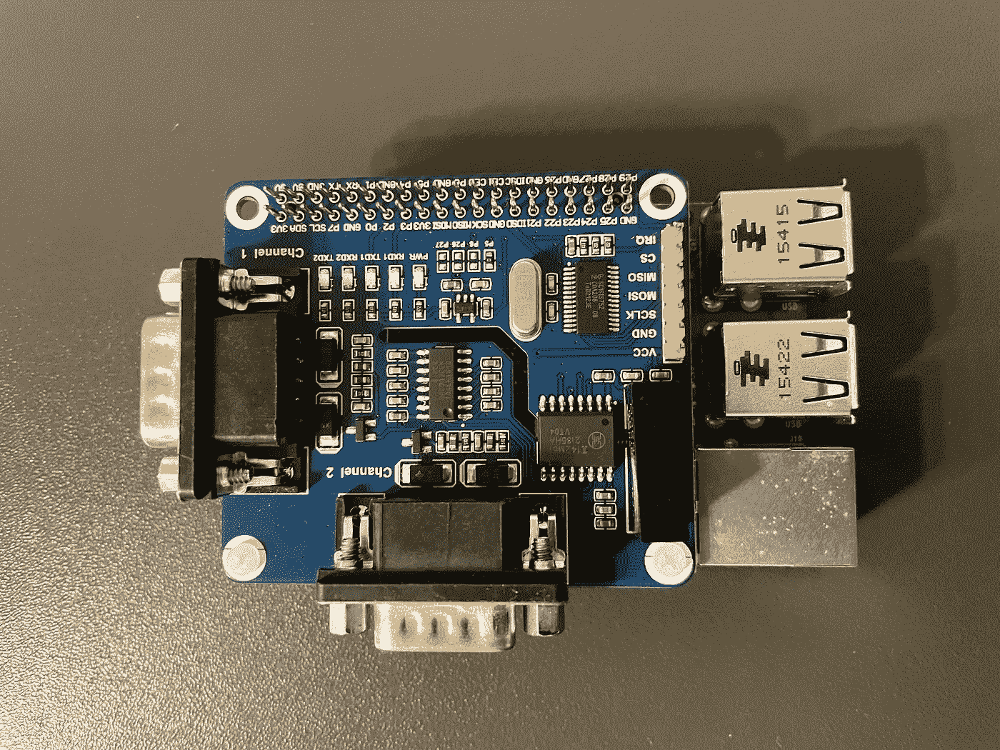

# 成为你的太阳数据的主人

> 原文：<https://blog.devgenius.io/be-the-master-of-your-solar-data-e25f4afc29fb?source=collection_archive---------23----------------------->

## 如何通过 RS232 接口从 Kaco Powador 1501 xi 变频器读取数据？


美国公共电力协会在 [Unsplash](https://unsplash.com?utm_source=medium&utm_medium=referral) 上拍摄的照片

由于系统设计，太阳能电池产生直流电(DC)。逆变器用于将 DC 转换成交流电。 [Kaco](https://kaco-newenergy.com/home/) Powador 1501 xi 是一款带串行接口的逆变器，用于数据检索。可以使用 Raspberry Pi 从逆变器读取参数数据。

在本帖中，我们将展示如何从 Kaco 1501 xi 变频器读取参数值。我们将讨论使用的硬件以及开发的软件。这些步骤如下:

1.  **硬件设置**
2.  **通过 RS232 接口读取数据**
3.  **展望**
4.  **有用链接**

# 🖥硬件设置

我们使用了以下组件:

*   [树莓派 3](https://www.raspberrypi.com/products/raspberry-pi-3-model-b/)
*   microSD 卡(建议至少 32GB)
*   [Waveshare 2-CH RS232 树莓派帽子](https://www.waveshare.com/wiki/2-CH_RS232_HAT)
*   RS232 电缆

## 1.硬件组件

第一步是将电路板连接到 Raspberry Pi 的 GPIO 引脚。图片说明了结果。您可以看到两个串行端口。两个 Kaco 逆变器可以通过这些接口连接。



树莓 Pi 3，带 Waveshare-CH RS232 帽子

## 2.闪存卡

关于在树莓 Pi 上安装操作系统，可以阅读我们的文章“[如何在树莓 Pi 上安装操作系统？](https://tinztwins.medium.com/how-to-install-an-operating-system-on-the-raspberry-pi-c92cf1fb8efa)”。

[](https://tinztwins.medium.com/how-to-install-an-operating-system-on-the-raspberry-pi-c92cf1fb8efa) [## 如何在树莓派上安装操作系统？

### 将操作系统闪存到 microSD

tinztwins.medium.com](https://tinztwins.medium.com/how-to-install-an-operating-system-on-the-raspberry-pi-c92cf1fb8efa) 

## 3.通过 ssh 连接到您的树莓 Pi

使用以下命令通过您的笔记本电脑连接到 Raspberry Pi:

```
# <ip-address>: ip adddress of your raspberry pi
ssh pi@<ip-address>
```

使用您的登录数据登录。用**确认下面的问题 T21【是】** 。

```
Are you sure you want to continue connecting (yes/no/[fingerprint])?
```

## 4.安装硬件驱动程序和**库**

这些解释基于 Waveshare 的 [wiki。](https://www.waveshare.com/wiki/2-CH_RS232_HAT)

修改 config.txt 文件:

```
sudo nano /boot/config.txt
```

将下面一行添加到文件中。

```
dtoverlay=sc16is752-spi1,int_pin=24
```

然后使用以下命令重新启动 Raspberry Pi:

```
sudo reboot
```

重启后，SC16IS752 的驱动程序将被加载到系统内核中。运行以下命令:

```
ls /dev 
```

现在您应该在列表中看到以下设备:gpiochip3、ttySC0 和 ttySC1

使用以下命令安装 wiringpi:

```
sudo apt-get install wiringpi
```

使用以下命令安装 python 3-串行库:

```
sudo apt-get update
sudo apt-get install python3-pip
sudo pip3 install RPi.GPIO
sudo apt-get install python3-serial
```

# 💿通过 RS232 接口读取数据

RS232 串行接口提供以下数据:

*   日期
*   时间
*   工况
*   发电机电压(V)
*   发电机电流，单位为安(DC)
*   发电机功率(W)
*   V(交流)电源电压
*   交流电中的注入电流
*   注入功率(W)
*   单位温度℃

下面你可以看到读取参数值的 Python 代码。

```
# Filname example.py
import serial

if __name__ == '__main__':
    try:
        ser = serial.Serial(port='/dev/ttySC0', baudrate=9600)   # Open serial interface
        ser.open

        line = ser.readline()   # read data
        line_str = line.decode("utf-8")

        parameter_list = line_str.split(" ")
        parameter_list_cleaned = list(filter(None, parameter_list))

        del parameter_list_cleaned[-1]
        print(parameter_list_cleaned)

    except Exception as e:
        print("Failed to read from RS232! -> {0}".format(e))
    finally:       
        ser.close() 
```

首先，打开串口。在我们的例子中，我们以 9600 的波特率打开串行端口'/dev/ttySC0 '。Waveshare 2-CH RS232 HAT 板的第二个串行端口带有“/dev/ttySC1”标志，可用于另一个逆变器。然后我们用函数 *readline()* 读取数据，解码数据。最后，我们转换数据，这样我们就可以在一个列表中拥有各个参数值。

首先，您必须将带有 *scp* 的 example.py 文件复制到您的 Raspberry Pi 中。为此，在笔记本电脑的终端中执行以下命令。

```
# <ip-address>: ip adddress of your raspberry pi
# <username>: username of your raspberry pi
scp -r example.py pi@<ip-address>:/home/<username>
```

您可以使用以下命令在您的 Pi 上启动 Python 代码:

```
python example.py
```

因此，您将获得当前参数值的输出。

# 🔮观点

给出的代码是一个更大项目的基础。目标是将数据持久存储在流入数据库中。随后，太阳能数据可用于评估和基于人工智能的分析。

你喜欢这篇文章吗？成为[中级会员](https://tinztwins.medium.com/membership)继续无限学习。当您使用该链接时，我们将收取一小部分会员费。您无需支付额外费用。

**不要错过我们接下来的故事:**

[](https://tinztwins.medium.com/subscribe) [## 每当 Tinz Twins 发布时收到一封电子邮件。

### 每当 Tinz Twins 发布时收到一封电子邮件。注册后，如果您还没有，您将创建一个中型帐户…

tinztwins.medium.com](https://tinztwins.medium.com/subscribe) 

非常感谢你的阅读。如果你喜欢这篇文章，请随意分享。关注我们了解更多内容。祝你有美好的一天！


# 🔍有用的链接

*   [Wiki Waveshare 2-CH RS232 帽子](https://www.waveshare.com/wiki/2-CH_RS232_HAT)
*   [曼努埃尔·卡科 1501 xi 变频器](https://www.solar-auctions.com/Auction/Document/94537003-5aa9-4d36-9971-43436c2ce7d5/kaco_powador_1501xi-5001xi_datasheet.pdf)