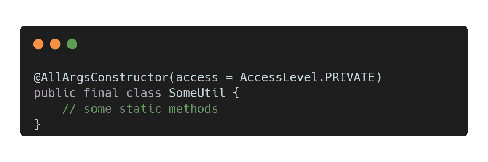

# 使用 Lombok 美化您的 Java 应用程序

> 原文：<https://blog.devgenius.io/beautify-your-java-applications-using-lombok-ea5230a5fe74?source=collection_archive---------2----------------------->

## 把 100 行代码改成 4 行试试！！！

这个故事将向您展示一些使用 Lombok 可以变得更漂亮的代码示例。

根据官方网站:

> Lombok 是一个 java 库，它可以自动插入到你的编辑器和构建工具中，增加你的 java 的味道。再也不用编写另一个 getter 或 equals 方法了，有了一个注释，您的类就有了一个全功能的构建器，自动记录变量，等等。

# 1.只读 POJO

让我们编写一些带有只读必填字段的简单 POJO 类。

我们可以这样用 Lombok 来美化它:

*   注释标记了 Lombok 生成 getters 的类
*   `@RequiredArgsConstructor`注释标记了 Lombok 为 *final* 字段生成构造函数的类

# 2.实用程序类别

您应该知道，实用程序类遵循以下规则:

*   这门课结束了
*   公共构造函数不应该在类中
*   默认构造函数是私有的

遵循规则，让我们创建一个简单的实用程序类:

对于 Lombok，我们可以使用一个注释来遵循这些规则:

但是静态导入可能会有一些麻烦。来自 javadoc:

> 警告:不要使用非星形静态导入来导入这些成员；javac 不会明白的。使用:导入静态 ThisType。*;或者不要静态导入。

但是如果我们真的需要使用非星形静态导入，我们可以使用注释来定义私有构造函数，但是我们也需要显式地将我们的类标记为 final:

# 3.恼人的“尝试…捕捉”块和“投掷”

例如，我们有一个可能抛出异常的方法:

抱歉，想象力太差了

或者也许我们打算写这样的东西:

再次抱歉

借助 Lombok 的力量，我们可以美化这段代码:

或者如果我们需要指定一个例外:

在 Lombok 网站上，开发者警告要小心使用`@SneakyThrows`。此外，他们还列出了一些这种注释可能有用的情况:

*   一个不必要的严格接口，比如`Runnable`——无论异常从你的`run()`方法中传播出来，检查与否，它都将被传递给`Thread`的未处理异常处理程序。捕捉一个检查过的异常并将其包装在某种类型的`RuntimeException`中只会掩盖问题的真正原因。
*   一个“不可能”的例外。例如，`new String(someByteArray, "UTF-8");`声明它可以抛出一个`UnsupportedEncodingException`，但是根据 JVM 规范，UTF-8 *必须*始终可用。当你使用一个字符串对象时，这里的一个`UnsupportedEncodingException`和一个`ClassNotFoundError`的可能性差不多，你也不会捕捉到它们！

# 4.惰性初始化

惰性对象初始化是在第一次调用对象之前运行的初始化。在 Java 中，它看起来像这样:

在 Lombok 下，我们可以使用一个强大的、线程安全的注释特性:

`@Getter`注释为该字段生成 getter，`lazy=true`标志将该字段标记为需要延迟初始化。

# 5.你做过的最简单的建筑工

生成器——设计模式，简化了具有许多可空字段的对象的创建。

在 Java 中，我们会这样实现它:

很繁琐吧？

IMHO，Lombok 最强大、最有用的特性是用一个注释创建任意规模的构建器:

“搞什么鬼！！!"你可能会说。而且，`@Builder`标注是高度可定制的。例如，我们可以通过`@Builder(setterPrefix = “with”)`为构建器方法添加一个前缀。

**龙目岛巨大**。如果有需要，您可以从网站上了解所有功能:

 [## 稳定的

### @Getter 返回到实际的 Getter。然后，它会移除注释。出于各种原因，这是有用的；你可以…

projectlombok.org](https://projectlombok.org/features/all) 