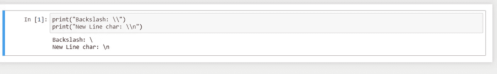

# Python 中原始字符串的美

> 原文：<https://blog.devgenius.io/beauty-of-raw-strings-in-python-fa627d674cbf?source=collection_archive---------3----------------------->

知道如何在代码中使用它们以及在哪里使用它们。


在 Python 中，转义字符总是以反斜杠(\)开头。这对于格式化很有用，但是如果我们想在字符串中使用反斜杠呢？？

为了更好的理解，我们来看一个例子！

```
print(“Backslash: \\”)
print(“New Line char: \\n”)
```

这两行将给出以下输出:



输出

这会使*变得难以阅读*。对此有一个替代方案。
我们可以使用一个原始字符串，它将按字面意思处理一个反斜杠。怎么会？

> 解决方法:只需在琴弦前面加一个“R”*或*“R”*。*

*参见下面的代码:*

```
*print(r”This is a backslash: \ and a new line: \n”)*
```

*输出:*

**

*我希望您理解使用原始字符串时的区别。你有吗？*

**

*有什么区别？*

***再来看看。首先，为什么我们在 python** 中使用原始字符串？*

> *Python 原始字符串将反斜杠(\)视为文字字符。
> 当我们想拥有一个包含反斜杠(\)的字符串，又不希望它被当作转义字符时，这是很有用的。*

*让我们看另一个例子来说明这一点:*

```
 *my_string = ‘Hello\nWorld’
print(my_string)*
```

*输出:*

**

*现在，让我们看看原始字符串是如何工作的。*

```
*my_raw_str =r’Hello\nWorld’
print(my_raw_str)*
```

*输出:*

**

***无效的原始字符串:***

*并非所有的原始字符串都有效。仅包含一个反斜杠的原始字符串无效。类似地，结尾反斜杠个数为奇数的原始字符串也是无效的。*

*参见以下示例:*

```
*raw_str_one = r’\’
raw_str_two = r’xyz\’
raw_str_tree = r’xyz\\\’*
```

**

*现在，我想你对 python 中的原始字符串用法已经有了清晰的理解。
这很酷，但真正的用途是使用 **"R *正则表达式(REGEX)"*** *。Regex 经常使用反斜杠(\)来表示特殊字符，如果没有原始字符串，它会变得混乱。**

*正则表达式通常包含很多反斜杠(\)。使用 Python 的["***re***"](https://docs.python.org/3/library/re.html)模块时，正则表达式表示为字符串。因此，像所有有很多反斜杠的字符串一样，当以原始文字形式书写时，它们更具可读性。*

> *原始字符串对于 regex 来说是惊人的。*

*让我们用基本的正则表达式来理解它:*

```
**#import Python's regular expressions module* import re*#compile a regular expression... note the raw string literal that doesn't have its backslashes escaped* p = re.compile(r'[Ee](\+|-)?[0-9]+')*
```

*在上面的例子中，如果我们没有把正则表达式写成一个原始的字符串，我们将不得不转义任何反斜杠，这将使字符串变得更加难以阅读。*

## *希望你对原声琴弦有清晰的认识。如果你觉得这篇文章有帮助，请鼓掌致谢。*

**