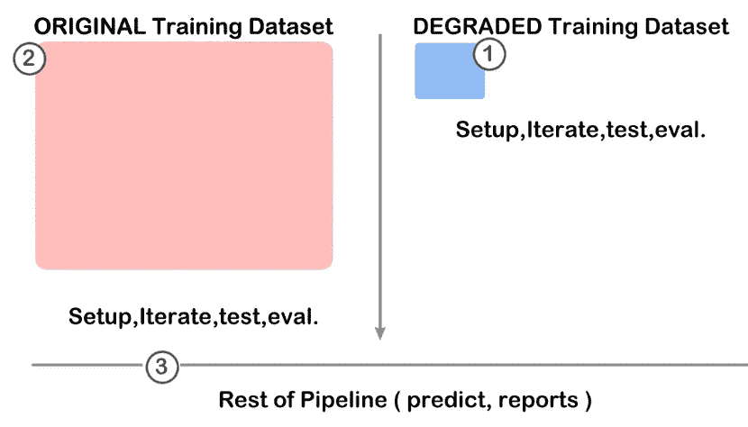

# 将数据科学的工作效率提高 10 倍。

> 原文：<https://blog.devgenius.io/become-10x-more-productive-in-data-science-c80242e9d0ae?source=collection_archive---------20----------------------->


来自[佩克斯](https://www.pexels.com/photo/white-clock-reading-at-2-12-1537268/?utm_content=attributionCopyText&utm_medium=referral&utm_source=pexels)的[斯塔斯·克诺普](https://www.pexels.com/@stasknop?utm_content=attributionCopyText&utm_medium=referral&utm_source=pexels)的照片

## 这太简单了。

以下可能对一些人来说是显而易见的，但话说回来，这些年来我一直在处理各种各样的 DS/ML 问题，我刚刚明白了这一点，所以也许我是一个迟钝的学习者，问题如下:

你得到了一个全新的数据集，并被赋予了分析、预测或应用一些 ML 技术的任务，然后你开始尝试一些模型和技术，到目前为止还不错，但我们越来越多地得到了由数千甚至数百万行组成的庞大数据集，而你管道中的每一步都需要一些时间。另一方面，你可能正在学习一个新的工具、框架或 DS，这也需要大量的试错。这些问题加在一起会占据你一天的大部分时间，而时间就是这个故事中的坏人。

我们被拷问，并被灌输一种感觉，即我们得到的数据是需要清理和尊重的东西，所以也许这就是为什么我从来没有想过为了更快地进行迭代，需要降低数据的质量而不是改进它。

这项技术的警告是，你应该只使用它来探索解决方案、工具(*即你的管道*)和框架，你仍然必须在完全清理和恢复的数据集上运行你的模型，用图形术语来说这就是我们将要做的:



```
**1.** Degrade your training Dataset and setup your environment, iterate on models and evaluate metrics, fine tune your pipeline etc, etc.**2\.** Run the resulting process on your Original Dataset.**3\.** Continue with the rest of your pipeline with your Original Dataset.
```

## 一个实际的例子:

我当前的数据集具有以下形状和读取时间:

```
Training dataset:df.shape
>>>(**501808, 313**) so 313 Columns and half a Million Rows.Reading time: **~15s**  (Specs: Windows, i5 8thGen, 32GB RAM)This might not seem like much but once you start running your pipeline time will add considerably, gradient boosting (xgboost) for instance takes about 5-10 minutes and my machine fans really start to take off.
```

为了以某种方式优雅地降低数据集，我最近使用的方法是删除每隔一行和/或一列:

```
**FOR ROWS :**f = "training_data.csv"
num_lines = sum(1 for l in open(f))-1

# Take every N-th (in this case 2nd) row
n = 2# The row indices to skip - make sure 0 is not included to keep the header.**skip_idx** = [x for x in range(1, num_lines) if x % n != 0]training_data = pd.read_csv(f, header=0, skiprows=**skip_idx**)training_data.to_csv("training_decimated_1.csv", index=False) **FOR COLUMNS/FEATURES :**f = "training_data.csv"
training_data = pd.read_csv(f, header=0)features = [c for c in training_data if c.startswith("feature")]
oddFeatures = features[0::2]training_data.drop(oddFeatures, axis = 1, inplace = True)training_data.to_csv("training_decimated_2.csv", index=False)
```

每个数据集都是不同的，这里我假设有要素列和数据行，但是在进行剪切之前，您需要了解自己的数据结构，例如，该数据集有预测阶段所需的附加列，这些列被单独留下。

```
After running the above a few times ( 3x rows, 1x columns) my resulting dataset has this shape and reading times.**df.shape**
>>> [62726 rows x 158 columns]
**Reading time:** ~1s 
**xgboost:** ~ 1 minute. 
```

这意味着您在数据集上花费的时间减少了 1/10，理论上还可以更少，但是…

## 子采样？

如果花费 50%-80%的时间来设置您的数据科学项目和选择正确的模型，您就节省了大量时间，但实际上使用降级的数据集运行整个管道又如何呢？

好吧，你会进行二次采样，不幸的是会删除信息，所以你的准确度很可能会下降。您仍然可以使用降级的数据集来试验诸如超参数调整和模型变量之类的东西，并且您有时(*但不总是*)会得到影响您的特定问题的指示，每个案例都是不同的，因此由您来确定这是否是一个好的时间投资，以及是否有任何关系。

## 可供选择的事物

有更复杂的替代方法来优化读取和扩展您的管道以处理更大的数据集，但它们确实需要一个学习过程，可能并不适用于所有情况，以下两种方法可能是一个很好的起点:

[**羽化**](https://github.com/wesm/feather) **:** 将你的数据帧转换成这种格式以便更快的读写。

[**Dask**](https://dask.org)**:**主要旨在扩大您的项目，但经过高度优化，可以减少您的读/写次数，只需对现有代码进行最小的更改。

我希望这有助于您提高工作效率，减少处理大型数据集或新项目时的挫折感。

感谢阅读！