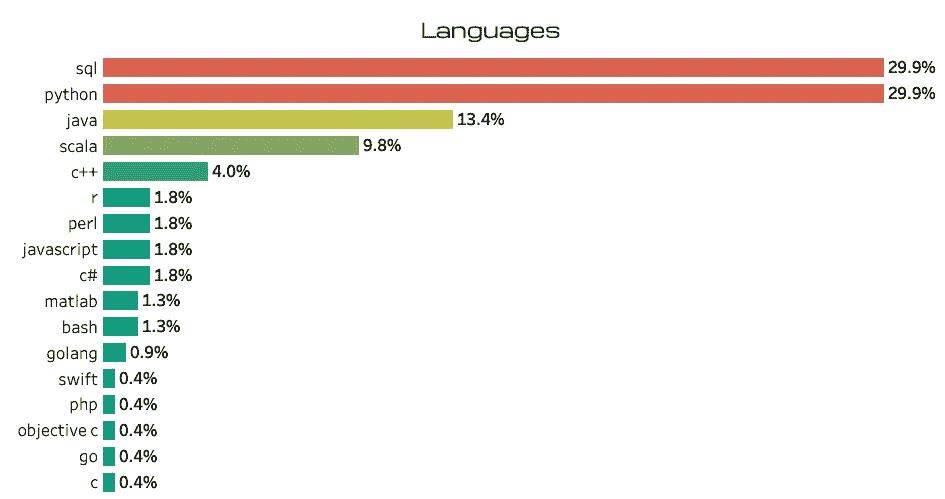
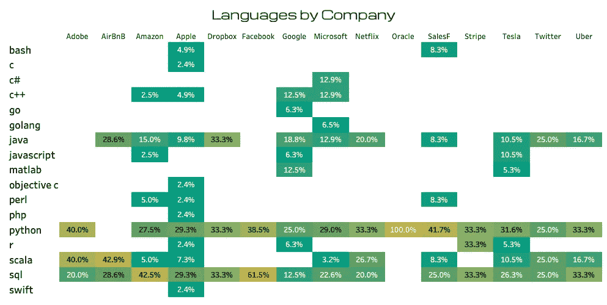
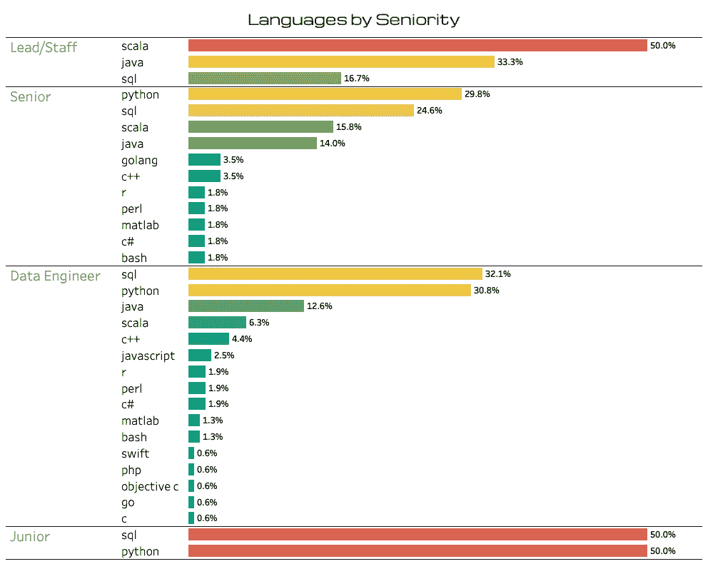
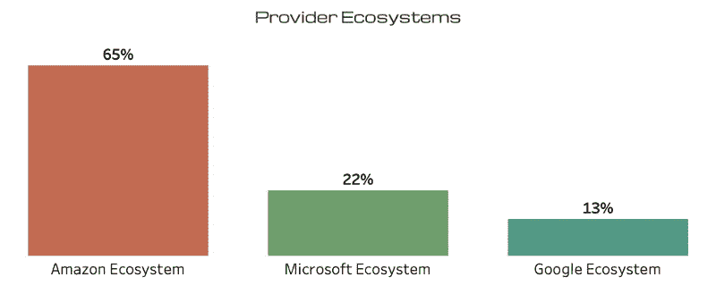
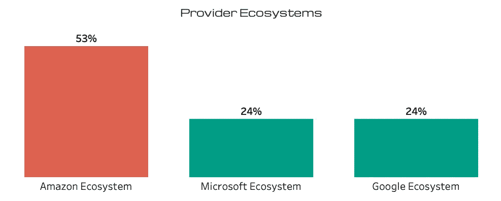
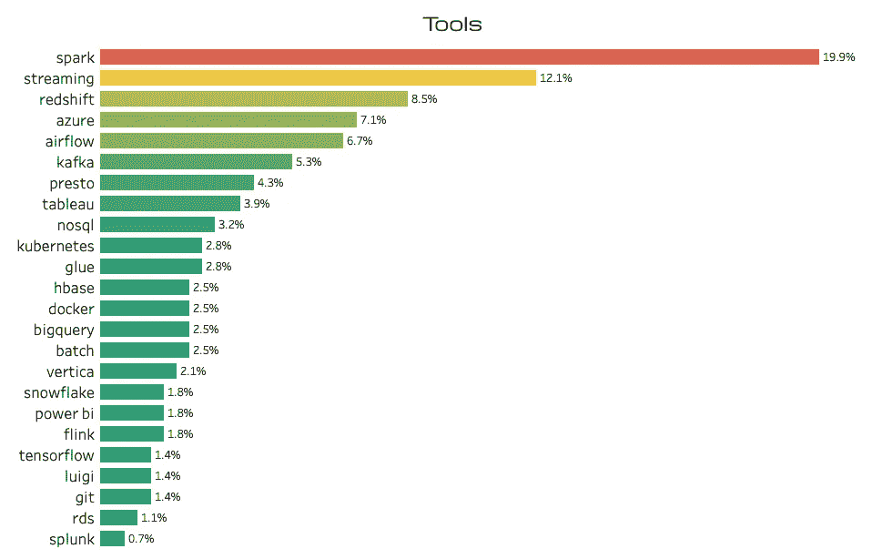
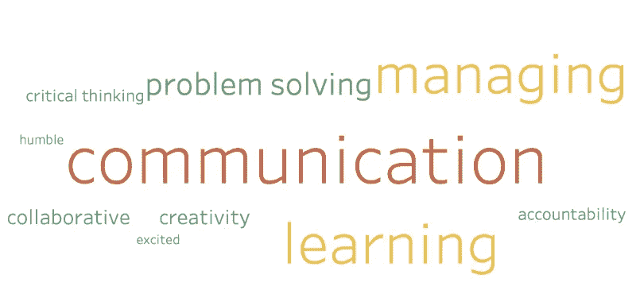

# 2022 年数据工程就业市场:对 1000 个 FAANG 职位发布的分析

> 原文：<https://blog.devgenius.io/become-a-data-engineer-in-2022-analysis-of-over-1-000-faang-job-postings-38784fa727a8?source=collection_archive---------1----------------------->

最近，我正在认真考虑转行的前景，所以我开始回答“2022 年数据工程师需要什么技能”这个问题为此，我从 LinkedIn 手动收集了 15 家顶级科技公司的 1029 个数据工程师职位，如 Meta、亚马逊、苹果、网飞和谷歌。虽然有些发现是意料之中的，比如对 SQL 和 Python 的高度重视，但有几个见解让我感到惊讶。

虽然大多数大公司都普遍使用许多编程语言，但数据工程通常倾向于 Python 和 SQL。在这些核心技术之后，低级编程语言的需求量很大，比如 Java 和 C++。我最近看到了一个转变；顶级科技公司需要更多重代码的技能，并且正在从低代码/无代码解决方案中转移出。我相信这可以追溯到某些头衔的区别，比如分析工程师和商业智能工程师。借助 DBT 和气流等低代码管道解决方案，在不同位置之间 ETL/ELT 数据不再需要低级编程。由于商业智能工程师处于解决业务问题的最前沿，并且现在拥有传输数据的工具，因此数据工程师通常在许多顶级科技公司解决更深层次的工程挑战。虽然 SQL 和 Python 被认为是最低要求，但在数据工程师的工具包中，低级语言的性能调优已经越来越流行。

关于公司偏好的一些观察——有趣的是，Dropbox(和其他 11 家 FAANG+公司)更喜欢他们的数据工程师有 Java 经验。事实上，Java 是继 Python 和 SQL 之后第三大最受欢迎的语言。Java 是一种基于 C++的面向对象、基于类、静态类型的高级语言。由于出色的库支持，Java 的一个常见应用是 API。

苹果对语言的要求最多样化，提到了 12 种独特的语言。通过阅读招聘启事，我认为苹果公司在数据工程师的角色上几乎没有标准化。似乎每个帖子都是写给确切的角色的，而不同的团队有不同的需求。

虽然苹果、谷歌、微软、亚马逊和特斯拉提到了编程语言的最大多样性，但脸书、Stripe、Adobe、AirBnB 和 Dropbox 要求的语言多样性最少。对于希望在 2022 年在 FAANG 公司找到第一份工作的入门级数据工程师来说，Python 和 SQL 是进入脸书或 AirBnB 等公司的一个很好的途径。

作为免责声明，大部分招聘信息都没有具体说明资历。每个资历类别的 N ≥10。初级候选人应该专注于 SQL 和 Python，在这两个领域，要达到更高的水平通常需要二级面向对象编程语言，如 Java、Scala 或 C++。数据工程师和高级数据工程师之间的语言变化不大，但一旦候选人成为首席/员工数据工程师，重点就会转向 Scala 和 Java，并需要更少的 SQL。

云生态系统分布包括亚马逊、微软、谷歌

亚马逊仍然在 FAANG 公司中占据主导地位，在这 1，029 家上市公司中占据 65%的市场份额。火花和气流主导着工具，应该是 FAANG 数据工程师工具带的基石。

不包括亚马逊、微软、谷歌的云生态系统分布

一旦我们删除了亚马逊、微软和谷歌的所有招聘信息，事情就变得不一样了，但仍然显示亚马逊是明确的云领导者。

对于数据可视化，Tableau 的普及程度是 Power BI 的两倍；当顶级科技公司想要可用的最佳工具，并且不依赖于云提供商时，这并不意外。更有趣的是，所有提到微软生态系统的列表中，有一半也提到了 Tableau。

2022 年流媒体火热。建立一个伟大的流媒体组合项目是展示你的技能的好方法。Twitter 是开始学习流媒体的一个好地方，我推荐查看这个 [GitHub 项目](https://github.com/jonathanhayes/Tweepy-Twitter-Stream-Example)来看看一个运行的流媒体项目的例子。数据流项目中常见的技术包括 Kafka 和 Flink。

我把最好的留到了最后——每个数据工程师最喜欢的话题；软技能。

有趣的是，每次提到 SQL，3 大软技能；沟通、管理和学习被提到了两次。SQL 和 Python 被提及的次数与这三大软技能相同。我相信这是一个重要的收获。要进入顶级科技公司，门槛很高。许多候选人都有优秀的投资组合，并有运用他们技能的经验。差异化因素变成了软技能。如果我们不能交流我们的代码、我们的架构、我们的挑战和我们的想法，我们就不能成为有效的同事。如果我们不能管理我们的框架、代码库或利益相关者，我们就不能成为有效的领导者。如果我们不能学习、成长、发展和适应动态的数据工程环境，我们的技能很快就会过时。

**关键要点**

1.  作为顶尖科技公司的数据工程师，Python 和 SQL 已经不足以保持竞争力。
2.  数据流是热门，建立展示你技能的组合项目是在市场中脱颖而出的一种方式。
3.  软技能是王道，专注于改善沟通、管理和持续学习是保持竞争力的关键。