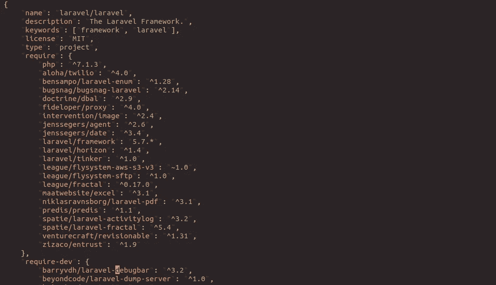
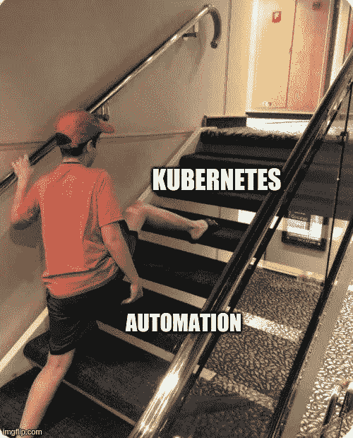

# 成为一名优秀的后端软件工程师

> 原文：<https://blog.devgenius.io/become-a-good-backend-software-engineer-782da1d135f?source=collection_archive---------5----------------------->

作曲家文件

我们经常看到很多程序员在谈论技术时变得如此雄心勃勃。我们也很快变得对采用新的花哨技术堆栈和编程语言感到兴奋。我们很多人都想成为“伟大”的尖端工程师，但我们往往跳过了成为优秀工程师的必要步骤。有时我们参加一个技术会议，学习新的东西，然后回到团队，只是说我们一直在做的一切都是错误的，过时的，等等。，只是因为我们看到一个著名的顶级公司在做他们说的事情。

现在的孩子

能够在系统中采用新技术是一件好事，但选择合适的新堆栈用于我们的系统往往有风险，年轻人不知道有什么风险。

想象一下，您决定采用一些新的花哨的数据库管理系统，只是因为您不需要编写任何迁移文件来改变数据结构。你认为这是我们管理数据方式的进步，这是最新的，所以这一定很好，对吗？不一定。

“啊，这太好了，现在我再也不需要费心去考虑我的桌子的结构了，我可以把所有东西都放进这个系列，它就可以工作了，”你说。几个月过去了，你的新系统现在使用新的数据库。你很高兴，直到你发现一些你不能轻松处理的情况，但你知道如果你使用你以前通常使用的旧的成熟的数据库技术，它会很容易。

在您被这个案例绊倒后不久，一个新的问题出现了，您发现数据库的磁盘在接下来的几天内突然要满了。现在你有了更多你从未面对过的问题。“如果我仍然使用那种古老的数据库技术，也许我现在就不需要花费几周的时间来解决这个问题了，”你说。

当我们不了解技术本身的基本原理时，这种问题经常发生。也许我们没有做足够的研究来了解这项新技术的目标是什么，有什么限制，这有什么不好，它如何处理磁盘中的数据，以便实现新功能，等等。

现在，让我们冷静一下，谈谈我认为在我们采用所有这些疯狂的技术之前，后端软件工程师必须掌握的一些基本知识。

# 首先，坚持最基本的。

“好，让我们从部署 Kubernetes 开始。我们将在微服务架构中构建系统”。

等等，你不需要那个。我是认真的。再想想。

如果你处于开发的早期阶段，你想做的是尽快推出你的产品。你甚至不知道这个产品会不会成功，所以一开始你不需要把事情搞得太复杂。

坚持最基本的。使用你非常熟悉的技术。尽可能保持简单的技术堆栈。

# 理解你的语言。

即使每个人都在谈论 Golang，用 PHP 构建你的系统也没有错——我不是想在这里挑起一场语言战争，你已经明白了。

你需要做的是非常好地理解你的编程语言，不管它是什么。每种编程语言都有自己的独特之处，你需要遵循这些独特之处才能充分利用它。他们也有自己的做事方式，你需要接受。例如，在 Java 中迭代一组数据可能不同于 PHP 或 Ruby。处理并发性通常也会有所不同。

学习这种语言所利用的范例，如果你坚持用 Golang 在 OOP 中交付你的解决方案，你会有很多头疼的问题。

你可以做的一件事是确定你是否精通使用一种编程语言，那就是你读完了一本关于这种语言的书。

# 很好地理解你的数据库。

就像编程语言一样重要，你应该知道如何正确使用数据库。您应该看到您可以从选择使用的数据库中得到什么。例如，您可以期望在基于 SQL 的数据库中有一个好的连接表解决方案，而对于基于文档的解决方案，您可能不能期望太多。

我注意到许多年轻的后端工程师甚至不知道 SQL 数据库中的索引是什么；这是一个问题。你知道这是什么吗？如果你不知道，我建议你了解一下这个。了解查询如何解析、如何优化以及如何正确设计数据。

# 正确地写代码(用你选择的语言)。

不要只写代码。把它写出来，让每个人(包括你)都能看懂，快速获得代码的含义。避免意大利面条代码。保持干燥。了解你可以在你的编程语言中使用的技术，这是 OOP 吗？这个有功能吗？这是在两者之间吗？。

抽象和模块化通常是关键，学会它。学习一下，处理语言之间的依赖关系有几种不同的方法。

# 正确测试。

一个好的程序员知道如何测试。最好的测试方法是自动测试。了解单元测试、集成测试以及您认为确保代码始终按预期运行所需的其他测试。学习技巧。

# 了解代码的复杂性。

这是最有效的计算方法吗？还是排序？还有别的办法吗？该语言是否提供了一个经过优化的功能，以便我可以使用它？代码命中数据库多少次？等等。

永远记住，很多人可能会同时访问你的代码。如果您关心如何尽可能高效地编写代码，那将是最好的。

# 了解您的代码在生产中是如何运行的。

这可能是下一步。您需要知道您的代码在产品服务器上运行得有多好。它会引发错误吗？用户访问您的终端平均需要多长时间？您可以通过一些监控工具来实现这一点，这些工具可以让您了解您的生产环境。只需在谷歌上搜索“APM 工具”就能找到你可以使用的选项。

# 写文档。

编写文档并不有趣，但在很多方面都是必不可少的。作为一名程序员，你很大程度上依赖于其他人写的文档。

你可能会写很多种类的文档。

例如，如果您的代码将在不同的服务中与其他人的代码交互，您可能希望编写关于您的 API 接口的文档，以便使用您的服务的其他人知道会发生什么并向您提供反馈。

另一个例子是随时跟踪你的预订逻辑的变化。你可能需要一系列的 changelog 文档来解释你的逻辑流程图。因此，您可以轻松地比较您的预订流程所依赖的任何元素，或者它现在与去年解决的任何计算。这将有助于您的逻辑发展，您需要知道为什么去年的数据在数据库中没有某些值。版本控制是好的，但是它通常是不够的。

您可能希望跟踪和记录系统中发生的每个事件，以便您和您的团队可以从中吸取教训，避免犯同样的错误。

以及更多你认为需要记录的东西。

所以这是我认为后端工程师成为一名好工程师所必须掌握的几件事。由于我们对如何做好我们的工作有很强的基本理解，我们可以通过自信地采用新技术来更进一步。