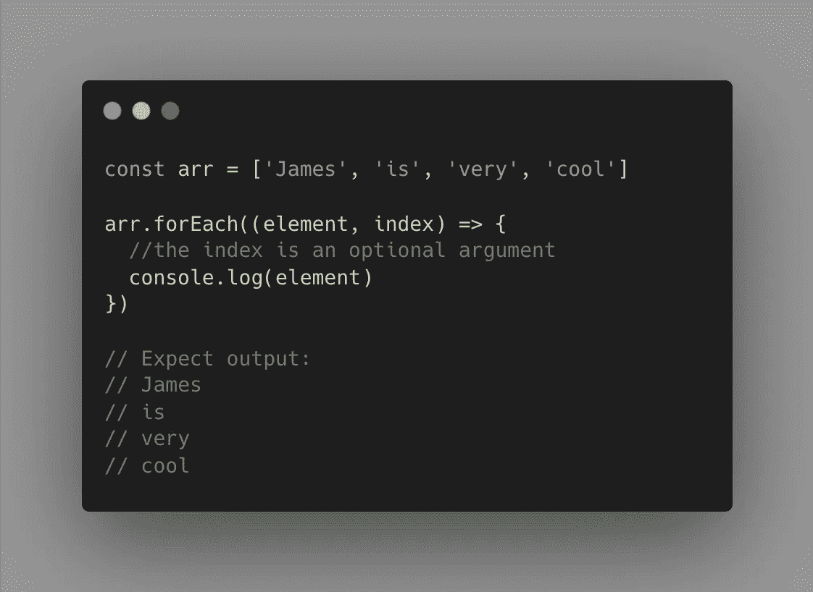
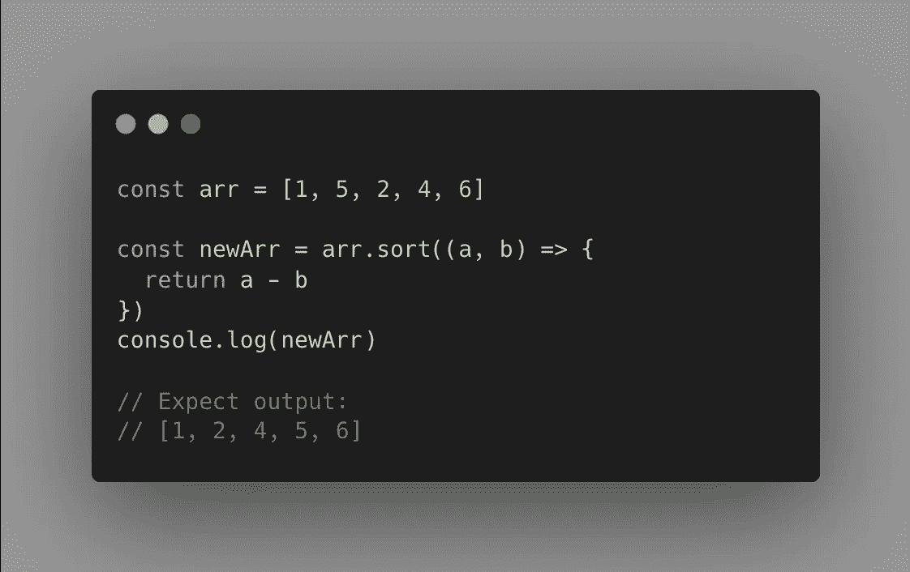
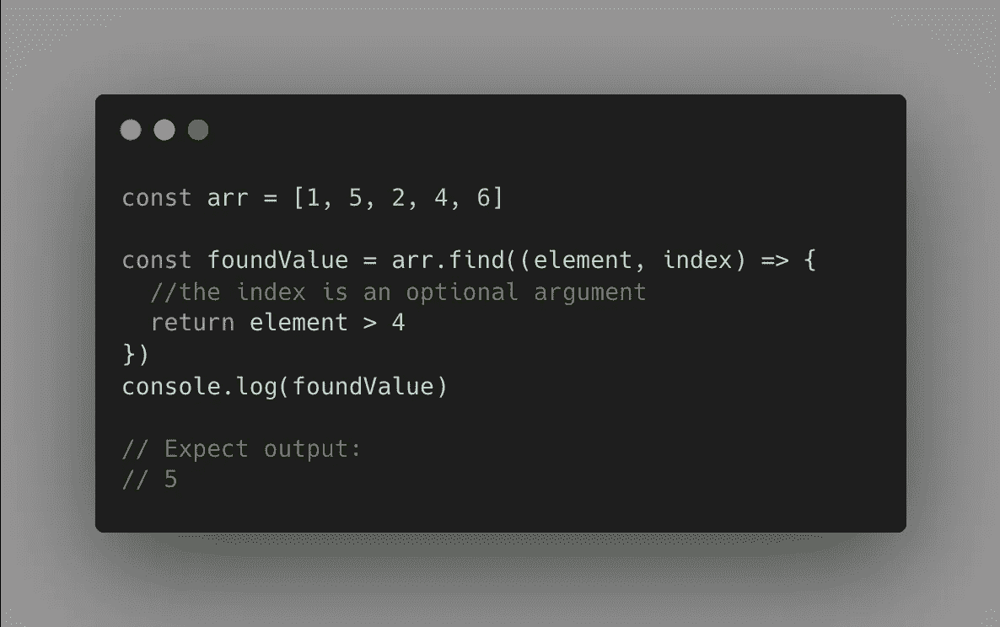
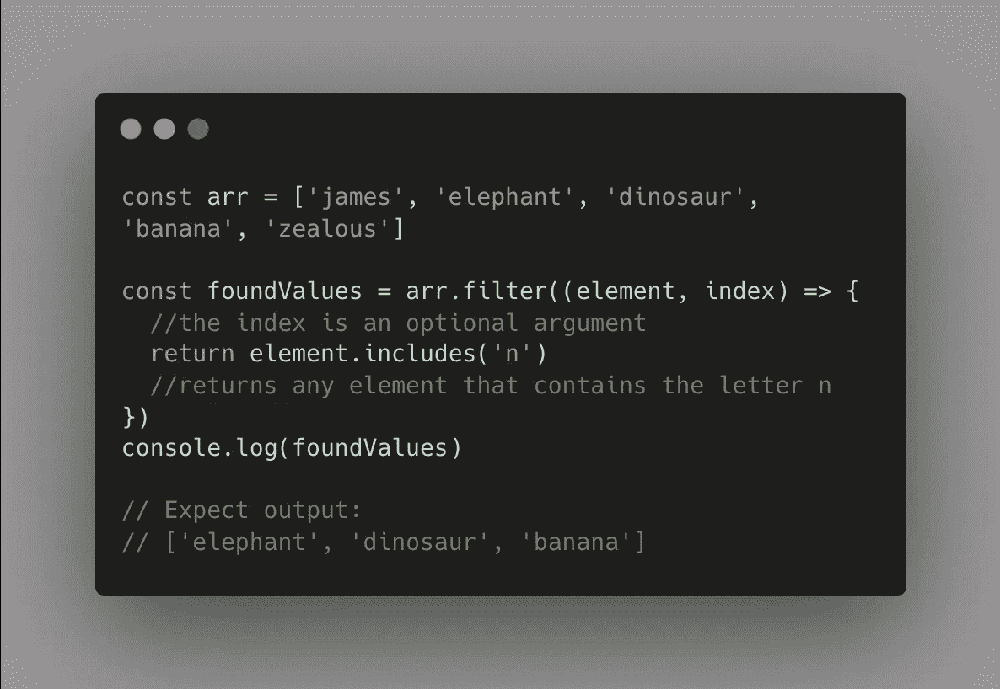
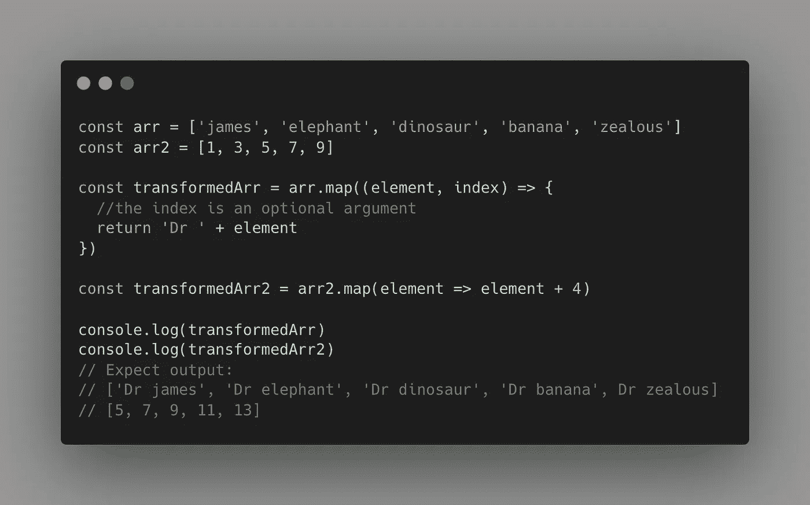
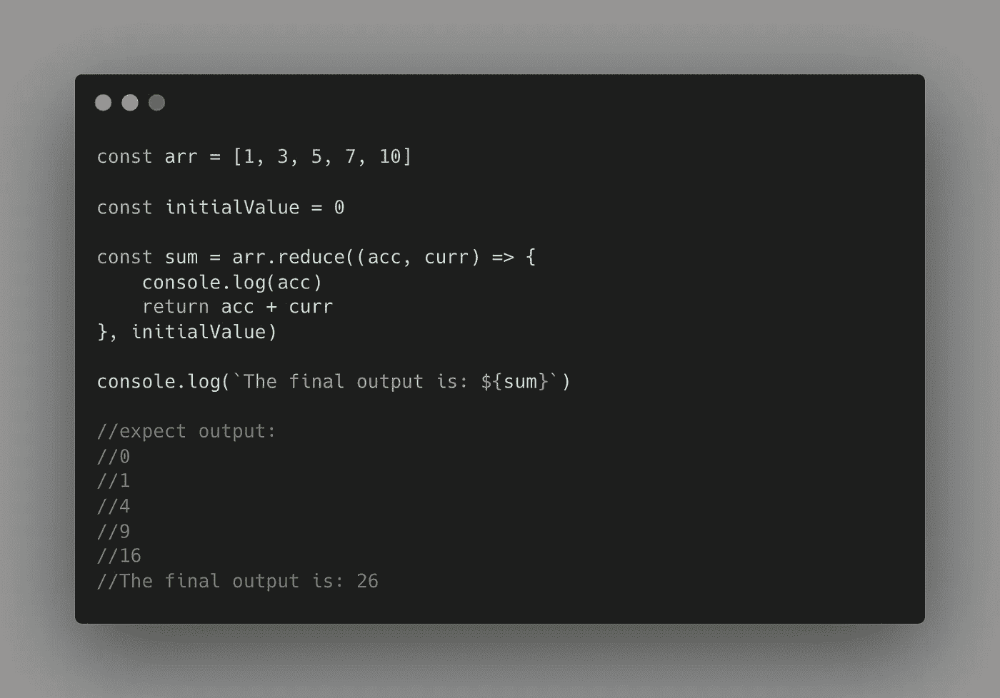
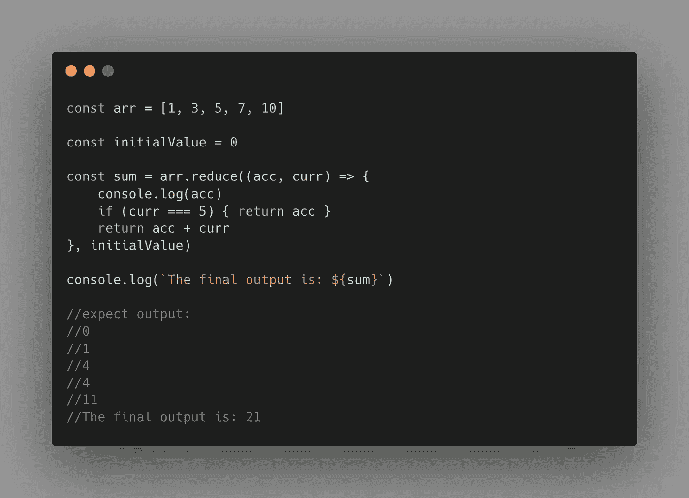
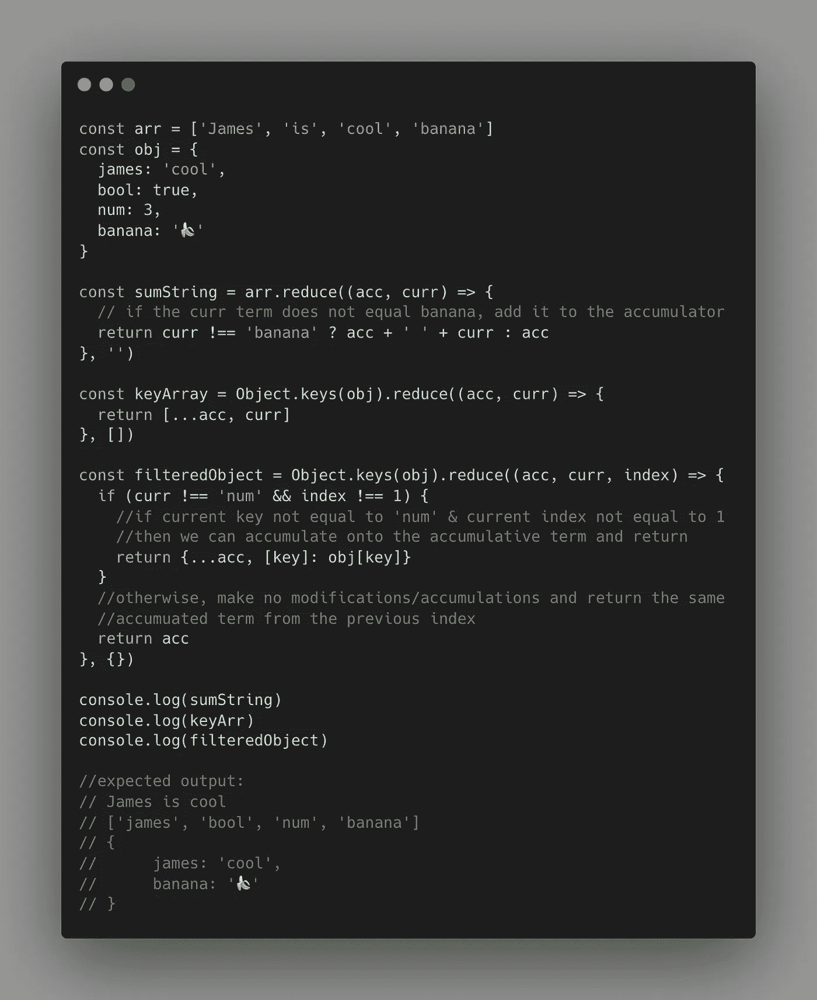
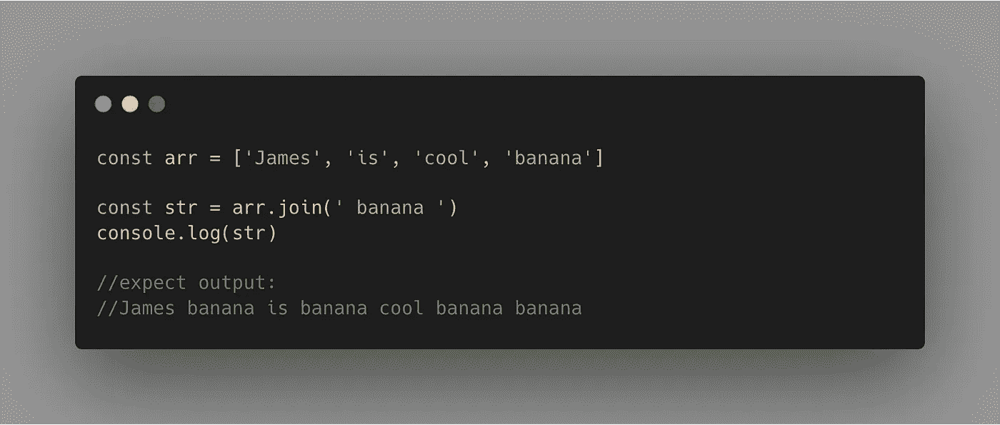
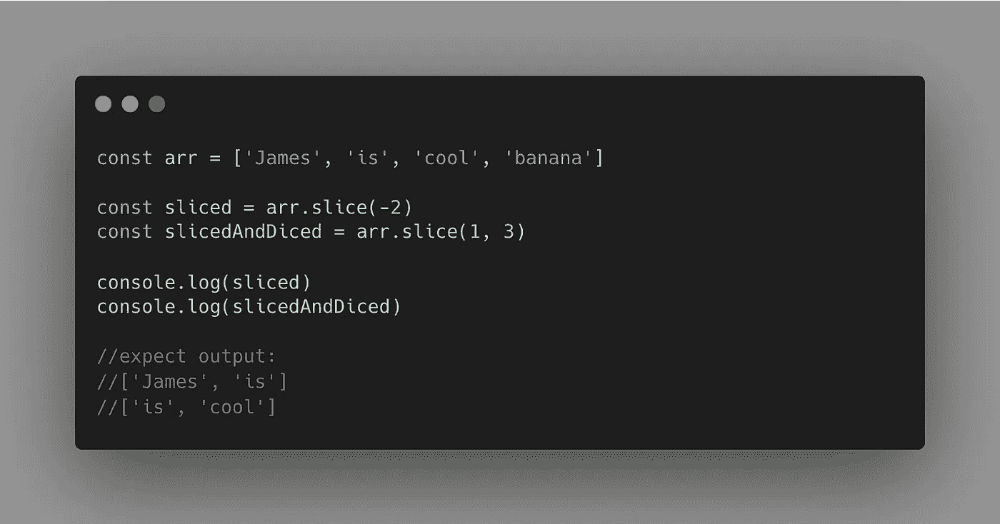

# 成为 JavaScrip 大师|数组函数

> 原文：<https://blog.devgenius.io/become-a-javascrip-guru-array-functions-34be176033b0?source=collection_archive---------7----------------------->

## 掌握基本的 JavaScript 数组函数

学习利用 JavaScript 必须提供的各种数组方法对于成为一名优秀的 JavaScript 开发人员至关重要。因此，没有比现在更好的时间来发现每一个的复杂性，并将它们添加到您的开发工具带上。

在本指南中，我们将讨论我认为最基本的数组方法:

*   *Array.forEach()*
*   *Array.sort()*
*   *Array.find()*
*   *Array.filter()*
*   *Array.map()*
*   *Array.reduce()*
*   *Array.join()*
*   *Array.slice()*

# 为每一个

ForEach 是相当于卑微的`for`循环的新时代。`for (let i = 0; i < arr.length; i++) {}`的时代已经一去不复返了，因为 forEach 方法会在它所应用的数组中的每个连续索引处自然地循环遍历每个元素。arrow 函数中的代码在数组中的每个索引处运行一次。此数组方法没有返回值。例如:



forEach 方法接收匿名箭头函数作为其参数。

# 分类

排序方法 ***返回*** 一个新数组，该数组是其前一个数组排序后的等价数组。该方法接收一个箭头函数作为参数，其中箭头函数本身有两个参数。第一个“a”是给定索引处的当前元素，第二个“b”是下一个元素。这个数组方法自然理解数组的边界，因此不会溢出。arrow 函数的返回值通常是“a”和“b”的比较，并确定应用于数组的排序机制。例如:



Array.sort()返回一个新的有序数组。

一般来说，净返回值有三种排序含义:

*   如果 ***返回值>0***；将“b”排在“a”之前。
*   如果 ***返回值<0***；将 a 排在 b 之前。
*   if**returned value = = 0；让‘a’&‘b’保持原来的顺序。**

该方法也可以应用于文本字符串，例如，您可能希望按字母顺序排列给定数组中的元素。

# 发现

有时当我们有很长的数组时，特定元素的位置可能会非常模糊。幸运的是，我们可以使用 JavaScript 从数组中动态地查找、获取并返回所述元素；我们只需要具体说明我们在找什么。Find 方法还接收一个 arrow 函数，其中 arrow 函数接收当前索引处的元素作为其参数，并返回满足返回条件的第一个元素。



当返回的条件为**真**时，find 方法返回第一个值。

find 方法在功能上类似于 Filter，因为 Filter 方法返回一个新数组，其中包含满足给定条件的每个值。Find 方法只返回第一个遇到的真实实例的实际值。

# 过滤器

Filter 方法遍历数组中的每个元素，并返回一个新数组，该数组包含满足返回条件的所有元素；即返回值为真。



不幸的是，“詹姆斯”不包含字母 n，因此被排除在外。

# 地图

我喜欢想象 Map array 函数对数组中的每个元素进行转换，并返回一个包含这些转换后的元素的新数组。转换后的元素是从 arrow 函数返回的任何内容，其中 arrow 函数作为 Map 方法的参数给出。两个例子可能是:



我们可以看到返回的元素构造了转换后的数组。

在这里我们可以看到，第一个 Map 方法返回一个修改后的字符串，其中每个元素都有一个“Dr”作为前缀，第二个 Map 返回一个新数组，其中所有原始值都经过转换，值中增加了 4。

# 减少

Reduce 可能是最复杂的数组方法，也是统治所有数组的方法之一。对于任何开发人员来说，Reduce 方法都是一个真正有价值的资产，它是您想要的任何东西的最终累积构建器。此外，Reduce 方法可以模拟大多数其他数组方法的行为；最值得注意的是 Map、Filter 和 ForEach 方法。

reduce 方法有两个参数。第一个是箭头函数，它本身有两个参数；累积项和当前元素项:

```
(accumulator, current) => { ... }//or(acc, curr) => { ... }
```

其中累加器项假定从先前迭代返回的值。第二个 Reduce 参数是一个初始值，由 Reduce 循环的第一个索引上的累加器项假定。

一个简单的例子就是对一组数字求和:



我们可以看到累加器项假设了前一次迭代的返回值。

“acc”或累加器项实际上是累加整个数组中每个索引处的当前值。它本质上允许我们构建自定义输出。

我们还可以在 sum 中包含一个过滤器功能；例如，如果我们想对除数字 5 之外的所有值求和:



在本例中，我们将当前元素添加到累加项中，除非它等于 5。

arrow 函数还可以接收第三个可选参数，即当前迭代索引。

以下是我们应用 Reduce 方法的另外三种独特方式:



我们如何产生字符串、数组和对象的三个独立的例子。

这些示例显示了应用 Reduce 方法的灵活性。我们可以用它来调整 JavaScript 对象和数组，并产生各种不同类型的输出。这是对我们开发人员工具带的一个真正伟大的补充。

# 加入

Join 方法构造并返回一个数组中所有不同元素的字符串。我们可以简单地应用该方法，而不传递参数:`[...array].join()`，在这种情况下，我们将产生一个带有逗号分隔条目的字符串，或者我们可以将一个字符串作为参数传递，其中字符串的内容将用于分隔每个术语。



我们将元素连接成一个字符串，每个元素之间用“香蕉”术语分隔。

# 薄片

最后但同样重要的是，我们有切片方法。这个数组方法根据提供给它的索引参数返回一个分片的副本数组。如果提供单个索引作为参数，slice 方法将返回一个新数组，该数组包含该数组中的所有值，但不包括指定索引处的值。如果提供了两个数字索引，将返回一个数组，其中包含从第一个索引(含)到第二个索引(不含)的元素。需要注意的是，切片法支持 ***负索引。*** 这种方法不会变异原来的阵列。



根据指定的索引创建一个新数组。

恭喜你，你现在是 JavaScript 数组大师了。这个数组方法的列表并不详尽，所以如果你想知道如何实现任何其他独特的数组方法，一定要留下评论。