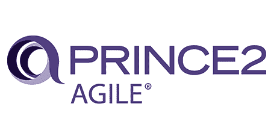

# 成为一名通过敏捷项目管理认证的 PRINCE2 Agile，了解敏捷是如何工作的！

> 原文：<https://blog.devgenius.io/become-a-prince2-agile-certified-in-agile-project-management-and-learn-how-agile-works-65aaa1fe1a83?source=collection_archive---------22----------------------->

凯利·西克玛在 [Unsplash](https://unsplash.com?utm_source=medium&utm_medium=referral) 上的照片

从流体力学的角度来说，如果你想向前游，你需要让前面的水分子离开，这样你的身体就可以占据那个空间。如果你想让*前进得更快*，你需要更快地把那些水分子弄走。为了更快地清除水分子，你需要让这些分子均匀平稳地移动到一边。

现在把你面前的那些水分子想象成你最近项目中的一组产品。如果这些产品的开发过程是有序进行的，那么所有成果的实现将会很快被清除。

*无论你打算以什么速度游泳，*你越好地使用敏捷的运动模式来平稳、统一地清理项目过程，你的组织就能越快地前进。你越快摆脱这些障碍和风险，将决定你如何有效地实现你的项目利益。你用来做这件事的能量决定了你的效率。
**PRINCE2 Agile** 为您提供原则、主题和流程，帮助您以一种有组织的方式向前推进，高效地完成您的项目。

照片由[维达尔·诺德里-马西森](https://unsplash.com/@vidarnm)在 [Unsplash](https://unsplash.com/) 上拍摄

你好，我的朋友们，我想分享我通过 PRINCE2 敏捷基础和实践考试的经验，并希望它能帮助其他申请人获得认证。

根据 2017 年行业[脉搏，几乎四分之三(71%)的组织报告有时、经常或总是使用敏捷方法。因此，如果你和敏捷团队一起从事敏捷项目，如果你的组织正在采用或支持敏捷实践，PRINCE2 敏捷将是你的绝佳选择。该认证将是敏捷原则和方法的实践经验和技能的惊人证据，并将有助于构建您的理论和实践知识。](https://www.pmi.org/-/media/pmi/documents/public/pdf/learning/thought-leadership/pulse/pulse-of-the-profession-2017.pdf)

# 让我们来谈谈 PRINCE2 敏捷

PRINCE2 敏捷资格分为基础和实践两个级别。 [PRINCE2 Agile](https://www.axelos.com/best-practice-solutions/prince2-agile) 教授将 PRINCE2 与敏捷方法相结合的基础和目的。这提供了可伸缩性以及与公司管理流程一起工作的能力。

## PRINCE2 敏捷面向谁:

*   项目管理人
*   生产部经理
*   变更经理
*   团队经理
*   项目管理顾问

## PRINCE2 敏捷优势

PRINCE2 Agile 的主要优势在于其对业务合理性的关注。PRINCE2 敏捷项目是基于成本效益分析来决定项目是否应该继续。

PRINCE2 敏捷 It 将 PRINCE2 的结构、控制和项目治理与敏捷的灵活性和响应性结合起来，允许从业者专注于项目管理和产品交付，因为它通过使用时间盒的准时交付与任何已建立的敏捷方法一起工作，并且还提供了管理和响应不断变化的需求的工具，这导致了利益相关者信心的增加。

PRINCE2 Agile 建立在 PRINCE2 作为项目管理方法的优势之上，加上敏捷开发方法的优势，以产生一个完全可扩展的、敏捷的、专注于为客户实现利益的框架。

# 为敏捷量身定制 PRINCE2

PRINCE2 由 4 个相互关联的元素组成:

*   **原则:这些构成了其他一切事物的基础。他们描述了优秀的实践。**
*   **主题:**这些是项目管理的重要方面，必须在整个项目中持续解决。
*   过程:这些描述了谁在什么时候做什么决定。
*   **裁剪:****从业者如何裁剪 PRINCE2，应用敏捷以适应项目运作的具体环境。**

# **让我们从 PRINCE2 敏捷基础开始**

**PRINCE2 敏捷基金会向任何想成为项目团队中有见识的成员的人介绍 PRINCE2 治理以及它如何与敏捷概念一起工作。**

**首先，没有资格标准。**

**其次，要开始你的研究，你需要在亚马逊上购买 Axelos 的**'**[prince 2 Agile](https://www.amazon.com/PRINCE2-Agile%C2%AE-AXELOS-ebook/dp/B0191RLUT2)**'**手册(约 115 美元)。这也是他们允许你在执业医师考试中使用的唯一材料。**

**✦ **基础考试小技巧****

*   **仔细阅读官方的 PRINCE2 敏捷手册，充分理解每一点，然后为 PRINCE2 原则、主题、流程和裁剪技术写笔记和总结。**
*   **专注于理解所介绍的方法的整体结构。**
*   **练习，练习，再练习[样题考试](https://www.axelos.com/certifications/sample-exam-papers)。**

**✦ **准备基础考试要学多久？****

**几天或最多一周的时间就足以学习和掌握 PRINCE2 敏捷基础考试，并练习示例考试。**

# **考试**

**直接报班或者[在线](https://www.peoplecert.org/browse-certifications/project-programme-and-portfolio-management/PRINCE2-Agile-28)考试:**

*   **考试很简单，多项选择，以知识为基础，60 分钟，50 道题，闭卷，55%及格分数。**
*   **最后，它的价格是 338 美元。认证没有有效期。**

# **PRINCE2 敏捷敏捷实践者**

****资格标准:**您必须提供一些知识证明，您需要通过以下至少一项认证:**

*   **PRINCE2 基金会**
*   **PRINCE2 敏捷基金会**
*   **项目管理专家(PMP)**
*   **项目管理认证助理(CAPM)**
*   **任何 IPMA 等级(A 或 B 或 C 或 D)。**

**✦ **执业医师考试小贴士****

*   **仔细阅读你为《PRINCE2 敏捷指南》每章最重要的方面准备的笔记和摘要。**
*   **重点了解 PRINCE2 敏捷的整体架构。**
*   **再次练习，练习，练习样题。**

**✦ **执业医师考试要学多久？****

**对于从业者考试来说没什么需要学习的，只需要你复习一下学过的内容，练习一下场景案例题就可以了。
对我来说，在 6 月 2 日完成 PRINCE2 敏捷基础考试后，我已经为 PRINCE2 敏捷实践者考试复习了两天，并在 6 月 4 日通过了考试。**

# **考试**

**直接注册课程或[在线](https://www.peoplecert.org/browse-certifications/project-programme-and-portfolio-management/PRINCE2-Agile-28)考试:**

*   **考试以案例为基础，150 分钟，50 个问题(7 个多项选择题，43 个问题基于一个案例场景)，开卷(仅允许 PRINCE2 敏捷指南的官方印刷硬拷贝，也允许使用白纸和笔做笔记)，60%及格分数。**
*   **最后，它的价格是 463 美元。认证必须每 3 年更新一次。**

**请注意，执业医师考试很难，所以你需要仔细阅读和重读问题和答案，并标记任何你不确定的问题，以便复习，稍后再回来。**

# **最后，**

**PRINCE2 Agile 认证和正式成绩将在考试后两个工作日内发送到您的注册邮箱。**

**如果你想获得 PRINCE2 敏捷徽章，你需要注册 [**MyPrince2**](https://www.axelos.com/my-axelos/my-prince2) 它还可以帮助你保持你的 Prince2 敏捷从业者证书，每年获得 20 个 CPD 单位，而不是每 3 年重新参加一次考试。**

**我向你们所有人致以最美好的祝愿，祝 PRINCE2 敏捷学习之旅愉快，并提前祝贺即将获得 PRINCE2 敏捷认证的持有者😊"所以你们要彼此劝勉，互相建立，正如你们素常所行的."(**帖撒罗尼迦前书 5:11)****