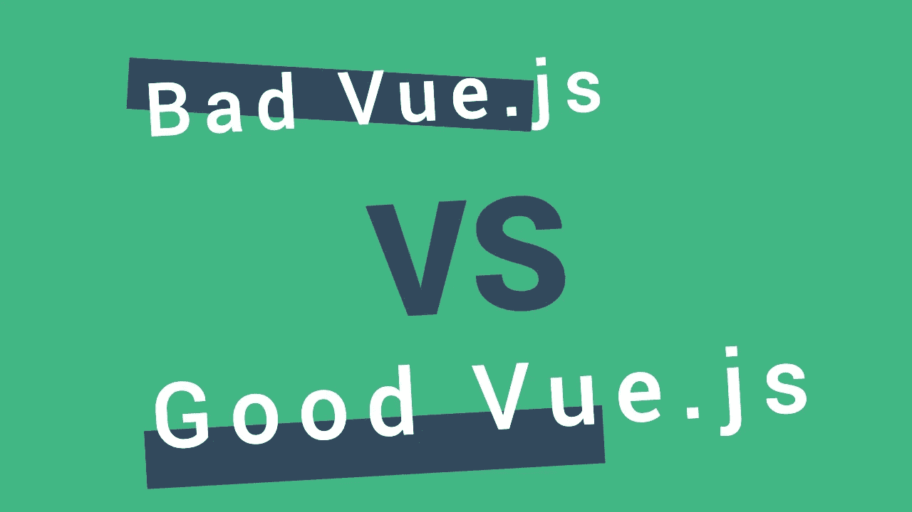
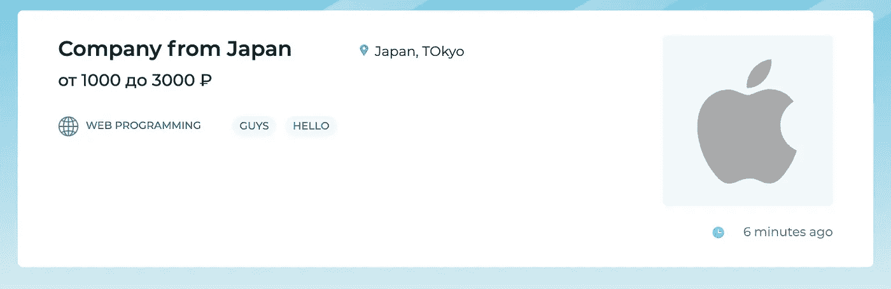
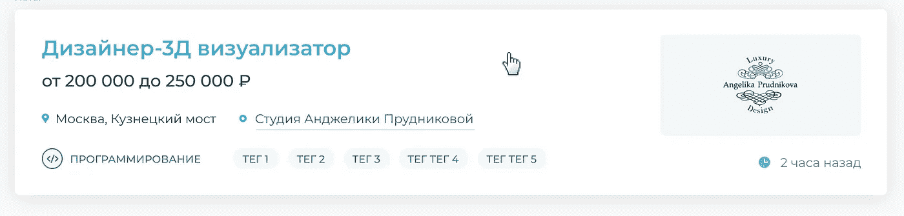

# 之前-之后-改进 UI 组件、可读性和重用代码的实用指南。HTML，CSS，JS，Vue。

> 原文：<https://blog.devgenius.io/before-after-a-practical-guide-to-improving-ui-components-readability-and-reusing-code-2223e1257e20?source=collection_archive---------0----------------------->

我想向您展示一个小的实际工作，我必须在 Nuxt.js (Vue.js 框架)中改进一些具有多个元素的列表组件，但原则在 React、Angular 或其他前端、库、框架或本机代码中是相同的。这不仅可以帮助开发人员，也可以帮助初级开发人员编写更好的代码并提高自己，如果你能让这个不完美的 Vue 组件变得更好，请写下评论。分享经验和看到新的方法将会很棒。

1 月 3 日，假期聚会后，我很累，不想工作，但发现了一个有趣的招聘项目，完成了一半。UI 和代码很糟糕，我认为这是一个挑战。几句话之后，与客户的交易完成了，工作开始了。

首先，看看我之前做的截图，以及在简单列表组件中改进代码后的截图。

**修改源代码前**

**源代码改进后**

**设计。**

任何不处理网站布局的人都可以看到这种差异。甚至我的代码也有设计上的不一致，比如标记大小、徽标或标题填充的不同，但这是应客户的要求修复的。

现在，最有趣的是代码的实现。这是一个巨大的组件，有很多 HTML、CSS 和一些不必要的 js，还有 categoryIcon computed 属性(不同的故事)。

尽管 2021 年已经到来，许多人继续这样写，但我要求你们不要这样做，不要给自己或其他开发者制造困难。

将它上面的代码与我改进的组件进行比较。没错，这不是 JS，PHP，或者其他语言，而是 380 行 VS 172 经过几个小时的编码，觉得是个不错的结果。

为了改进代码，我创建了可重用的组件，使用了 SCSS 而不仅仅是 CSS，添加了方法论 BEM 和引导工具类。您可以使用一些模板引擎，如 pug 或其他 CSS 方法，如面向对象，创建自定义 CSS 类，并决定将数据放在本地组件中或存储到状态管理器中。这取决于你和你的团队喜欢如何处理它。但这是创建一些普通网站必须做的最起码的事情，不管我们使用的是哪个库(框架)，Vue (Quasar，Nuxtjs)，React (Next，Gatsby)，还是其他。