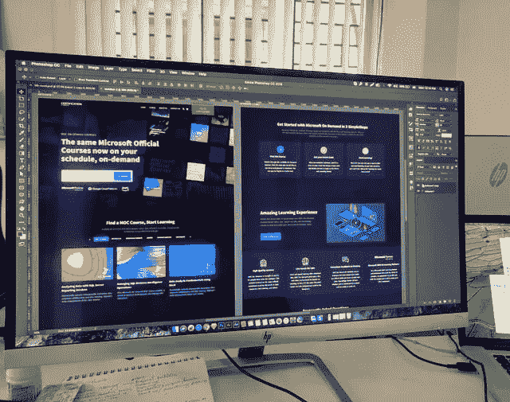

# 在你开始网页设计和开发之前。

> 原文：<https://blog.devgenius.io/before-you-dive-into-web-design-development-8a3e0917aa26?source=collection_archive---------8----------------------->

新开发人员和设计师的职业指南

照片由 [Unsplash](https://unsplash.com/s/photos/web-design?utm_source=unsplash&utm_medium=referral&utm_content=creditCopyText) 上的 [Eftakher Alam](https://unsplash.com/@easiblu?utm_source=unsplash&utm_medium=referral&utm_content=creditCopyText) 拍摄

你好，朋友们，如果你正在读这封信，你可能是我们的新员工之一，我对你说欢迎。如果没有，你仍然可以继续阅读指南。它适用于任何进入网页设计和开发职业的人。

不知何故，你跌跌撞撞地进入了网页设计和开发的冒险世界，也许是通过一个启发你的朋友，你想要建立一个产品，谋生的需要，或者只是纯粹的好奇心。无论哪种方式，有一件事会有所帮助，那就是清楚地了解行业中包含的各种途径，这样你就可以做出更明智的决定。

作为一个起点，让我们首先建立网页设计和网页开发之间的区别，因为尽管它在行业中可以互换使用，但还是有区别的。同样从这些术语中，我们可以提炼出两类角色:网页设计师和网页开发者。在这篇文章结束时，你应该知道你陷入或想要陷入的是什么。

**网页设计**

现在，网页设计指的是将一个想法转化为视觉表现，甚至精确到最终产品的样子。但它不仅仅是视觉效果，它还涉及到参与设计过程来打造一种体验，这种体验将确保想法的成功，并为 web 开发工作的开始奠定基础。所以我们可以说网页设计先于网页开发。

在网页设计师的工作中，他们必须与最初的产品设置团队以及内容撰稿人和信息架构师密切合作，以了解产品的外观和感觉。根据公司的规模，“网页设计师”这一角色可以细分为其他几个角色，例如:

1.  信息架构师:他的工作是从发起人那里获得想法，并对其进行排序。他将传达给他的大量想法和需求转换成设计团队其他成员容易理解的形式。他们使用思维导图、流程图、想法、计划或旧笔记等工具。
2.  UX 设计师:参与规划用户通过网站的整个旅程，并确保用户离开时有极好的体验。他们研究用户以及他们如何与网站互动，并利用这些知识打造更好的体验。有时候，UX 设计师也兼任 UI 设计师。
3.  UI 设计者:接受写在文本中的想法，并试图将它们转换成视觉表现。它们将类似“用户应该能够登录”的内容转换成包含字段、文本和登录按钮的表单。他们使用像 Figma，Adobe XD 和 Sketch 这样的工具。
4.  插画师:关注设计你在网站上找到的图标和插图，尤其是当网站开始更多地使用插图而不是图像的时候。一些公司从股票网站获得插图，但当目的是实现适当的品牌，讲述故事，或避免看起来平淡无奇时，就需要插画师的服务。
5.  图形设计师:一些网站需要大量的设计，因此需要图形设计师来为美化网站提供视觉材料，或者作为营销材料，甚至是社交媒体明信片。
6.  内容或文案:众所周知，网站上的文字对说服用户或传递信息有很大帮助，因此内容作者的服务在设计过程中是必不可少的。通常，他们将内容放在网站页面的粗略轮廓中，甚至直接放在 UI 设计项目文件中。

网页设计师做的一些事情:

1.  跟上最新的设计趋势和技术
2.  他们运用平衡、负空间、统一等设计原则来实现视觉上吸引人的网站。
3.  了解如何打造出色的用户体验
4.  知道如何使用像 Figma，Adobe Photoshop，Adobe XD，Invision design app，sketch 等工具。
5.  他们需要知道如何通过将产品风格的元素融入网站的字体、颜色、形状和总体感觉来传达产品或其所有者的信息。我经常说，“一个好的品牌设计尝起来就像这个品牌”。
6.  他们通常在设计师社交媒体和平台上，如 Behance，Dribbble，Uplabs，甚至 Instagram 也有设计师生态系统。此外，请查看 Figma 社区。

**网页开发**

Web 开发包括实现设计文件或图像成为工作网站所需的代码的过程。Web 开发人员通常被称为程序员或开发人员。

web 开发中的一些角色包括

1.  前端开发人员:他们从 UI 设计人员那里获取视觉输出，并通过通常被称为编程的过程将其转换成实际的软件或网站。现在，一个用户界面设计文件没有能力履行一个实际网站的职责，如接受用户输入，从一个页面到另一个页面导航，拥有华丽的动画和滑块，播放视频，启动文件下载，打开 pdf。所有这些都是由前端开发人员设置的。
2.  后端开发人员:他们参与网站的商业逻辑。他们编写处理注册、登录、电子邮件验证、支付处理、发送电子邮件等请求的代码。之所以称之为后端，是因为它是开发过程的一部分，最终用户看不到它。
3.  Dev Ops:一个网站存在于某个地方的另一台计算机(服务器)上，这台服务器需要维护才能正常工作。这是开发运营工程师的工作。
4.  系统分析师:这些人用数据分析和设计技术来解决商业问题。他们通常出现在效率和洞察力非常重要的大公司。他们寻找更好的做事方式，并试图让所有人都参与进来，从而优化整个业务流程。

现在有一个角色将 web 行业中的各种角色集合在一起，那就是“产品经理”。他们负责监督所有网页设计或开发项目。

大多数非技术或非设计人员的一个流行想法是，你可以跳过设计，直接进行开发，但通常在时间、智力和最终产品的视觉美学方面，开发团队要花费很多。

现在你知道它们的区别，你知道它们的重要性，你知道它们的名字。现在继续深入探究这些领域需要什么，你可能会对其中一个领域非常在行，你会开始教其他人如何去做。无论你在哪里发现自己，拥有一些关于其他人扮演的其他角色的信息总是好的，这样你可以更好地理解他们和他们的过程。但是，在涉足另一个领域之前，你最好专注于任何一个领域，成为一名专业人士。

接下来:网络应用、网站和移动应用之间有什么区别。

感谢阅读…