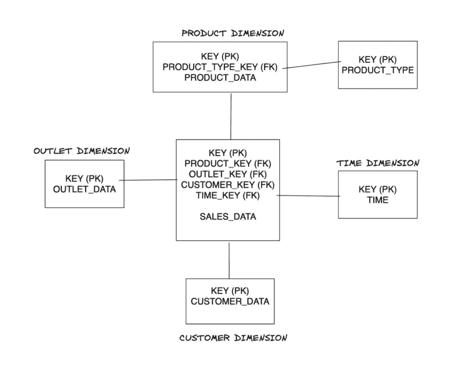
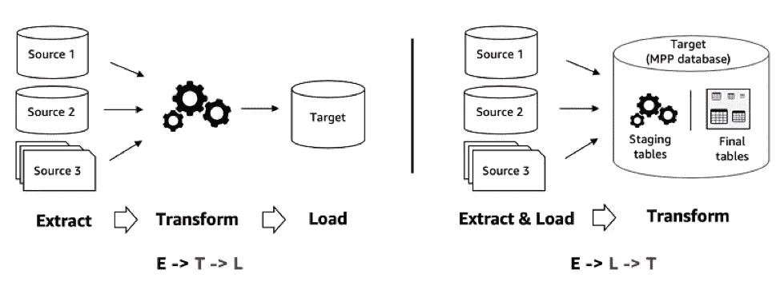

# 数据仓库的初级概念

> 原文：<https://blog.devgenius.io/beginner-concepts-for-data-warehouses-d32f837f2793?source=collection_archive---------7----------------------->

# **什么是数据仓库？**

数据仓库是一种关系数据库，设计用于查询和分析，而不是事务处理。通常，数据仓库包含来自事务数据的历史数据，但它也可以包含来自其他来源的数据。它将分析工作负载与事务工作负载分开，使组织能够整合来自不同数据源的数据。它需要这样的过程:*从不同的数据源中提取、转换和加载* (ETL)，并在数据仓库中创建另一个副本来支持 SQL 查询和分析。

为了便于分析处理的数据检索，需要以下数据设计技术:

## **星际模式**

它是数据仓库建模中最基本和最简单的模式。它包含一个或多个事实表，索引到任意数量的维度表。它的图形表示看起来像一个星形，因此我们称之为星形模式。与维度表相比，事实表通常非常大，并且维度表可能包含冗余数据，因为这些数据不需要进行规范化。

## **雪花模式**

它是星型模式的扩展，在星型模式中，一个集中的事实表引用许多其他维度表；但是，这些维度表被进一步规范化为多个相关的表。该模式的实体关系图类似于雪花形状，因此我们称之为雪花模式。

# 数据仓库示例

考虑一个事实表，它存储了某个时间每个产品和客户的销售量。这里将测量销售量，来自客户、产品和时间维度表的(主)键将流入事实表。此外，所有产品可以进一步分组到不同的产品系列下，并存储在不同的表中，产品系列表的主键也作为外键进入产品表。这种结构被称为雪花模式，因为产品表被进一步雪花化为产品系列。

典型的雪花模式设计

## **ETL 或 ELT——提取、转换和加载数据**

除了数据建模和模式的不同，构建数据仓库还涉及 ETL 的关键任务——将来自其他来源的数据编译到仓库中。

ETL 和 ELT

在数据提取中，我们将数据移出源系统。它可以是关系数据库、NoSQL 数据库或流数据源。这一步面临的挑战是识别正确的数据和管理访问控制。

在数据管道或批处理工作负载中，我们经常将大量数据从不同的源系统移动到数据仓库。这里的挑战是规划一个现实的 SLA，并拥有一个可靠和快速的网络和基础设施。

在数据转换中，我们格式化数据，以便它可以在数据仓库中一致地表示。原始数据可能驻留在使用不同数据类型或不同表格式的不同数据库中，或者不同文件系统中的不同文件格式。

我们通过数据加载中的错误处理过程将数据正确地加载到事实表中。

# **数据仓库到数据湖到数据湖库**

数据湖是一种集中式文件系统或存储，旨在存储、处理和保护大量结构化、半结构化或非结构化数据。它可以以原始格式存储数据，并处理各种数据。数据湖的例子包括 HDFS、AWS S3、ADLS 或 GCS。

数据湖使用 ELT(提取加载转换)过程，而数据仓库使用 ETL(提取转换加载)过程。使用像 Presto 这样的 SQL 引擎，您可以从数据湖中运行交互式查询、报告和仪表板，而无需创建另一个数据仓库或数据副本。并且增加了操作开销。

数据湖只是开放数据湖库的一个元素，因为它从数据仓库和数据湖两者中获益。然而，一个开放的数据湖库远不止于此。这是整个堆栈。除了托管一个数据湖(AWS S3)和一个 SQL 引擎(presto)，它还允许治理( [AWS 湖形成](https://aws.amazon.com/lake-formation))和 ACID 事务。事务性或事务支持是通过使用技术和项目实现的，如[阿帕奇胡迪；](https://hudi.apache.org/)而 Presto 是 SQL 引擎，它位于您正在查询的云数据湖之上。