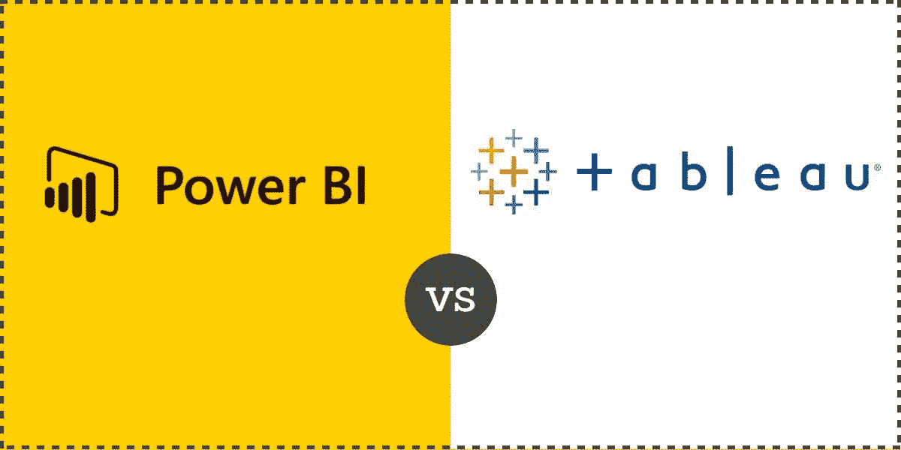
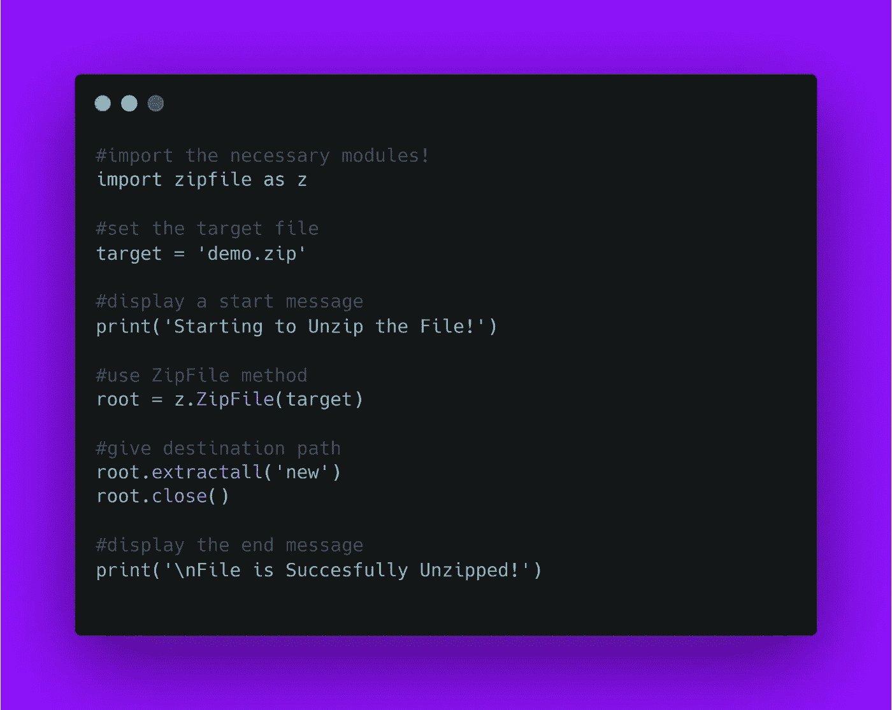

# 成为成功数据分析师的初学者路线图

> 原文：<https://blog.devgenius.io/beginner-roadmap-to-become-a-successful-data-analyst-f864703844f5?source=collection_archive---------0----------------------->

## 探索这个非常需要的工作领域


由 [Unsplash](https://unsplash.com/s/photos/struggle?utm_source=unsplash&utm_medium=referral&utm_content=creditCopyText) 上的 [Pars Sahin](https://unsplash.com/@byadoniaa?utm_source=unsplash&utm_medium=referral&utm_content=creditCopyText) 拍摄的照片

数据是当今世界最重要的资产，数据分析师是操纵数据的专业人士。所以他们的需求在飙升。

最棒的是，成为一名数据分析师不需要特定的学位。如果你有一个商业/数学/计算机科学学位，那很好，但是如果你有正确的热情，那么即使没有学位你也可以继续前进。

今天，如果你是一个绝对的初学者，我们将看到成为数据分析师的路线图。

# 为什么要成为数据分析师？

据[玻璃门](https://www.glassdoor.sg/Salaries/us-data-analyst-salary-SRCH_IL.0,2_IN1_KO3,15.htm?countryRedirect=true)透露，入门级工资 3000 美元/月。它可能会涨到 7000 美元/月，这比其他任何职业都要高。这意味着，如果你在数据分析方面非常优秀，你可以用你的初级档案赚到 5 万美元。

据 [morningfuture](https://www.morningfuture.com/en/2018/02/21/data-analyst-data-scientist-big-data-work/) 报道，许多数据分析师都是女性，几乎 59%的数据分析师都是女性。这是 21 世纪最性感的工作。

# 工作描述:

作为数据分析师或者数据科学家，这个工作的征用都差不多。一些大公司只是想要一些额外的技能来做好准备。

1.  确定数据源
2.  清理杂乱的数据
3.  API，数据库知识
4.  理想情况下，对数据进行排序和聚合
5.  数据过滤和创建可视化

# 学习事物:

今天，我将向您介绍成为数据分析师的具体步骤。所有这些工具/技术都很重要，但有些比其他的更重要。

# 步骤 1:高级 Excel

老实说，excel 对于任何测量都是一个非常强大的工具。如果你有商业背景，那么这是你必须具备的技能。

我们可以在 excel 中进行各种计算。我们还可以使用数据透视表制作图表和表格；这对于轻松呈现数据非常有用。

这是你应该首先学习的基本知识。**微软 excel** 非常合适。但是如果你没有这个，你可以使用 *Google sheets，针对 Ubuntu 用户的 Libre* 等。

[这里的](https://www.udemy.com/course/microsoft-excel-for-data-analysts-t/)是微软 excel 上 Udemy 的高级课程。

# 第二步:SQL

完整形式是`Structure Query Language`。对于数据科学家来说，这是一项非常苛刻的技能。在清理或收集数据之前，您应该使您的数据变得简单，便于进行复杂的分析。

作为一名数据科学家，您需要了解 SQL 的许多功能，例如:

```
select, from, where, order by
```

这些是 SQL 的基本功能。

```
Subqueries, temp tables, CTEs
```

每个数据科学家都应该知道这三种方法。这将有助于快速调优查询。

```
Case when, exsits
```

当我们应该确定一个条件并返回一个或多个结果表达式时，就会用到它。它使它变得又快又快。

这些都是 SQL 的示例函数。数据科学家应该知道哪些功能使**数据变得干净**和**成为标准。**

# 第三步:使用工具

最好的工具是 [**力量匕**](https://powerbi.microsoft.com/en-us/) 和 [**画面**](https://www.tableau.com/) **。**

作为一名数据科学家，你应该在 excel 中工作。Power BI 和 Excel 惊人地协同工作。使用 Power BI 可以非常轻松地制作报告和仪表板。Power BI 对微软 365 生态系统有好处。

Power BI 有一个需要先付费的 pro 版本。如果您作为专业用户共享任何数据，您的接收者也应该成为 Power BI 的专业用户。

但是 tableau 有很棒的可视化软件。它专注于大型社区、大型组织和企业。Tableau public 是一项完全免费的服务。但是如果你想访问在线或服务选项，你应该付费。

作为初学者，可以从学习微软的 Power BI 开始。如果你一旦学会了一种工具，其他工具你就很容易理解了。但是要成为一名专业的数据分析师，你应该深入学习这些工具。



信用:[https://www.generatorresearch.com/tableau-vs-power-bi/](https://www.generatorresearch.com/tableau-vs-power-bi/)

# 第四步:Python

Python 是一种初学者友好的编程语言。这很容易学。Python 可以制作任何东西。

这不是数据分析师的必备技能。但是如果我谈论数据科学家，你应该知道至少一种编程语言。所以最大的偏好是 Python。

假设，我需要选择一名合格的数据分析师/数据科学家。我有两份简历。一个懂编程语言，一个不懂。但两者对我的公司来说都足够好了。我会选择这个至少懂一门编程语言的。



作者图片

# 第五步:学习数学:

作为一名数据分析师，你不仅要知道基础数学，还要知道**微积分、统计、概率、线性方程组、**等等。

微分积分有这么多基本规律。这些是微积分的一部分。统计是一件大事。你应该知道样本分布，不同类型的图形和图表等。

如果你不知道这些，你可以向 [**卡纳卡迪米**](https://en.khanacademy.org/) 学习。它对所有人完全免费。这对数学来说是最好的。

# 学习资源:

有这么多免费课程。首先，一个初学者应该向 **YouTube** 和 **Google** 学习。如果你遇到任何困难，就用谷歌。

Udemy 有这么多高级付费课程。这些课程的价格差不多是 5 到 20 美元。这些课程太棒了。

如今，没有任何有形的机构，学任何东西都不难。在这个疫情，任何人都可以在家开始他/她的数据科学家之旅。

# 结论:

世界上所有的工作都是通过数据收集来完成的。每个公司、政府组织、公共和私营部门；所有这些都需要一个数据分析师来更好地清理和组织数据。

这是我们的未来。数据控制着所有信息。一个优秀的数据分析师聪明地推动公司更高效地运营。如果你作为一个数据分析师足够干净，你就是这家公司的福星人。

**我认为这篇文章会帮助你选择数据分析师的职业。**

## 资源:

*   **卡纳卡德米:**[https://en.khanacademy.org/](https://en.khanacademy.org/)
*   **Python:**https://www.python.org/
*   **画面:【https://www.tableau.com/】**
*   **感谢伟大的解释:**

[https://www.youtube.com/watch?v=ywZXpfdqg1o&t = 138s](https://www.youtube.com/watch?v=ywZXpfdqg1o&t=138s)

[https://www.youtube.com/watch?v=_Dys9aSujWs&t = 719s](https://www.youtube.com/watch?v=_Dys9aSujWs&t=719s)

[https://www.youtube.com/watch?v=E_IQ3mzZyrw&t = 340s](https://www.youtube.com/watch?v=E_IQ3mzZyrw&t=340s)

[](https://python.plainenglish.io/6-libraries-every-python-developer-should-know-b4f616dca001) [## 每个 Python 开发者都应该知道的 6 个库

### 精选的顶级 Python 库集合

python .平原英语. io](https://python.plainenglish.io/6-libraries-every-python-developer-should-know-b4f616dca001) 

如果你喜欢阅读这样的故事，并想支持我成为一名作家，可以考虑 [**成为媒体成员**。每月 5 美元，你可以无限制地阅读媒体上的故事。](https://akhialam.medium.com/membership)