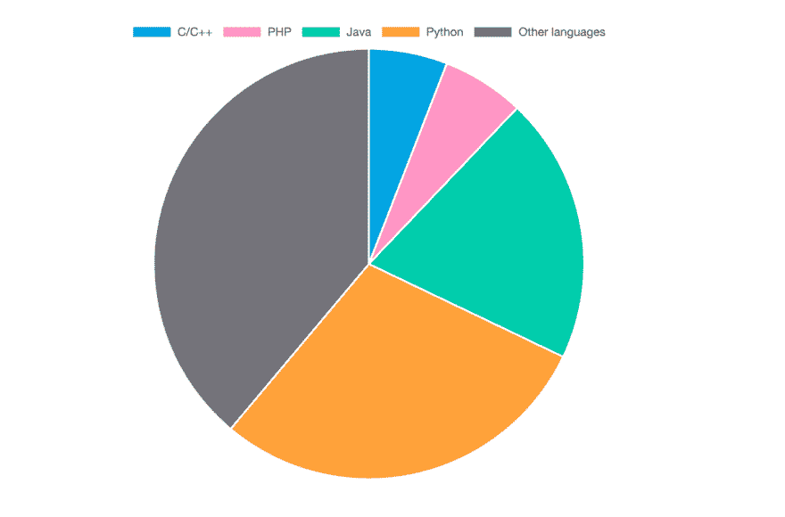
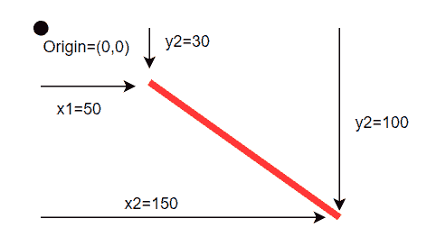

# 初学者的 D3.js 教程:用 js 学习数据可视化

> 原文：<https://blog.devgenius.io/beginners-d3-js-tutorial-learn-data-visualization-with-js-b357d9308ada?source=collection_archive---------3----------------------->


图片来源:作者

D3.js 是用于**数据可视化**的强大 JavaScript 库。与许多使用 Python 的数据可视化工具不同，D3.js 完全由 JavaScript、CSS 和 HTML 等前端技能控制。凭借 JS 驱动的代码、内置的渲染功能和自动动画，D3 一直是前端开发人员的最佳数据可视化工具。

今天，我们将帮助你开始使用 D3.js 组件，并给你创建你的第一个可视化的实践机会。

**下面是我们今天要讲的内容:**

*   D3.js 是什么？
*   D3.js 环境设置
*   D3.js 的基本组件
*   数据可视化示例
*   接下来要学习的高级概念

# D3.js 是什么？

**D3 . js(Data-Driven-Documents)**是一个开源的 JavaScript 库，可以让你使用 SVC、HTML 5 和 CSS 在 web 浏览器中创建动态数据可视化。它是由迈克·博斯托克在 2011 年创建的，作为普罗托维斯的精神继承者。D3.js 擅长以可理解和交互的方式表示大型数据集。

虽然大多数数据可视化工具需要 Python，但 D3.js 可视化完全是使用 JavaScript 创建的。这允许前端开发人员将高级数据可视化添加到他们的 ui 中，而无需学习新语言。

内置并实现了许多高级数据操作和可视化功能，这意味着新的 D3.js 用户可以创建需要多年经验才能创建的效果。

例如，D3.js 具有内置的图形样式，可以显示从简单的饼图到交互式圆形条形图的任何内容。

> *简而言之，D3.js 在现在的前端开发者手中，设计起来就是上手快，功能强大。*

这里有一个 D3.js 饼状图的例子，展示了 2020 年使用的顶级编程语言。



图片来源:作者

虽然大数据很难理解，但可视化要容易得多。一个做得好的视觉效果可以将成千上万的数据点完美地传达成一个有凝聚力的、可操作的趋势。

数据可视化有助于:

*   基于大型数据集快速做出决策
*   了解总体市场趋势
*   交流信息一目了然
*   查找记录数据中的错误

# D3.js 的主要特性

*   **使用 Web 标准**:使用已建立的标准 SVG、HTML 和 CSS，使其与现有技术兼容。
*   **数据驱动** : D3 可以使用静态数据，也可以从远程服务器获取多种格式的数据，比如数组、对象、CSV、JSON 或 XML。
*   **DOM 操作** : D3 允许您使用数据操作文档对象模型(DOM)。
*   **动态属性** : D3 提供动态属性和元素。可以将属性指定为数据的函数，然后编辑您的元素。换句话说，您的数据定义了可视化的风格。
*   **可视化的类型** : D3 有几十种内置的图形格式，用于常见的应用，如排名、关联和分布。
*   **定制可视化** : D3 允许你从头开始或者通过调整当前的图形格式来创建定制可视化。
*   **过渡和动画:** D3 提供了内置的动画函数`transition()`、`duration()`、`delay()`和`ease()`函数，这些函数根据用户交互、定时过渡或其他事件自动动画显示图形的特征。

# D3.js 环境设置

在动手之前，您必须设置一个 D3.js 环境。D3.js 环境的四个组件是 **D3 库**、**web 服务器**、**文本编辑器**和**web 浏览器**。

您可以通过从内容交付网络(CDN)将 D3 库直接链接到您的 HTML 页面来使用它。使用 CDN 将允许你在不下载源代码的情况下使用 D3。

通过在您的`head`部分输入 D3 的 CDN url 来包含 D3:

```
<!DOCTYPE html>
<html lang="en">
<head>
    <script src="https://d3js.org/d3.v4.min.js"></script>
</head>
<body><script>
    // write your d3 code here.. 
</script>
</body>
</html>
```

对于 web 服务器，大多数浏览器将本地 HTML 文件直接发送到浏览器。如果你觉得更舒服的话，你也可以使用 Apache 这样的 web 服务器。

您的文本编辑器应该支持 JavaScript。一些优秀的集成开发环境(ide)包括:

*   Visual Studio 代码
*   黯然失色
*   崇高的文本

D3 可以在除 IE8 和更低版本以外的所有浏览器上运行。在本教程中，我将使用谷歌浏览器。一旦你拥有了所有这些东西，你就可以开始了！

# D3.js 的基本组件

现在我们来看看任何 D3 项目的基本组件。重要组件包括:

*   **选择**，用于选择 DOM 元素进行操作
*   **DOM 操纵**，用于添加或修改 DOM 元素内的文本
*   **方法链接**，用于创建方法管道，每个方法都转换一个对象。
*   **数据连接**，用于将数据绑定到选定的元素，使基于数据的操作更容易。

# D3 选择

选择是大多数 D3 方法链的开始，因为它决定了哪些元素将受到后面方法的影响。D3.js 中有两种选择方式，`select()`和`selectAll()`。

# 选择()

`select()`方法用于选择给定 HTML 标签的单个实例。如果指定的标签不存在，那么它将返回一个空的选择。如果存在选定标记的多个实例，那么它将只选择第一个元素。

让我们使用`select()`方法为 D3.js 运行著名的“hello world”程序。

> 第一段代码是我们的 HTML，第二段是我们的 JavaScript 文件。

```
<head>
    <script src="https://d3js.org/d3.v6.min.js"></script>
</head>
<body>
    <div>Welcome to Educative</div>
    <div>Introduction to D3.js</div>
</body>
</html>d3.selectAll('div').style("color","green");
```

上面，我们使用`selectAll()`方法选择所有的 HTML `div`标签，将它们的颜色改为绿色。

首先，我们使用`selectAll()`方法选择`div`标签下的所有文本。然后，我们使用`style()`方法给选中的文本添加样式。

# 用 D3 进行 DOM 操作

现在我们来看看最常见的 DOM 操作方法，`text()`、`append()`、`remove()`、`style()`和`attr()`。

# 文本()

`text()`方法操作 DOM 元素，通常用于添加或修改 DOM 元素中的文本。

```
<head>
    <script src="https://d3js.org/d3.v6.min.js"></script>
</head>
<body>
    <div></div>
</body>
</html>d3.select('div').text("I am adding text");
```

我们首先使用`select()`方法来选择`div`元素。然后我们使用`text()`方法将我们的文本添加到`div`元素中。

# 追加()

`append()`方法用于在选中元素的末尾添加一个新的 HTML 元素。让我们在`body`标签内创建一个新的`div`元素，并使用`text()`方法向其添加文本。

```
<head>
    <script src="https://d3js.org/d3.v6.min.js"></script>
</head>
<body>
    <div>Introduction to Visualization using D3.js</div>
</body>
</html>d3.select("body").append("div").text("Appending new div tag")
```

一个`div`标签已经存在于 HTML 文件的 body 标签中。在第 1 行，我们使用`append()`方法向 HTML 文件添加一个新的 div 元素。然后，我们添加了文本，使用 text()方法“追加新标签”。

# 移除()

方法用于移除一个选中的 HTML 元素。

```
<head>
    <script src="https://d3js.org/d3.v6.min.js"></script>
</head>
<body>
    <div>1st div tag</div>
    <div>2nd div tag</div>
</body>
</html>d3.select("div").remove()
```

`select()`方法选择第一个`div`元素。然后，我们使用`remove()`方法移除选中的元素。最后，仅显示第二个`div`元素。

# 样式()

D3.js 提供了`style()`方法来设置所选 DOM 元素的样式。样式以类似于 CSS 的格式设置，但一次只能更改一个属性。`style`的第一个参数始终是您想要编辑的属性，第二个参数是新值。

```
<head>
    <script src="https://d3js.org/d3.v6.min.js"></script>
</head>
<body>
    <div>Showing effect of the style method</div>
</body>
</html>d3.select("div").style("color","blue").style("font-size","30px")
```

和以前一样，我们首先选择`div`标签，然后用第一个`style()`方法将颜色改为蓝色，用第二个方法改变字体。每个`style()`方法只能改变一个属性。

# 属性()

我们可以调用`attr()`一次，而不是调用`style()`两次。方法将你的元素链接到一个 CSS 样式表，并将该样式表的设置应用到任何选中的元素。

它也用来定义一个几何图形的属性，我们将在后面看到。

```
<head>
    <script src="https://d3js.org/d3.v6.min.js"></script></head>
<body>
    <div>Showing effect of the attr method</div>
</body>
</html>d3.select("div").attr("class","error");.error {
    color: blue;
    font-size: 30px
    }
```

我们的`attr()`方法将选中的`div`元素链接到我们的 CSS 表单。第一个参数定义工作表的类型，第二个参数指定要选择的类名。

这允许 D3 使所选元素的颜色和字体大小属性与 CSS 表单相匹配。

# 方法链接

方法链是一种将多个方法串在一起的技术。第一个方法的输出将作为第二个方法的输入，依此类推，直到链完成。

类似于函数式编程中的函数组合，方法链允许您组合简单的方法来创建复杂的行为。

当我们在同一个元素上使用`select()`和另一个方法时，你已经在整个教程中使用了。

前面的例子是一个很好的例子。

```
d3.select("div").style("color","blue").style("font-size","30px")
```

首先，我们将`div`作为输入传递给`select()`方法。然后`select()`返回一个选择元素，作为`style()`方法的输入。然后，第一个`style()`将样式更改应用于传递的元素。然后，新样式的元素被传递到下一个`style()`进行另一次更改。最后，我们通过对原始输入的一次调用来应用 3 个方法。

您也可以在单独的行上编写方法链，以提高可读性:

```
d3.select("div")
.style("color","blue")
.style("font-size","30px")
```

# 数据连接

数据连接允许我们将选定的元素绑定到数组的数据上。绑定是您用来绘制可视化的主要工具，因为它们使您的 DOM 操作对您的数据更加敏感。

数据连接的三种主要方法是`datum()`、`data()`和`enter()`。

# 基准()

`datum()`方法用单个 D3 选择连接数据点。

```
<head>
    <script src="https://d3js.org/d3.v6.min.js"></script>
</head>
<body>
    <p></p>
</body>
</html>d3.select("body")
  .select("p")
  .datum(["10"])
  .text(function(d) { return d; });
```

在上面的例子中，我们想要绑定数据元素和 HTML 标签。在**行 1** 中，我们使用`select()`方法选择`p`标签。在**第 3 行**中，我们使用`datum()`将`10`与`p`标签绑定。在**第 4 行**中，我们使用`text()`返回与`p`标签相关的数据。

# 数据()

我们可以使用`data()`将多个数据点与一组 D3 选择相关联。这在处理大数据集时很有用，因为这意味着您不需要单独绑定每个数据点。

```
<head>
    <script src="https://d3js.org/d3.v6.min.js"></script>
</head>
<body>
    <p></p>
   <p></p>
   <p></p>
</body>
</html>d3.select("body").selectAll("p")
   .data([10, 20, 30])
   .text(function(d) { return d; });
```

这里，我们使用`selectAll()`方法选择正文中的三个元素，并使用`data()`将每个元素绑定到一个数据点。最后一行打印成对选择的数据。

# 输入()

当选择的元素多于数组中的元素时，使用`enter()`方法绑定元素。

```
<head>
    <script src="https://d3js.org/d3.v6.min.js"></script>
</head>
<body>
    <p></p>
    <p></p>
    <p></p>
</body>
</html>d3.select("body").selectAll("p")
   .data([10, 20, 30, 50, 70])
   .text(function(d) { return d; })
   .enter()
   .append("p")
   .text(function(d) { return d; });
```

上面我们选择了三个`p`元素，但是在`data()`数组中有 5 个元素。这将按顺序绑定所有可能的元素，直到没有未绑定的`p`元素。然后我们使用 append 添加额外的`p`元素，直到所有元素都可以被绑定。

# 数据可视化示例

现在我们知道了组件，我们将看看如何使用 D3 来完成两个不同的示例视觉效果。我们将从一个简单的 line SVG 开始，让您熟悉一下，然后向您展示如何创建本文前面提到的饼图。

# 带有 D3.js 的 SVG

为了用 D3 创建一个 SVG，我们需要在 HTML 文件中包含`svg`标签。

```
<body>
     <svg>content</svg>
</body>
```

D3 还有一个“线”图形元素，可以用`attr()`配置。

```
<head>
    <script src="https://d3js.org/d3.v6.min.js"></script>
</head>
<body>
</body>
</html>var svg = d3.select("body") //create Svg element
   .append("svg")
   .attr("height",200 )
   .attr("width", 200)
   .style("border", "solid 8px red");svg.append("line")
   .attr("x1", 50)
   .attr("y1", 30)
   .attr("x2", 150)
   .attr("y2", 100)
   .attr("stroke", "black")
   .attr("stroke-width","2px");
```

从 JavaScript 页面中的**第 1 行**到**第 5 行**，我们在`body`标签内创建了`svg`标签。在`attr`方法的帮助下，我们正在定义`svg`的属性。

在 JavaScript 页面中，从**第 7 行**到**第 13 行**，我们在`svg`标签内创建了一行，并借助`attr`方法初始化了该行的属性。

下图显示了直线相对于位于 SVG 画布左上角的原点的位置。



图片来源:作者

# 包含 D3.js 的饼图

现在我们将使用`d3.arc`和`d3.pie`API 来创建我们在文章开头看到的“2020 年使用的编程语言”图表的一部分。

```
<head>
    <script src="https://d3js.org/d3.v6.min.js"></script>
</head>
<body>
</body>
</html>var margin = {top: 20, right: 20, bottom: 60, left: 80},
     width = 500 - margin.left - margin.right,
     height = 500 - margin.top - margin.bottom;
var data = [
  {language:  "Python", value: 30},
  {language:  "Java", value: 20},
  {language:  "C/C++", value: 15},
  {language:  "Javascript", value: 35},
  {language:  "PHP", value: 15},];
colors=["#00A5E3","#FF96C5","#00CDAC","#FFA23A","#74737A"]  
var svg = d3.select("body") //create Svg element
   .append("svg")
   .attr('width', width + margin.right + margin.left)
   .attr('height', height + margin.top + margin.bottom)
   .style("border", "solid 1px red")
    .attr("transform","translate(200,0)");                 
var chart=svg.append('g')
   .attr('transform', 'translate(' + margin.left + ',' + margin.top + ')')
   .attr('width', width)
   .attr('height', height)
var pie=d3.pie() 
        .value(d => d.value)
var color_scale=d3.scaleOrdinal()
              .domain(data.map(d=>d.language))
              .range(colors)
let arc=d3.arc()
       .outerRadius(150)
       .innerRadius(0)
var p_chart=chart.selectAll("pie")
     .data(pie(data))
     .enter()
     .append("g")
     .attr('transform', 'translate(170,230)') 
p_chart.append("path")
     .attr("d",arc) 
     .attr("fill",d=>{
       return color_scale(d.data.language);
     })     
p_chart.append("text")
      .text(function(d){ return d.data.language})
      .attr("transform", function(d) { return "translate(" + arc.centroid(d) + ")";  }) 
      .style("text-anchor", "middle")
```

**第 29–33 行**:首先，我们定义了`p_chart`。我们选择了不存在的 pie，所以它将返回一个空的选择。现在我们通过`data(pie(data))`加入`data()`我们的返回选择。然后，我们为每个数据点添加了`g`标签。

**第 34–38 行**是借助弧线绘制饼图的地方。在`ordinalScale()`的帮助下，我们已经给每条弧线分配了一种颜色。

**第 39–42 行**:我们已经使用`text()`方法将语言的名称添加到相应的 arc 中。借助于`arc.centroid()`方法，该`text()`将被放置在每个圆弧的质心。

# 接下来要学习的高级概念

正如你所看到的，D3 允许你用这些基本的组件创造一些引人注目的视觉效果。随着您继续学习 D3.js，这里有一些高级概念将帮助您制作更好的图表和图形:

*   缩放和重新缩放
*   用户交互性
*   分层映射
*   高级图表表单

*快乐学习！*