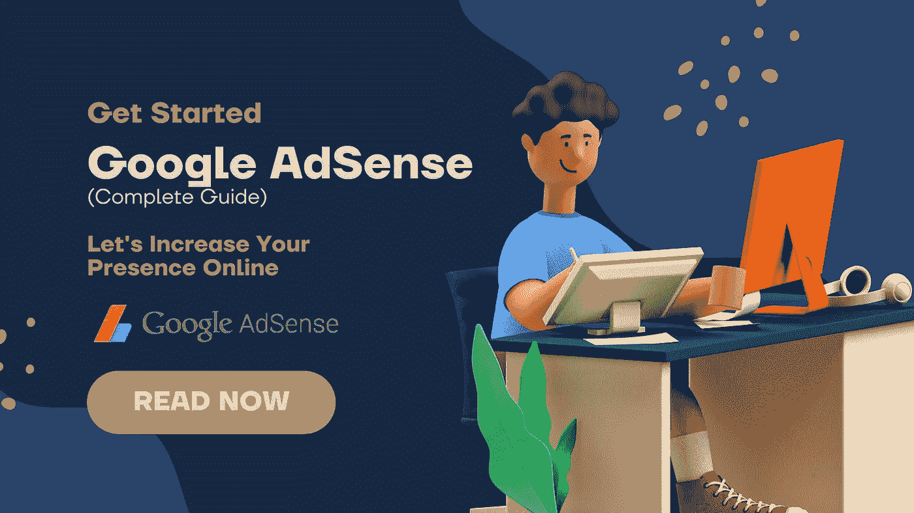
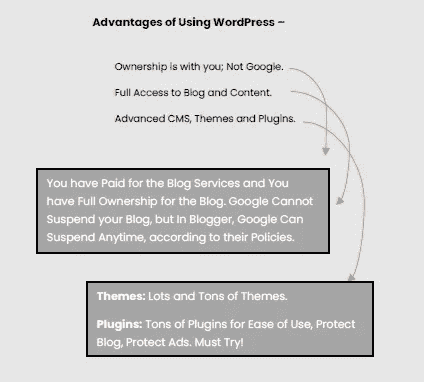
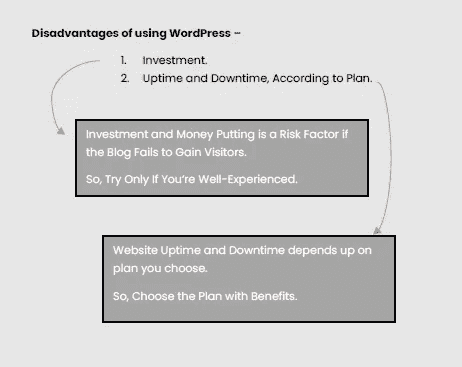

# 初学者指南:谷歌广告——必读🔥

> 原文：<https://blog.devgenius.io/beginners-guide-google-adsense-must-read-5cf17c169ebc?source=collection_archive---------6----------------------->

了解 Google AdSense 的一切，让你的网站在更短的时间内盈利。

> **Google AdSense 简介和概述-**

Google AdSense 是 Google 发起的一项倡议，来自不同网站或博客的发布者可以加入这个网络，提供完全针对网站内容和访问者兴趣的文本广告、图像广告、视频广告或互动广告。
如前所述，这个程序归谷歌所有，是谷歌的产品，所以——这里的一切都由谷歌管理和维护。

Google AdSense 最初由 **Google** 于 2003 年 6 月 18 日**发布。互联网上有大量的第三方广告平台；但是 Google AdSense 总是在顶端，也是通过在你的网站上投放广告获得收入来源的最积极突出的平台。
根据一些报道，**谷歌向出版商支付超过 100 亿美元。**这是全球范围内计算的总数和平均值。
现在每天有数百万的网站注册了谷歌 AdSense 计划，并通过从他们的网站和博客中产生有机流量来赚取巨额收入。
谷歌提供的安全级别是高等级的，安全性和整体透明性兼具；出版商和广告商。毫无疑问！为什么 Google AdSense 站在最顶端。让我们来看看一些关于广告的基本信息，广告类型和使用谷歌 AdSense 的利弊。**

****完全加载的各种广告格式:**
Google AdSense 附带了许多广告格式，发布者可以使用它们在整个网站上显示，并吸引访问者根据他们的兴趣来查看广告。
广告形式，如文字广告、图片广告、视频广告、主播广告、插页广告等。**

****Google AdSense 的优点:
1。**高数量的出版商和广告商
**2。**具有响应性的高质量广告
**3。**高安全等级
4。与 Google Analytics 和 Google Webmaster
**5 集成。**多种广告形式
**6。**可信和安全平台
**7。**被动收入**

****谷歌站长之弊:**
**1。**出版商获得 100 美元后的报酬
**2。**账号可以随时暂停
**3。**针对无效点击和无效流量的敏感政策**

> ****为什么使用 Google AdSense 平台？****

**正如我之前所说，Google AdSense 是通过在在线内容旁边显示广告来赚钱的免费而简单的方式。Google AdSense 是基于兴趣的广告，或者你可以说它总是向用户展示相关的广告。**

**例如，如果有两个不同用户的设备登录，并且在网站上显示 AdSense 批准的广告；然后，用户或设备显示相同的广告并不是强制性的，他们可以根据自己的选择或根据他们的大多数搜索查询而有所不同和相关。**

**谷歌默认启用每个谷歌账户中的相关广告设置(截至 2022 年 5 月——以后可能会改变)。这种设置有助于用户和谷歌在手机上冲浪时获得即时广告。想想看，你一直在搜索“孟买的 MBA 学院”,之后，无论你在哪里冲浪，它都可能是社交媒体——你会开始得到同样的相关广告。这对于用户获得他们正在寻找的广告可能是有利的，并且可以解决问题。截至 2022 年，Google AdSense 仍然是盈利的，任何有兴趣的人都可以通过遵守他们的政策来赚钱。**

**我听过很多人说 Google AdSense 政策非常严格敏感；嗯！

可能是。但在我看来，如果你遵守这些规则，我从他们的政策中挑选了一些元素，如无效点击，无机流量。等等。如果你遵循这些并保护你的网站免受这种垃圾(无效活动[流量，点击])，你的广告和谷歌 AdSense 帐户是安全的，你的网站也将处于健康状态。
谈到 Google AdSense 的薪酬结构，我认为就我的经验而言——在获得批准并完成 100 美元的里程碑后——根据他们的条款和条件，金额会被释放。**

**并且在完成 **$7** 或 **$10** 后，Google AdSense 会提示您申请 Google AdSense Pin 信，以便在完全模式下激活账户并进行账户验证，因此只要达到 **$100** ，您就可以轻松提取各自银行账户中的金额。**

**从用户的角度来看，使用 Google AdSense 平台赚钱可以带来很多好处，如信任、安全、品牌、知名度。**

****信任—** 顾名思义，谷歌本身就暗示了对它的重视和信任。
**安全—** 毫无疑问！谷歌是安全平台之一。
**品牌—** 谷歌是一个品牌，AdSense 是其产品之一。
**知名度—** 数百万出版商和广告商。**

**走向谷歌 AdSense 的负面，在我看来，这是非常公正的，因为只要你遵守政策，没有什么会损害你的帐户。弊或利可能是暂停帐户，这是唯一的因素，已经关闭或给了许多用户的收入暂时完全停止。
但在我看来，如果你遵循政策并遵守它，这是可以跳过的。**

> ****使用 Google AdSense 的好处****

**就 Google AdSense 的流行而言，你一定在想，没有更多的好处，流行是不可能的。当然可以！你是正确的。**

**Google AdSense 有很多好处。我会在下面列出来。但是，你有没有想过，为什么 Google AdSense 如此受欢迎？我想我在前面几章已经回答了这个问题。**

****大量出版商/广告商****

**在世界范围内，Google AdSense 被广泛用于赚取被动收入，毫无疑问，这个产品的工作场所拥有最多的出版商和广告商。**

**发布者是那些在他们的网站上展示广告的人。**

**广告主是那些通过 Google AdSense 平台，通过发布商制作广告并进行推广/服务的人。**

**Google AdSense 有一个最流行的程序或功能叫做“PPC ”,也就是点击付费。**

**正如我所说的，Google AdSense 简单易用，轻量级，用户友好，使用可靠。**

**虽然 Google AdSense 有严格的政策，但一些用户喜欢作为发布者，因为品牌和安全性本身就建立在用户的心中。**

****具有响应性的高质量广告****

**Google AdSense 提供各种类型的广告在网站上显示，广告格式列表，如图像广告、锚广告、插图广告、搜索引擎广告、文本广告等。**

**所有这些广告都是自然反应，但也有一个选项，使广告的大小固定。用户可以在它们之间进行选择，并相应地显示广告。我会推荐响应式广告，因为它可以自动适应任何尺寸的筛选设备，如手机、平板电脑和个人电脑。**

**据统计，最受欢迎的广告尺寸是 728x90、320x50 或略 468x60。这是所有广告中最常用的尺寸，在出版商中更受欢迎。**

****高安全级别****

**就该公司过去的记录而言，谷歌拥有自己的数据服务器，这些服务器 24x7 全天候高度安全，具有多层安全保护，以防止任何恶意攻击或未经授权的数据使用。谷歌还使用带有摄像头覆盖和生物认证的安全周界防御系统。**

**毫无疑问！关于储存在谷歌服务器和数据库中的数据的安全性。**

****整合谷歌分析和谷歌网站管理员****

**正如 Google AdSense 是 Google 的产品一样，Analytics 和 Webmaster 也是 Google 的产品。简单地说，Google Analytics 用于监控网站的流量、统计数据和综合数据质量，另一方面，Google Webmasters 有助于提高网站在 Google 搜索引擎中的可见度。在这里，人们可以免费在谷歌搜索引擎中手动排列他们的帖子或文章。**

**在这两个产品中，Google Analytics 和 Google Webmaster 或 Google Search Console 都需要添加和验证属性才能开始活动。**

****多种广告形式****

**广告形式，如图像广告、文字广告、插图广告、锚定广告等等。这种广告形式在本质上是完全响应性的，并带有高质量的图形。**

****可信和安全的平台****

**正如在《高级别安全性》中所讨论的，Google 是一个非常受欢迎且高度安全的以数据为中心的平台，它通过六层安全措施得到充分保护。**

**简而言之，第 1 层(标志和围栏)、第 2 层(安全周界)、第 3 层(大楼入口)、第 4 层(安全运营中心)、第 5 层(数据中心楼层)、第 6 层(安全硬盘销毁)。**

****被动收入****

**根据 AdSense 政策，世界各地的每个人都可以通过创建内容网站、工具网站或任何其他分类网站来获得被动收入。正如我所说的，必须达到 100 美元的最大限额**才能提取这笔钱并将其转入银行账户。****

> ******使用 Google AdSense 面临的挑战******

******出版商获得 100 美元后的报酬******

****Google AdSense 的最低门槛是 100 美元。只有当发行人达到 100 美元的里程碑时，他/她才能从帐户中取钱。这可能是使用谷歌广告的利与弊。我知道，谷歌是真实的和有价值的公司，但有时由于政策，如果帐户因违反条款而被 AdSense 禁止，收入可能会被暂停。****

****考虑一下，你的账户收入是 **$92** ，你的账户经常因为一些不当行为而被暂停，那么根据这种情况，如果你没有被判有罪，你赚的钱会支付给你(根据政策)，但如果没有，这笔钱会被完全取消，如果账户被禁止，你必须忘记它。同样，这是一个风险因素。****

****你可能会想，如果我是无罪的，为什么帐户被暂停。因此，周围有许多竞争对手故意点击和发送你的广告。这有一个解决方案，但谷歌仍然会让你为这狗屎负责。但是谷歌并不是每次都给你机会，但是如果你幸运的话，你会得到第一次警告，帐户将被暂停 30 天，并在此期间后被撤销，第二次帐户被永久禁止。****

****有一份上诉表，但你的账户有 0.1%的机会被恢复。在下面的表格中，你必须提到所有无效流量或点击的统计数据。如果你使用 WordPress 平台，那么追踪垃圾邮件活动并保存记录就很容易了。但是在 Blogger 平台上没有这样的东西，所以要小心。****

******随时可以暂停账户******

****如上所述，谷歌 AdSense 的政策是非常严格和明智的，可以发现非常高的不当活动。这是一个风险因素，帐户可以随时被禁用。****

******针对无效点击和无效流量的敏感政策******

****有一些过于自信的用户，他们认为如果我点击自己的广告，收入就会增加。但那是一个错误的概念。谷歌认为自行点击是无效活动。****

****由于算法策略，收入可能会在短时间内增加，但一段时间后，如果活动为假或自行点击，收入将被借记。如果超过垃圾邮件计数，你会得到警告或暂停。****

****在这里，当你是一个个体时，你会面临很多挑战，因为我已经作为一个个体在博客上工作了很长时间。尽管如此，我还没有一个团队，因为我还没有选择博客作为我的职业。面临的挑战与日常生活非常相似。你必须自己做的一切…****

****因此，挑战是旅程的主要部分，但如果保持耐心并工作更长时间，它是可以解决的。****

> ******Google AdSense 是如何工作的？******

****我想你到目前为止已经读完了所有的四章。现在你对 Google AdSense 有了更好的了解。！****

****Google AdSense 的工作原理是在你的网站上投放广告，并根据浏览量、点击量、 **RPM(页面+浏览量)**获得收益。****

******印象数—** 访问者在您的网站上创建的广告请求量。它可以是有机交通，社会驱动的交通。****

******点击量—** 表示访问者点击广告的次数。记住，不是垃圾邮件。****

******RPM(页面+展示)——**代表每千次展示的收入。它是经过彻底计算的，只需将你的预估收益除以你有机获得的页面浏览量，然后乘以 1000。****

******举例来说——**从 **25 次页面浏览**中，你的预计收入是 **$0.15** ，那么你的每分钟转数将相当于 **$0.15** 或 **$0.25 * 1000** 。****

****Google AdSense 的工作原理是将你的兴趣与广告匹配起来，这些广告也被称为相关广告。这种广告是由想推广他们的产品或业务的广告商制作的。****

****简单地说，创建一个博客或内容网站，在上面工作几个月，获得网站的有机流量。去注册谷歌广告并提交你的网站。专家会检查你的网站，并给你发电子邮件。****

****如果网站获得批准，您可以开始在网站上放置广告或启用汽车广告来开始盈利。****

> ******Google AdSense 中的术语“CTR”是什么？******

****Google AdSense 中的术语 CTR 代表****

******“点击率”******

****简单来说就是广告被点击的次数除以广告被观看的次数。它是广告点击数和页面浏览量的比率。****

******CTR =广告点击量/浏览量。******

******CTR % =点击次数*100 /广告的浏览量。******

******例如—******

****我会用简单的语言向你解释，如果你的网站上显示的广告被 150 个人看到，只有 5 个人点击了它。那么 CTR 就是 5%。永远记住，点击率越高，你的网站上的广告就会越来越好。所以，总是尽量把广告放在可视和可点击的区域。****

****CTR 或点击率是印象和点击之间的一个强有力的纽带:在以下次数中，你的广告显示给访问者的次数和点击完成的频率。****

> ******Google AdSense 审批流程+审批提示******

****要么你在用 Google Blogger，要么用 WordPress。申请 AdSense 应用程序的过程也是如此。****

****在 Google Blogger 中，您可以直接从 Blogger Dashboard 注册，但由于我过去冻结应用程序的经验，有时我不会推荐这样做。****

****所以，Google Blogger 或者 WordPress，遵循同样的流程。****

******去 Google >搜索 Google AdSense 注册。******

****点击**显示的第一个链接**。****

******现在！你在官方的谷歌广告页面**。****

****使用与网站相关的相同电子邮件地址注册。****

****接下来，您将被重定向到注册页面。****

****首先输入你的网址。****

****比如: [www.abc.xyz](http://www.abc.xyz)****

****然后输入您的相关电子邮件地址。点击你喜欢的选项，无论你是否想收到促销邮件。然后点击提交按钮。****

****下一个屏幕将出现，并要求您粘贴以下代码到您的 HTML 模板编码。你要把那个代码粘贴在 **<头>** 段的编码里。****

****你已经完成了一部分！现在，Google AdSense 团队的一名专家将审查您的网站，并向您发送电子邮件。****

****根据 Google AdSense，此过程可能需要 2 周时间。****

# ****这里有一些获得 Google AdSense 许可的技巧****

****总是想知道为什么你的博客或网站在流量、设计、结构和搜索引擎优化方面缺乏响应。你是否也将 Google AdSense 与基于 Google Blogger 或 WordPress 平台的博客和网站整合在一起？毫无疑问！Google AdSense 是全球付费和排名最高的广告网络之一，广告商和出版商可以与之合作。Google AdSense 是一个广告平台，允许出版商和广告商分享各自的广告，并在博客和网站上展示。****

****根据大多数博客所有者的说法，获得 Google AdSense 的批准是一件令人头疼的事情，也许确实如此；因为 Google AdSense 的政策是严格的，遵守它不是每个人的工作。****

****今天，我将讨论一些很好的技巧，告诉你如何快速获得 Google AdSense 许可。如果你遵循我在这里提出的每一个技巧，你一定会得到一个谷歌 AdSense 的批准，没有任何错误和缺乏效率。****

******写足文章******

****如果你是一个博客写手，并且想在你的博客/网站上寻求一个包含内容的许可，那么你应该总是为你的博客写足够的内容。简单来说，Google AdSense 想要有好内容的有机流量。****

****首先，选择一个主题，然后开始写。****

****AdSense 官方并没有给出具体的文章数量来寻求批准。这只是一个从博主过去的认可中衍生出来的想法。尽管如此，你不应该在你的网站上缺乏文章和内容。****

****在申请 Google AdSense 之前，你必须写 18-20 篇 1000+字的独特文章或 30-35 篇 500+字的文章。这个标准取决于你怎么写。因此，你必须满足这个标准，以寻求谷歌广告的批准。****

******域或子域******

****如果你是博客行业的新手，不想投资，这是早些时候的问题，而不是现在。因为 Google AdSense 最近也开始批准. blogspot.com 子域名。****

****许多人说在博客上添加一个自定义域名可以保证你很快获得批准。完全是错误的，没有偏见的。添加自定义域永远不会有助于获得批准，因为您也可以从子域获得批准。如果你的网站有好的内容，并且符合 Google AdSense 的政策，那么自定义域名可以帮助你获得批准。****

****是的，但是为了专业，你可以在你的网站上添加一个自定义域名。在，。com，。博客。等等。****

******博客/网站模板******

****在独特的内容和域/子域之后，是博客站点的模板或主题。该网站的模板必须响应和 AdSense 友好，以获得 AdSense 的批准。如果你的网站没有很好的组织，那么它会看起来一团糟，并会导致拒绝 AdSense。所以，主题是获得 AdSense 许可的最重要的部分。****

****有许多免费和付费的主题，只是不同的是，免费主题是在页脚水印和付费是完全定制的。****

****所以，总是尝试应用好的和快速加载的主题。****

******谷歌网站管理员指南******

****众所周知，谷歌搜索控制台通过添加属性来帮助手动索引我们的文章。尝试获得成功，遵守谷歌网站管理员的指导方针。永远记住，在申请 AdSense 之前，确保你的文章在谷歌排名，并有可见性。要知道有多少文章在谷歌中排名，只需在浏览器中键入一个操作符，即站点:“yourdomain”，然后搜索相同的内容。****

****谷歌搜索控制台会对你在谷歌上的文章进行排名，这样你就可以通过搜索引擎获得有机流量。****

******写出高质量的文章******

****写一篇高质量的文章会给你的博客带来优质的氛围，如果在你的博客上发现一些独特的东西，访问者重复访问的机会就会增加。写足够多的文章是主要目标****

****但是要想在 Google 搜索引擎中成功抓取网页，必须要有高质量的内容。****

****谷歌上有数百万篇关于同一主题的文章和内容，是什么让你与众不同？这就是内容。如果你写高质量的文章。如果写了一些独特的东西，谷歌会把你的文章放在搜索结果的顶部，你会得到有机点击和流量。****

******创建重要页面******

****当涉及到您的博客或网站的信息时，Google AdSense 会寻找您为访问者所做的安排，以解决他们的问题，或者 Google AdSense 希望访问网站或博客的访问者应该获得适当的帮助，以获得有关页面的可用性，如关于、联系方式、隐私政策、条款和条件以及免责声明。所以，这是博客的必备页面。****

****这个页面帮助每个访问者获得关于博客的有用信息，比如什么是该做的，什么是不该做的。所以，创建这种类型的重要页面是有好处的。****

******使用无版权图像******

****每当谈到写作，我假设你写的是独特和高质量的内容，但图像呢？它们是没有版权的吗？如果您使用自己构建的图像，那就没问题！但是如果你使用谷歌的图片，那么你必须定制图片或者通过过滤谷歌上的结果部分来使用无版权的图片。并非谷歌上的每张图片都是无版权的。****

****从谷歌获得无版权图片。搜索图像。****

****例如，我将搜索“Dog ”,结果就会显示出来。然后进入搜索框下面的过滤器部分，你会找到使用权限，并相应地从不同的许可证列表中进行选择。****

****所有的手续都办好了。现在，你可以安全地申请 Google AdSense，如果一切顺利，你会收到一封电子邮件，****

****您的网站现已准备好投放广告，或者您的网站已成功与 AdSense 连接。****

****运筹学****

****如果有任何问题，如果它拒绝，他们将发送电子邮件定义，****

******感谢你申请谷歌广告。废话…废话。废话！！！！******

****— — — — — — — — — —****

*******嘿好色之徒！*******

****现在轮到你了。我希望你喜欢这篇关于如何快速获得 Google AdSense 许可的指南。****

****寥寥数语…****

******耐心是关键******

****众所周知，Google AdSense 表示审查网站需要 2 周时间，但有时需要更多时间，仍然会遭到拒绝。很常见。我见过很多人，他们开了一个博客，做了一点点工作，然后匆匆忙忙地申请了 Google AdSense。他们一点耐心都没有。****

****记住，所有的情况都不一样。至少要等一个月，然后按照上面给出或提到的所有步骤去做，然后检查，然后申请。****

****永远记住，不要在申请后就停止写作，只是继续同样的过程。****

****耐心是博客行业的必备要素。****

> ******用少量投资开始写博客+ AdSense 集成******

****投资是你今天为了更好的明天而投入或储蓄的东西。我觉得这是投资的唯一定义。****

****如果你是一个新手或者初级博客作者，我不会建议你投资博客领域。仍然阅读这一章，让你自己了解投资如何与博客一起运作。****

****我假设你是一个对博客有基本了解的入门者。如果你正在寻找投资来开博客，我肯定会推荐你使用 WordPress。这是一个先进的内容管理系统平台。****

****WordPress 完全加载了大量的主题和插件，这将使你的日常博客生活更加轻松。所以，在这里，如果你投资了一笔钱，那么你必须购买托管服务，你肯定会按照你的计划得到一个免费的域名。几乎免费一年。我总是更喜欢 BLUEHOST 服务，它们与 WordPress 有着惊人的集成和协作。****

****只需点击一下，你就可以通过 Bluehost 完全安装 WordPress 网站。你要做的只是根据你的预算购买一个计划，并报名参加。确保该计划包括一个自由域和 WordPress 的集成。只需点击一下就可以通过 WordPress 上的 Bluehost 安装网站。这就是美！****

****之后，你就可以努力聪明地开始写博客了。写 15-20 篇 1000 字的文章，然后按照程序申请 AdSense。****

****获得批准后，你可以在你的 WordPress 网站上投放广告。****

****************

> ******从零投资+ AdSense 整合开始写博客******

****因此，在前面的章节中，我们讨论了投资博客，但现在我们讨论的是零投资博客+从内容中赚取收入。****

****如果你想在博客领域零投资，我会推荐你从谷歌的博客平台开始，这个平台 100%由谷歌托管，完全依赖于谷歌服务器。最近，Google AdSense 已经开始在。blogspot 子域也是。****

****所以，在这里你有机会进入零投资博客。你可以单独购买域名，并将其链接到 blogger，但这将是对博客的投资。blogspot 将是这里的最佳选择。****

****只需按照流程用 Google Blogger 创建一个博客，开始写内容，在博客上工作几个月，然后发送给 AdSense 审查。****

****也要记住，以适当的方式做博客的 SEO。你写的文章应该在谷歌搜索引擎排名，你可以手动排名，有时谷歌自动使用算法排名。****

****在申请 AdSense 之前，你至少要等一个月，因为谷歌说一个网站的年龄应该是一个月以上。****

****因此，这样你就可以零投资开始写博客了。****

****如果你是博客新手，那就零投资，赚取被动收入。****

> ******结论和我的结束语******

****Google AdSense 不仅是选项，而且在暂停 AdSense 帐户后，没有结束。你仍然可以上升…****

****如果您的 AdSense 帐户被禁止，不要担心！****

****有许多替代平台，如信息链接，Media.net，联盟营销来赚钱你的博客。****

****所以，永远不要认为这是一个结束。****

****不要只跟在 AdSense 后面，先建立你的博客，开始自己获得有机流量。不要依赖 AdSense 或者其他。****

****将来，如果 AdSense 被禁用，那么你就有了自己的受众，你仍然可以获得收入、印象和参与度。****

****所以，首先建立你的受众，然后去谷歌广告。****

****使您的网站独立和开源，以显示任何广告，如第三方平台，联盟和更多…不要哭后面的 AdSense 批准和狗屎。老实说！以适当的方式建立你的受众和内容。你的博客会留下来，这个广告网络会来来去去。****

****我希望你喜欢这些内容，并对 AdSense 有了更多的了解。****

****从你购买的任何地方标记你的评论！****

****太棒了。****