# AWS 初学者指南—虚拟私有云[VPC]

> 原文：<https://blog.devgenius.io/beginners-guide-to-aws-virtual-private-cloud-vpc-7f0ce44e9aca?source=collection_archive---------18----------------------->

嘿读者！！！！

你在这里，你想知道更多的技术概念。

# 博客的内容包括:

*   在 Amazon Web Service 中创建虚拟私有云[VPC]的步骤

以下部分演示了如何创建和配置用于 AWS 目录服务的 VPC。

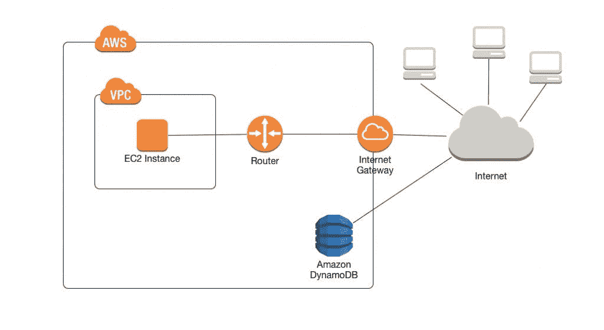

# 创造一个新的 VPC

本教程使用 VPC 创建向导之一来创建以下内容:

*   VPC
*   其中一个子网
*   互联网网关

使用 VPC 向导创建您的 VPC

*   在 console.aws.amazon.com/vpc[打开亚马逊 VPC 控制台](https://console.aws.amazon.com/vpc/)
*   在导航窗格中，单击 VPC 仪表板。如果您还没有任何 VPC 资源，请找到控制面板的您的虚拟私有云区域，然后单击开始创建 VPC。否则，单击启动 VPC 向导。
*   从 AWS 控制台选择 VPC 服务

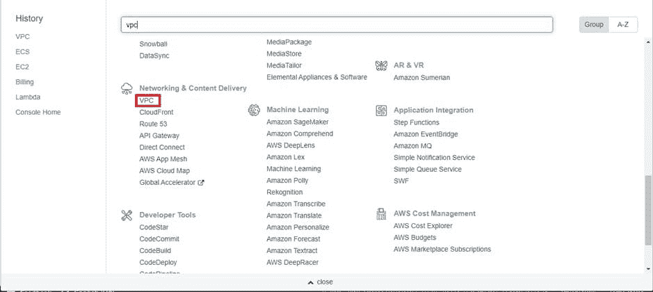

*   欢迎控制台将如下所示

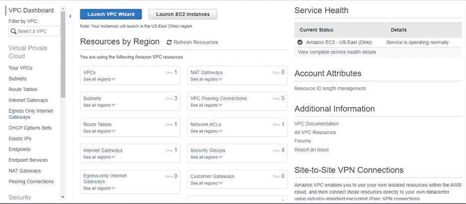

*   点击启动 VPC 向导

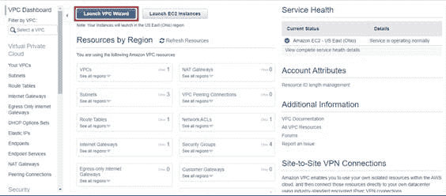

*   选择“带有公共和私有子网的 VPC ”,然后单击“选择”

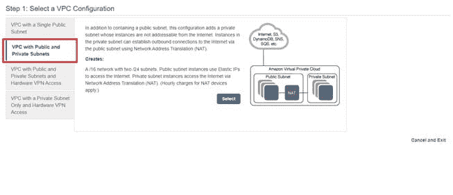

*   为公有和私有子网提供 VPC 名称和有效的 CIDR 范围。为公共和私有子网选择可用性区域[根据标准，公共和私有应该位于不同的可用性区域]。键入详细信息后，为 NAT 网关提供弹性 IP，单击“创建 VPC”

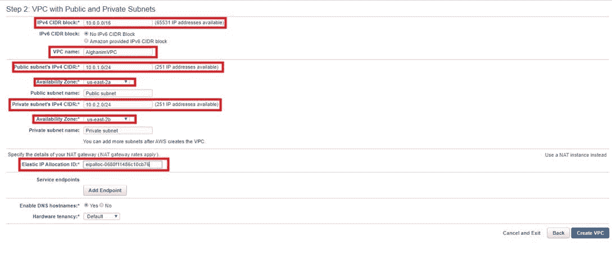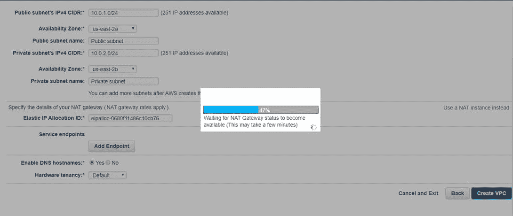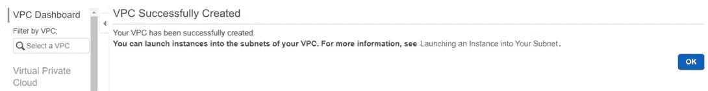

*   单击“确定”，列表将显示如下

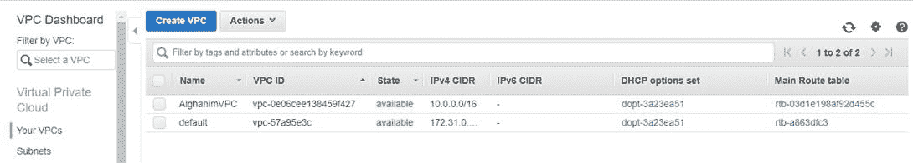

*   成功创建 VPC 后，将自动创建子网、路由表和 Internet 网关

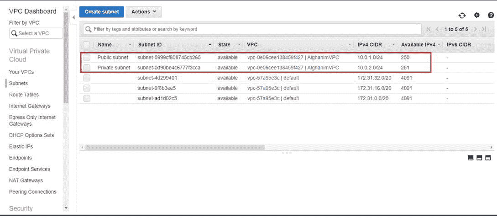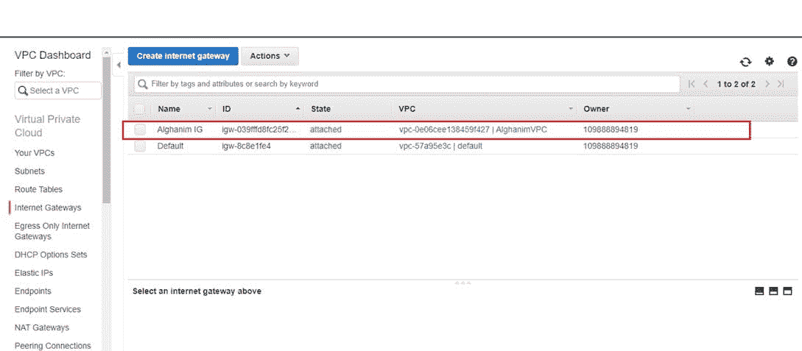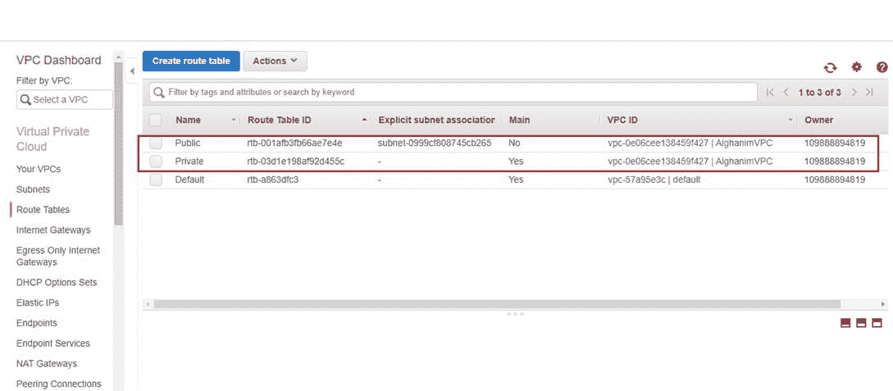

*   验证公共子网路由配置对公共访问开放。为了进行公共访问，CIDR 必须是 0.0.0.0/0，目标应该是 Internet 网关。每个 VPC 应该只有一个互联网网关。

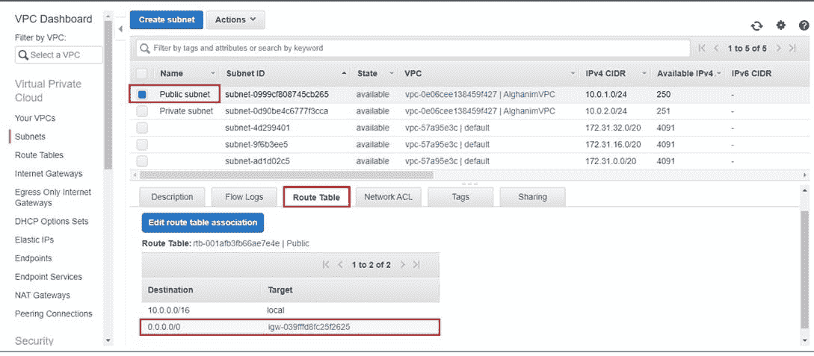

*   导航到“路由表”并关联公共子网->公共路由和私有子网->私有路由

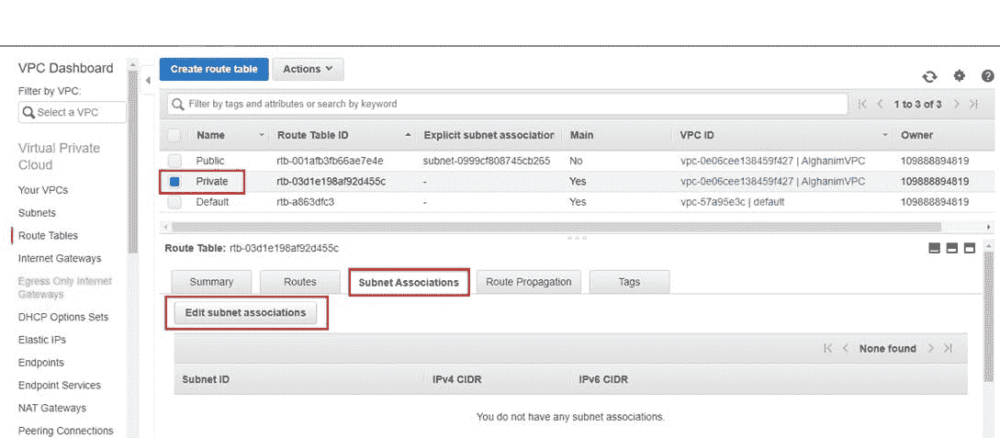

显示为“主”的路由表必须映射到专用子网

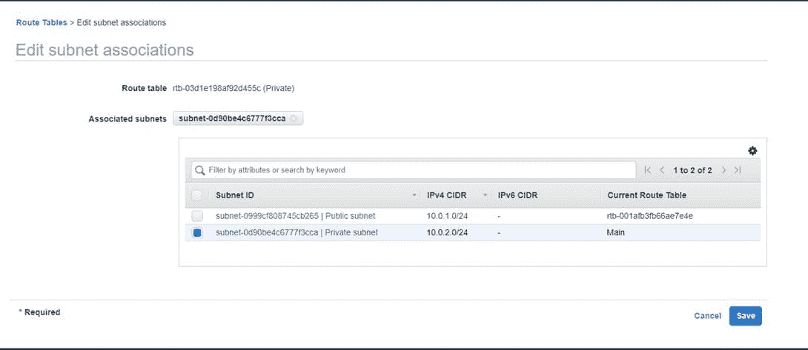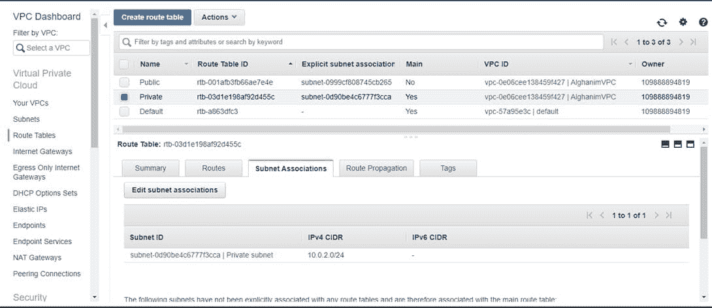

*   专用路由表路由配置配置了 NAT 网关，这有助于专用 EC2 仅通过出站流量访问互联网

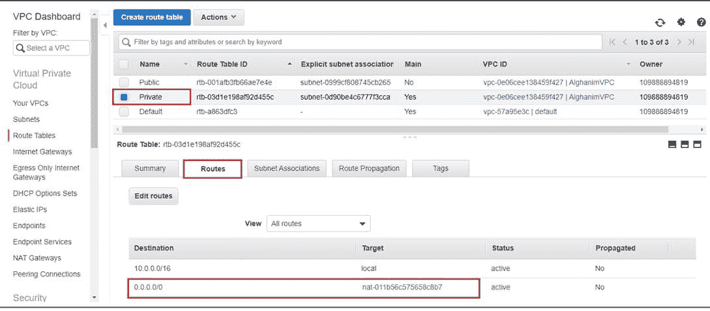

*   启用为公共子网自动分配 IP，以便为在公共子网中启动的实例分配公共 IP。这个 IP 仍然可以通过提供弹性 IP 来覆盖。

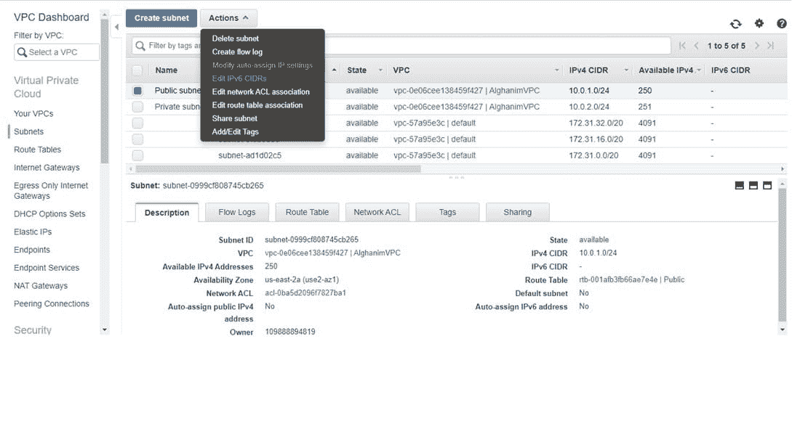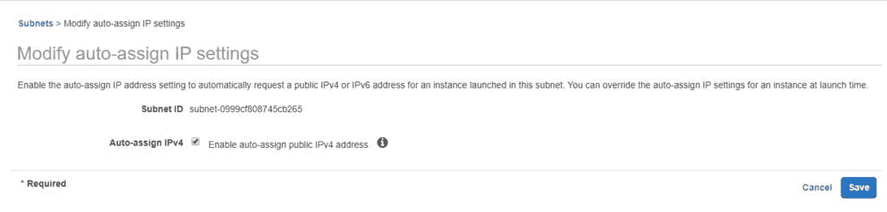

*感谢您的阅读，请喜欢这篇文章，它会鼓励我写更多这样的文章。请分享您的宝贵建议，感谢您的真诚反馈！！*