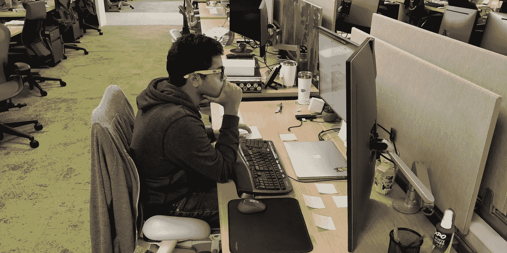

# 初学者成为 SWE 的指南

> 原文：<https://blog.devgenius.io/beginners-guide-to-being-a-swe-by-a-beginner-swe-869da35261c4?source=collection_archive---------0----------------------->

工作项目可能不是真实的

🍎我作为一名新毕业的软件工程师进入 Salesforce 已经四周了。这是非常令人兴奋的，但是你总是开始得很慢:等待访问系统、获得 git 的许可，以及设置你的开发环境，然后再从待办事项中修复小的 bug。以下是我在这里的 20 天里学到的一些东西。要么读书，要么去死。

## 你不会记得的

📗当你要向队友询问文件的路径、首字母缩略词的扩展，甚至是镇上最好的拉面地方时，带上笔记本。在任何情况下，你都不应该说，“没关系，我会记住的”。我发现自己做得太频繁了，不得不一遍又一遍地去找同一个人，因为我总是忘记事情。带一个笔记本去开会，记下你脑海中闪过的细节，稍后向你的导师或经理询问。如果你去参加一个两小时的会议，但什么也没写，这是完全没问题的，但是记得随身带一个笔记本。

## 彻底点

🙇🏻不管你在写什么(测试计划，文档，评论，或者在 Slack 上聊天)，你都应该把所有的东西都写下来。不要把任何事情留给想象中的“他们明白我的意思”的仙女。不要使用任何缩写，除非它们是通用的。

## 坚持一个水品牌

🚰每当你盯着冰箱的时候，想想你想要什么水，会让你花掉本可以用来编码的钱。还有，柚子 Bubly 真他妈恶心，应该烧掉。

## 走出你的舒适区。

😰Storytime:我团队的 PM 在 SF 工作，有一天拜访了我们在西雅图的团队。我没怎么和她说过话。一天，我们都工作到很晚，所以我想和她谈谈是个好主意，因为我们还没有机会好好谈谈。但是我害羞的屁股临阵退缩，什么也没说就走了。就在我要离开的时候，我意识到我应该鼓起勇气和她谈谈。我回到楼上，我们只谈了 5 分钟，但这 5 分钟对我来说意义重大:我觉得自己勇敢多了，也变得更好了。我决定更经常这样做。

走出你的舒适区只会带来好的事情。

## 傻一点。提问。

😬想问多少问题就问多少，因为你不知道你不知道的。总是询问反馈和期望。我并不是说你应该打扰你的经理，而是在你的一对一会谈中，就你的期望、进步和需要改进的地方进行交谈。

🏃‍♂️:最后，我建议你慢慢来，去跑马拉松。这只是你职业生涯的开始。乐在其中；它会在这里呆很长时间！