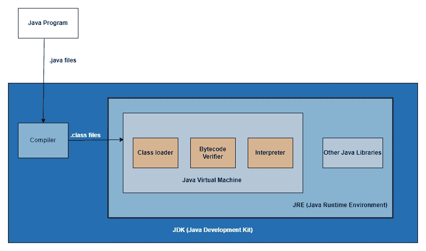
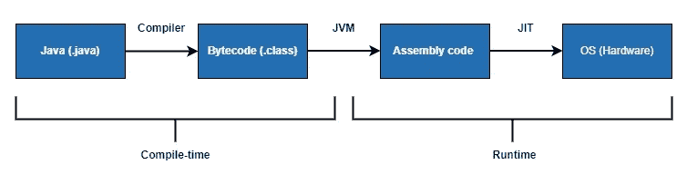
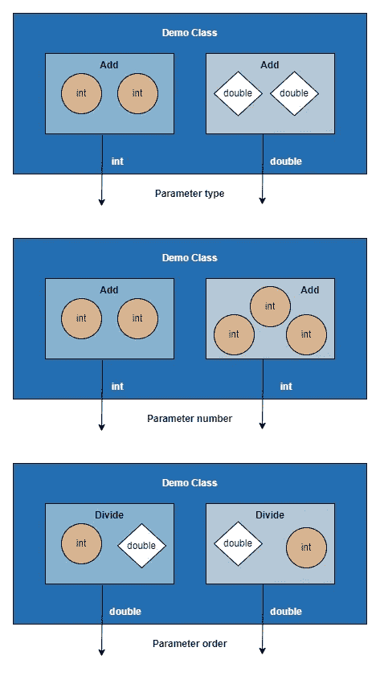
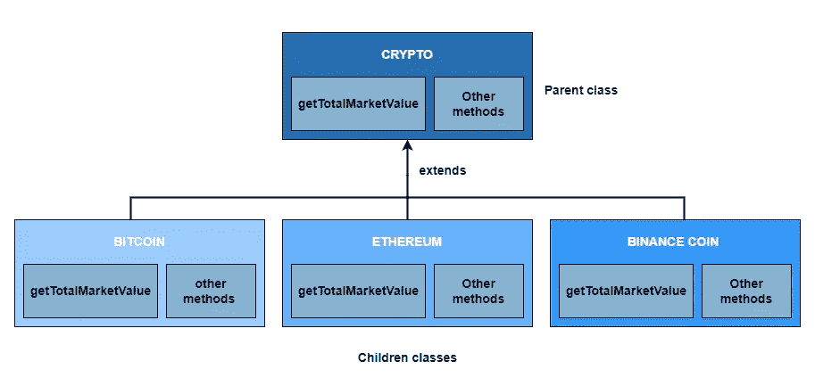

# 编译时和运行时多态性 101

> 原文：<https://blog.devgenius.io/beginners-guide-to-compile-time-and-runtime-polymorphism-in-java-72d197862778?source=collection_archive---------3----------------------->

本文将帮助您轻松理解编译时多态性和运行时多态性之间的区别。


由 [Aviv Rachmadian](https://unsplash.com/@avivrchmdn?utm_source=medium&utm_medium=referral) 在 [Unsplash](https://unsplash.com?utm_source=medium&utm_medium=referral) 上拍摄的照片

# 定义

`define: polymorphism`

**多边形+变形=多种形式**

> 多态是为不同类型的实体提供一个单一的接口，或者使用一个单一的符号来表示多个不同的类型。
> 
> 这个概念是从生物学的一个原理借用来的，即一个有机体或物种可以有许多不同的形式或阶段

# Java 程序生命周期

在讨论编译时和运行时多态之间的区别之前，让我们先了解一下什么是编译，什么是运行时。

众所周知，Java 是一种高级语言，我们以人类可读/可理解的格式编写程序，使用定义的语法和语义，遵循定义的规则和规定。但是机器只能理解 1 和 0。那么我们的程序是如何工作的呢？我们来了解一下。



JDK (Java 开发工具包)——粗糙的架构

1.  我们编写普通的高级 java 程序(例如 HelloWorld.java)
2.  然后我们必须运行`javac HelloWorld.java`将人类可读的代码编译成字节码(HelloWorld.class)
3.  字节码类似于机器码，但并不完全如此。因为有这么多不同的操作系统，如 Windows，Mac，Linux 等。)很难为每个 OS 生成机器码。因此，我们的编译器生成的字节码被提供给一个虚拟机，它是驻留在 JRE (Java 运行时环境)中的 JVM (Java 虚拟机)。
4.  JVM 最终解释字节码，并将其解释给底层操作系统。



解释编译时和运行时的流程图

1.  **编译期**:当高级 java 程序正在被转换成字节码(。java - >。类)。在这个过程中，编译器检查代码的语法、语义和类型。
2.  **运行时**:机器代码执行时。

# 编译时和运行时多态性

现在我们对 java 程序的生命周期以及编译和运行时的区别有了一个基本的概念。让我们深入探讨编译时和运行时多态性的主题。

## 编译时多态性

> 又称**静态多态**。这种类型的多态性只能由编译器解决。我们甚至在运行之前就知道哪些代码块将被执行。

在一个类中，可以有几个方法共享相同的名称，但在

1.  参数类型
2.  参数数量
3.  方法中声明的参数的顺序

这个概念叫做**方法重载**。在这种情况下，在编译时，根据参数类型、参数数量或参数顺序，编译器决定调用哪个方法。

**此处需要注意的重要事项。**

> 重载方法可能有也可能没有不同的返回类型。但是返回类型本身不足以让编译器在运行时确定要执行哪个方法。

**举例**



编译时多态性示例

```
public class CompileTimeDemo
{
  public static void main(String[] args)
  {
    int result1 = sum(1, 2);
    double result2 = sum(2.5, 3.6);
    int result3 = sum(1, 2, 3);
    double result4 = div(10, 2.5);
    double result5 = div(9.75, 2); System.out.println("CASE 1 - Parameter type" + 
        " result1: " + result1 + 
        " result2: " + result2
    ); System.out.println("CASE 2 - Number of parameters" + 
        " result1: " + result1 + 
        " result3: " + result3
    ); System.out.println("CASE 3 -" + 
       " Order of the parameters declared in the method" + 
       " result4: " + result4 + 
       " result5: " + result5
    );
  } // sum for two integer
  public static int sum(int n1, int n2)
  {
    return n1 + n2;
  }

  // sum for two double
  public static double sum(double n1, double n2)
  {
    return n1 + n2;
  }

  // sum for three integer
  public static int sum(int n1, int n2, int n3)
  {
    return n1 + n2 + n3;
  }

  // division for two, order (int, double)
  public static double div(int n1, double n2) {
    return n1 / n2;
  }

  // division for two, order (double, int)
  public static double div(double n1, int n2) {
    return n1 / n2;
  }}
```

在这个例子中，我们可以看到方法重载的所有三种情况。

## 运行时多态性

> 又称**动态多态**。这种类型的多态性在运行时得到动态解析。即使在编译之后，我们也不知道哪些代码块将被执行。

当一个子类提供了一个已经存在于它的父类中的方法的特定定义，那么我们称这个概念为**方法覆盖**。

**此处需要注意的重要事项。**

> 它必须具有相同的名称、相同的参数(类型、长度和顺序)和相同的返回类型
> 
> 它不能重写声明为 final 或 static 的方法
> 
> 它不能有更严格的访问修饰符。
> 
> 它可能有一个限制较少的访问修饰符。
> 
> 它必须*而不是*抛出一个新的或更广泛的检查异常。
> 
> 它可能抛出更窄、更少或没有检查的异常。
> 
> 重写方法可以引发任何未检查的异常，不管重写方法是否声明了该异常。

**示例**



运行时多态性示例

```
class Crypto{  
 double getTotalMarketValue(){return 0;}  
}class Bitcoin extends Crypto{  
 double getTotalMarketValue(){return 826;}  
}class Ethereum extends Crypto{  
 double getTotalMarketValue(){return 390;}  
}class BinanceCoin extends Crypto{  
 double getTotalMarketValue(){return 79.5;}  
}class RunTimeDemo {  
 public static void main(String args[]){  
    Crypto crypto;  
    crypto = new Bitcoin();  
    System.out.println(
        "Bitcoin Total market value in (Billion $): " + 
        crypto.getTotalMarketValue()
    ); 

    crypto = new Ethereum();  
    System.out.println(
        "Ethereum Total market value in (Billion $): " + 
        crypto.getTotalMarketValue()
    ); 

    crypto = new BinanceCoin();  
    System.out.println(
        "BinanceCoin Total market value in (Billion $): " + 
        crypto.getTotalMarketValue()
    );  
 }  
}
```

在这个例子中，我们可以看到所有的子类，如比特币、以太坊等。正在扩展加密类，然后覆盖`getTotalMarketValue()`方法。

如果你想了解更多，请浏览这些文档:

1.  [http://www.eeng.dcu.ie/~ee553/ee402notes/html/ch04s02.html](http://www.eeng.dcu.ie/~ee553/ee402notes/html/ch04s02.html)
2.  [https://www.baeldung.com/cs/runtime-vs-compile-time](https://www.baeldung.com/cs/runtime-vs-compile-time)
3.  [https://www . freecodecamp . org/news/polymorphism-in-Java-tutorial-with-object-oriented-programming-example-code/](https://www.freecodecamp.org/news/polymorphism-in-java-tutorial-with-object-oriented-programming-example-code/)