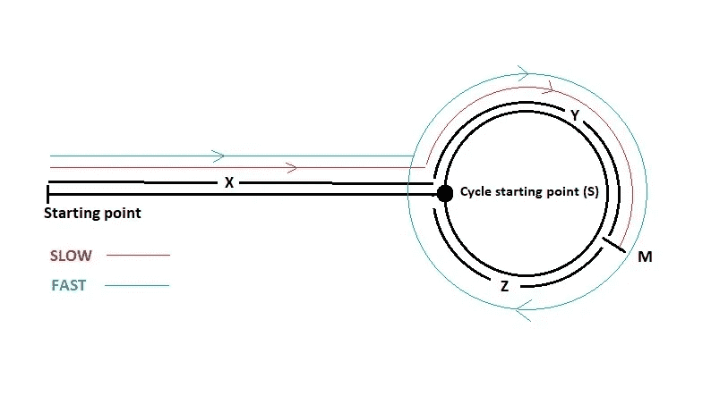

# 使用弗洛伊德算法的循环检测

> 原文：<https://blog.devgenius.io/beginners-guide-to-cycle-detection-in-linked-list-ca610f8a7980?source=collection_archive---------8----------------------->

本文是数据结构与算法系列的一部分。在这个系列中，我将尝试详细解释重要而棘手的数据结构和算法主题。

在本文中，我将讨论三个臭名昭著的链表问题

1.  循环检测
2.  如果循环存在，则寻找循环的起点
3.  如果循环存在，求循环的长度

用 [**弗洛伊德的周期寻找算法**](https://en.wikipedia.org/wiki/Cycle_detection) 通俗易懂。

在浪费我们的时间之前，让我们直接开始吧。



链表循环表示法。(图片由作者提供)

为了便于理解，在本文的其余部分，我们将参考这张图片。

# 问题 1:周期检测

第一个问题很简单。假设我们有一只兔子和一只乌龟，兔子的速度是乌龟的两倍。现在两人都从**起点**开始比赛。

> 考虑到这一点。如果赛道上有一个循环，那么没有人会完成比赛，他们会继续跑下去，对吗？如果他们继续以不同的速度奔跑，他们一定会相遇，我们会发现有一个以可怜的兔子和野兔为代价的循环😅

现在，让我们为上述情况编写算法。

```
public class Solution {
    public boolean detectCycle(ListNode head) {
        // If the track is of 0 length or,
        // if the track is of length 1,
        // it obviously means there is no cycle
        if (null == head ||  null == head.next) return false;

        // Slow pointer is our tortoise
        ListNode slow = head;

        // Fast pointer is our rabbit
        ListNode fast = head;

        // Rabbit and tortoise will keep running
        // until they meet or rabbit finishes the race.
        // We are only checking for rabbit as it is twice faster
        while (fast != null && fast.next != null) {
            slow = slow.next;
            fast = fast.next.next;
            if (slow == fast) break;
        }

        // If rabbit and tortoise are at the same position
        // that means the cycle exist, otherwise it doesn't
        if (slow != fast) return false;
    }
}
```

# 问题 2:寻找循环的起点

从上一个问题中，我们知道了如何用兔子来求循环。我们知道，如果有一个循环，那么他们会在循环中的某处相遇，在位置 **M** 。

让我们把我们所知道的一切都用方程式来表示。(为便于理解，请参考图片)

```
Length of the cycle = NTortoise distance covered = X + YRabbit distance covered = X + k x N + Y (Where k is the number of repetition)Rabbit distance covered = 2 x Tortoise distance covered (As Rabbit is twice faster than Tortoise)X + k x N + Y = 2 x (X + Y)=> X = k x N - Y=> X = (k - 1) x N + N - Y=> X = (k - 1) x N + Z  (Since N = Y + Z)=> Z = X % N  (% is modulo operator)
```

从上面的等式中，我们得到了`X = (k — 1)N + Z`或`Z = X modulo N` ，其中`k`是兔子在遇到乌龟之前重复跑的次数。因此，如果我们将第一只乌龟保持在 **M** 处，并将第二只乌龟带到**起始位置**处，然后让第一只乌龟和第二只乌龟都跑，它们肯定会在循环的起始位置**s**处相遇

现在，让我们为上述情况编写算法。

```
public class Solution {
    public ListNode detectCycle(ListNode head) {
        // If the track is of 0 length or
        // if the track is of length 1,
        // it obviously means there is no cycle
        if (null == head ||  null == head.next) return null;

        // Slow pointer is our tortoise
        ListNode slow = head;

        // Fast pointer is our rabbit
        ListNode fast = head;

        // Rabbit and tortoise will keep running
        // until they meet or rabbit finishes the race.
        // We are only checking for rabbit as it twice faster
        while (fast != null && fast.next != null) {
            slow = slow.next;
            fast = fast.next.next;
            if (slow == fast) break;
        }

        // If rabbit and tortoise are at the same position
        // that means the cycle exist, otherwise it doesn't
        if (slow != fast) return null;

        // This is the second tortoise pointer,
        // and we put it to the starting position
        Listnode slow2 = head;

        // Both tortoise will keep running until they meet
        while (slow != slow2) {
            slow = slow.next;
            slow2 = slow2.next;
        }

        // Then we can return the first or second tortoise pointer
        return slow;
    }
}
```

# 问题 3:寻找周期的长度

从前面两个问题我们知道如何检测一个循环，也知道如何找到循环的起点。

```
N = Y + Z 
```

我们记得兔子在 M，两只乌龟在 s。

```
Y = distance between S -> M
Z = distance between M -> S
```

所以，在这种情况下，第二只乌龟可以计算两个距离。

1.  首先，它将从现在的位置(S)出发，与(M)处的兔子相遇，从而找到 y。
2.  然后它会从(M)回到第一只乌龟的位置(S ),在这个过程中它会找到 z。

现在，让我们为上述情况编写算法。

```
public class Solution {
    public int detectCycle(ListNode head) {
        // If the track is of 0 length or
        // if the track is of length 1,
        // it obviously means there is no cycle
        if (null == head ||  null == head.next) return 0;

        // Slow pointer is our tortoise
        ListNode slow = head;

        // Fast pointer is our rabbit
        ListNode fast = head;

        // Rabbit and tortoise will keep running
        // until they meet or rabbit finishes the race.
        // We are only checking for rabbit as it twice faster
        while (fast != null && fast.next != null) {
            slow = slow.next;
            fast = fast.next.next;
            if (slow == fast) break;
        }

        // If rabbit and tortoise are at the same position
        // that means the cycle exist, otherwise it doesn't
        if (slow != fast) return 0;

        // This is the second tortoise pointer,
        // and we put it to the starting position
        Listnode slow2 = head;

        // Both tortoise will keep running until they meet
        while (slow != slow2) {
            slow = slow.next;
            slow2 = slow2.next;
        }

        // y and z is represeting distance Y and Z respectively
        int y = 0, z = 0;

        // Second tortoise is running from point S to M
        // and in that process it will find Y
        while (slow2 != rabbit) {
            slow2 = slow2.next;
            y++;
        }

        // After that seconnd tortoise will run from M to S
        // and in that process it will find Z
        while (slow2 != slow) {
            slow2 = slow2.next;
            z++;
        }

        // Then we can return sum of Y + Z which will be N
        return y+z;
    }
}
```

现在我们知道如何检测一个循环，找到循环的起点，找到循环的长度。