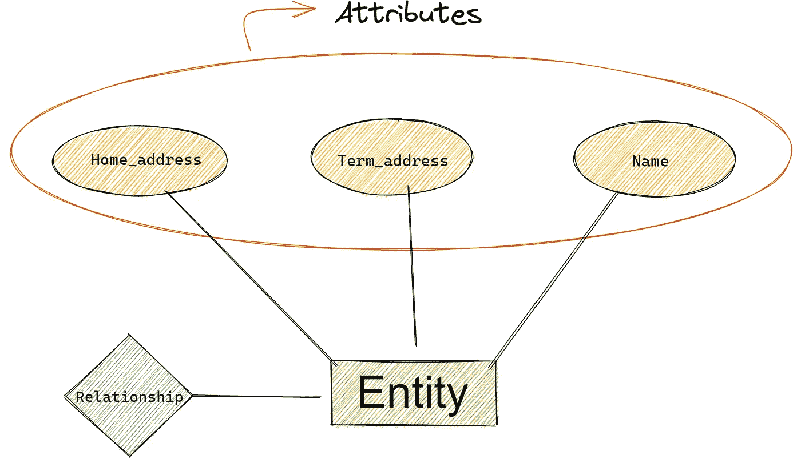
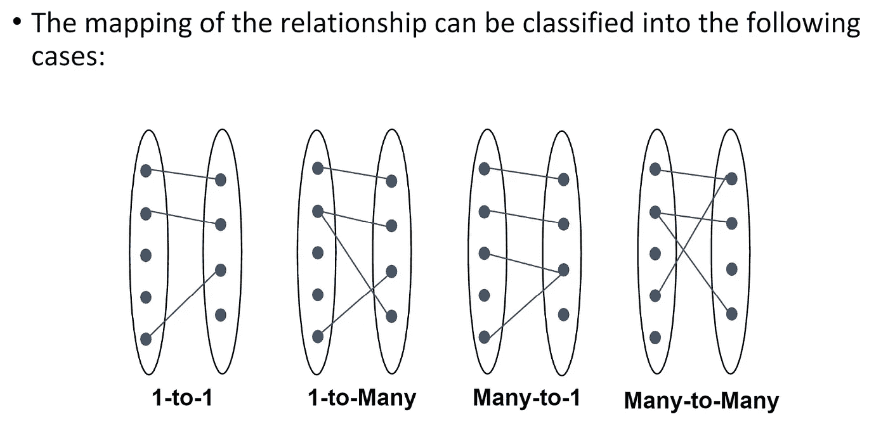
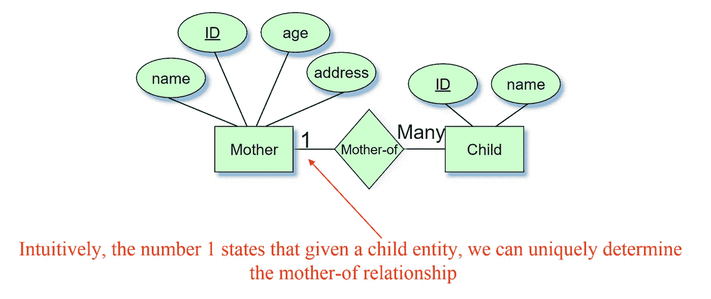
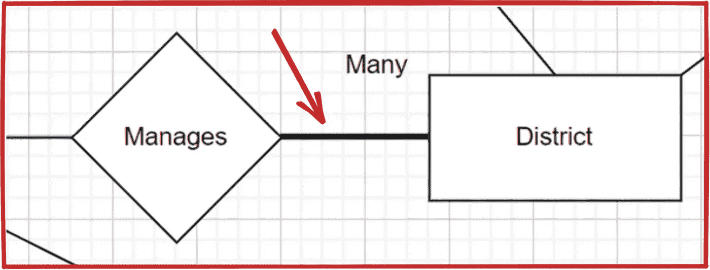
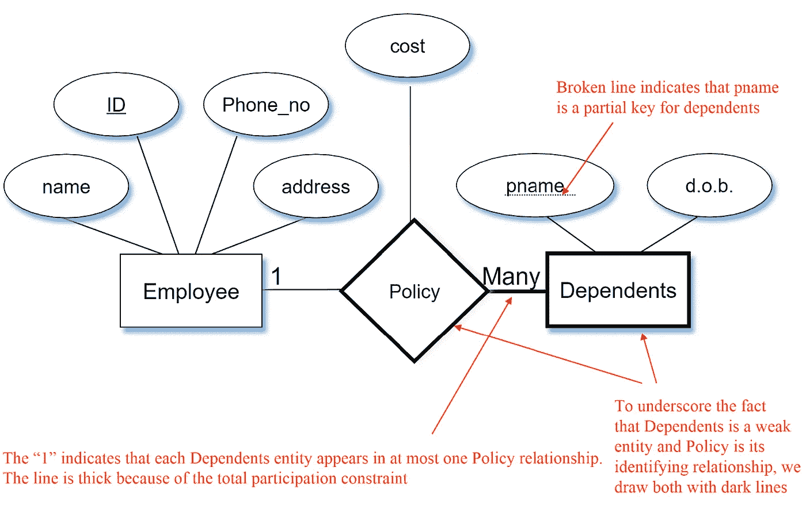
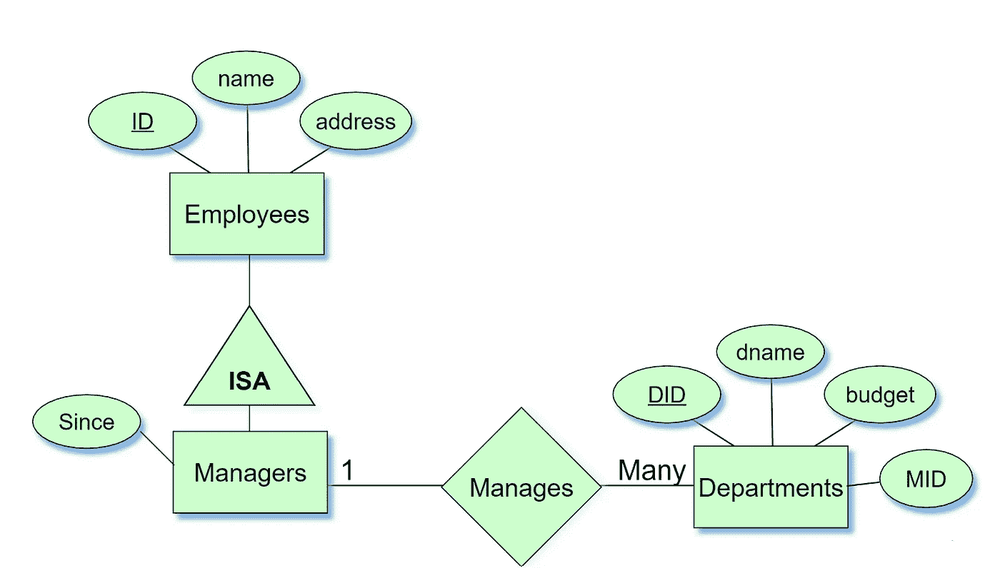
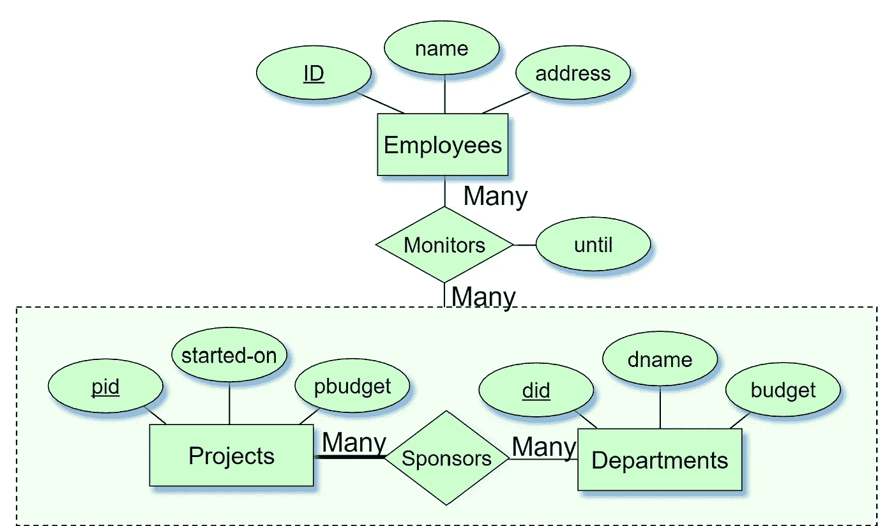

# 实体关系图初学者指南(ERD)

> 原文：<https://blog.devgenius.io/beginners-guide-to-entity-relationship-diagrams-erd-1fe8d083e32e?source=collection_archive---------8----------------------->

这篇文章解释了 ER 图和关系模型的基础。在开始之前，了解一些基本术语很重要:

## 属性和实体:

一个实体就像一个对象的类别或类型，而一个属性是关于该对象的一条特定信息。在数据库中，实体可以用表来表示，属性可以用表中的列来表示。在实体关系(ER)图中，实体用矩形表示，属性用椭圆形表示，它们之间的线条显示了实体之间的关系。ER 图用于可视化和组织数据库中实体之间的关系。

> *例如，在一所大学的数据库中，* `Student` e *实体可能具有诸如* `Student ID、` Name、`*和` major . `*` T7 . ` Course `*实体可能具有诸如`* Course ID、` ` Course Name、`*和* `Credits 等属性**

为了帮助理解这一点，我制作了这个简单的图表:



## 数据库中的关键字:

关键字是唯一标识记录的字段或字段组合。数据库中可以使用几种类型的键，包括:

1.  **主键**:唯一标识表中每条记录的字段(或字段组合)。主键不能包含空值，并且在表中的所有记录中必须是唯一的。在图表中，主键总是带下划线。
2.  **候选关键字**:也称为**超级关键字**是一个字段(或字段组合)，可以用作表的主键。一个表可以有多个候选键，但只能有一个被指定为主键。
3.  **外键**:外键是一个表中引用另一个表中主键的字段。外键用于建立表之间的关系。
4.  **组合键**:组合键是由两个或多个字段组成的主键。每个字段本身必须是唯一的，但是在组合时，字段组合在表中的所有记录中必须是唯一的。

键是数据库设计的重要组成部分，因为它们有助于确保数据库中数据的完整性和准确性。它们还有助于建立表之间的关系，并确保可以有效地检索和使用数据。

## 关系类型(映射):

关系是两个实体之间的连接，必须在没有任何进一步描述的情况下进行识别。

*(查看三元关系了解更多信息)*



*   **一对一关系**:当一个表中的一条记录只与另一个表中的一条记录相关时出现。例如，雇员表可能与包含雇员福利信息的表有一对一的关系。每个雇员在福利表中都有一个唯一的记录，福利表中的每个记录都对应一个雇员。
*   **一对多关系**:当一个表中的一条记录与另一个表中的多条记录相关时出现。例如，一个*`母亲`*表可能与一个*`子女`*表有一对多的关系。每个母亲在`*母亲`*表中都有一个唯一的记录(因为一个孩子只能有一个亲生母亲)，但是多个孩子可能来自同一个母亲。

下面是该示例的示意图:



*   **多对一关系**:基本上与一对一相同——多对一只是另一个，除了它被交换了。
*   **多对多关系**:当一个表中的多条记录与另一个表中的多条记录相关时出现。例如，“学生”表可能与“课程”表有多对多关系。每个学生可以注册多门课程，每门课程可以有多个学生注册。

## **参与:**

**总参与度**:实体集中的每个实体必须至少参与一个关系。所有的书都将被借走。
**部分参与**:实体集中的实体不可以参与
关系。并非所有的图书馆成员都会借书

如果一个实体集合在一个关系中的参与是完全的，那么它们在 E-R 图中由一条粗线连接。就像这样:



## 弱实体集

缺少足够的属性来构成主键！
弱实体只能通过考虑另一个(所有者)实体的主键来唯一识别



pname =策略名称

**强实体集:**有足够的属性构成主键

## 我们可以针对 ISA 层次结构指定两种约束:

**(遗传-亚型-关联)**

*   **重叠约束**:决定是否允许两个子类包含同一个实体，即一条记录只能属于一个子类。
    例如，一名员工是否可以既是“小时工”又是“合同工”？
    **覆盖约束**:判断子类中的实体是否全部包含超类中的所有实体，即父实体中的每条记录都必须属于一个子类。
    例如，是否每个雇员实体都必须是“小时雇员”或“合同雇员”?

图表示例:



该 ID 只能是经理访问雇用数据的 ID。

重叠约束:

```
Contract_Emps OVERLAPS Senior_Emps
```

覆盖约束:

```
Subclass1 AND Subclass2 COVER Superclass
```

## **聚合**

当实体集不直接参与一个关系时，他们只是关注它们。

*   通过虚线框标识
*   它允许我们将关系集视为参与另一个关系的实体集。

赞助一个项目的部门可能会指派员工监督赞助情况



## 属性还是实体？

1.如果我们每个雇员有几个地址，地址必须是一个实体(属性不能是集值的)
2。如果结构(城市、街道等。)很重要，
*例如，想要检索给定城市中的雇员，必须将地址建模为实体(属性值是原子的)

*房屋号码甚至可以是一个实体。*

# 最后的话:

你现在已经准备好开始练习你的呃图了。实体与属性、实体与关系、二元或多元关系、是否使用 ISA 层次结构以及是否使用聚合。这些都是你需要努力去做的事情，这样你才能对自己创建 er 图的能力充满信心。更多关于这个主题的文章将很快发表。

> 祝你好运！