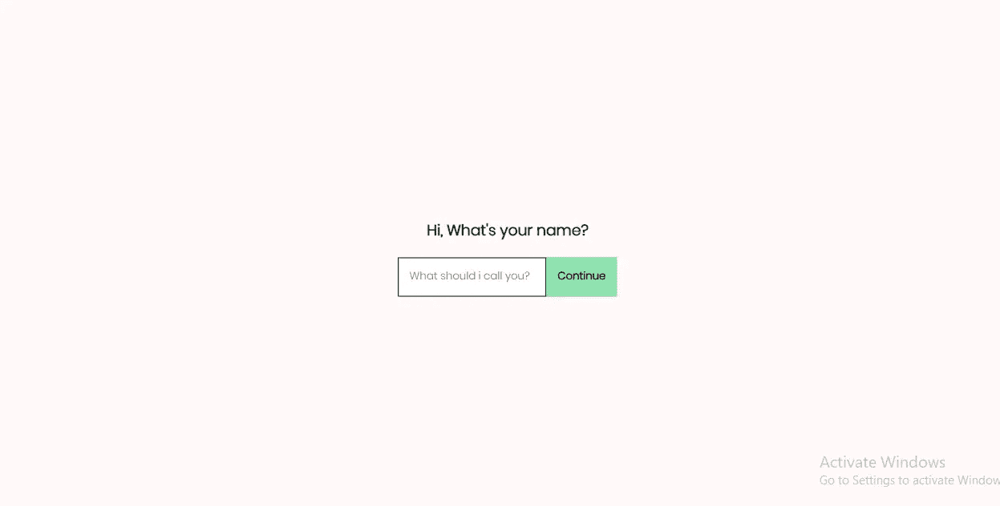
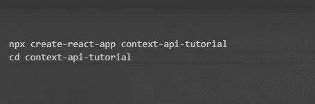
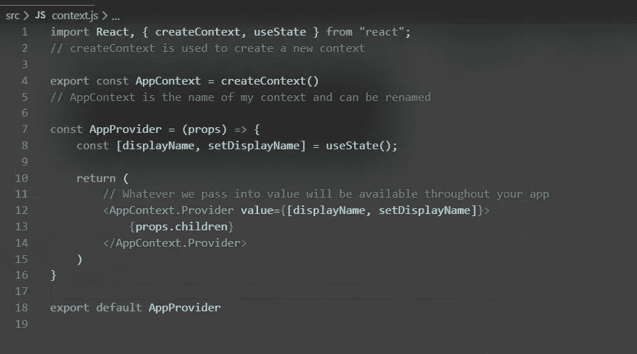
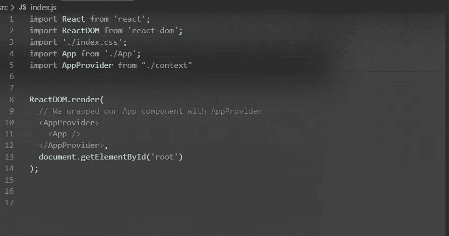
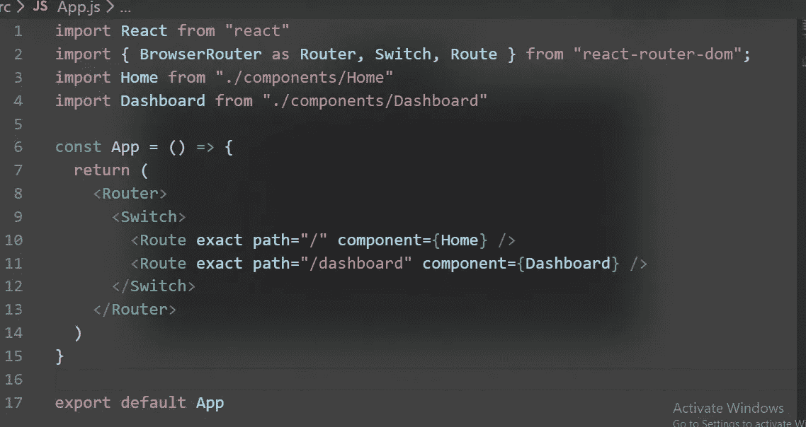
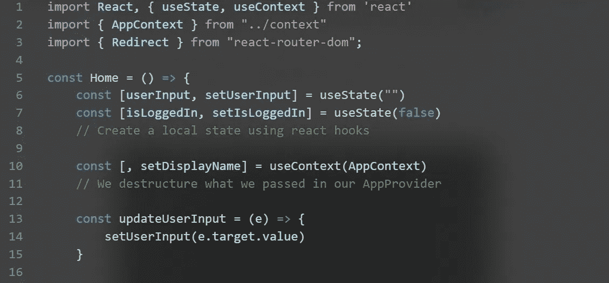
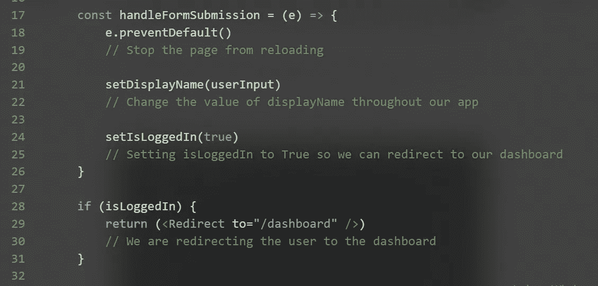
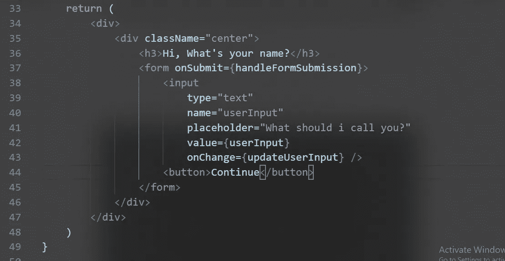
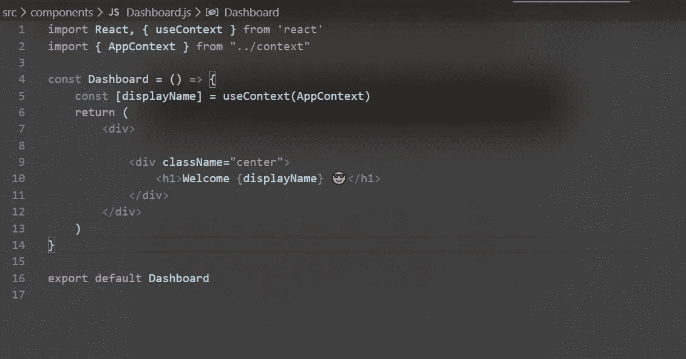

# React 的上下文 API 初学者指南

> 原文：<https://blog.devgenius.io/beginners-guide-to-reacts-context-api-d2fafc89404f?source=collection_archive---------1----------------------->

免责声明:本指南适用于任何想学习 React 中的状态管理的人，或者任何想从 redux 过渡到更简单选项的人。

话虽如此，让我们继续前进。

## **这是我们将要建造的**

你可以在我的 github [回购上找到源代码。](https://github.com/HarcourtHamsa/context-api-tutorial)

## 先决条件:

1.  反应钩。
2.  react-router-dom(用于 react 中的基本路由)
3.  结节
4.  反应

我假设您已经安装了所有这些软件，并且知道它们是如何工作的。如果你不知道，请去上一两堂课，然后再回来。

## 入门指南

我假设你的电脑里已经安装了 React、Node 和 NPM。让我们从创建 react 应用程序开始。运行以下命令。

我们刚刚在一个名为 context-api-tutorial 的目录中创建了一个 react 应用程序，并进入了这个目录。

接下来，在你最喜欢的文本编辑器中打开你的 react 应用。我将使用 VSCode。

在您的 *src* 文件夹中创建一个名为 *context.js* 的文件。

src/上下文. js

这就是上面发生的事情。我们从 React 导入 *createContext* 。 *createContext* 你猜对了，它被用来创建一个上下文，我把我的上下文命名为 AppContext*但是你也可以把你的上下文命名为其他的。我们创建一个名为 *AppProvider* 的功能组件，它返回 *AppContext.Provider。提供者*和*提供者是同一个东西，它接受一个价值道具。*我们传递到价值主张中的任何内容都将在我们的应用程序中可用*。*如果你熟悉 *react 钩子，*你就已经知道代码的另一部分了。*

接下来，我们进入我们的 *index.js* 文件，并进行以下更改。

索引. js

这里，我们只导入了我们的 *AppProvider* 并将其包装在我们的应用程序中。就像我之前说的，这使得我们的*值*在我们的应用程序中可用。

接下来，打开 App.js 文件，进行以下更改。

App.js

在这里，我正在为我的 react 应用程序创建基本路线。如果你不知道这是怎么回事，请参加 react 路由教程。

接下来，创建一个名为 *components* 的目录来存储我们所有的应用组件。我们的应用程序将只有两个组件；**归位**和**仪表盘**。在我们的组件文件夹中，创建一个名为 *Home.js* 的文件，并粘贴以下代码。

我知道你现在的感受。相信我，我知道。给我一点时间

解释这是怎么回事。我们从 react 导入了 *useContext。useContext* 基本上告诉 react 我们想要使用的上下文。对我们来说，那将是 *AppContext* 。然后，我们析构我们传递到我们的值 props 中的内容(它被传递到 *AppProvider* )。从用户那里获得输入后，我们用 setDisplayName 设置 displayName 的状态。然后，我们可以在应用程序的任何地方使用 display。

最后，我们在组件目录中创建一个 Dashboard.js 文件，并粘贴以下代码。

src/组件/Dashboard.js

到目前为止，我相信您已经掌握了这里发生的事情。如果没有，我们告诉 react 我们想要使用什么上下文(使用 *useContext* )。我们从 AppContext 中析构 displayName，因为这是我们所需要的。最后，我们显示 displayName 的结果。

# 包裹

这个例子相当简单，我希望你能够理解如何使用上下文 API 在 React 中处理状态。

别忘了自己尝试新的例子。

快乐编码:)