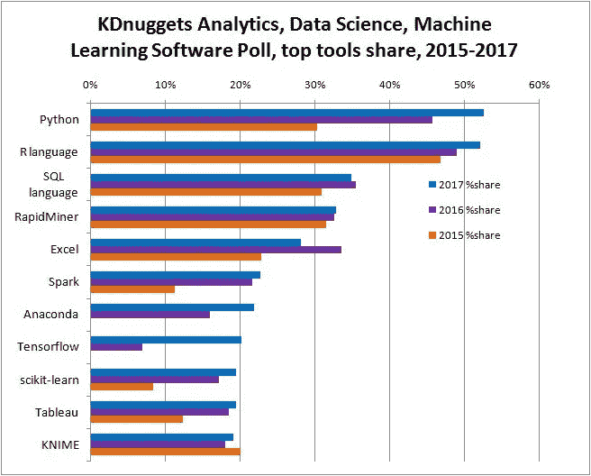
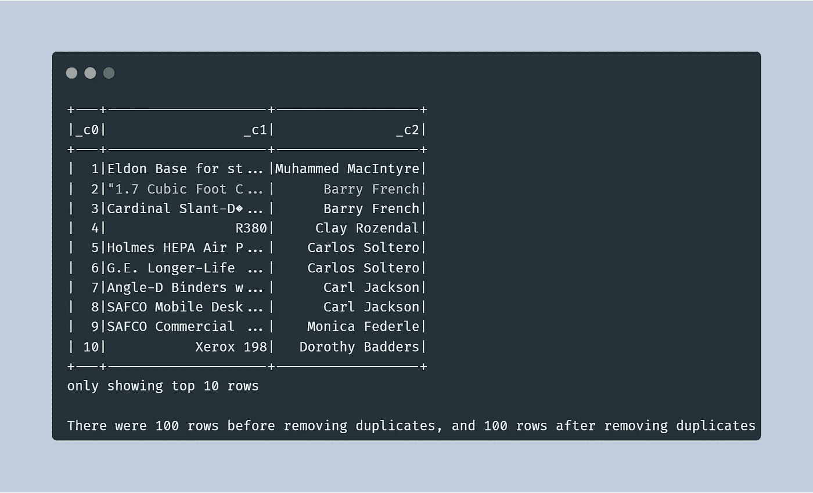
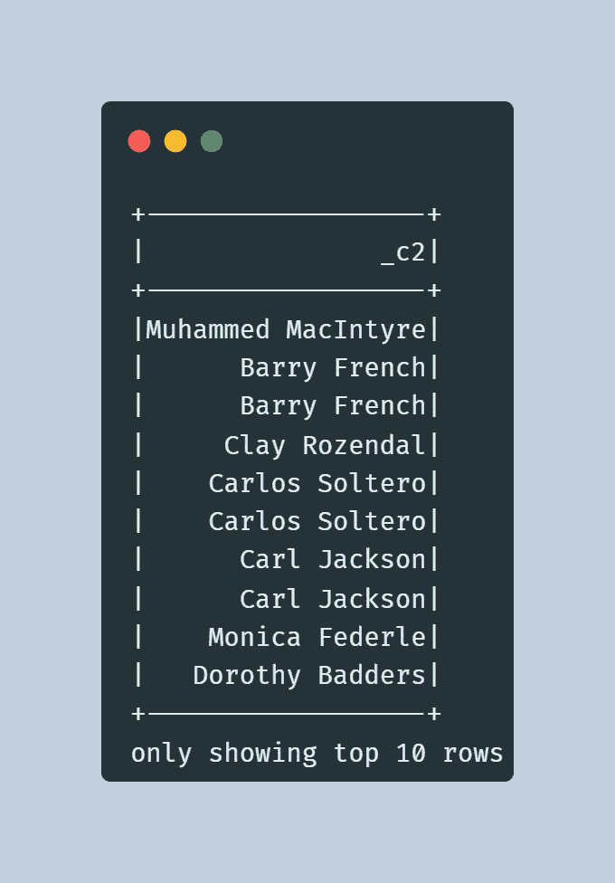
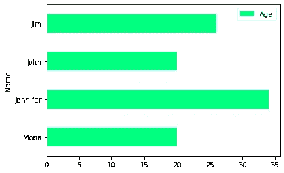

# PySpark 大数据初学者入门

> 原文：<https://blog.devgenius.io/beginners-introduction-to-big-data-in-pyspark-9931d919521c?source=collection_archive---------6----------------------->


帕斯卡尔·德布鲁纳在 [Unsplash](https://unsplash.com/?utm_source=unsplash&utm_medium=referral&utm_content=creditCopyText) 上的照片

在这篇博客中，我们将深入探讨 PySpark 大数据基础知识。Python 一直是最流行的编程语言之一，因此集成 Python 和 Spark 只是一个好主意。它具有处理大数据的优势和 Python 的易解释性。



## 配置

PySpark 可以在许多不同的平台上运行，对初学者来说最方便的是 Google colab。在 colab 中安装 PySpark 最简单的方法是

```
!pip install pyspark
```

# Spark 大数据分析简介

# 什么是大数据？

根据维基百科的说法，大数据是一个术语，用于指对传统数据处理软件来说过于复杂的数据集的研究和应用。

**大数据的 3 个 V**

1.  卷—指数据的大小
2.  多样性—指收集/生成数据的不同来源和格式
3.  速度—指生成数据的速度

**术语**

1.  集群计算——汇集多台机器的资源来完成作业
2.  并行处理—许多计算同时进行的处理
3.  分布式计算——并行运行作业的网络计算机(又名节点)的集合
4.  批处理—指的是将数据分成更小的部分，并在单独的机器上运行每个部分
5.  实时处理—意味着必须立即处理数据

**了解大数据处理系统**

Hadoop 用于处理大数据。它是解决大数据问题的框架。它的工作原理是数据局部性，这意味着数据在保存的地方被处理。

Hadoop 的核心组件

1.  HDFS —用于分布式文件存储
2.  MapReduce——用于分布式处理(在许多地方使用 PySpark 代替 MapReduce——请进一步阅读)
3.  纱线——资源管理

**Apache Spark 的特性**

1.  它是一个分布式集群计算框架，这意味着它跨多个集群分布数据和计算
2.  Spark 的计算发生在内存中，这使得它对于大型数据集来说很快
3.  Spark 可以提供比内存运行快 100 倍的计算速度
4.  Spark 是用 Scala 编写的，但是支持 Python、Java、R 和 SQL

**火花的成分**

1.  spark 核心—包含 spark 的基本功能
2.  spark SQL——用于处理 python、java 和 Scala 中的结构化和半结构化数据的库
3.  MLib——通用机器学习算法库
4.  GraphX —操纵图形并执行并行图形计算
5.  Spark Streaming —用于实时数据的可扩展、高吞吐量(吞吐量是对系统在给定时间内可以处理多少信息单元的衡量)库

# PySpark

Apache Spark 最初是用 Scala 编写的。为了支持 Python 实现，开发了 PySpark

**火花壳**

1.  运行 Spark 作业的交互式环境
2.  有助于交互式原型制作
3.  Spark 允许在各种机器上运行进程，并自动负责分发进程
4.  PySpark shell 是 Python 语言中的 Spark shell

**星火语境**

1.  Spark 上下文是与 sparks 功能交互的入口点
2.  入口点是连接 Spark 集群的一种方式
3.  PySpark 有一个名为“sc”的默认 Spark 上下文

```
 # creating a spark context
from pyspark import SparkContext
sc = SparkContext("local", "Simple App")

# Print the version of SparkContext
print("The version of Spark Context in the PySpark shell is", sc.version)

# Print the Python version of SparkContext
print("The Python version of Spark Context in the PySpark shell is", sc.pythonVer)

# Print the master of SparkContext
print("The master of Spark Context in the PySpark shell is", sc.master)
```

# PySpark 的 RDD 的编程

# 用 RDD 氏提取数据

**什么是 RDD**

1.  RDD 代表弹性分布式数据集
2.  它是一个不可变的分布式对象集合
3.  它是分布在集群中的数据集合
4.  Spark 中的基本数据类型

**RDD 的结构**

1.  弹性—承受失败的能力
2.  分布式—意味着将作业跨越群集中的多个节点，以实现高效计算
3.  数据集—分区数据的集合

**创建 rdd**

1.  并行处理现有的对象集合
2.  外部数据集和文本文件方法
3.  从现有 rdd

```
filename = '/content/sample1.txt'
rdd = sc.textFile(filename)
```

**py spark 中的分区**

1.  分区是大型分布式数据集的逻辑划分

```
# Print the file_path
print("The file_path is", file_path)

# Create a fileRDD from file_path
fileRDD = sc.textFile(file_path)

# Check the type of fileRDD
print("The file type of fileRDD is", type(fileRDD))

# Check the number of partitions in fileRDD
print("Number of partitions in fileRDD is", fileRDD.getNumPartitions())

# Create a fileRDD_part from file_path with 5 partitions
fileRDD_part = sc.textFile(file_path, minPartitions = 5)

# Check the number of partitions in fileRDD_part
print("Number of partitions in fileRDD_part is", fileRDD_part.getNumPartitions())
```

# 基本 RDD 变换和行动

**py spark 操作概述**

1.  转换创建新的 rdd
2.  转换遵循惰性求值，这意味着 Spark 会根据您在 RDD 上执行的所有操作创建一个图，并且只有在 RDD 上执行某个操作时，才会开始执行图
3.  基本的 RDD 变换

> map()-将函数应用于 RDD 中的所有元素
> 
> filter()-返回 RDD 中满足条件的元素
> 
> flat map()-为原始 RDD 中的每个元素返回多个值
> 
> 联合()—一个以上 RDD 的联合

1.  操作对 RDD 执行计算并返回值

> collect()-以数组形式返回 RDD 的所有元素
> 
> take(N)-从 RDD 返回前 N 个元素
> 
> first()-返回 RDD 中的第一个元素
> 
> count()-返回 RDD 中元素的数量

```
#  Create map() transformation to cube numbers
numbRDD = sc.parallelize(range(1,11))
cubedRDD = numbRDD.map(lambda x: x**3)

# Collect the results
numbers_all = cubedRDD.collect()

# Print the numbers from numbers_all
for numb in numbers_all:
 print(numb)
```

```
# Filter the fileRDD to select lines with Spark keyword
fileRDD_filter = fileRDD.filter(lambda line: 'est' in line)

# How many lines are there in fileRDD?
print("The total number of lines with the keyword Spark is", fileRDD_filter.count())

# Print the first four lines of fileRDD
for line in fileRDD_filter.take(4): 
  print(line)
```

# PySpark 中的配对 rdd

1.  键是标识符，值是数据

**创建配对 rdd**

1.  从键值元组列表中
2.  来自一个普通的 RDD

**对 rdd 的转换**

1.  所有 RDD 变换都作用于 RDD 对
2.  必须传递操作键值对而不是单个元素的函数
3.  一些功能-

> reduce by key(func)-组合具有相同关键字的值
> 
> group by key(func)-对具有相同关键字的值进行分组
> 
> sort by key(func)-返回按关键字排序的 RDD
> 
> join() —根据关键字连接两对 rdd

```
# Create PairRDD Rdd with key value pairs
Rdd = sc.parallelize([(1,2),(3,4),(3,6),(4,5)])

# Apply reduceByKey() operation on Rdd
Rdd_Reduced = Rdd.reduceByKey(lambda x, y: x + y)

# Iterate over the result and print the output
for num in Rdd_Reduced.collect(): 
  print("Key {} has {} Counts".format(num[0], num[1]))
```

```
# Sort the reduced RDD with the key by descending order
Rdd_Reduced_Sort = Rdd_Reduced.sortByKey(ascending=False)

# Iterate over the result and retrieve all the elements of the RDD
for num in Rdd_Reduced_Sort.collect():
  print("Key {} has {} Counts".format(num[0], num[1]))
```

# 高级 RDD 行动

*   reduce()操作

1.  reduce(func)用于聚合常规 RDD 的元素
2.  函数应该是可交换的和可结合的

*   saveAsTextFile()操作

1.  将 RDD 保存到一个文本文件中，每个分区作为一个单独的文件
2.  coalesce()可以用来将 RDD 保存为一个文本文件

*   对 rdd 对的操作操作

> countByKey() —计算每个键的元素数并返回一个列表
> 
> collectAsMap() —以字典形式返回键值对

```
# Count the unique keys
total = Rdd.countByKey()

# What is the type of total?
print("The type of total is", type(total))

# Iterate over the total and print the output
for k, v in total.items(): 
  print("key", k, "has", v, "counts")
```

# PySpark SQL 和数据框架

## 用数据帧提取数据

**PySpark 数据帧**

1.  PySpark SQL 是一个用于结构化和半结构化数据的 Spark 库。它提供了比 RDD 更多的关于数据结构的信息
2.  它们是不可变的分布式集合
3.  Pyspark 中的数据帧支持 SQL 查询或表达式方法

火花会议

1.  就像 SparkContext 是创建 rdd 的主要入口点一样，SparkSession 是 Spark 数据帧的单一入口点。
2.  Sparksession 可用于创建数据帧、注册数据帧、执行 SQL 查询
3.  它在 PySpark 外壳中作为 Spark 提供

**在 PySpark 中创建数据帧**

1.  使用 SparkSession 的 createDataFrame()方法从现有 rdd
2.  使用 SparkSession 的读取方法[spark.read.csv()]从数据源(CSV、JSON、TXT)读取

```
sample_list  = [('Mona', 20), ('Jennifer', 34), ('John', 20), ('Jim', 26)]

# Create an RDD from the list
rdd = sc.parallelize(sample_list)

# Create a PySpark DataFrame
names_df = spark.createDataFrame(rdd, schema=['Name', 'Age'])

# Check the type of names_df
print("The type of names_df is", type(names_df))
```

```
file_path = 'FILENAME.csv'
# Create a DataFrame from file_path
people_df = spark.read.csv(file_path, header=False, inferSchema=True)

# Check the type of people_df
print("The type of people_df is", type(people_df))
```

```
This is what our data looks like

+---+--------------------+------------------+---+-------+------+-----+-------+--------------------+----+
|_c0|                 _c1|               _c2|_c3|    _c4|   _c5|  _c6|    _c7|                 _c8| _c9|
+---+--------------------+------------------+---+-------+------+-----+-------+--------------------+----+
|  1|Eldon Base for st...|Muhammed MacIntyre|  3|-213.25| 38.94| 35.0|Nunavut|Storage & Organiz...| 0.8|
|  2|"1.7 Cubic Foot C...|      Barry French|293| 457.81|208.16|68.02|Nunavut|          Appliances|0.58|
|  3|Cardinal Slant-D�...|      Barry French|293|  46.71|  8.69| 2.99|Nunavut|Binders and Binde...|0.39|
|  4|                R380|     Clay Rozendal|483|1198.97|195.99| 3.99|Nunavut|Telephones and Co...|0.58|
|  5|Holmes HEPA Air P...|    Carlos Soltero|515|  30.94| 21.78| 5.94|Nunavut|          Appliances| 0.5|
|  6|G.E. Longer-Life ...|    Carlos Soltero|515|   4.43|  6.64| 4.95|Nunavut|  Office Furnishings|0.37|
|  7|Angle-D Binders w...|      Carl Jackson|613| -54.04|   7.3| 7.72|Nunavut|Binders and Binde...|0.38|
|  8|SAFCO Mobile Desk...|      Carl Jackson|613|  127.7| 42.76| 6.22|Nunavut|Storage & Organiz...|null|
|  9|SAFCO Commercial ...|    Monica Federle|643|-695.26|138.14| 35.0|Nunavut|Storage & Organiz...|null|
| 10|           Xerox 198|   Dorothy Badders|678|-226.36|  4.98| 8.33|Nunavut|               Paper|0.38|
+---+--------------------+------------------+---+-------+------+-----+-------+--------------------+----+
```

# 在 PySpark 中操作数据帧

**PySpark 中的 Dataframe 运算符**

1.  数据帧转换-

> select()-对数据帧中的列进行子集划分
> 
> filter()-基于条件的选择
> 
> group by()-使用指定的列对数据帧进行分组
> 
> orderby() —返回按一列或多列排序的数据帧
> 
> drop duplicates()-删除重复的行
> 
> with column renamed()-重命名列

1.  数据框架操作-

> head() —将前 n 行作为行对象返回
> 
> printSchema() —返回 dataframe 中列的数据类型
> 
> columns()-打印数据帧的列
> 
> show()-打印数据帧中的前 20 行
> 
> count()-计算数据帧中的行数
> 
> describe()-数字列的汇总统计信息

```
# Print the first 10 observations 
people_df.show(10)

# Count the number of rows 
print("There are {} rows in the people_df DataFrame.".format(people_df.count()))

# Count the number of columns and their names
print("There are {} columns in the people_df DataFrame and their names are {}"\
      .format(len(people_df.columns), people_df.columns))
```

```
# Select _c0,_c1,_c2 of birth columns
people_df_sub = people_df.select('_c0', "_c1", "_c2")

# Print the first 10 observations from people_df_sub
people_df_sub.show(10)

# Remove duplicate entries from people_df_sub
people_df_sub_nodup = people_df_sub.dropDuplicates()

# Count the number of rows
print("There were {} rows before removing duplicates, and {} rows after removing duplicates"\
      .format(people_df_sub.count(), people_df_sub_nodup.count()))
```

上述查询的输出-



图片作者使用 [https://carbon.now](https://carbon.now)

```
# Filter people_df to select Nunavut 
people_df_Nunavut = people_df.filter(people_df._c7 == "Nunavut")

# Filter people_df to select Northwest Territories
people_df_nt = people_df.filter(people_df._c7 == "Northwest Territories")

# Count the number of rows 
print("There are {} rows in the people_df_female DataFrame and {} rows in the people_df_male DataFrame"\
      .format(people_df_Nunavut.count(), people_df_nt.count()))
```

# PySpark SQL

**数据框架 API 与 SQL 查询**

1.  使用编程领域特定语言的数据框架 API
2.  SQL 查询可以很简洁，更容易理解

执行 SQL 查询

1.  SparkSession sql()方法执行 sql 查询
2.  SQL 不能针对数据帧运行，因此我们必须使用 createOrReplaceTempView()命令创建一个临时视图，并运行 SQL 查询，它将返回一个数据帧
3.  语法-df . createorreplacetenview(" test ")

> > test_df = spark.sql(来自测试的查询报价)

> > test_df.show()

```
# Create a temporary table "people"
people_df.createOrReplaceTempView("people")

# Construct a query to select the names of the people from the temporary table "people"
query = '''SELECT _c2 FROM people'''

# Assign the result of Spark's query to people_df_names
people_df_names = spark.sql(query)

# Print the top 10 names of the people
people_df_names.show(10)
```

上述查询的输出—



```
# Filter the people table to select female sex 
people_Nunavut_df = spark.sql('SELECT * FROM people WHERE _c7=="Nunavut"')

# Filter the people table DataFrame to select male sex
people_nt_df = spark.sql('SELECT * FROM people WHERE _c7=="Northwest Territories"')

# Count the number of rows in both DataFrames
print("There are {} rows in the people_female_df and {} rows in the people_male_df DataFrames"\
      .format(people_Nunavut_df.count(), people_nt_df.count()))
```

# PySpark 中的数据可视化

**使用 PySpark 数据帧绘制图表可通过以下方法完成**

1.  Pyspark_dist_explore 库

> 历史()
> 
> 距离图()
> 
> 熊猫 _ 直方图()-

2.托潘达斯

> 使用 df.toPandas()将数据帧转换为 pandas 数据帧，然后绘图

3.HandySpark 图书馆

> 使用 df.toHandy()将 df 转换成方便的数据帧，然后绘图

```
# Check the column names of names_df
print("The column names of names_df are", names_df.columns)

# Convert to Pandas DataFrame  
df_pandas = names_df.toPandas()

import matplotlib.pyplot as plt

# Create a horizontal bar plot
df_pandas.plot(kind='barh', x='Name', y='Age', colormap='winter_r')
plt.show()
```



上述查询的输出

**熊猫数据帧到 PySpark 数据帧**

1.  Pandas 是基于单服务器的内存结构，而 Pyspark 操作是并行运行的
2.  熊猫数据帧是可变的，Pyspark 数据帧是不可变的

# 结论

PySpark 对于数据分析和处理大量数据来说是一项重要的技能。我希望这篇博客能帮助你了解 PySpark 的基础知识和它的工作原理。PySpark 也有一个名为 MLib 的机器学习库，我将在另一个博客中介绍。

# 参考资料和资源-

1.  我的 PySpark 代码—[https://github . com/RaghuMadhavTiwari/py spark-practice/blob/main/introtopyspark . ipynb](https://github.com/RaghuMadhavTiwari/PySpark-practice/blob/main/IntroToPySpark.ipynb)
2.  我学习 PySpark 的 Datacamp 课程—[https://app . data camp . com/learn/courses/big-data-fundamentals-with py spark](https://app.datacamp.com/learn/courses/big-data-fundamentals-with-pyspark)
3.  PySpark 博客—[https://Jacob celestine . com/knowledge _ repo/colab _ and _ py spark/# installing-spark](https://jacobcelestine.com/knowledge_repo/colab_and_pyspark/#installing-spark)
4.  面向傻瓜的大数据，用于理解大数据基础知识。

# 祝你好运！

如果你想进一步讨论这个问题，请通过 LinkedIn 联系我。**在下面留下掌声和评论支持博客！关注更多。**