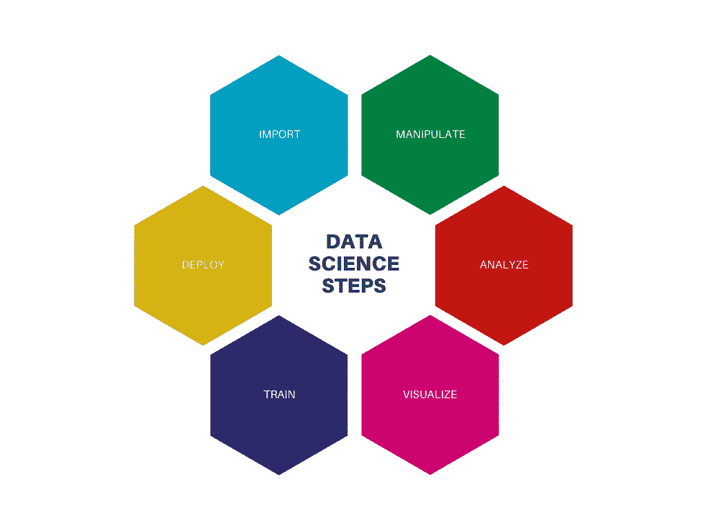
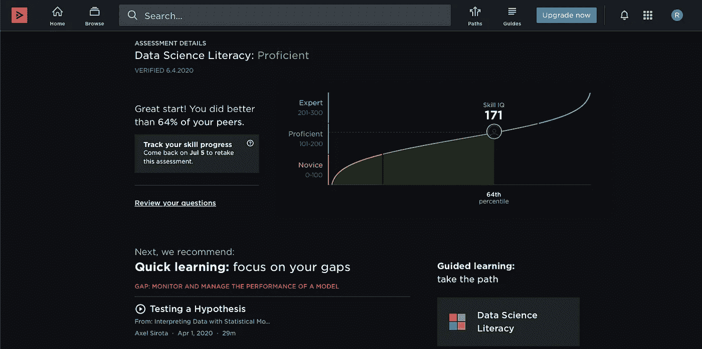
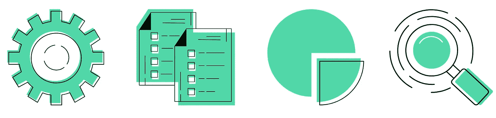

# 我的数据科学之旅的开始

> 原文：<https://blog.devgenius.io/beginning-of-my-data-science-journey-e887431ba834?source=collection_archive---------16----------------------->

## 学习之旅

帕特里克·托马索在 [Unsplash](https://unsplash.com/s/photos/journey?utm_source=unsplash&utm_medium=referral&utm_content=creditCopyText) 上的照片

早在 2020 年 3 月，我就开始对*数据科学*产生兴趣，从那时起，学习之旅就开始了，但是我遇到的许多人告诉我，我正在学习*数据科学*并且对它充满热情，他们开始问我，“那你为什么选择建筑作为你的专业，为什么不选择计算机科学或任何其他与计算机、软件或编程相关的专业呢？你父母逼你学建筑的吗？”所有这些问题的答案都是否定的。很明显，数据科学是有发展空间的，但我并不打算仅仅为了趋势或任何东西而学习它。没有人强迫我学习这两个科目中的任何一个，建筑学或者数据科学，这两个都是我的兴趣所在，我同样热爱学习这两个科目。

我在读兰迪·多伊奇的书《数据驱动的设计和构建》，其中一段激励我继续学习，那段是:

> 数据被建筑、工程、施工和运营(AECO)行业的许多人视为房间里的大象。数据，尤其是笼统的术语大数据，是一个重要的话题，撇开具体的标签不谈，它将继续保持下去。值得称赞的是，许多设计和 AECO 行业的专业人士已经意识到，数据是他们最困惑的专业和业务问题的答案。

此外，据信，与其他行业相比，AECO 行业的可用数据量最大，但尚未得到充分发现、处理和利用。我认为开始学习数据科学是一个很好的机会。

当我开始了解*数据科学*的用例时，我产生了真正的兴趣。当我说*数据科学*时，它是一个更广泛的术语，包括机器学习、数据库管理、统计学、概率，当然还有编程。在学习*数据科学*的时候，我知道它可以分为 6 个简单的部分:

1.  *导入可用数据*
2.  *管理和清理数据*
3.  *数据的探索性分析*
4.  *可视化数据*
5.  *模型训练和评估*
6.  *部署模型*

# 学习

许多人认为*数据科学*只与编程有关，只有那些拥有非凡编程技能的人才能成功，是的，你确实需要 Python 或 R 的基本编程知识(因为这两种编程语言被广泛用于*数据科学*，但是*数据科学*也与解决问题、逻辑推理、讲故事和数学有关。

于是开始学习 R 编程语言，并为此做了各种在线课程。我在 [Pluralsight](https://app.pluralsight.com/library/free) 、 [edx](https://www.edx.org/) 、 [Datacamp](https://www.datacamp.com/) 和 [udacity](https://www.udacity.com/) 找到了相当不错的基础和中级编程课程。为了更深入地了解一些话题，我参考了一些知名出版商[Packt>、](https://www.packtpub.com/) [O'Reilly](https://www.oreilly.com/) 和 [Springer](https://www.springer.com/in/search?query=DATA+SCIENCE&submit=Submit) 的书。

对于统计分析和机器学习，我必须温习我的数学技能——统计学、概率和线性代数，尽管要理解它们，你只需要学习上述的基本概念和一些中级概念。网上有很多课程，但我只是修改了一些重要的概念。

机器学习是*数据科学*的主要子集。因此，在学习了基本编程、探索性数据分析和可视化之后，我转向了 ML。我参加了 edx、[、Pluralsight](https://app.pluralsight.com/library/free) 、 [Datacamp](https://www.datacamp.com/) 、 [data-flair](https://data-flair.training/) 等知名热门在线教育平台的各种课程。幸运的是 [Pluralsight](https://app.pluralsight.com/library/free) 已经宣布他们平台上的 7000 多门课程在 4 月份免费，我利用了这一点。YouTube 视频对我帮助很大，我参考了这些 YouTube 频道以获得更多知识 [Edureka](https://www.youtube.com/watch?v=4R8nWDh-wA0&list=WL&index=35&t=2446s) 、[Bharatendra Rai 博士](https://www.youtube.com/channel/UCuWECsa_za4gm7B3TLgeV_A)(R 概念的精彩解释)和 [Simplilearn](https://www.youtube.com/user/Simplilearn) 。

(我没有专注于获得证书，因为我只是想学习概念，所以我习惯于旁听课程)

# **练习**

实践使人完美不再只是一句谚语，但你在实践后确实会提高自己。我开始自己做一些初学者项目，因为有很多开放的数据集可用，我喜欢玩它们，尝试新事物。Pluralsight 提供了一个名为 Skills IQ 的平台，在这里你可以测试你的技能。

复数形式

它让你很好地了解了什么是尚未涉及的，你擅长什么(正如你在我的评估中看到的，我还有很多要学习和涉及的)。我也参加了 [Datacamp](https://www.datacamp.com/) 评估，他们看起来也很不错。

# 探索

这是数据科学之旅中的可选过程之一，尽管它有很大的好处。当我在 [Kaggle](https://www.kaggle.com/) 开始竞争性编码时，最初我表现很差，就像进入了竞争对手的前 98%一样，我很难过。但在那之后不久，我开始在 [Kaggle](https://www.kaggle.com/) 查看其他笔记本，我必须说我从中学到了很多。有一些最大似然算法是我在任何课程中都没有学到的，比如梯度推进或修剪，或者说一些元算法。[栈溢出](https://stackoverflow.com/)和 [RPubs](https://rpubs.com/) 帮我解决了很多疑惑。我关注了一些播客，如 [O'Reilly](https://www.oreilly.com/radar/topics/oreilly-data-show-podcast/) 和 [OCDevel](http://www.ocdevel.com/mlg) 。

阅读在这个美丽的旅程中给了我很多帮助，它最大的来源是 medium，我在四月份加入 Medium，最初每周阅读 1-2 篇文章。从那以后，我开始保存故事以备将来参考，现在我甚至保存我还没有学到的概念的故事。阅读其他项目会给你很大的启发。阅读媒体上的故事促使我写了第一篇关于体育和数据科学的文章。

# 竞争

竞争总是一件好事，它迫使我们尽力而为。竞争编程是数据科学的重要学习途径。我在 Kaggle 开始了我的竞争性编程。和其他人一样，我也失败过几次(甚至得了 98 分)。对于我的第一个游乐场比赛，泰坦尼克号:从灾难中学习机器，我提交了 13 个参赛作品，第 13 个我进入了前 9 个百分点。我也尝试了其他一些有竞争力的编程平台，比如 HackerEarth 和 AnalyticsVidhya，但是我在那里不如在 Kaggle 上稳定。竞争性编程教会了我很多东西，但关键是“同一个问题有许多不同的方法。”

> “告诉我，我忘了。教我，我会记住。让我参与，我学习”——本杰明·富兰克林

