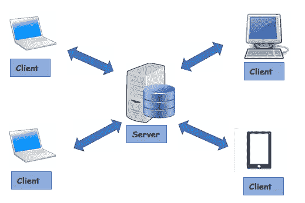
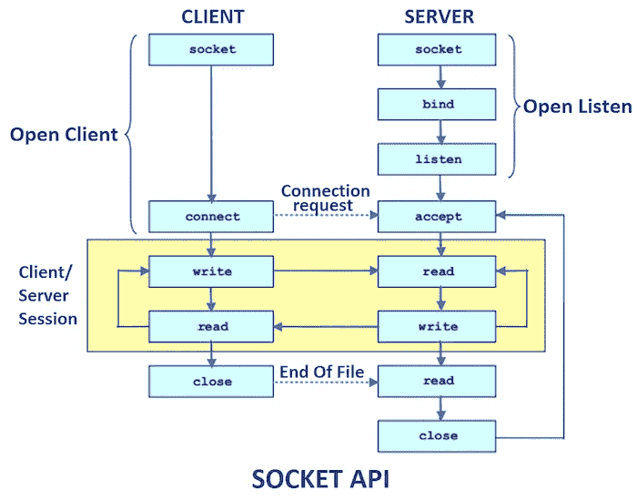

# 互联网的幕后:套接字

> 原文：<https://blog.devgenius.io/behind-the-curtain-of-the-internet-sockets-811a88cfe29?source=collection_archive---------14----------------------->

## 客户端套接字服务器体系结构介绍

# 什么是插座？

套接字是网络上运行的两个程序之间的双向通信流中的端点。在客户机-服务器体系结构中，一个套接字是客户机，一个套接字是服务器。也有对等网络，需要较少的基础设施来建立，但通常有较差的性能(这里有一个链接来了解更多关于[具体差异](https://pediaa.com/difference-between-peer-to-peer-and-client-server-network/))。

在本教程中，我将重点介绍客户端-服务器设计。

# 什么是客户机-服务器体系结构？



照片由 [omnisci](https://www.omnisci.com/technical-glossary/client-server) 拍摄

在这个模型中，我们有中央资源存储(服务器)，客户端连接到它并请求资源(数据、计算能力等)。



照片由 [javapoint](https://www.javatpoint.com/socket-programming) 拍摄

在图中，我们可以看到服务器和客户端之间的工作流

1.  服务器监听请求(通常总是发生，否则就会出现臭名昭著的 404 异常)
2.  客户端连接到服务器
3.  客户端向服务器请求一些东西
4.  服务器用请求的资源响应客户端
5.  连接关闭

现在我们已经了解了设计和工作流，让我们创建自己的例子。

# 案例研究:多线程客户机服务器

在我们的示例中，我们将创建一个使用线程的服务器，这样它就可以同时连接到多个客户端。然后，我们将两个客户端连接到服务器，并发送一些消息。

## 服务器类别

我们的服务器是一个可执行的方法。我们在端口 8000 创建一个套接字，然后我们不断接受客户端请求，并使用 ServerClientThread 实例化连接。

## 服务器客户端线程

这里，我们接收一个客户端套接字引用，并在服务器上的一个线程和客户端套接字之间开始一个会话。互动包括…

1.  从客户端套接字输入流中读取消息
2.  在服务器控制台上打印出“来自客户端-{id}:消息为:{clientMessage}”
3.  然后向客户端发回消息，表示“从服务器到客户端-{id}:已接收消息{clientMessage}”

当用户发送消息“关闭”时，我们将关闭连接。

这里我们创建了两个客户端一个和两个。我们创建了一个缓冲读取器来从标准 in 中读取用户输入。我们要求用户输入 1 或 2 来确定哪个客户端将向服务器发送消息。根据用户给出的数字，我们使用客户机 1 或 2 的 outputstream 向服务器发送消息。最后，我们从客户机的输入流中读取由服务器发送的消息。

# 使用服务器

要运行这个示例，首先要运行 MyServer 应用程序，它包含我们的多线程服务器。然后，运行客户端模拟器。

如果您回答如下提示

```
Enter 1 or 2: 
1
Enter Message :
hello
From Server to Client-1 received message hello
Enter 1 or 2: 
2
Enter Message :
hi
From Server to Client-2 received message hi
```

您应该会在服务器的控制台中看到以下输出

```
listening on port 8000
Client:1 started!
Client:2 started!
From Client-1: Message is :hello
From Client-2: Message is :hi
```

既然您已经理解了客户机-服务器体系结构，那么您可以实现自己的服务器，并更好地理解您日常使用的应用程序的内部工作原理。