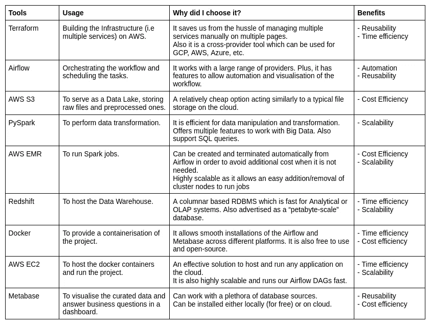

# 我在 AWS 上构建了一个不错的批处理，我的收获是什么？

> 原文：<https://blog.devgenius.io/being-a-couple-of-years-in-the-it-industry-what-are-my-takeaways-619ca826c4e2?source=collection_archive---------12----------------------->

史诗战士，来自[istockphoto.com](https://www.istockphoto.com/photo/army-gm941116916-257236589)

时至今日，AWS 仍在 IaaS(基础设施即服务)和 PaaS(平台即服务)领域引领市场。因此，接触这个平台对有抱负的或专业的数据工程师来说是一大优势。在本文中，我将阐述我在 AWS 上构建数据工程项目时学到的一些经验。

**1。业务影响应该放在第一位**

作为一个技术人员，当被给予一个要解决的问题时，通常很容易立即想到它的技术方面。在我职业生涯的早期，我至少犯过两次这样的错误。相反，我认为最好先考虑业务问题。因为，归根结底，对一个组织来说，最重要的是我们带来的解决方案的效率，而不是如何使用我们最喜欢的技术组合的演示。

在项目一开始就提出正确的问题会给我们自己和我们的利益相关者带来巨大的好处。从一开始就对具体的业务影响或结果有一个清晰的理解将会节省大量的时间和沟通。

*利益相关者、组织和我的团队将如何从我的工作中短期/长期受益？*

什么样的决定将取决于我的交付？

*最终产品将如何使用，它将如何使利益相关者的生活更轻松？*

例如，他们可能需要销售数据的实时报告。而实际上，他们只会在午饭前和离开办公室前查看报告，这基本上是一天两次，而不是所有时间。

有了这些关键问题的正确答案，我们就有了更具战略性的计划和选择武器的更好方法。

**2。如果说我看得更远，那是因为我站在巨人的肩膀上。**

很可能你不是地球上第一个要处理这类问题的人。了解别人是如何解决类似问题的，会让你对如何解决自己的问题有更好的看法。例如，如果有人已经选择了一条你正在考虑的特定路线，那么确定他们面临的利弊和挑战不仅仅是暗示你应该去哪里。今天，网上有大量的资源，其中一些聪明人分享他们的知识，他们的经验来帮助社区，包括:播客，会议，Youtube 视频，你能想到的。向他人学习，并在此基础上积累你的资产。无论如何，你不会重新发明轮子吧？

即使我们从一开始就已经有了一个明确的方向，在给它开绿灯之前，花些时间浏览网页或其他资源来支持这个想法总是安全的。

**3。技术问题**

如今我们有一整套工具可供选择。他们中的大多数人似乎都做得很好，或者至少这是他们的目的。然而，为正确的问题选择正确的工具与选择适当的战略计划同样重要。最近，我在 AWS 上完成了一个[数据工程项目，以下是我在选择工具之前的考虑。](https://github.com/HoracioSoldman/batch-processing-on-aws)

*   时间和成本效率

这对于将受到你的工作影响的每一个人都非常重要，包括利益相关者、你的组织、你的团队。如果你熟悉大 O 符号，举例来说，一种评估算法效率的方法是从时间和空间复杂度来评估它。时间:你的程序完成需要多长时间？空间:它的执行需要多少空间或资源？最少是最好的。在这里，我喜欢通过与资源相关的成本来评估资源。

*   复用性

人们常说**【无所不知】**，我们所获得的一切都会以某种方式复合，并将帮助我们在未来做出更好的决定，当然！然而，如果你曾经学过的一种工具在不止一个场景中同样有效，那就像一石二鸟一样棒，就是这样。如果在我的用例中两者都能得到相同的结果，我通常会选择一个可重用的工具，而不是一个过于特定的工具。

*   可扩展性和可维护性

随着组织的发展，数据量不可避免地也会增加，而且复杂性也可能会增加。此外，我们团队的其他成员也可能在未来继续我们的工作。为了让它工作，我们不应该是唯一一个知道工具和工作的人，它必须是容易学习或教授的东西。在构建我们的工具包之前考虑这一事实可能会让我们在未来免于头痛。

*   自动化

我们的时间和资源有限，我们的组织也是如此。手动一遍又一遍地做同样的任务可能会在某个时候变得无聊，甚至会阻止我们迎接新的挑战。[懒而聪明，不懒而哑](https://www.quora.com/Would-you-rather-be-very-intelligent-but-lazy-or-extremely-driven-and-hard-working-but-not-that-bright-Why)。如果有自动化的空间，那就是我们要走的路。自动化是关键，我们也可以享受生活:)

*   如果我们考虑在我们的领域工作的最佳实践，这个列表可能会继续下去。然而，这些至少是我在为我的项目选择工具时的想法。

**4。我对批处理项目**的技术补充说明

以下是我个人对这个项目的补充说明，描述了我为什么以及如何在这个项目中使用特定的工具。

希望我的收获也能对数据工作生态系统中的其他人有所帮助。

为 AWS 上的批处理检查我的存储库:【https://github.com/HoracioSoldman/batch-processing-on-aws[。](https://github.com/HoracioSoldman/batch-processing-on-aws)

编码快乐！