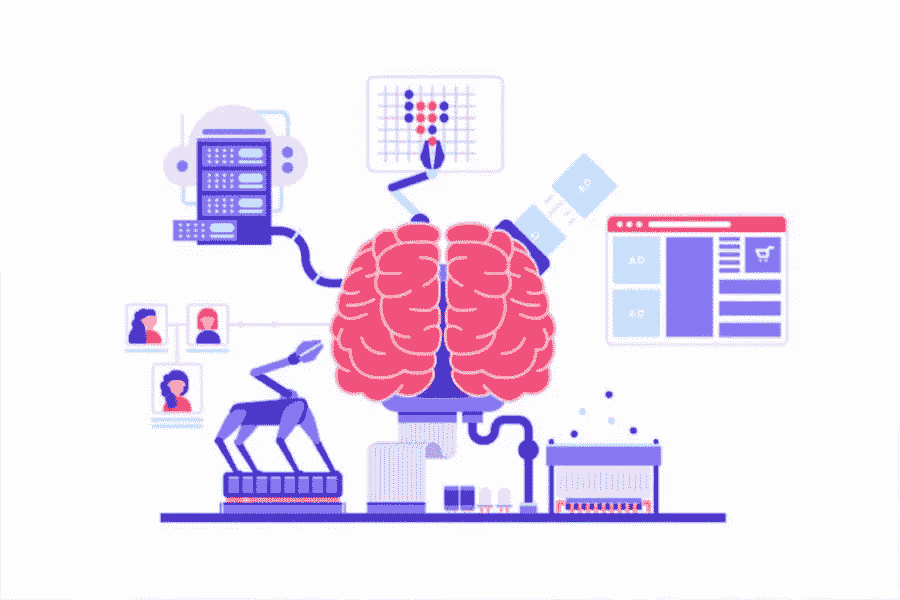
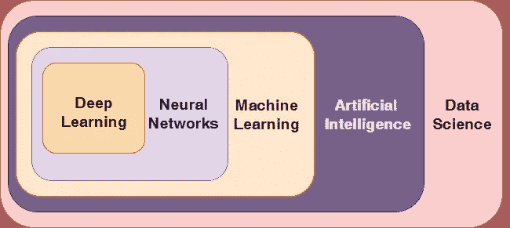
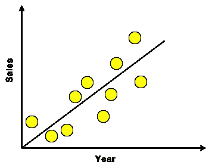

# 成为 ScholarX-2022 的学员|第 2 部分

> 原文：<https://blog.devgenius.io/being-a-mentee-at-scholarx-2022-part-2-d5c384ec5077?source=collection_archive---------7----------------------->

# **什么是机器学习？**

正如你所听到的，当前的技术通常与数据科学、人工智能、机器学习、神经网络和深度学习相关联。这些术语在对话中可以互换使用，这可能会导致对它们之间的细微差别产生一些混淆。那么这些技术是如何相互关联的呢？

简单来说，深度学习是神经网络的一个子领域，即神经网络构成了深度学习算法的主干。机器学习是神经网络加上基本的统计模型，如支持向量机(SVM)算法，K-means，随机森林算法，决策树，线性回归等。人工智能模仿人类智能来执行任务，并根据它们收集的信息迭代地改进自己，例如，使用机器人中的运动传感器或光传感器进行导航。而且这个不是 ML 而是 AI。当考虑计算机视觉、图像或音频识别时，有些领域计算机不可能比人更好。假设你试图让计算机像人类一样聪明，那么它可以被称为人工智能。现在，数据科学是一个总括术语，可以用在 AI 中，甚至可以用在简单的 excel 文件中。数据科学是从可用数据中获得洞察力的过程。

人类通过经验学习，不管是自己的还是别人的。他们已经具备了学习过程的智能。每个人都有独特的学习过程。人的学习过程一旦根植于思想就很难改变。与人类不同，机器需要输入过去的数据。机器使用这些过去的数据通过经验学习和获取知识，以便机器可以理解和解释或预测一些场景或生成特定的应用程序。

机器学习可以称为对开发计算机算法感兴趣的研究领域，以将数据转换为智能动作，而不依赖于基于规则的编程。

根据卡耐基梅隆大学的**汤姆·米切尔**的说法，**机器学习**是；

> 如果一个计算机程序在任务 T 中的性能(由 P 测量)随着经验 E 而提高，则称该计算机程序从关于某类任务 T 和**的**经验 E** 中学习。**

当我们多次做一个特定的任务时，性能会提高。例如，如果任务是机器人行走，则可以通过速度、动作、识别路径和避免他的路径中的障碍等来测量性能。经验可以通过使用不同途径的实践获得。

**任务:**

每个机器学习任务都可以分解为回归或分类。

1.分类

在分类中，它要求计算机程序指定输入数据属于哪一类。例如，我们给出猫、狗和马的图片。我们需要输出狗的照片。所以程序应该能够识别，这是一只猫，这是一只狗，这是一匹马，最后，输出狗的图像。在现实世界中，分类用于语音分类和物体检测等任务。

1.回归

回归用于根据给定的输入值预测数值。它可以用于基于过去的数据、销售额等预测销售额的场景。此外，根据具有缺失值的要素的性质(分类或连续),回归可用于识别给定数据集中的缺失数据或无效数据，而不会拒绝整个数据集。

**性能:**

性能是评估机器学习算法执行特定任务的能力。度量用于在训练和测试期间监控和测量模型的性能。为此，我们可以使用准确性、错误率、精确度和召回率等指标。指标是特定于领域的。

**经历:**

基于学习过程，机器学习基本上可以分为两种类型。

1.监督学习

在监督学习中，使用输入和相应的输出来训练机器学习模型，并且基于训练，机器预测新输入的输出。例如，在考虑电子邮件标记的模型时，给出一些垃圾邮件和非垃圾邮件的示例电子邮件。因此，用这些数据对第一个训练进行建模，然后用其他输入进行预测。监督机器学习可以进一步分为两种类型，分类和回归。

一些监督学习算法是；

*   随机森林算法
*   决策树算法
*   逻辑回归算法
*   支持向量机算法
*   k-最近邻
*   线性回归

1.无监督学习

在无监督学习中，模型是用既没有分类也没有标记的数据训练的，模型在没有任何监督的情况下对这些数据进行操作。它没有标记的输入和相应的输出，只有用于自学的输入。基本上，数据集包含许多特征。使用聚类等方法仅在输入图层中识别有用的要素。在示例电子邮件标记模型中，它不知道什么是垃圾邮件。它通过查看电子邮件和聚类来找到自己。无监督学习可以进一步分为聚类和关联两种类型。

一些无监督学习算法是；

*   k-均值聚类算法
*   k-最近邻(KNN)
*   等级聚类
*   异常检测
*   神经网络

**机器学习过程:**

在机器学习过程中，有一些关键步骤需要遵循。让我们一个一个地看。

1.获取数据集

收集准确的数据将有助于您的机器学习模型识别正确的模式。你的模型有多精确将取决于你提供的数据的质量。

2.数据预处理

在收集数据后，需要通过清理和标准化数据对其进行预处理，以便进行特征提取和特征缩放。这将减少数据集或样本，以选择更好的特征或观测值。

3.选择一个 ML 模型并训练

机器学习模型在对输入数据运行机器学习算法之后确定输出 get。因此，选择最适合的模型可能具有挑战性。

选择模型后，需要使用数据对其进行训练，以便随着训练时间的推移，模型在预测方面变得更好。应该对模型进行训练，因为它表现良好，不仅使用训练过的数据，而且使用看不见的数据。这就叫泛化。因此，**泛化**指的是模型适当适应新的、以前未见过的数据的能力，这些数据来自与用于创建模型的分布相同的分布。

我们可以衡量和评估这种概括。所以我们简单地将数据分成三个子集；

***训练数据集:*** 用来训练模型的实际数据集。

***验证数据集:*** 调整模型超参数时，用于对训练数据集上的模型拟合度提供无偏评估的数据样本。

***测试数据集:*** 用于提供最终模型在训练数据集上的无偏评估的数据样本。一旦使用训练和验证数据集对模型进行了完整的训练，就可以使用它。

当机器学习模型试图覆盖给定数据集中存在的所有数据点或多于所需的数据点时，模型开始缓存数据集中存在的噪声和不准确的值。该模型适用于训练数据集，但不适用于看不见的数据或不同的数据集。这被称为 ***过拟合或过给*** 。

当机器学习模型无法捕捉数据集的潜在趋势并导致不可靠的预测时，则称为 ***欠拟合或欠馈*** 。这也是表现不好。

因此，我们需要找到不会过拟合和欠拟合的参数。

4.调整参数

**调整**是在不过度拟合或欠拟合的情况下最大化模型性能的过程。这是通过选择适当的超参数来实现的。**超参数**是由用户明确定义的参数，用于控制学习过程。每个模型都有特定于该模型的不同种类的超参数，例如核、支持向量机(SVM)的 C 值等。它改进了模型的学习，并且在开始模型的学习过程之前设置值。

对于调优，我们使用验证数据集。基本上首先使用训练数据训练数据模型。然后调整，找到正确的超参数，然后测试数据集。在训练和调优中，数据模型不应该看到测试数据。

在分割数据集时，我们可以将 80%用于训练数据，20%用于测试数据，或者 70%用于训练数据，20%用于验证数据，10%用于测试数据，同样采用不同的方法。

如果我们以一种方式分割数据，可能会出现泛化问题，因为可能会有看不见的其他类型的数据。所以我们可以用交叉验证的方法来减少这种情况。

**交叉验证**是一种评估 ML 模型的技术，通过在可用输入数据的子集上训练 ML 模型，并在数据的互补子集上评估它们。

有几种交叉验证的方法。

*   验证集方法
*   遗漏交叉验证
*   遗漏一个交叉验证
*   k 倍交叉验证

让我们试着去理解 K 倍交叉验证。

**K 倍交叉验证**方法将输入数据集分成 K 组大小相等的样本。这些样本被称为褶皱。对于每个学习集，预测函数使用 k-1 个折叠，其余的折叠用于测试集。

考虑 4 重交叉验证。因此，数据集被分成 4 个部分。在第一次迭代中，第一次折叠用于测试模型，其余的用于训练模型。在第二次迭代中，第二次折叠用于测试模型，其余的用于训练模型。这个过程将对每个折叠继续进行。

5.部署

评估后，模型可以部署到生产中。

我们与 Rukshani Somarathna 女士的会议到此结束。我希望以这种方式与你分享，也能帮助其他人。谢谢大家！