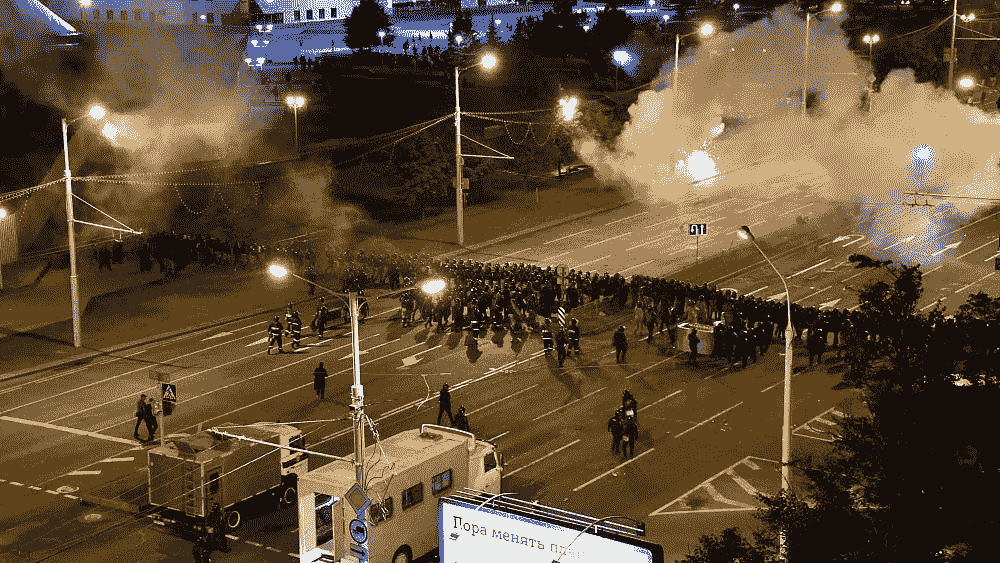
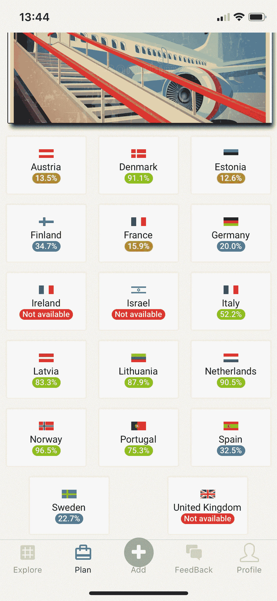

# 白俄罗斯的情况，我能帮上什么忙

> 原文：<https://blog.devgenius.io/belarus-situation-and-how-a-i-can-help-47de863c5e9b?source=collection_archive---------11----------------------->

如果你一直在关注我的 youtube 频道，我正在开发一个人工智能来帮助和生成一个移民框架，这将授权和帮助人们移居国外。

由于应用程序和人工智能处于开发的早期阶段，我没有对我收集的所有数据进行太多的分析，你可以在这里查看这篇[文章](https://clusterstack.io/app_share/post/II-fBVN2SqF)。我的应用程序可以做的分析之一是评估用户根据其国籍可以获得的批准签证的比例，这很重要，我会向您解释原因。

白俄罗斯正处于[动乱](https://www.bbc.com/news/world-europe-53762995)中，他的总统第六次连任，成千上万的人走上街头抗议并谴责这个“有点不民主”的政权。那里的情况很糟糕，如果情况不改变，许多白俄罗斯居民不愿意继续在他们的祖国生活。

要明确的是，我希望白俄罗斯公民通过改变自己的国家找到一种获得和平和更好生活的方式，但如果他们不能，目前，我希望他们能找到一个地方，并从那里开始建立一个网络，可以改善他们的生活，并可能支持他们自己国家的变化。

也就是说，ClusterStack 应用程序支持白俄罗斯移民的移民分析，这可以显示他们在几个欧洲国家获得签证的概率。

因此，运行 ClusterStack，我可以检查白俄罗斯居民相对于欧洲国家的签证批准概率，结果是:

正如你所看到的，白俄罗斯公民在大多数国家都非常受欢迎，我相信这很高兴看到如果情况没有好转，还有其他选择。这通常发生在他们的公民善良而勤奋的时候，因此他们不仅在欧洲，而且在世界其他国家都被广泛接受。

我希望这些信息对你有所帮助，给你的生活带来价值，如果你想看看，你可以下载这个应用程序，看看你的变化。

*   [Google Play](https://play.google.com/store/apps/details?id=com.clusterStack.clusterStack)
*   [应用商店](https://apps.apple.com/ie/app/clusterstack/id1495723069)

干杯！