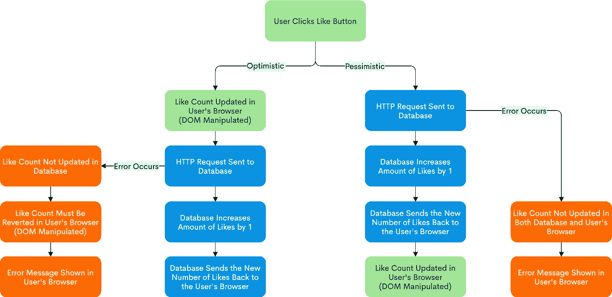

# 相信你的请求:乐观与悲观渲染

> 原文：<https://blog.devgenius.io/believing-in-your-requests-optimistic-vs-pessimistic-rendering-726e48fb1573?source=collection_archive---------12----------------------->

当 JavaScript 开发人员必须存储刷新后保存在网页上的数据时，他们必须从简单的 [DOM 操作](https://developer.mozilla.org/en-US/docs/Web/API/Document_Object_Model/Introduction)中分离出来。许多 JS 开发人员最终使用了 [AJAX](https://developer.mozilla.org/en-US/docs/Web/Guide/AJAX) ，它代表异步 JavaScript 和 XML。AJAX 使用 JavaScript 向网站的数据库发送 HTTP 请求。数据库将遵循 HTTP 请求中给出的指令，然后用新信息响应客户机的浏览器。

我们如何呈现这些新信息呢？你可能认为下一个合乎逻辑的步骤是使用我们客户的浏览器刚刚接收到的数据并显示出来，但是一些网站实际上并没有这样做。关于网页应该如何呈现这些新数据，有两种不同的观点。我刚才所描述的，网站使用数据库响应的数据来呈现变化，叫做**悲观**呈现。**乐观**呈现是站点先在客户端的浏览器中呈现更改，然后再向数据库发出请求。乐观呈现希望相信我们的数据库请求将会通过，因此它在客户机发送请求之前采取行动。悲观渲染更谨慎；它只根据他们直接从数据库中获得的信息来修改网页。

一个喜欢是如何乐观和悲观地呈现的

在这一点上，你可能会想:为什么你不总是悲观地渲染呢？对于网站来说，把所有的数据存储在一个地方不是更有意义吗？这些问题的答案是，客户端的计算机与服务器的数据库通信需要时间。有时当悲观地渲染时，这个时间是最小的，从用户点击按钮到他们的网页被更新只需要不到一秒钟的时间。在这种情况下，悲观渲染是最佳的:我们既有快速的响应，又有单一的真实来源。我们在错误发生时处理错误，而不是追溯。我们的数据流是精简和干净的。

但是，如果用户的互联网连接不稳定，或者他们的计算机被同时发生的其他请求所困扰，该怎么办呢？一种令人难以置信的令人沮丧的用户体验发生了，在他们的动作被数据库注册然后被发送回来之前，可能需要几秒钟，有时甚至几分钟。用户可能会点击该按钮，发送多个不需要的数据库请求，这反过来会减慢他们最初的请求，或者在最坏的情况下，离开网站。

这就是乐观渲染的用武之地。它总是首先显示用户的动作，这样他们就知道他们的动作已经被网页注册了。网页相信数据库请求会成功，它将在后台处理这一变化，以便提供更好的用户体验。在数据库请求失败的情况下，它会追溯性地将网页更改回用户操作之前的状态，并(可选地)通知用户。如果你曾经喜欢过手机上的社交媒体帖子，当你的服务很差时，你会知道这个应用程序有时似乎会神奇地收回你的喜欢。现在你知道这就是乐观渲染在工作中的力量，向你显示你的动作被识别，然后在错误发生时返回并恢复它。现在不那么违反直觉了，是吗？