# 贝尔曼-福特算法直观解释

> 原文：<https://blog.devgenius.io/bellman-ford-algorithm-visually-explained-e940b6edb00a?source=collection_archive---------4----------------------->

贝尔曼-福特算法寻找从源顶点到有向图中每个顶点的最短路径。与 Dijkstra 的算法不同，Bellman-Ford 可以有负边缘。

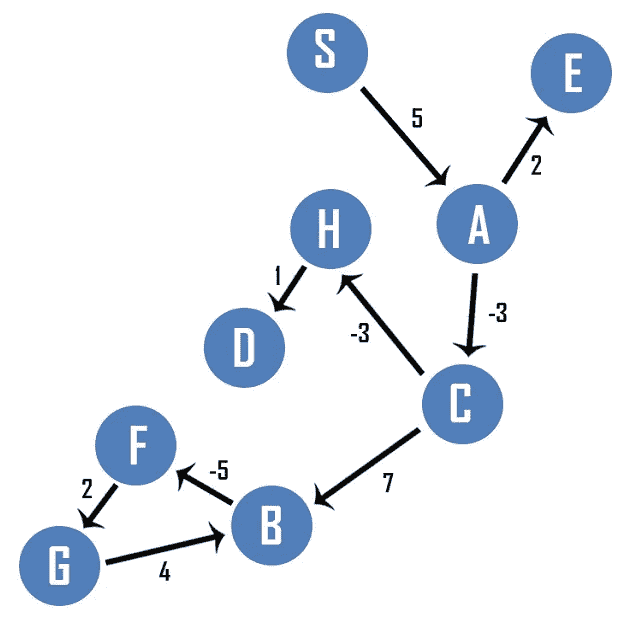

首先，所有出站边都按字母顺序记录在一个表中。

像 Dijkstra 的算法一样，创建一个记录到每个顶点的距离和每个顶点的前身的表。除了源顶点之外，每个顶点的距离都被初始化为无穷大。距离用变量 d 表示，前任用变量π表示。

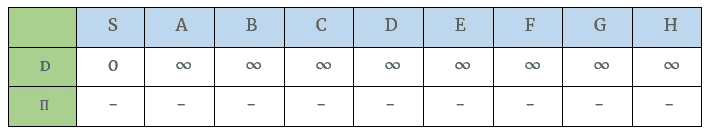

贝尔曼-福特算法将遍历每条边。因为有 9 条边，所以最多有 9 次迭代。在每次迭代过程中，放松特定的边。在第一次迭代中，从 A 到顶点 C 的代价是-3。从源到 A 的当前距离是无穷大。当-3 加到无穷大时，结果是无穷大，所以 C 的值保持无穷大。类似地，从 A 到 E，成本是 2，然而，由于到 A 的距离是无穷大，E 的值保持无穷大。看看边 B-F，C-B，C-H，F-G，G-B 和 H-D，我们可以看到它们都产生相同的结果，无穷大。最后一条边 S-A 产生了不同的结果。边 S-A 的权重是 5。目前到 S 的距离是 0，所以 S 到 A 的距离是 0 + 5 = 5。A 的前任设置为 s，第一次迭代后，贝尔曼-福特找到了从 s 到 A 的路径。

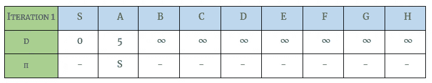

因为所有的边都被放松了，贝尔曼-福特开始第二次迭代。尽管每条边都是松弛的，但唯一重要的边是来自 S 和 A 的边，因为到这些顶点的距离是已知的。到所有其他顶点的距离是无穷大。查看包含边的表，我们从放松边 A-C 开始。

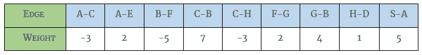

边 A-C 的权重是-3。通过边 S-A 到顶点 A 的当前距离是 5，所以到顶点 C 的距离是 5 + (-3) = 2。C 的前身是 A，边 A-E 的权重是 2。通过边 S-A 到 E 的距离是 5+2 = 7。E 的前身更新为 a。边 B-F 还不能放松。

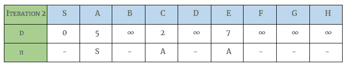

边 C-B 可以放松，因为我们知道到 C 的距离。到 B 的距离是
2 + 7 = 9，顶点 B 的前身是 C。边 C-H 可以放松，因为我们知道到 C 的距离。到 H 的距离是 2 + (-3) = -1，顶点 H 的前身是顶点 C

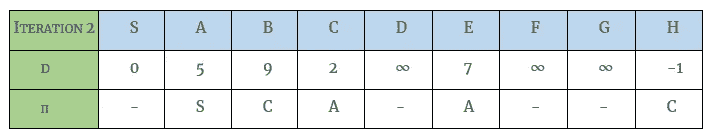

边缘 F-G 还不能放松。边缘 G-B 不能放松。边 H-D 可以放松，因为我们知道到顶点 H 的距离是-1。到顶点 D 的距离是-1 + 1 = 0，到顶点 D 的前任是顶点 h。

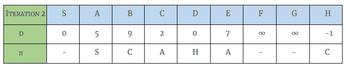

从边 S-A 到 A 的距离已经是 5，因此不需要更新。这结束了迭代 2。

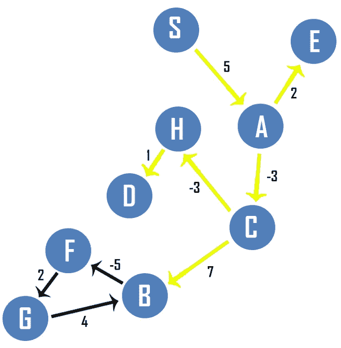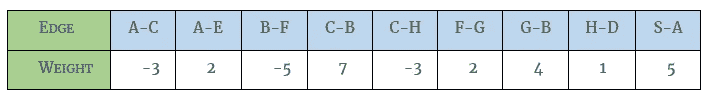

在第三次迭代中，贝尔曼-福特算法再次检查所有的边。边 A-C 和 A-E 产生相同的结果。边缘 B-F 现在可以放松了。到 B 的距离是 9，所以到顶点 F 的距离是 9 + (-5) = 4。F 的前身是 b。

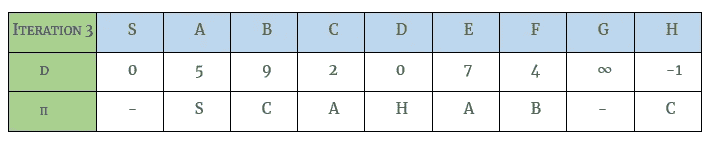

边 C-B 和 C-H 产生相同的结果，因此表保持不变。边缘 F-G 现在可以放松了。到顶点 F 的距离是 4，所以到顶点 G 的距离是 4 + 2 = 6。G 的前身是 f。

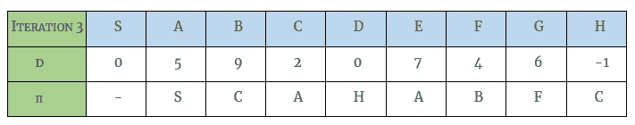

边缘 G-B 现在可以放松了。到顶点 G 的距离是 6，所以到 B 的距离是 6 + 4 = 10。因为通过边 C-B 可以用更短的距离到达顶点 B，所以表保持不变。

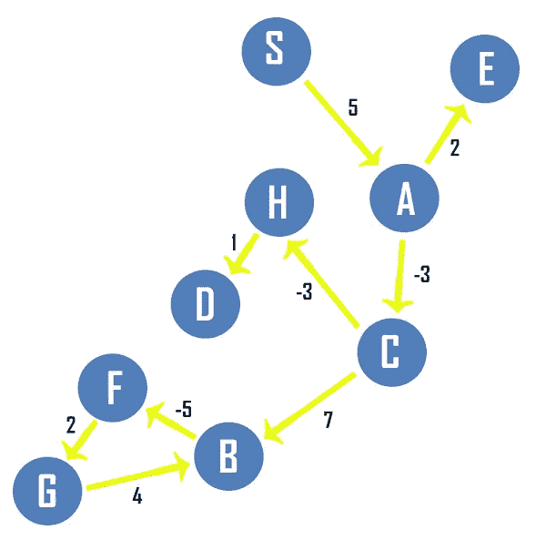

在第四次迭代中，检查所有的边。该算法发现没有变化，因此该算法在第四次迭代时结束。

如果这个图有一个负循环，在迭代重复 n-1 次后，理论上贝尔曼-福特算法应该已经找到了到所有顶点的最短路径。在第 n 次迭代期间，其中 n 代表顶点的数量，如果存在负循环，到至少一个顶点的距离将改变。让我们看一个简单的例子。

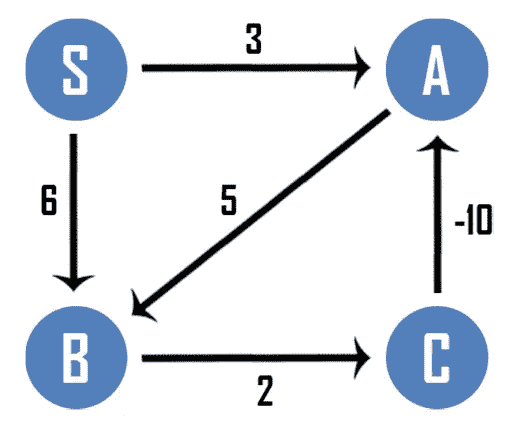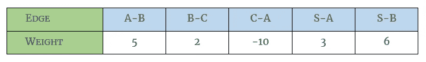

构建具有距离和前辈的表。顶点 A、B 和 c 的距离被初始化为无穷大。到 S 的距离为 0。

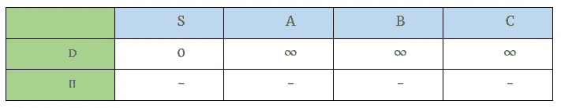

看第一条边，A-B 还不能放松，边 B-C 和边 C-A 也不能放松，边 S-A 可以放松。到 S 的距离是 0，所以到 A 的距离是 0 + 3 = 3。A 的前身是 s。

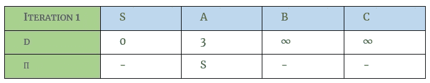

Edge S-B 也可以放宽。到顶点 B 的距离是 0 + 6 = 6。顶点 B 的前身是 s。

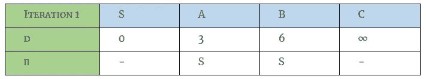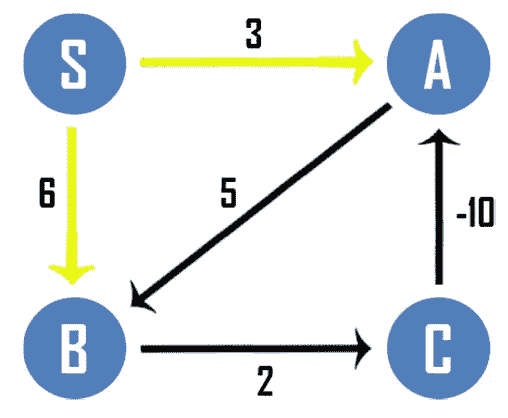

第一次迭代完成。在第二次迭代中，再次检查所有的边。

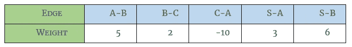

边缘 A-B 可以在第二次迭代中放松。到 A 的距离是 3，所以到顶点 B 的距离是 3 + 5 = 8。因为到 B 的距离已经小于新值，所以保留 B 的值。6 + 2 = 8 可以达到边 B-C。顶点 C 的前身是顶点 b。

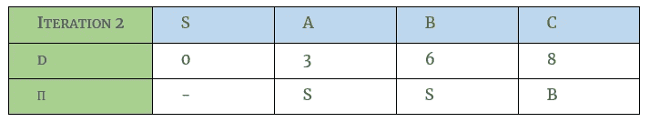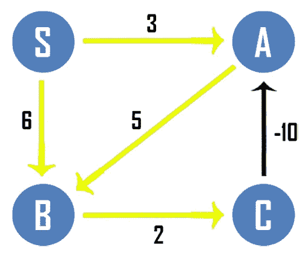

接下来检查边 C-A。到 C 的距离是 8 个单位，所以到 A 的过孔边缘 B-C 的距离是 8 + (-10) = -2。因为到通孔边缘 C-A 的距离小于到通孔 S-A 的距离，所以到 A 的距离被更新。

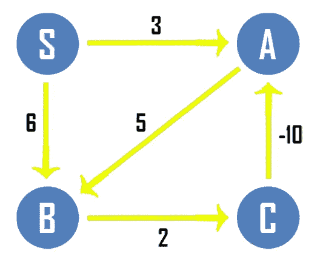

边 S-A 和 S-B 不会产生更好的结果，因此第二次迭代完成。第三次迭代开始。

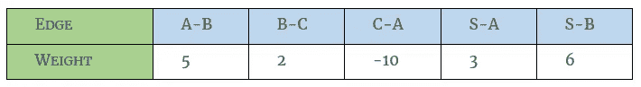

边缘 A-B 是放松的。到 A 的距离目前是-2，因此通过边 A-B 到 B 的距离是-2 + 5 = 3。由于通过 A-B 到 B 的距离小于到 S-B 的距离，因此距离更新为 3。顶点 B 的前身更新为顶点 a。

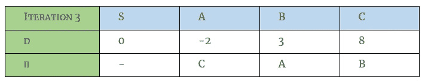

接下来放松边缘 B-C。当前到 B 的距离是 3，所以到 C 的距离是
3 + 2 = 5。到 C 的距离更新为 5。

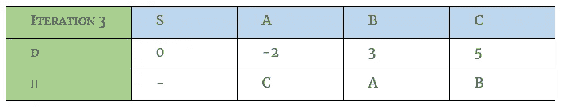

边缘 C-A 是放松的。到 C 的距离是 5 + (-10) = -5。到顶点 A 的距离更新为-5 个单位。

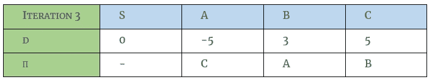

边 S-A 和 S-B 不会产生更好的结果。此时，应该已经找到了所有最短路径。如果我们检查另一个迭代，应该没有变化。

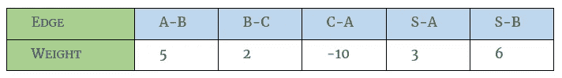

边缘 A-B 是放松的。到 A 的距离是-5，所以到 B 的距离是-5 + 5 = 0。到 B 的距离更新为 0。因为值在第 n 次迭代时改变，所以值也将在第 n+1 次迭代时改变；价值观将继续无限变化。如果我们仔细观察这个图，我们可以看到 A-B-C 产生了一个负值:5 + 2 + (-10) = -3。

如果你喜欢你所读的，看看我的书，**算法的说明性介绍。**

**

*Dino Cajic 目前是 [LSBio(寿命生物科学公司)](https://www.lsbio.com/)、[绝对抗体](https://absoluteantibody.com/)、 [Kerafast](https://www.kerafast.com/) 、 [Everest BioTech](https://everestbiotech.com/) 、 [Nordic MUbio](https://www.nordicmubio.com/) 和 [Exalpha](https://www.exalpha.com/) 的 IT 负责人。他还是我的自动系统公司的首席执行官。他有十多年的软件工程经验。他拥有计算机科学学士学位，辅修生物学。他的背景包括创建企业级电子商务应用程序、执行基于研究的软件开发，以及通过写作促进知识的传播。*

*你可以在 [LinkedIn](https://www.linkedin.com/in/dinocajic/) 上联系他，在 [Instagram](https://instagram.com/think.dino) 上关注他，或者[订阅他的媒体出版物](https://dinocajic.medium.com/subscribe)。*

*阅读 Dino Cajic(以及 Medium 上成千上万的其他作家)的每一个故事。你的会员费直接支持迪诺·卡吉克和你阅读的其他作家。你也可以在媒体上看到所有的故事。*