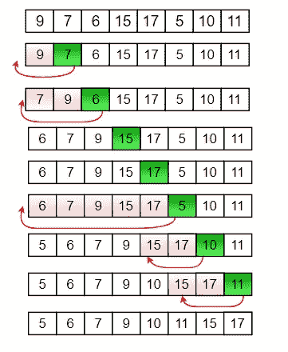
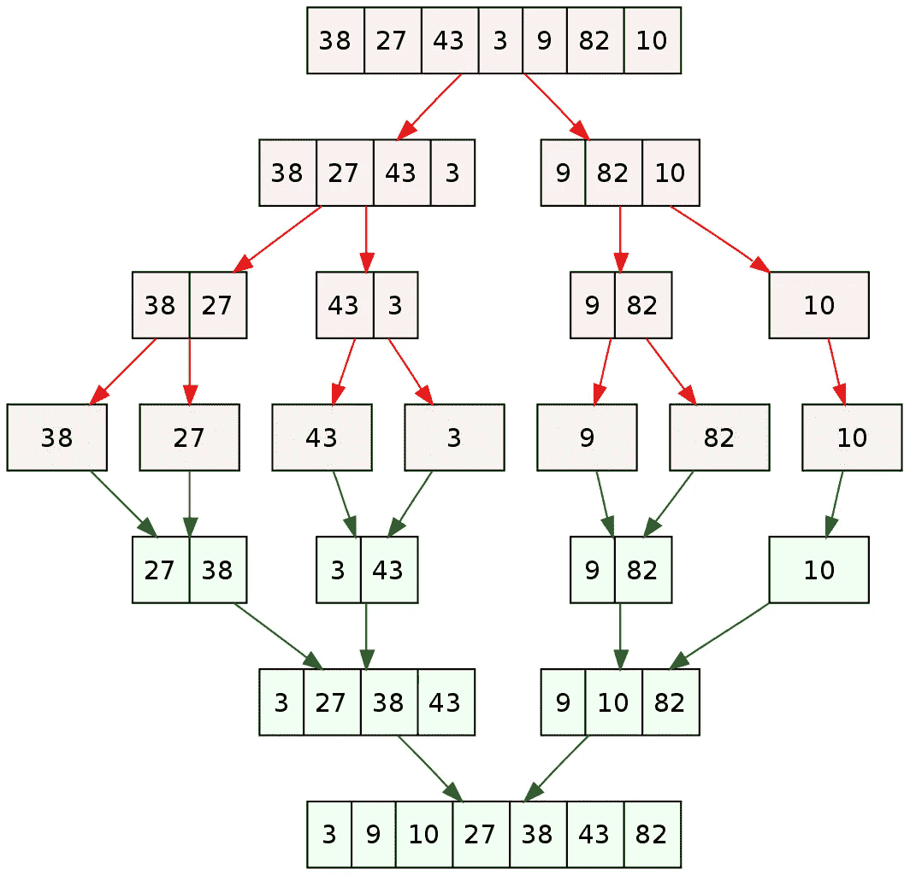

# 基准测试 Go 代码

> 原文：<https://blog.devgenius.io/benchmarking-go-code-7c780e29a7f?source=collection_archive---------4----------------------->

如果你已经用 Go 编程一段时间了，你可能真的很喜欢它附带的工具。语言本身被有用的工具挤得满满的，比如`go test`、`go fmt`、`go build`等等。我们之前已经检查过测试了。今天，我们将看看如何对我们的 Go 代码进行基准测试。

# 为什么应该运行基准测试

想知道你的代码运行有多快多高效吗？基准测试是检查代码性能的最直接的方法。Go 提供的基准测试工具主要关注以下几个方面:

*   每次操作花费的时间
*   每次操作分配的内存

基准测试不是必须的，但是它们是检查瓶颈的好方法。此外，运行数字很有趣。如果你是一个内容创建者，你可能会每天查看你的 feed，记录你最近的帖子获得了多少新的浏览量。基准给了我类似的喜悦感。

# 插入排序与合并排序

在本教程中，我们将使用以下代码。

```
package mainimport (
    "fmt"
)func main() {
    list := []int{3, 4, 1, 5, 2}
    iList := insertionSort(list)
    mList := mergeSort(list)
    fmt.Println(iList, mList)
}func insertionSort(list []int) []int {
    for i, num := range list {
        j := i - 1 for j >= 0 && num < list[j] {
            list[j+1] = list[j]
            j -= 1
        }
        list[j+1] = num
    } return list
}func mergeSort(list []int) []int {
    if len(list) > 1 {
        mid := len(list) / 2
        left := list[:mid]
        right := list[mid:] mergeSort(left)
        mergeSort(right) i, j, k := 0, 0, 0 for i < len(left) && j < len(right) {
            if left[i] < right[j] {
                list[k] = left[i]
                i++
            } else {
                list[k] = right[j]
                j++
            }
            k++
        } for i < len(left) {
            list[k] = left[i]
            i++
            k++
        } for j < len(right) {
            list[k] = right[j]
            j++
            k++
        }
    } return list
}
```

以上是两种流行排序算法的实现:插入排序和合并排序。

插入排序是一种简单的排序算法，其工作原理如下:

*   从头开始遍历列表。
*   如果当前数字小于前一个数字，将它移到前面，直到它变得大于前一个数字。

合并排序采用不同的方法:

*   把列表分成两半，这样你最后得到一个左列表和一个右列表。在左列表和右列表上递归地这样做。
*   当你不能再分的时候，把左列表和右列表按升序合并。
*   合并列表，直到最后得到排序后的原始列表。

这些图表将帮助您更好地理解这两种类型。

*   插入排序:



[https://media . geeks forgeeks . org/WP-content/uploads/insertion _ sort-recursion . png](https://media.geeksforgeeks.org/wp-content/uploads/insertion_sort-recursion.png)

*   合并排序:



[https://en . Wikipedia . org/wiki/Merge _ sort #/media/File:Merge _ sort _ algorithm _ diagram . SVG](https://en.wikipedia.org/wiki/Merge_sort#/media/File:Merge_sort_algorithm_diagram.svg)

# 对代码进行基准测试

让我们编写我们的基准代码。

```
package mainimport (
    "fmt"
    "math/rand"
    "testing"
)func BenchmarkInsertionSort(b *testing.B) {
    inputSize := []int{10, 100, 1000, 10000, 100000}
    for _, size := range inputSize {
        b.Run(fmt.Sprintf("input_size_%d", size), func(b *testing.B) {
            testList := make([]int, size)
            for i := 0; i < size; i++ {
                testList[i] = rand.Intn(size)
            }
            b.ResetTimer() for i := 0; i < b.N; i++ {
                insertionSort(testList)
            }
        })
    }
}func BenchmarkMergeSort(b *testing.B) {
    inputSize := []int{10, 100, 1000, 10000, 100000}
    for _, size := range inputSize {
        b.Run(fmt.Sprintf("input_size_%d", size), func(b *testing.B) {
            testList := make([]int, size)
            for i := 0; i < size; i++ {
                testList[i] = rand.Intn(size)
            }
            b.ResetTimer() for i := 0; i < b.N; i++ {
                mergeSort(testList)
            }
        })
    }
}
```

所有基准代码都以`BenchnmarkXxx`的格式命名，其中`Xxx`是被基准测试的函数的名称，以大写字母开头。

我们将使用不同的输入大小来测试这两种排序算法。这些在`inputSize`中定义。对于每个输入大小，我们启动一个`b.Run`来触发单个基准。`b.Run`接受两个参数:第一个是基准的名称，第二个是要运行的实际基准函数。`fmt.Sprintf("input_size_%d", size)`是动态命名我们的基准的好方法，因为它会这样命名我们的基准:`input_size_10`、`input_size_100`等等。

您可以为每个输入大小创建一个基准函数，但是代码会变得不必要的长，所以使用`b.Run`是惯用的方法。

```
testList := make([]int, size)
for i := 0; i < size; i++ {
    testList[i] = rand.Intn(size)
}
b.ResetTimer()
```

这部分填充了我们的测试数据。我们创建一个大小为`size`的切片，并用随机整数填充它。我们最后调用`b.ResetTimer`来重置我们的基准计时器。`b.Run`在启动定时器时启动定时器，因此默认情况下，它将包括初始化数据所用的时间。这是一种误导，我们在运行基准测试之前重置了计时器。

```
for i := 0; i < b.N; i++ {
    mergeSort(testList)
}
```

这是运行我们的`mergeSort`函数的循环。循环运行`b.N`时间，这是为产生稳定可靠的结果而计算的任意数字。这就像多次运行一个实验室，寻找不同数据点的平均数据，使结果更加精确。

现在让我们运行基准测试。

```
$ go test -bench=. -benchmem
goos: linux
goarch: amd64
pkg: example.com/benchmarking
cpu: Intel(R) Core(TM) i7-7700K CPU @ 4.20GHz
BenchmarkInsertionSort/input_size_10-8          127217533                9.369 ns/op           0 B/op          0 allocs/op
BenchmarkInsertionSort/input_size_100-8         13812344                89.95 ns/op            0 B/op          0 allocs/op
BenchmarkInsertionSort/input_size_1000-8         1508656               743.6 ns/op             0 B/op          0 allocs/op
BenchmarkInsertionSort/input_size_10000-8         158587              7365 ns/op               0 B/op          0 allocs/op
BenchmarkInsertionSort/input_size_100000-8             1        1296239500 ns/op               0 B/op          0 allocs/op
BenchmarkMergeSort/input_size_10-8              14895802                76.45 ns/op            0 B/op          0 allocs/op
BenchmarkMergeSort/input_size_100-8              1000000              1045 ns/op               0 B/op          0 allocs/op
BenchmarkMergeSort/input_size_1000-8               89268             14178 ns/op               0 B/op          0 allocs/op
BenchmarkMergeSort/input_size_10000-8               7522            156233 ns/op               0 B/op          0 allocs/op
BenchmarkMergeSort/input_size_100000-8               678           1743882 ns/op               0 B/op          0 allocs/op
PASS
ok      example.com/benchmarking        15.215s
```

我们像运行测试一样运行`go test`。然后我们传递这两个标志:

*   `-bench`指定运行哪个基准函数。要运行所有程序，请通过`-bench=.`。
*   `-benchmem`显示每个操作分配了多少内存，以及发生了多少次分配。

在左侧，您可以看到基准函数的名称。末尾的`-8`表示我们正在使用 8 个 CPU 内核。

旁边是一个巨大的数字，随着输入量的增加而减少。这些是你的`b.N`，或者说基准测试运行你的函数的次数。我们称之为操作次数。

在它的右边，你可以看到每个操作的平均时间。这意味着对于函数的每次运行，大约需要 x 纳秒的时间。

最后两列显示了每个操作使用的平均内存字节数，以及每个操作的分配数。

您可以看到，对于 10，000 及以下的较小输入大小，插入排序更有效。然而，从这一点开始，合并排序更加有效。

两者都是内存高效的，因为它们都不需要太多的内存分配。在围棋中，走片不耗费内存。更多关于指针 golang 中的片不分配任何内存？—堆栈溢出。

# 结论

基准测试是检查代码是否高效运行的有用工具。这给我们留下了一个问题:这意味着如果我们从一开始就编写了一个优化良好的代码，我们就不需要对代码进行基准测试，对吗？在一个完美的世界里，这是真的。然而，和无数其他人一样，我建议不要这么做。

> *过早优化是万恶之源。*
> 
> *—传奇计算机科学家、数学家唐纳德·克努特*

专注于编写可读的工作代码。如果开始遇到瓶颈，就运行基准测试。在许多情况下，可维护性比性能更重要，尤其是在现代计算机如此快速的情况下。

感谢您的阅读！你也可以在 [Dev.to](https://dev.to/jpoly1219/benchmarking-go-code-1k23) 和[我的个人网站](https://jpoly1219.github.io)上阅读这个帖子。