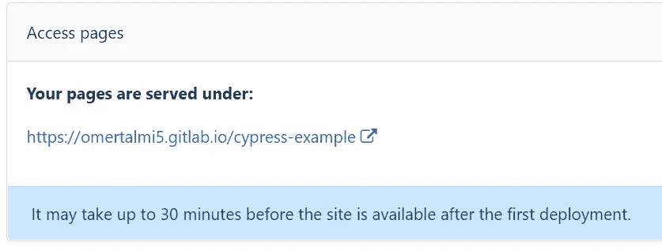
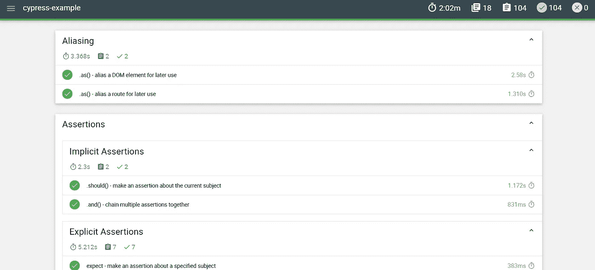

# 从 Cypress 报告中获益最多

> 原文：<https://blog.devgenius.io/benefiting-the-most-of-cypress-report-10279fd9feb6?source=collection_archive---------2----------------------->

## **如何将 Mochawesome 报告与 GitLab 页面集成**

照片由[艾萨克·史密斯](https://unsplash.com/@isaacmsmith)在 [Unsplash](https://unsplash.com/s/photos/guide?utm_source=unsplash&utm_medium=referral&utm_content=creditCopyText) 拍摄

随着作为测试框架的 Cypress 越来越受欢迎，以一种清晰易懂的方式反映测试结果变得非常重要。

在[持续集成](https://en.wikipedia.org/wiki/Continuous_integration)时代，包括 Cypress 测试在内的很多 CI/CD 管道一直在运行。团队开发人员应该有一个简单的方法来了解产品的状态，并快速分析测试失败的原因。这样做的目的是减少查看报告所花费的时间和精力。

这可以通过使用 [Mochawesome reporter](https://www.npmjs.com/package/mochawesome) 和 [GitLab Pages](https://docs.gitlab.com/ee/user/project/pages/) 的组合来实现。这两个人在一个固定的地方提供了一个方便的报告。

让我们深入了解这两个问题:

## **摩卡牛逼记者**

*mocha awesome 是一个定制的报告器，与 Javascript 测试框架* [*mocha*](https://mochajs.org/) 一起使用，根据 [npm](https://www.npmjs.com/package/mochawesome) 。它广泛用于 Cypress 的端到端测试。它提供了一个清晰友好的用户界面，快速清晰地阐明了测试失败的原因。

## **GitLab 页面**

GitLab Pages 是 GitLab 的一个特性，它使我们能够直接从我们的 GitLab CI/CD 管道发布静态网站。它从我们的 CI/CD 管道中提取工件，并将它们转换成静态网站。您的所有团队开发人员都可以轻松访问该网站。

GitLab 页面在 CI/CD 管道的配置文件中声明，通常使用名称`.gitlab-ci.yml`。该文件包含称为阶段的不同块，每个块定义 CI/CD 管道中的一个步骤(构建、测试、部署……)。

## **整合他们两个**

这里我们假设 Mochawesome 已经在您的项目中配置好了。如果没有，你可以在这里学习如何做。

让我们在 CI 渠道中集成生成报告:

`.gitlab-ci.yml example`

## 编辑`.gitlab-ci.yml`

首先，我们添加命令在`.gitlab-ci.yml`中创建 GitLab 页面。我们应该创建一个名为`pages`的单独阶段。

在生成一个 Mochawesome 报告后，会创建一个名为`mochawesome-report`的文件夹。该文件夹包含 html 页面和发布报告所需的所有结果文件。接下来，我们应该重命名这个文件夹`public`，GitLab 的保留字，以便使它成为 GitLab 页面。此外，我们需要将文件夹声明为管道的工件。

运行管道后，GitLab 会自动创建另一个名为‘deploy’的阶段，并将报表直接部署到 GitLab 页面。

请注意创建的名为“部署”的额外阶段

## 访问 GitLab 页面

最后，我们可以在导航菜单中导航到`Settings -> Pages`，找到我们的 GitLab 页面 URL 地址。为了显示报告，我们需要添加我们的报告名称(单击下面的链接查看报告示例):

`[https://omertalmi5.gitlab.io/cypress-example/mochawesome.html](https://omertalmi5.gitlab.io/cypress-example/mochawesome.html)`

GitLab 页面 URL 地址

到目前为止，我们已经了解了如何将 Mochawesome 报告与 GitLab 页面集成。现在，我们每次输入 URL 地址，就可以观看报告。每次构建 CI/CD 管道时，都会更新报告。

Mochawesome 报表示例

## **结论**

我这篇文章的目标是改善你的日常工作流程。本文介绍了一种方法，可以省去您可能要花在理解 Cypress 报告上的大量宝贵时间。我希望本文提供的信息能帮助你实现这一目标。

感谢您花时间阅读这篇文章。

完整的例子可以在我的 [GitLab 页面](https://gitlab.com/omertalmi5/cypress-example)找到。

欢迎在评论中提问。