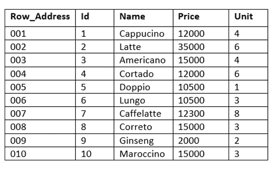
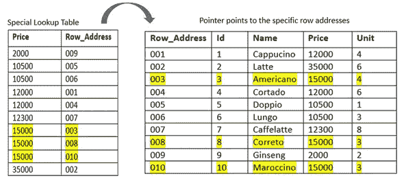

# 索引在构建快速执行的 API 中的好处

> 原文：<https://blog.devgenius.io/benefits-of-indexing-in-building-fast-performing-apis-55e4a7fe07aa?source=collection_archive---------5----------------------->

几周前，我正好有机会在 engineering 上提出这个话题，所以我决定也在我的博客上分享一下。数据库索引是一个庞大的主题，但是在这里我简化了它，以适应我们如何用正确的索引实现快速执行的 API。

**什么是数据库索引？**

索引是一种特殊的查找表，它有助于加快表的搜索，也有助于加快数据库引擎的更新和删除。

数据库中的索引类似于书后面的索引。例如，如果我们想定位一个名为“操作系统”的主题，假设这个主题在本书 100 页中的第 78 页，没有索引，我们可能必须翻阅本书的每一页，直到第 78 页，才能找到主题“操作系统”。即使我们不翻阅每一页，我们也会不停地翻页，直到找到主题，你同意这是有压力的，浪费时间，对吗？但是有了索引，我们就不会翻阅 77 页去找题目，我们需要做的只是去找书的索引，找到题目和它的页码，然后再回到书上，具体到那个页码。现在你同意这是一种更快的搜索方法，对吗？当我们在数据库列上放置索引时，会发生完全相同的事情。

例如，如果我们有一个名为 Products 的数据库表，它有 4 列:Id、Name、Price、Quantity，假设这个表有 40，000 条记录，我们希望找到所有 Price 为 15，000 的记录。

**从价格= 15000 的产品中选择***

当我们在没有索引的情况下运行上述查询时，数据库引擎会为我们返回记录，对吗？但是数据库引擎所做的是扫描 40，000 条记录，并过滤掉价格为 15，000 的记录，然后将它们返回给我们，这称为表扫描，表扫描的性能很差。想象一下，这个表有数百万条记录，数据库必须进行这个表扫描，这将花费相当多的时间，如果我们从我们的应用程序 UI 加载这个查询，这将带来糟糕的用户体验，因为调用 API 的页面在加载数据之前会延迟。通过 Price 列上的索引，数据库引擎创建了另一个特殊的查找表，在该表中保存了每个价格的行地址，这样，当我们运行上述查询时，数据库引擎将转到该查找表并检索该价格的行地址，然后使用该行地址从实际的表中提取记录，如果有 3 条价格为 15，000 的记录， 查找表将包含这 3 条记录及其唯一的行地址，它将从第一次出现开始，然后向下扫描以获取所有匹配标准的行地址。 让我们举例说明这个例子。

*产品表:*

*指数:*

*结果记录:*

# 何时使用索引？

创建索引时，请记住，更新有索引的表比更新没有索引的表花费更多的时间，因为索引也需要更新。重要的是，只在需要和绝对必要的时候创建索引。你脑海中的下一个问题是什么时候它是绝对必要的？以下是在列上创建索引的一些有效理由:

1.  当该列被频繁查询时，这意味着当该列经常出现在 where 子句中，或者当该列所在的查询非常频繁地运行时，则应该对该列进行索引。
2.  其次，如果列上存在引用完整性约束，则该列需要索引，这意味着将参与查询中的联接的列需要索引。
3.  如果列上存在唯一键完整性约束，则该列需要唯一索引。唯一索引是对列应用唯一键约束的一种方式，数据库引擎将创建特殊的查找表(索引)并强制该列中值的唯一性。

# 何时不使用索引？

并非所有场景都需要索引，过多的索引也不是一个好的做法，因为这会导致问题，在一些场景中，我们不需要添加索引:

a.当表是一个小表时，例如一个保存完全不增加或没有显著增加的记录的表，例如一个保存一周中的天、一年中的月、一年中的公共假日、一个州中的城市的表。(其中一些可以是枚举，而不是表格)。这些都是小表，所以即使这些类型的表中的任何列频繁出现在 where 子句中，仍然不需要索引，这是因为索引会占用存储空间，并且不对这些列进行索引不会影响性能，因为表扫描将在最少数量的记录上完成。

b.不建立索引的另一种情况是，当表上的读操作很少而写操作很多时，这意味着当表不经常被搜索或查询但经常被更新时，无论表的大小如何，如果没有在列上建立索引，也不会影响性能。

c.当我们经常提取很大比例的数据库记录而不是一小部分时。如果在您的搜索条件中，一个列将会提取表中几乎所有的记录，那么您不希望在该列上放置索引。这一点可能是有争议的，但看看下面的查询；

**Select * from Employees where id<10000**

假设 *id* 递增 1。

如果记录的数量可能是 11，000 甚至 12，000，并且如果这是您需要在该表上运行的所有查询，那么就不需要索引，因为数据库引擎将不得不大量读取索引来获取所有记录，这对于数据库来说是很差的性能。如果预期结果是 10，000 条记录，那么对 12，000 条记录进行表扫描不会有什么坏处。

**我应该索引哪些列？**

a.索引应该放在经常出现在 *where* 子句和 *order by* 子句中的列上。

b.具有唯一约束的列应该具有唯一索引。

c.作为外键的列需要索引。

**单一或综合指标:**

单一索引是一列上的索引，复合索引是多列上的索引。

**什么时候两者都用？**

当经常搜索多个列时，我们使用复合索引，而当只经常搜索一个列时，我们使用单一索引。创建复合索引时，我们需要指定索引在每一列中的顺序，数据库引擎使用该顺序来确定哪一列排在第一、第二、第三位..在它将要创建的特殊查找表中，帮助我们确定应该如何构造查询的 *where* 子句。必须按照数据库引擎对*查找表*中的列进行排序的相同方式，对 *where* 子句中的列进行排序。

了解如何对索引进行排序是非常重要的。为了避免在创建不必要或未使用的索引时浪费存储空间和内存，可以在 Where 子句中出现的列上创建索引，但查询可能不会从索引中受益。一个例子:

如果在城市和国家列上添加索引，并且国家的索引顺序为 0，城市的索引顺序为 1，则该表的 select、update 或 delete 查询的 where 子句中的列顺序应为:

*Select FieldName1，field name 2…from TableName where Country = " value " and City = " value "*

下面的查询将不会受益于该索引，事实上，如果查询是以这种方式构造的，那将是对索引、存储和内存的浪费。

*Select FieldName1，field name 2…from TableName where City = " value " and Country = " value "*

同样，按国家(0)、州(1)、城市(2)顺序排列的索引将有利于以下查询

*Select FieldName1，FieldName2… from TableName 其中 Country = " value " and State = " value " and City = " value "*

或者

*从表名中选择字段名 1、字段名 2…其中 Country = "value "和 State = "value"*

或者

*从表名中选择字段名 1、字段名 2…其中 Country = "value"*

但是它对下面的查询没有好处。

*从表名中选择字段名 1、字段名 2…其中 State = "value "和 Country = "value"*

原因是在创建复合索引时，列顺序很重要，在 *where* 子句中，顺序号最小的列必须始终排在第一位，它应该按照顺序排到顺序号最大的列，这意味着列顺序为 2 的城市应该排在 *where* 的最后一位。

此外，请记住，根据您想要实现的目标，对列应用了不同类型的索引，例如聚集索引和非聚集索引、过滤索引、唯一索引(我在本文中提到过)等。

*最初发表于*[*【https://kalungozi.com】*](https://kalungozi.com/2021-04-07-index-helps-you-build-fast-performing-apis/)*。*