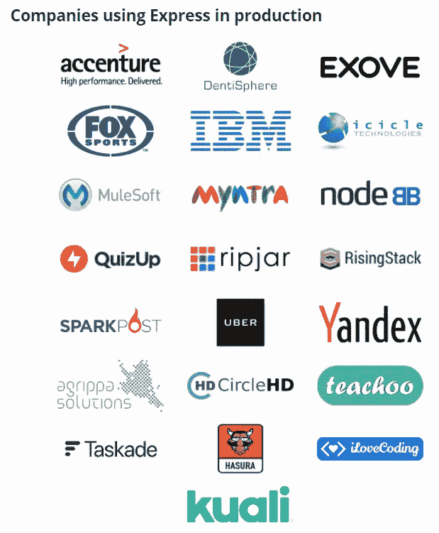

# 使用 Express 进行 Web 开发的好处

> 原文：<https://blog.devgenius.io/benefits-of-using-express-for-web-development-c786557ed3e5?source=collection_archive---------10----------------------->

‍

Express 是 Node.js 的一个 web 框架，是一个非常棒的现代 web 开发工具，让您的网站建设工作变得轻而易举。它允许你创建强大的，复杂的，漂亮的网站。由 [StrongLoop](https://strongloop.com/) 、TJ Holowaychuk 和其他人开发的这个框架可以节省你很多时间，因为它有很多有用的特性和工具。

这款应用开发工具于 2010 年 11 月 16 日发布。

官方网站:【https://expressjs.com/ 

GitHub:【https://github.com/expressjs/express 

使用这个神奇的工具，您可以开发高质量的移动和 web 应用程序。Feathers、Poet、北海巨妖、LoopBack、KeystoneJS、Locomotiv、Kites、ItemsAPI、Expressive Tea、NestJS 等框架都是基于 Express 框架构建的。

MySpace、LearnBoost、Klout、Storify、Countly、Yummly、Koding、Ghost、Cozy、SimpleSet、Glip、Apiary、Segment 等网站都是用 Express 搭建的。[ [图像来源](https://expressjs.com/en/resources/companies-using-express.html)

这个框架让您可以轻松创建功能强大的应用程序。

与 Laravel 和 CodeIgniter 等 web 开发框架相比，Express 是一个现代化的工具，可以让您更快地开发应用程序。

‍

## 这篇文章强调了使用 Express 的一些主要好处:

‍

## 免费和开源

Express 在 MIT 许可下是免费和开源的，这意味着你不必在这个框架上花钱。这有助于节省加工成本。此外，现在大多数框架都不是免费的。

由于这是开源软件，来自全球各地的开发人员聚集在一起做出贡献，并不断迭代使其变得更好、更强大。在 express 框架上构建的一些最受欢迎的开源项目[是 SaaS 样板、Builder Book 和 BitMidi。](https://expressjs.com/en/resources/open-source-using-express.html)

## 出色的表现

使用 Express 最令人印象深刻的好处之一是，它允许您创建高性能的 web 应用程序，这反过来有助于提升用户体验。正如大多数企业家和技术领导者所知，用户体验对保留和重复购买至关重要。

Express 是一个极简主义框架，它为您提供了一层薄薄的基本 web 应用程序功能，并附带由专家编写的高质量代码。因此，当您在项目中使用 Express 时，您使用的是高质量的代码，这会带来很好的性能。

Node.js 的非阻塞输入/输出操作以及它通过 V8 js 引擎解释 JS 代码的事实是 Express apps 速度快的原因。V8 引擎将 JS 代码编译成机器码。因此，它加快了应用程序的速度，因为它需要更少的时间来执行。

您可以通过优化代码和资源来提高 web 应用程序的性能。网页图像优化是提高网站速度和响应能力的最好方法之一。您可以使用在线图像压缩工具，并在 Photoshop 中缩小图像大小。

负载平衡器、gzip 压缩和反向代理的使用也将极大地增强应用程序的性能。

## 易用性

Express 为您提供了 Node.js 的性能，使您编写代码变得容易。该框架附带了一些基本的工具和功能，使事情变得容易得多。

易用性非常重要。如果开发工具很难使用，开发人员将不得不花费大量时间来弄清楚如何正确地利用该工具。

## 使用 Express 创建 API 很容易。

Express 令人敬畏的另一个主要原因是，您可以使用这个框架轻松地创建 API。这有助于后端开发人员快速起步，尤其是那些刚开始使用 JavaScript 的人。

## 迅速发展

人们使用 web 框架的原因之一是他们希望更快地构建他们的应用程序。使用框架使得开发过程更加容易和流畅。当你使用像 Express 这样的现代框架时，你不需要为你想开发的每个特性从头开始写代码。

Express 提供了预制的函数、库和工具来加速 web 开发过程。用这个工具构建的几个[框架，比如 Feathers、Poet、LoopBack 和 Kites，可以帮助你非常快速地完成许多普通的开发任务。](https://expressjs.com/en/resources/frameworks.html)

Express 还让你[编写自己的中间件函数](https://expressjs.com/en/guide/writing-middleware.html)，可以减少你需要编写的代码行数，节省你的时间和精力。该框架还为您提供了一套预构建的[中间件功能](https://expressjs.com/en/guide/using-middleware.html)，用于快速应用开发，为了更快地构建，您可以使用第三方中间件功能，帮助您轻松扩展 Express 应用的功能。

有不同类型的中间件，如错误处理中间件、第三方中间件、内置中间件、路由器级中间件和应用程序级中间件。

看看这些[中间件模块](https://expressjs.com/en/resources/middleware.html)和[实用模块](https://expressjs.com/en/resources/utils.html)。这些模块让您以系统的方式构建应用程序。

有几个[模板引擎](https://github.com/expressjs/express/wiki#template-engines)和[流程管理器](https://expressjs.com/en/advanced/pm.html)，你可以用它们来使应用程序开发过程更加顺畅。

一些流行的[模板引擎](https://expressjs.com/en/resources/template-engines.html)有 Pug、Eta、h4e、swig、EJS、marko 和 Blade。一些著名的 Express 流程管理器有 PM2、SystemD、Forever 和 StrongLoop 流程管理器。‍

## 现代网络应用

Express 是一个流行的现代 web 应用程序开发框架，具有所有高级功能和设施。它让您轻松构建现代化的强大应用程序。

与 Laravel 和其他技术相比，Express 是一种较新的技术，使用这个框架可以更容易地构建一个现代的、响应性强的应用程序。Express 是一个 Node.js 框架，由于 Node.js 是一项现代技术，因此在创建高质量、稳定的生产级 web 应用程序时，Express 非常强大。‍

## 令人敬畏的官方学习资源

这个框架的官方文档简直太神奇了！很好理解，也很详细。它涵盖了基础和高级主题。

由于官方文档易于理解且非常详细，因此学习该框架相当容易。

**快速学习资源:**

这些只是一些最受欢迎的快速学习资源。互联网上还有许多其他有用的教程和课程。‍

## 强大的社区支持

Express 得到了社区成员的大力支持，他们投入了大量精力来改进框架。截至目前，其 GitHub 页面显示有 261 名贡献者。此外，有很多人通过制作高质量的博客帖子、教程和回答 Express 相关问题，帮助有抱负的 Express 开发人员有效地学习该框架。

[本页](https://expressjs.com/en/resources/contributing.html)解释了您可以如何为 Express 项目做出贡献。

‍

## JavaScript 程序员的好消息

对 JavaScript 充满热情的人肯定会喜欢使用 Express。如果你已经知道 JavaScript，你就不必学习这种语言。这是一个巨大的优势，因为学习一门新的编程语言需要大量的时间。

‍

## 全栈 JS 的优势

Node.js 被认为是一个全栈 js，因为您可以构建应用程序的服务器端和客户端。Node.js 不是一个框架，它是一个运行时环境。有了这个工具，你不仅可以进行前端和后端开发，还可以为桌面 OS、web 等几乎所有环境构建工具和实用程序。

当人们说‘前端’和‘后端’时，通常分别指前端 web 开发和后端 web 开发。但术语“前端”可以指任何应用程序的前端，如 web 应用程序、桌面应用程序和移动应用程序。同样，广义来说,“后端”一词可以指任何类型的应用程序的后端。

也可以用它来进行 UI 开发。

最重要的是，Node.js 不仅限于前端/后端开发。你可以将它用于各种平台的各种其他类型的应用程序。

所以你不必为不同类型的开发工作雇佣不同类型的开发人员。一个有经验的 Express 开发人员可以处理前端和后端任务。这是一个很大的好处，因为它将使整个开发过程更加顺利。请记住，你还需要有前端工具的技能，如 Angular 和 React 的前端开发。‍

# 其他好处

使用 Express 还有许多其他有趣的好处。例如，配置 Express 非常简单，用户几乎可以毫不费力地对其进行定制。你可以很容易地将它与各种模板引擎集成，比如 Vash、EJS 和 Jade。它让您可以毫不费力地连接 MongoDB、MySQL、Redis 和其他数据库。

构建一个复杂的应用程序通常需要花费大量的时间，但是这个框架可以让你非常快速地构建复杂的应用程序。

如果你的员工是专业的 Node.js 开发人员，他们可以快速掌握 Express 并开始使用这项技术构建应用程序，这意味着如果你已经在使用 Node.js 大师，你可能不必单独雇用 Express 开发人员。这可以节省你大量的精神能量，让你的生活更轻松。

尽管我们在本文中关注的是 Express 在 web 开发方面的优势，但是我们不能忘记 Express 也是一个很好的移动应用程序开发工具。因此，任何对移动应用程序开发感兴趣的人都可以使用这个工具，利用他现有的 Express 技能来构建一个移动应用程序。换句话说，如果你知道如何使用 Express 建立一个 web 应用程序，你也可以使用这个工具建立一个移动应用程序，使用你在使用 Express 建立网站时学到的技能，尽管你必须掌握一些移动特定的技能。其主要优势在于，您不必为了开发移动应用程序而学习另一种框架或技术。这可以节省你大量的时间。

Express 允许您以有趣的方式扩展其功能。例如，通过使用不同级别的中间件，您可以向这个框架添加功能。

Express 是一个极简的应用程序开发框架。所以它显然没有太多的特点。但是您总是可以根据自己的需求添加中间件包，比如库、URL 参数、安全头等等。

Express 是一个现代的 web 开发工具，尤其适合构建实时 web 应用程序。因此，如果您希望您的用户实时看到更新，Express 将是一个非常好的开发工具。‍

# 最后的想法

本文讨论了使用 Express 进行 web 开发的惊人好处。但它也有一些缺点，就像互联网上的其他任何 app 开发工具一样。

一些开发人员可能不喜欢它的极简特性，其他人则认为 Node.js 的事件驱动方法很复杂。Express 是一个基于 JavaScript 的框架。因此，如果你对 JavaScript 没有很好的理解，你会面临使用它的问题。

尽管它有负面影响，但这一框架的优点大于缺点。‍

*原载于*[*https://www . tempest . house*](https://www.tempest.house/blog-posts/benefits-of-using-express-for-web-development)*。*