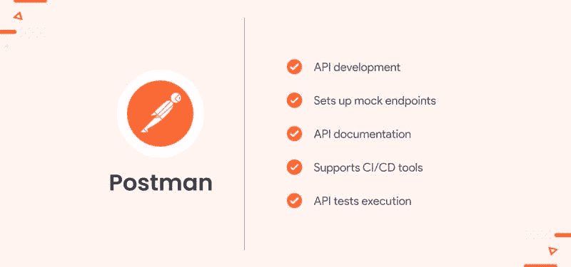

# 要考虑的 8 个最佳自动化软件测试工具

> 原文：<https://blog.devgenius.io/best-8-automated-software-testing-tools-to-consider-4bf8452d4c1c?source=collection_archive---------12----------------------->

[自由股票](https://unsplash.com/@freestocks?utm_source=medium&utm_medium=referral)在 [Unsplash](https://unsplash.com?utm_source=medium&utm_medium=referral) 上的照片

在软件开发项目中，很容易专注于编码而忽略质量保证(QA)。你的用户会原谅你一次或两次，但是如果你每次都有 QA 漏洞，你可能会很快失去你的客户群。**自动化软件测试工具**可以帮助你消除这些问题，它们能够对你的代码运行测试，并确保它正确运行——不需要人工干预。

此外，自动化软件测试工具是强大的工具，可以帮助企业在发布之前消除 bug，并提高软件测试人员的效率。市场上有如此多的工具，选择一个是具有挑战性的，所以我们已经创建了这个我们今天最喜欢的自动化软件测试工具的列表。

这里有一些顶级的自动化软件测试工具，当你着手下一个项目时，它们应该在你的雷达上。

# 顶级自动化软件测试工具

## **1)邮递员**

Postman 是一个强大的工具，可以帮助您快速轻松地测试 API。它有一个用户友好的界面，很容易上手。Postman 还有一个很棒的社区，可以帮助您解决任何问题。此外，Postman 有一个非常适合小项目的免费计划。

它还有大量的模板，如果你需要一些关于如何编写测试的想法，这些模板会很有帮助。其广泛的功能使 Postman 成为一个可靠的自动化测试工具，并证明是软件开发公司竞争更短期限项目的一个可靠选择。您不仅可以用它来测试 RESTful APIs，还可以用它来测试其他协议，比如 SOAP、HTTPS 等等。如果你正在寻找一些快速和直接的东西，那么邮差将是完美的。

**主要特性:**

*   [API 开发](https://www.pixelcrayons.com/blog/top-api-app-development-companies/?utm_source=medium&utm_medium=api-development&utm_campaign=DC-AR)
*   设置模拟端点
*   API 文档
*   支持 CI/CD 工具
*   API 测试执行

## **2)肥皂推**

SoapUI 是在 web 服务中工作的测试人员中流行的工具。像 Postman 一样，它很容易开箱即用，并且不需要任何编程知识来创建练习测试。SoapUI 的另一个好处是网上有很多教程。

开发人员还可以通过设置请求之间的延迟或指定特定的标头和凭据来自定义发送请求的方式。在手动运行测试或使用其他框架(如 Selenium WebDriver)时，它可以让您更好地控制测试的行为。

**主要特性:**

*   高级脚本
*   手动测试步骤
*   异步测试
*   断言测试步骤
*   内容断言

## **3)茄子的功能**

茄子功能可以实现 GUI 自动化，因此在进行自动化测试工作时，您不必依赖浏览器或安装的应用程序。您甚至可以在没有 GUI 的场景中使用它，在没有编码经验的情况下测试 API！凭借其拖放界面，茄子可以很容易地被那些不知道如何编码的人使用。

茄子将提供已完成测试的详细报告，确定需要改进的地方，并建议新的测试方法。它还提供了数据在屏幕之间传输的可视化，以及使用图表、图形和数据表的可视化验证技术。

**主要特点:**

*   智能视觉
*   聚变发动机
*   API 评估
*   基于模型的测试
*   CI/CD 集成适配器

## **4)硒**

Selenium 是一个著名的用于测试 web 应用程序的可移植框架。它为编写测试提供了一个记录/回放工具，无需学习测试脚本语言(Selenium IDE)。它提供了特定于测试领域的语言(Selenese)来用几种流行的编程语言编写测试，包括 Java、C#、Groovy、Perl、PHP、Python 和 Ruby。Selenium 可以在 Windows、Linux 和 macOS 上运行。值得注意的是，像 Selenium & Appium 这样的工具在全球开发者中拥有 70%的受欢迎度。

来源: [Statista](https://www.statista.com/statistics/673467/worldwide-software-development-survey-testing-tools/)

Selenium 具有动态 web 元素，允许您执行诸如拖放、键入文本、点击按钮等交互。你也可以使用硒来定制你的命令。比如:点击等待(注销)。除了像这样定制订单，您还可以创建页面对象类来表示网站的不同部分。这些页面对象允许您在创建测试用例时，无需使用定位器或 ID 就可以轻松地导航您的站点。

**主要特性:**

*   多浏览器支持
*   使用多种语言的
*   动态 web 元素
*   开源
*   轻便的

## **5)托斯卡特里森蒂斯**

Tricentis Tosca 是市场上最流行的自动化软件测试工具之一。它有许多特性使其成为质量保证的绝佳选择，例如易于使用的界面、对多种编程语言的支持，以及创建可重用测试用例的能力。

Tricentis Tosca 与 JIRA 和詹金斯等流行的开发工具相集成，使建立持续集成和交付渠道变得容易。Tricentis Tosca 是值得考虑的自动化测试工具之一，有助于简化质量保证流程。

**主要特性:**

*   视觉人工智能
*   基于模型的测试自动化
*   基于风险的测试优化
*   服务虚拟化
*   分布式执行

## **6)阿帕奇 JMeter**

Apache JMeter 是一个基于 Java 的开源工具，可用于加载功能测试行为和测量性能。它最初是为测试 web 应用程序而设计的，但后来扩展到了其他测试功能。您可以使用它来测试静态和动态资源，包括 Web 应用程序。数据库。FTP 服务器。网络服务。

Apache Jmeter 还附带了各种插件，允许您监控测试的进度并提供额外的功能。例如，sampler 插件使您能够指定想要收集的各种度量，比如响应时间或单个请求中发送的字节。AWT 插件提供了创建自动化浏览器脚本的工具，这些脚本执行用户交互，比如填写表单或点击按钮。

**主要特点:**

*   图形用户界面设计
*   结果分析
*   可扩展核心
*   可插拔采样器
*   数据分析

## **7)机器人框架**

Robot Framework 是一个免费的开源工具，用于自动化验收测试和机器人流程自动化(RPA)。它有一个易于使用的表格测试数据语法，并且可以用 Python 或 Java 库进行扩展。

它拥有大量的用户，并且有大量的在线文档。该工具适用于初学者和有经验的测试人员。该设备的一个缺点是它没有对面向对象编程概念的内置支持。

**主要特性:**

*   验收测试
*   测试驱动开发
*   机器人过程自动化
*   测试用例标记
*   报告和日志

## 8)量角器

量角器是 AngularJS 应用的端到端测试框架。它像用户一样通过交互对您的应用程序运行测试。它建立在 WebDriverJS 之上，web driver js 使用本地事件和特定于浏览器的驱动程序与您的应用程序进行交互，就像用户一样。

开发人员也可以使用量角器来测试非 AngularJS 应用程序，但他们主要关注的是 AngularJS 测试。设置量角器比列表中的其他工具要复杂一些，但是一旦设置好了，就很简单了。

**主要特性:**

*   易于安装
*   支持数据驱动测试
*   自动同步
*   支持并行测试
*   出色的速度

## **结束**

以上是自动化软件测试工具比较列表，包括 Postman、SoapUI、茄子功能、Tricentis Tosca、Apache JMeter、Robot Framework 和量角器。如果您想在不使用第三方工具的情况下构建您的自动化脚本，那么您可以考虑使用它们。

[软件测试服务公司](https://www.pixelcrayons.com/testing-and-qa-service?utm_source=medium&utm_medium=software-testing-companies&utm_campaign=DC-AR)可以帮助你分析需求，开发测试用例，选择合适的自动化工具，实现脚本，部署自动化框架。选择一个在这方面有经验的组织，他们将能够根据你的项目范围定制他们的方法。