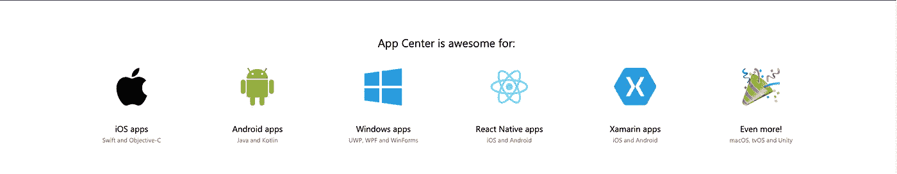
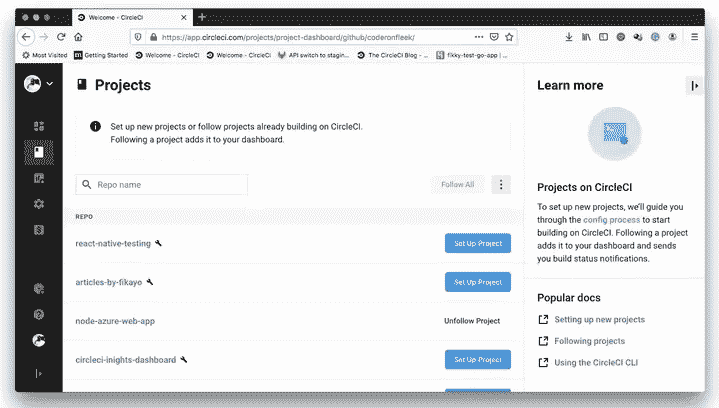
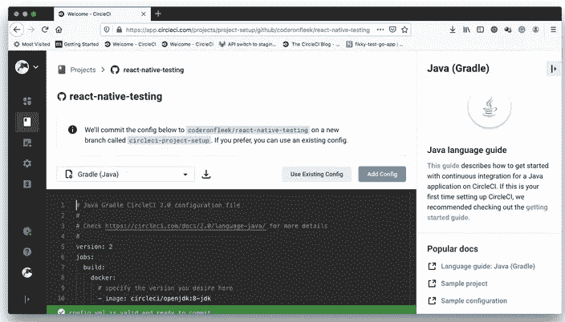
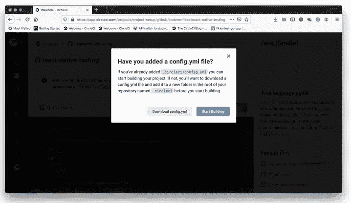
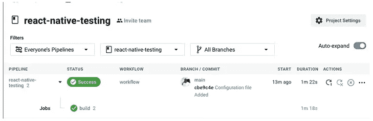
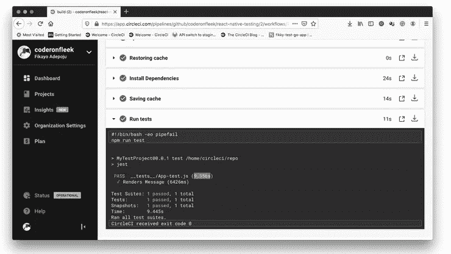

# React Native 最佳 CI/CD

> 原文：<https://blog.devgenius.io/best-ci-cd-in-react-native-1f653066d049?source=collection_archive---------1----------------------->


React Native 中的 CI/CD

在软件工程中，CI/CD 或 CICD 是持续集成和持续交付或持续部署的结合实践。CI/CD 通过在应用程序的构建、测试和部署中实施自动化，填补了开发和操作活动以及团队之间的空白。

首先，创建一个 react 本地应用程序

```
npx react-native init demoApp
```

创建应用程序完成后，有各种选项可用于将应用程序交付到各个商店，即 AppStore 和 PlayStore。

一些受欢迎的服务有:

*   AppCenter: web config，存储在服务端
*   appcircle: web config，存储在服务端
*   azure devo PS:[azure-pipelines-Android . yml](https://github.com/retyui/react-native-ci-cd-compare/blob/main/azure-pipelines-android.yml)
*   比特桶管道:[比特桶管道. yml](https://github.com/retyui/react-native-ci-cd-compare/blob/main/bitbucket-pipelines.yml)
*   Bitrise: [bitrise.yml](https://github.com/retyui/react-native-ci-cd-compare/blob/main/bitrise.yml)
*   Buddy: [buddy.yml](https://github.com/retyui/react-native-ci-cd-compare/blob/main/buddy.yml)
*   圈词:[。circleci/config.yml](https://github.com/retyui/react-native-ci-cd-compare/blob/main/.circleci/config.yml)
*   code magic:[code magic . YAML](https://github.com/retyui/react-native-ci-cd-compare/blob/main/codemagic.yaml)
*   GitHub 动作:[。github/workflows/*。yml](https://github.com/retyui/react-native-ci-cd-compare/blob/main/.github/workflows/)
*   Gitlab CI: [。gitlab-ci.yml](https://github.com/retyui/react-native-ci-cd-compare/blob/main/.gitlab-ci.yml)
*   Travis CI: [.travis.yml](https://github.com/retyui/react-native-ci-cd-compare/blob/main/.travis.yml)

根据这些列表，我将解释应用中心和 Circle CI。

1.  Appcenter
    访问[https://appcenter.ms/](https://appcenter.ms/)并注册或登录门户以创建应用程序。



关于进一步的设置，你可以参考我以前的文档。下面是链接[https://medium . com/@ rajibstha 059/implementing-code push-on-react-native-IOs-1c defa 4640 c 7](https://medium.com/@rajibstha059/implementing-codepush-on-react-native-ios-1cdefa4640c7)。

# **2。圆 CI**

在本教程中，您将学习如何:

*   为 React 本机应用程序编写并运行测试
*   通过构建持续集成管道，自动化这些测试的运行方式

# 先决条件

要遵循本教程，需要做一些事情:

1.  Javascript 的基础知识
2.  您系统上安装的 [Node.js](https://nodejs.org/) (版本> = 10.13)
3.  一个圆形的账户
4.  一个 [GitHub](https://github.com/) 账户
5.  为 React(Android 的本地开发)设置的环境

**注意:***React 环境是有条件可选的。没有它，您将无法在模拟器中运行示例应用程序。您仍然能够运行教程中描述的测试。*

安装并设置好所有这些之后，是时候开始本教程了。

转到`App.js`文件(在根文件夹中),将其中的代码替换为:

```
import React from "react"; 
import { Button, Text, TextInput, View, StyleSheet } from "react-native"; const App = () => {   
const [message, setMessage] = React.useState();    
return (     
 <View>       
  <Button         
   title="Hello to the tester"
   onPress={() => {           
   setTimeout(() => {             
     setMessage("Hello Tester");           
   },Math.floor(Math.random() * 200));         
  }}       
 />          
 {message && (         
   <Text 
    style={styles.messageText} 
    testID="printed-message">           
    {message}         
   </Text>       
  )}     
 </View>   
 );
}; 

const styles = StyleSheet.create({   
 messageText: {     
   fontFamily: "Arial",     
   fontSize: 38,     
   textAlign: "center",     
   marginTop: 10   
 }
});  
export default App;
```

这段代码创建了一个简单的 UI，一个标记为`Hello to the tester`的按钮在被点击时显示消息`Hello Tester`。为了模拟异步操作，我们使用`setTimeout`在点击按钮后将显示延迟几分之一秒。React Native `Text`组件在按钮的底部显示消息。代码通过使用`Stylesheet`组件向消息添加样式。

要运行该项目，请打开终端窗口，并使用以下命令启动 metro 服务器。

```
npx react-native start
```

如果应用程序无法通过上述命令运行，请使用:

```
npx react-native run-ios //for ios user
  or
npx react-native run-android //for android user
```

现在设置和添加测试:

将 React 本机测试库作为开发依赖项安装:

```
npm install —-save-dev @testing-library/react-native
```

安装该库后，用以下代码片段替换 __tests__App-test.js 文件中的代码:

```
import "react-native"; 
import React from "react"; 
import App from "../App";  
import { fireEvent, render, waitFor } from "@testing-library/react-native"; it("Renders Message", async () => {   
 const { getByTestId, getByText, queryByTestId, toJSON }  =render(<App />);    
  const button = getByText("Say Hello");   
  fireEvent.press(button);    

  await waitFor(() => expect(queryByTestId("printed-    message")).toBeTruthy());      expect(getByTestId("printed-message").props.children).toBe("Hello Tester");   
  expect(toJSON()).toMatchSnapshot(); 
});
```

要运行测试套件，请转到项目的根目录并运行:

```
npm run test
```

现在在 CircleCI
1 上设置项目。要开始测试自动化过程，第一步是[将您的项目推送到 GitHub](https://circleci.com/blog/pushing-a-project-to-github/) 。确保您使用的 GitHub 帐户是与您的 CircleCI 帐户连接的帐户。

现在，转到 [CircleCI 仪表板](https://app.circleci.com/projects)上的**项目**页面。选择您在此项目中使用的 GitHub 帐户。



点击**设置项目**。



在设置页面上，点击**使用现有配置**。接下来，您会得到一个提示，要么为 [CI 管道](https://circleci.com/blog/what-is-a-ci-cd-pipeline/)下载一个配置文件，要么开始构建。



点击**开始构建**开始构建。此构建将失败，因为您尚未编写 CI 管道配置文件。写入该文件是我们的下一步。

# 编写 CI 管道

持续集成管道确保每当更新被推送到 GitHub 存储库时测试都会运行。第一步是在项目的根目录下创建一个名为`.circleci`的文件夹。添加一个名为`config.yml`的配置文件。在该文件中，输入:

```
version: 2.1 
jobs:   
 build:     
  working_directory: ~/repo     
  docker:       
    - image: circleci/node:10.16.3     
  steps:       
    - checkout       
    - run:           
      name: Update NPM           
      command: "sudo npm install -g npm@5"       
   - restore_cache:           
      key: dependency-cache-{{ checksum "package-lock.json" }}                          - run:
   name: Install Dependencies           
   command: npm install       
- save_cache:           
   key: dependency-cache-{{ checksum "package-lock.json" }}                      paths:
- ./node_modules       
- run:           
name: Run tests           
command: npm run test
```

在这个管道配置中，Docker 映像首先用所需的 Node.js 版本导入。然后，`npm`被更新，依赖项被安装，缓存它们以便后续的构建更快。

最后，`npm run test`命令运行项目中包含的所有测试。

保存该文件，并将所有更改提交到远程存储库。提交更改会触发管道成功运行。



点击**构建**显示管道构建步骤。如果您折叠**运行测试**，您将看到测试的详细信息。



# 结论

适当的测试对移动应用来说可能比网络应用更重要。每次你修复一个 bug，都要求用户安装更新，这很容易惹恼他们。通过应用您在这里学到的知识来彻底测试您的 React 本机应用程序，让用户满意。更重要的是，自动化您的测试过程，并确保那些错误不会在第一时间被推到您的产品代码中。

编码快乐！

因此，这些是 React Native 的最佳 CI/CD。

编码快乐！

玩得开心！干杯，