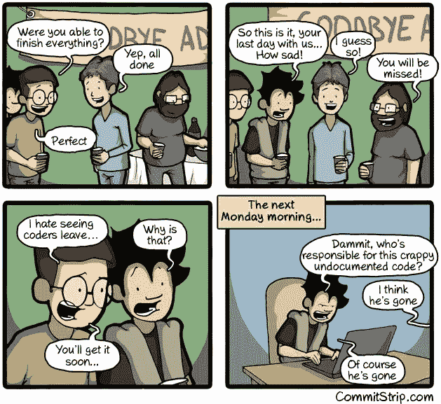
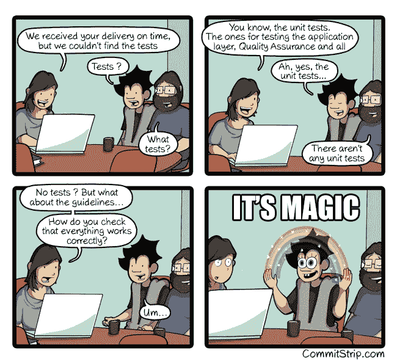
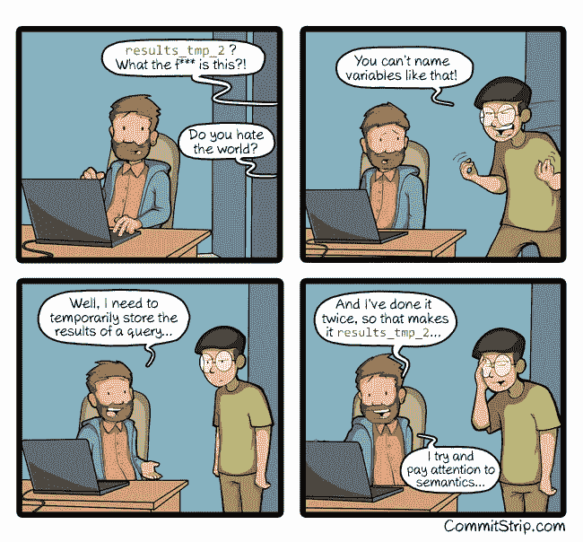
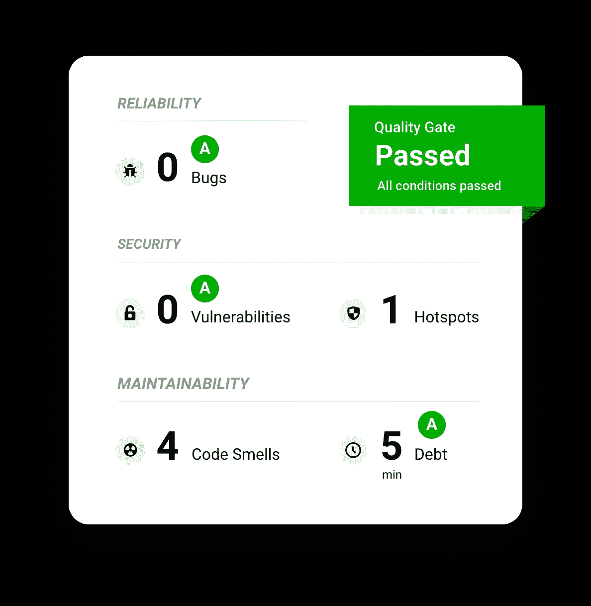

# 每个开发人员都必须遵循的最佳编码实践

> 原文：<https://blog.devgenius.io/best-coding-practices-every-developer-must-follow-b9f93af9b6f8?source=collection_archive---------4----------------------->

## 这些非正式的规则可以帮助你提高代码的质量。

由 [Unsplash](https://unsplash.com/s/photos/programmer?utm_source=unsplash&utm_medium=referral&utm_content=creditCopyText) 上的[记者](https://unsplash.com/@perloov?utm_source=unsplash&utm_medium=referral&utm_content=creditCopyText)拍摄

最近，一个初级开发人员向我提出了一个问题，关于他必须遵循什么样的编码最佳实践。我回答了他一些常见的问题，比如方法名的可读性更好(*你的代码*)、适当的文档等等。，然后它让我意识到我是否遵守了规范。*人心，你看*。🙄

嗯，编码实践和标准因地而异。互联网上已经有很多关于这个的文章了，但是不幸的是，信息太多了，有时候简直是铺天盖地。至少，我在研究这个的时候是这么觉得的。所以可以肯定地说，无论你进一步阅读什么，都是最佳编码标准(*或者我会说，应该是最佳编码实践*)在我看来，每个应用程序开发人员都必须遵循**。**

# 编写可读的文档化代码

当然，这是我的第一点。你在想什么？这是每个开发人员必须考虑的首要问题。为什么这很重要？嗯，当你开始为一个组织工作时，有可能在工作几年后，你可能会搬到一个不同的公司，你留下的是你的代码。但是如果你的代码不可读，而且你也没有文档，那么对于新的开发者来说，这将是一个真正的挑战。

这是一个新开发人员在处理未记录的代码时必须经历的事情

此外，新开发人员必须花大量的时间去阅读杂乱无章的无文档代码。当你写一个方法的时候，只要给它们一个有意义的名字，这个名字可以足够长，让你理解这个方法。行内注释对于描述方法、控制器、异常等同样重要。因此，它应该被授权编写文档化的、可读的代码。

# 为代码覆盖率编写单元测试用例

一些编程爱好者认为编写单元测试用例纯粹是浪费时间。这是一些开发人员和项目经理争论的话题。但是我可以告诉你，编写单元测试用例可以节省你的金钱和资源。*讨论结束，ehh！*🤨

是的，我希望有一种魔法可以用单元测试来测试代码。

*单元测试通常以函数的形式编写，检查这些函数在各种场景中的值和行为。*它基本上有两个目的:

1.  该函数将通知我们，当你在一个无效的情况下做错了什么。
2.  该功能将记录无效情况。

对于一些开发人员来说，单元测试是应用程序的文档。为了了解一个模块或另一个模块提供了什么功能，开发人员可以参考单元测试来获得模块和系统整体逻辑的基本情况。

你可能会问，它是如何省钱的呢？ [当编写单元测试时，在应用程序开发阶段会发现许多 bug，这阻止了这些 bug 向后续阶段的过渡，包括在产品发布之后。这节省了在开发生命周期的后期修复错误的成本，也给最终用户带来了好处，他们不必处理有问题的应用程序。](https://www.amazon.com/Code-Complete-Practical-Handbook-Construction/dp/0735619670/ref=as_li_ss_tl?crid=PHOF50LZONIU&dchild=1&keywords=code+complete&qid=1607196916&sprefix=code+c,aps,404&sr=8-1&linkCode=ll1&tag=thedevelope0e-20&linkId=ed45c6f96dd4e3cc923ca76da61f4785&language=en_US)

# 写一个简单的代码总是更好

不管你有多少经验，如果你想展示你的编码能力，*只要学会写简单的代码*就行了。无论您是用 Java、C++还是 Python 编写代码，都应该在需要时使用面向对象的编程概念，而不是不必要的，否则调试出错的代码会变得很困难。

拥有简单有意义的变量名确实有助于代码审查

这也适用于变量、类、函数(或方法)等的适当命名约定。为了更好的可读性。

# 重构是一种不可避免的罪恶

重构可以定义为改进现有代码的系统化过程，不增加新的功能或改变代码的外部行为。唯一的目的是在不改变功能的情况下使代码更具可读性和可维护性。*不幸的是，这并不是每次都对你有利，因为如果在一段较长的时间后完成，它可能会导致巨大的技术债务，并且你可能会最终在你的代码中产生错误，这可能会占用你的时间。*

SonarQube Quality Gates 的快照

在我的项目中，我使用[**sonar cube，一个检测代码中的 bug、漏洞和代码味道的工具。**](https://www.sonarqube.org/) 它还会扫描代码的质量，并指出技术缺陷来纠正它。因此，每次代码更改后，都可以对应用程序进行问题扫描，并立即进行纠正。

# 阅读。设计。代码。重复一遍。

当你从客户那里得到一个任务时，你需要正确地阅读需求，理解完成任务的验收标准。然后，您需要根据您的需求设计(或构建)应用程序。决定使用哪个设计模式，需要哪个数据库，使用哪个框架，一切都取决于您的设计阶段。然后是编码部分。

罗曼·辛克维奇在 [Unsplash](https://unsplash.com/s/photos/code?utm_source=unsplash&utm_medium=referral&utm_content=creditCopyText) 上拍摄的照片

嗯，阅读任何新技术的官方文档并学习设计模式应该是每个开发人员的惯例。

写这个确实很有趣。这些可能不是开发人员遵循的所有最佳实践，但是我已经提到了一些重要的实践(希望如此)。我很喜欢浏览 [**CommitStrip 的网络漫画**](https://www.commitstrip.com/en/?) ，你们一定要看看，它是如此的相关，你们会彻底喜欢它。

> **披露**:请记住，这篇文章中的一些链接是附属链接，如果你通过它们进行购买，我将赚取佣金。请记住，我链接这些公司和他们的产品是因为它们的质量，而不是因为我从你的购买中获得的佣金。决定权在你，是否决定买东西完全取决于你。

你可能也会发现下面的文章值得你花时间去读。

 [## 开发人员必须了解的关于微服务的一切

### 微服务是首选的应用平台，每个开发人员都必须了解它。

medium.com](https://medium.com/dev-genius/everything-a-developer-must-know-about-microservices-dae854782ab)  [## 每个开发人员都必须知道的关于 Spring Boot 的特性

### 该框架通常被称为“类固醇上的弹簧”，的确如此。

medium.com](https://medium.com/dev-genius/features-that-every-developer-must-know-about-spring-boot-c1c0d7f1c0a8)  [## docker——每个开发人员必须学习的最受欢迎的平台

### 实际上，根据 Stackoverflow 调查，它是第二大最受开发者喜爱的平台。

medium.com](https://medium.com/dev-genius/docker-the-most-loved-platform-every-developer-must-learn-6e5bb702c97b) 

*如果你喜欢阅读有助于你更好地学习、生活和工作的故事，可以考虑* [*成为订阅者*](https://viveknaskar.medium.com/subscribe) *。成为会员后，你可以无限制地阅读 10000 篇故事、文章和作家。每月只要 5 美元。* [*如果你用我的链接*](https://viveknaskar.medium.com/membership) *注册，我会赚一点佣金，帮助我写更多的文章。*