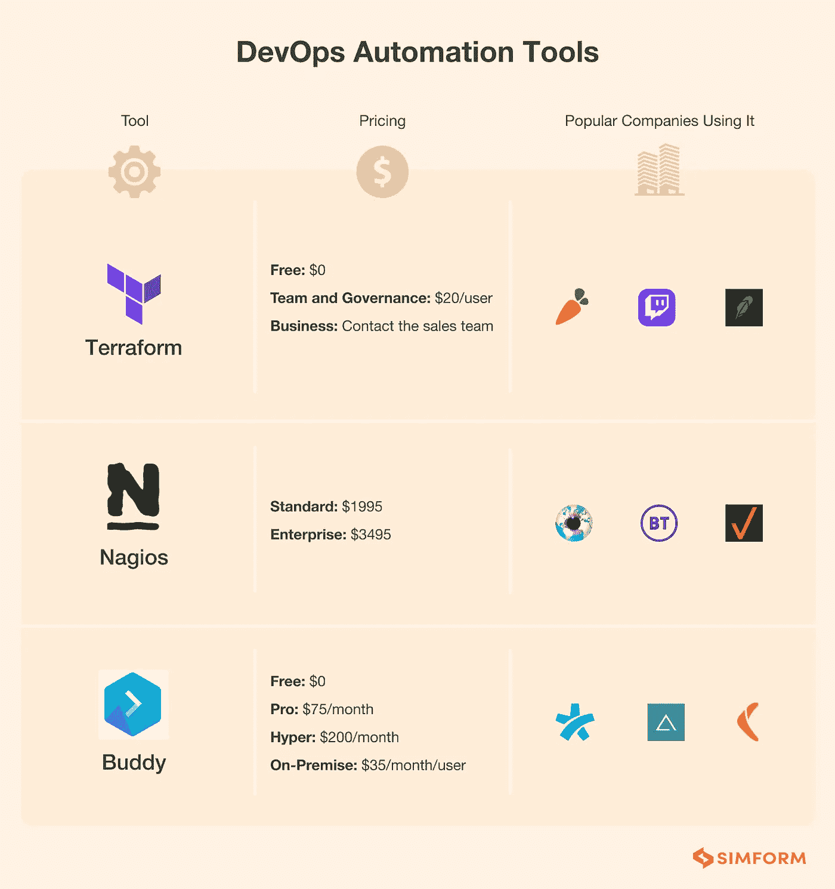
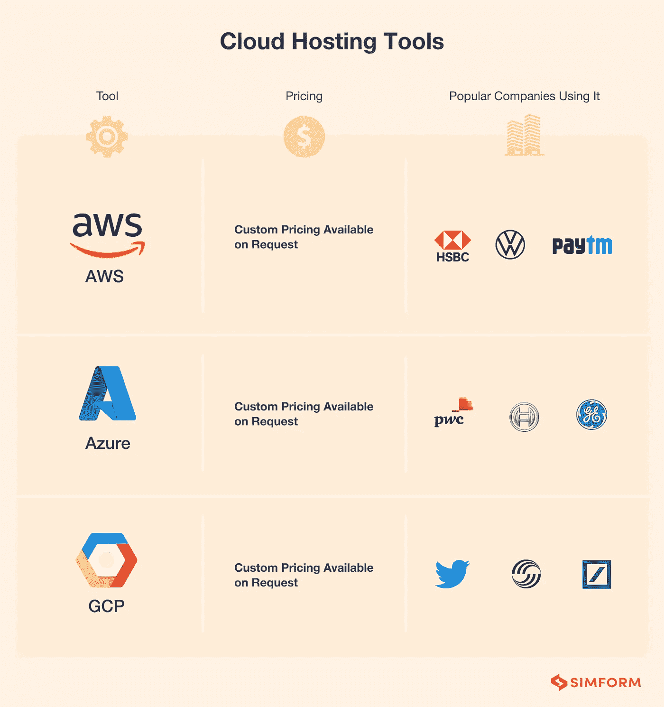

# 2022 年最受欢迎的开发运维工具

> 原文：<https://blog.devgenius.io/best-devops-tool-in-demand-2022-6e902b64c434?source=collection_archive---------0----------------------->

DevOps 工具用于自动化软件开发、部署和测试。在这里，我们将讨论可以用来自动化软件开发过程的最佳 DevOps 工具。

有许多开源的 DevOps 工具可以免费使用，但就工作质量而言，没有什么比付费服务更好的了。在这里，我们列出了一些最受欢迎的 DevOps 服务，您可以根据自己的业务需求进行选择。

# Ansible

Ansible 是一个 DevOps 工具，可以帮助您自动化任务、部署应用程序和管理基础架构。它使用 SSH 与基础设施中的节点进行通信，并且可以在您有一台服务器或数百台服务器时使用。Ansible 是无代理的，这使得它很容易与任何支持 SSH 的服务器操作系统一起使用。

Ansible 可用于同时在多个服务器上自动执行任务。例如，如果您需要为您的 web 应用程序设置一个负载平衡器，那么您所需要做的就是编写一个可行的行动手册，描述在您的环境中的每个节点/服务器上需要做什么，并运行它一次。

Ansible 还可以用作 Saltstack 或 Puppet 等配置管理软件的一部分，它将使用 SSH 协议在目标机器上执行远程命令，而不是像 CFEngine 或 Chef 等其他工具那样通过客户端-服务器模型发送命令

# 码头工人

Docker 是一个开源项目，它为开发人员和系统管理员构建、发布和运行分布式应用程序提供了一个开放平台。

Docker 使开发人员能够将他们的代码及其所有依赖项打包到一个标准化的软件开发单元中。容器拥有运行所需的一切:代码(文本+数据)、系统工具和库。

Docker 平台通过提供一个抽象层来自动部署软件容器中的应用程序，在这个抽象层中您可以构建自己的应用程序，而不用担心基础设施的细节。

# 厨师

Chef 是一个自动化平台，可以帮助您自动化和简化软件交付过程。Chef 在从开发到生产的整个生命周期中自动执行软件部署、配置和合规性。Chef Software，Inc .是 Chef 背后的公司，由前 VMware 工程师 Barry Steinglass(首席执行官)、Adam Jacob(首席技术官)和 Jason Garms(总裁)于 2009 年创立。

# 木偶

Puppet 是一个开源的配置管理工具。Puppet 使用声明性语言来指定系统配置状态，然后在每台主机上自动实施(或增加)指定的状态。

Puppet 最初用于部署 Linux 操作系统和应用程序。但是，它也用于部署 Microsoft Windows 和管理各种网络设备，如防火墙、负载平衡器、VPN 网关、web 服务器等。这种类型的自动化的一个主要好处是，它允许系统管理员扩展他们的操作，而不需要增加人员或花费时间在每次添加或替换他们环境中的另一个基础架构时重复他们的操作。

既然您正在 DevOpsDashboard 上阅读这篇文章，那么您可能有兴趣了解我们如何使用 Puppet 或 Chef 等工具帮助我们的客户实现 IT 基础架构自动化..

# 纳吉奥斯

Nagios 是一个运行在 Linux、FreeBSD、NetBSD 和 Mac OS X 上的系统和网络监控应用程序。当出现问题时，它会提醒用户，并提供系统、应用程序、服务等信息。

安装 Nagios 很容易，因为它附带了适用于大多数操作系统的预构建二进制包。它还包括一个 web 界面，允许您通过互联网连接登录其网站，从世界任何地方监控您的系统。

# 饭桶

Git 是一个免费的开源分布式版本控制系统，旨在快速高效地处理从小到大的项目。

Git 允许您跟踪谁做了更改，何时做的，以及更改了什么。如果需要，您还可以将文件恢复到旧版本。Git 的分布式本质意味着每个人在任何时候都可以访问相同版本的代码库——不再需要合并分支或处理合并冲突！

# 詹金斯

Jenkins 是一个用 Java 运行的开源自动化服务器。它用于持续集成并拥有大量插件，Jenkins 广泛用于自动化与软件开发相关的各种任务，如构建、测试和部署。

为了理解 Jenkins 在 DevOps 中的重要性以及它在 DevOps 工具链中的作用，让我们花更多的时间来讨论它到底是做什么的。

# 将（行星）地球化（以适合人类居住）

Terraform 是一个开源工具，用于安全有效地开发、更改和版本控制基础设施。

Terraform 是由 HashiCorp 开发的，该公司也开发了流浪者和包装者。

Terraform 可以管理云基础设施，如 AWS、Azure、GCP(谷歌云平台)、DigitalOcean 等。

# 库伯内特斯

Kubernetes 是一个容器编排系统，使得部署和管理容器化的应用程序变得容易。它将组成应用程序的容器分组到逻辑单元中，以便于管理和发现。Kubernetes 还提供了用于观察、记录和排除集群故障的工具。

Kubernetes 最初由谷歌开发，但后来在云原生计算基金会(CNCF)下开源，作为他们“培育新一代云原生计算平台”使命的一部分。因为它的起源，Kubernetes 在安装了 Docker 的 Linux 平台上运行得最好；然而，也有可用的 Windows 版本。

因为 Kubernetes 是 CNCF 主持的一个开源项目，所以您可以在[https://github . com/Kubernetes]找到许多贡献的项目。

# 简单地

DevOps 工具用于自动化软件开发和部署过程。这些工具有助于提高软件开发、测试和交付的效率，从而使开发人员更容易以更快的速度增加价值。在本文中，我们讨论了一些将在 2022 年出现需求的最佳 DevOps 工具。

资源:

 [## 面向 2022 年的 30 多种领先开发运维工具

### 根据 Puppet 的 2021 年开发运维状况报告，86%的企业级公司、71%…

www.simform.com](https://www.simform.com/blog/devops-tools/)